# 电池寿命预估与衰减因果推断技术报告

生成日期：2026-05-29  
范围：只基于本地现有脚本、报告、指标 CSV、日志与图表产物进行学术化综合改写；不重新训练、不刷新既有 CSV 或图表、不联网查新文献。  
分卷目录：`outputs/analysis/battery_life_decay_causal_report_parts_2026-05-29/`  
证据索引：`outputs/analysis/battery_life_decay_causal_full_report_2026-05-29_evidence.csv`

## 一、研究背景与问题提出

动力电池寿命预估并不是单纯的容量曲线拟合问题，而是一个由材料退化、电化学表征、工况控制、数据划分和工程复现共同构成的系统问题。随着电池在多策略、多电芯和多循环阶段下运行，容量衰减既受到历史循环过程影响，也受到充电倍率、SOC 区间、温度和内阻变化等因素共同作用。若仅以单一模型指标评价寿命预测，很容易把短期趋势、固定验证集拟合或历史容量输入带来的优势误读为对真实工况机理的掌握。

在当前工程中，研究对象具有明确的产业与学术双重价值。产业上，寿命预估用于维护策略、快充策略和安全边界制定；学术上，数据同时包含 `q_discharge`、dQ/dV 主峰、工况区间统计、阻抗和温度等多类证据，使其适合比较传统机器学习、序列模型、桥接表征和观测因果推断。首先需要回答的是标签口径是否可靠，进一步需要判断哪些表征真正提供了关于 SOH 的信息，最后还必须区分“可预测”与“可干预”之间的边界。

已有数据表明，当前样本以 `policy + cell_code` 为基本单元，共 `187` 个样本，其中训练集 `135`、验证集 `52`。这一划分不是 cycle 行级随机拆分，而是更接近策略和电芯粒度的留出评估。与此相对应，循环级底表 `life_performance.csv` 共 `140623` 行，核心容量标签为 `q_discharge`；`retention` 则由 `q_discharge / q_ref` 派生，通常以同一 `policy + cell_code` 前 5 个有效 cycle 的 `q_discharge` 中位数作为参考容量。由此可见，本文讨论的寿命预测并非脱离数据口径的抽象问题，而是围绕样本定义、标签归一化和验证集外推压力展开的技术判断。

## 二、核心技术原理

从技术原理上看，`q_discharge` 提供的是绝对容量尺度，它直接反映单次循环中可释放的电荷量，但不同电芯和策略之间的初始容量差异会影响横向比较。`retention` 通过除以参考容量将容量转换为相对 SOH，使不同电芯在相同归一化尺度上比较成为可能。该转换的作用路径是先建立同一 `policy + cell_code` 内部的早期容量基准，再把后续容量映射为相对衰退程度。因此，`retention` 更适合跨电芯和跨策略的模型训练，但其解释必须始终绑定 `q_ref` 定义。

进一步看，dQ/dV 表征之所以重要，是因为它把容量随电压变化的局部响应显式化。主峰面积、峰高、峰位电压、峰宽和偏度等特征并不是任意统计量，而是由电化学曲线的峰形结构压缩得到。它们通过反映反应平台位置、强度和形状变化，为 SOH 提供比原始容量值更细粒度的信息。与传统区间统计相比，dQ/dV 更接近电化学退化表征；与端到端深度模型相比，它又保留了一定物理可解释性。

传统机器学习基线的技术作用在于建立低成本、可审计的非线性参照。线性回归、Ridge 和 ElasticNet 可检验特征到容量的近似线性关系，而 RF 和 XGBoost 则通过树模型划分特征空间来捕捉非线性和交互效应。当前 XGBoost 在固定验证集上达到 `R2=0.8777216018`，RF 达到 `R2=0.8618745152`，说明 policy 与放电区间统计中确实存在可预测结构。不过，这类结果描述的是给定切分下的预测能力，不自动说明长期外推稳定性。

LSTM 的核心机制在于对序列或循环进程中的状态变化进行建模。dQ/dV LSTM 使用 `main_peak_temp_cycle` 特征包，即 9 个主峰/温度特征加 `cycle_index_norm`，在固定验证集上达到 retention valid `R2=0.9267926812`、`RMSE=0.0124910391`。这一结果说明 dQ/dV 表征与循环位置结合后能显著提高单步 SOH 预测能力，但也意味着模型并非纯峰形输入，更不能直接等同于端侧部署模型。

工况到 dQ/dV 再到 retention 的 bridge 路线体现了两阶段代理建模思想。第一阶段用工况区间特征预测 dQ/dV target，第二阶段用真实或预测 dQ/dV target 解释 retention。其理论价值在于揭示可观测工况能否间接重建电化学表征；其工程风险在于第一阶段误差会传递到第二阶段。因此必须区分 `oracle bridge`、`deployable bridge` 和 `direct retention`，否则会把真实 dQ/dV 信息上限误写成可部署性能。

因果推断部分采用 GPS/AIPW、DML 和中介分析等方法，其工作机制与预测模型不同。AIPW 通过结果模型和倾向模型的双重结构降低单一模型错设风险，GPS 用于连续处理变量的剂量响应估计，DML 通过残差化控制高维混杂，中介分析则把总效应拆解为直接路径和温度等间接路径。它们的共同目标不是提高预测 R2，而是在观测数据中估计处理变量对结果变量的可能影响，并为受控实验排序提供依据。

## 三、理论分析框架

从系统论角度看，电池衰退是由工况输入、电化学状态、热状态、阻抗状态和容量状态共同组成的动态系统。任何单一指标都只能观察系统的一个投影。`policy` 描述设计工况，真实执行倍率和温度描述运行过程，dQ/dV 主峰描述电化学响应，`q_discharge` 和 `retention` 描述容量结果，阻抗则描述动力学退化。系统论提醒我们，预测路线和因果路线必须围绕变量层级展开，而不能把不同层级的证据混为一种结论。

从信息论角度看，模型性能提升可以理解为输入特征提供了关于 SOH 标签的额外信息。放电区间统计比充电区间统计更直接解释 `q_discharge`，说明放电过程包含较高容量状态信息；dQ/dV 主峰特征与 retention 的 Spearman 约 `0.8575` 量级，说明峰形表征包含强单调信息；history-retention-enhanced 多步模型表现较强，则说明近期容量历史对短期外推具有高信息量。信息论同时也提示，信息量并不等于因果作用，历史 retention 的预测优势不能写成工况模型能力。

从控制理论角度看，策略建议必须经历“观测识别、候选排序、受控实验、反馈修正”的闭环。观测因果可以提出 `bin50 +5pp`、`bin44 +5pp`、`bin41 -5pp` 等候选动作，但这些动作仍处于策略空间的假设阶段。只有通过明确的实验臂、意向治疗和依从方案双口径评估、容量与阻抗双结局监测，才能判断候选策略是否可进入工程应用。由此，控制理论为本文提供了重要边界：因果章节只能支持策略解释和实验排序，不能直接生成上线策略。

## 四、已有数据与实证材料分析

本章以数据证据为主线，将图表、指标和读图补充嵌入连续论证。每一类证据都同时说明其支持的判断和结论边界，避免把描述性趋势、预测性能和观测因果效应混为一谈。

已有图表和指标材料从数据底座、单步表征、多步外推和因果解释四条路径共同支撑本文判断。下列图像均为既有产物，本文只进行解释性综合，不新制图表。首先，样本划分图说明当前数据不是按循环行随机拆分，而是以 `policy + cell_code` 为单位留出验证样本。这一事实决定了后续验证结果必须被理解为样本级泛化检验，而不是普通行级拟合。

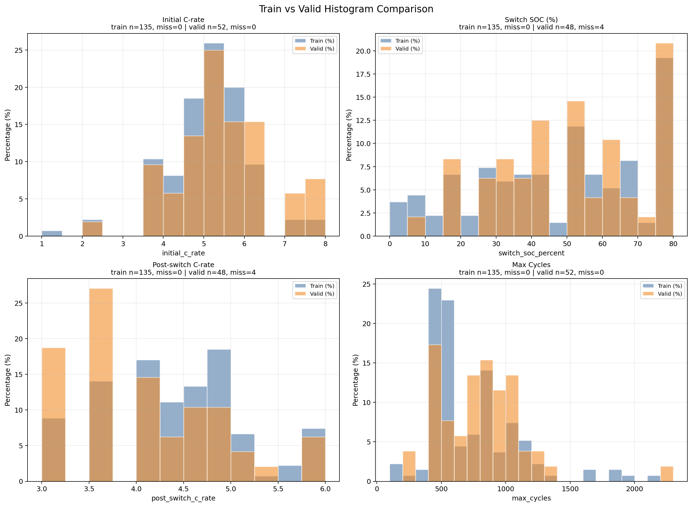

**图1-1 数据底座导览。** 来源路径：`data/processed/train_valid_hist_compare.png`。口径：`policy + cell_code` 固定划分。关键数值：训练 `135`、验证 `52`、合计 `187`。解释：读者应先确认样本粒度，再阅读所有模型指标。该图不能支持模型泛化，只支持划分口径审计。

**读图补充：** X/Y轴：横轴为寿命或最大循环数分箱，纵轴为对应样本数量或密度；数据来自 `data/processed/train_policy_cell_samples.csv` 与 `data/processed/valid_policy_cell_samples.csv` 的 `policy + cell_code` 样本级统计。颜色/分组表示 train 与 valid 两个固定集合，组合在一起用于检查验证集是否覆盖长寿命与短寿命区域。该图对应监督学习中的样本划分、分布偏移与外推压力理论，能支持“后续指标必须按固定 policy-cell 划分解释”的结论；不能支持模型性能或因果效应。

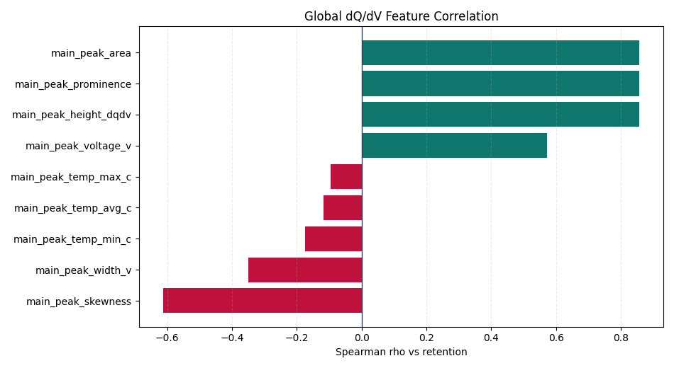

**图1-2 单步表征导览。** 来源路径：`outputs/analysis/dqdv_feature_retention_correlation/spearman_global_bar.png`。口径：dQ/dV 主峰特征与 retention 的 Spearman。关键数值：面积、prominence、峰高约 `0.8575/0.8566/0.8565`。解释：该图提示 dQ/dV 是单步 SOH 主线。该图不能把相关性升级为因果。

**读图补充：** X/Y轴：横轴为 dQ/dV 主峰与温度等候选特征，纵轴为这些特征与 `retention` 的 Spearman 秩相关系数；数据来自 `outputs/analysis/dqdv_feature_retention_correlation/` 下的特征相关性结果。柱高表示单变量单调关联强度，组合柱形图用于比较哪个 dQ/dV 特征更接近 SOH 标签。该图对应特征筛选、秩相关与表征学习的前置证据，能支持“主峰面积、prominence、峰高是强单步表征候选”；不能支持因果解释或可部署闭环。 字段核对：X/Y轴、数据来源、颜色/分组含义、组合含义、理论/方法口径、可支持结论与不能支持结论均需结合本段前文、原图注和来源路径一起读取。

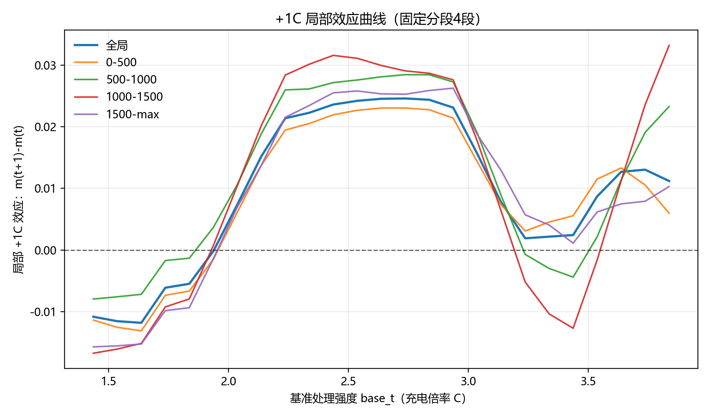

**图1-3 因果解释导览。** 来源路径：`outputs/analysis/causal_initial_rate_effect/fig_delta_plus1c_curve_window_mean.png`。口径：`window_mean +1C` 对未来 200 cycles 相对容量下降的观测因果估计。关键数值：效应 `0.014658`。解释：该图标定策略解释章节的主处理变量。该图不能替代受控实验。

**读图补充：** X/Y轴：横轴为窗口或处理强度相关的倍率口径，纵轴为 `window_mean +1C` 对未来容量下降的估计效应及置信区间；数据来自 `outputs/analysis/causal_initial_rate_effect/` 的连续处理因果估计。曲线/误差带表示效应大小与不确定性，组合呈现不同窗口下效应稳定性。该图对应 GPS/AIPW 连续处理、剂量效应与潜在结果框架，能支持“观测数据中较高倍率与未来容量损伤风险增加相关且经调整后仍显著”的结论；不能替代随机受控实验。

当前工程最稳的主线不是单一模型，而是一个分层体系：数据底座用 `policy + cell_code` 固定样本划分，单步 SOH 表征以 dQ/dV 主峰特征和 retention 目标为核心，多步预测必须同时面对历史 retention 趋势基线，因果分析用于策略风险解释和受控实验排序。

第一，数据底座已经具备可追溯性。当前划分以 `policy + cell_code` 为样本单元，共 `187` 个样本，训练集 `135`、验证集 `52`；循环级寿命底表 `life_performance.csv` 共 `140623` 行，核心绝对容量标签是 `q_discharge`。`retention` 不是底表原生字段，而是在训练任务中由 `q_discharge / q_ref` 派生，通常 `q_ref` 为同一 `policy + cell_code` 前 5 个有效 cycle 的 `q_discharge` 中位数。

第二，早期统计特征证明了非线性基线的必要性。放电区间特征比充电区间特征更直接解释 `q_discharge`；XGBoost 在固定验证集上达到 `R2=0.8777216018`，RF 达到 `R2=0.8618745152`，显著优于线性类模型。这些结果适合作为低成本非线性基线，不应直接升级为长期寿命预测结论。

第三，dQ/dV 是当前最强的单步 SOH 表征之一。主峰面积、prominence、峰高与 retention 的 Spearman 相关分别为 `0.8575`、`0.8566`、`0.8565`；dQ/dV LSTM 在 Colab final 中达到 retention valid `R2=0.926793`、`RMSE=0.012491`，换算 q_discharge valid `R2=0.935550`。但该模型输入是 9 个 dQ/dV 主峰/温度特征加 `cycle_index_norm`，不是纯峰形特征。

第四，`工况 -> dQ/dV -> retention` bridge 更适合解释和辅助，而不是当前主预测器。工况特征能较好预测 dQ/dV 的面积和峰高，compact4 bridge 的 deployable R2 达到 `0.897059`，但同口径 direct retention baseline 仍达到 `0.941887`。因此 oracle bridge、deployable bridge、direct retention 必须分开报告。

第五，多步预测的核心边界是“历史 retention 趋势”和“工况模型能力”不能混写。H100/M50 非重叠 block 中，`linear_last10` all-horizon R2 为 `0.986496`，说明短期 retention 平滑趋势极强；但在 long-life H50/M100 中，预测更远的 H100 endpoint 时，`LightGBM + history retention summary` 达到 RMSE=`0.009033`、R2=`0.947182`，优于 trend baseline。

第六，增强后的因果推断章节应定位为“识别可信度和实验排序”，而不是直接给出上线策略。`window_mean` +1C 对未来 200 cycles 相对容量下降的效应为 `0.014658`；温度中介路径存在但占比较小，`NIE/TE=3.04%`；60 区间替代效应中 `bin50`、`bin41`、`bin44` 是候选，但 `bin05` 这类 raw 头部、支持域极窄的结果必须禁止外推。

本报告中的指标口径统一如下：`R2` 表示相应评估集或分组口径下的决定系数；`MSE`、`RMSE`、`MAE` 分别表示均方误差、均方根误差和平均绝对误差，均需绑定具体 target、split 与 horizon；`Spearman` 表示秩相关，`Pearson` 表示线性相关；`TE`、`NDE`、`NIE` 分别表示总效应、自然直接效应和自然间接效应；`AIPW` 表示增强逆概率加权的观测因果估计；`DML` 表示双机器学习估计。以上预测指标不自动构成因果结论，以上因果估计也不等同受控实验。

**图2-1 样本划分与寿命分布。** 来源路径：`data/processed/train_valid_hist_compare.png`。口径：policy-cell train/valid 固定划分。关键数值：`187` 个样本，训练 `135`、验证 `52`。解释：该图支撑“不是 cycle 随机切分”的数据口径。该图不能说明任何模型已经泛化。

**读图补充：** X/Y轴：横轴为寿命或最大循环数分箱，纵轴为对应样本数量或密度；数据来自 `data/processed/train_policy_cell_samples.csv` 与 `data/processed/valid_policy_cell_samples.csv` 的 `policy + cell_code` 样本级统计。颜色/分组表示 train 与 valid 两个固定集合，组合在一起用于检查验证集是否覆盖长寿命与短寿命区域。该图对应监督学习中的样本划分、分布偏移与外推压力理论，能支持“后续指标必须按固定 policy-cell 划分解释”的结论；不能支持模型性能或因果效应。

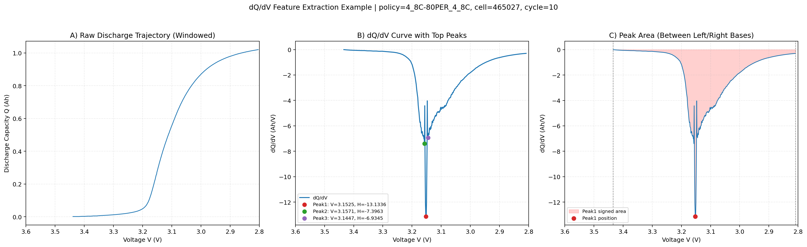

**图2-2 标签到表征的连接示意。** 来源路径：`outputs/analysis/dqdv_feature_explanation/dqdv_feature_extraction_illustration.png`。口径：既有 dQ/dV 特征说明图。关键数值：概念图不替代指标 CSV。解释：帮助理解 `q_discharge` 与 dQ/dV 表征为何能连接。该图不能写成训练结果。

**读图补充：** X/Y轴：横轴通常为电压或归一化电压区间，纵轴为 dQ/dV 响应强度；数据来源是已处理循环曲线经数值微分后的 dQ/dV 表征。图中的峰位、峰高、峰宽、面积、偏度等标注分别对应电化学反应平台的位置、强度和形状，组合在一起说明“原始充放电曲线如何被压缩为可建模特征”。该图对应特征工程、峰形分析与退化表征理论，能支持 dQ/dV 主峰作为 SOH 表征入口；不能支持某个模型已经达到特定预测精度。

当前项目的数据层分为 raw 和 processed。raw 层包含 `cycles_*.csv` 与 `summary_*.csv`；processed 层的核心底表包括 `data/processed/life_performance.csv`、`data/processed/policy_meaning.csv`、`data/processed/train_policy_cell_samples.csv` 和 `data/processed/valid_policy_cell_samples.csv`。

`life_performance.csv` 是循环级寿命标签表，粒度为 `policy + cell_code + cycles`，包含 `q_discharge`、`t_max`、`ir` 等字段。`q_discharge` 是绝对放电容量，单位 Ah；该表中范围包括 `0.0` 到 `2.8840845`，说明不同建模任务必须明确过滤规则。不能把某个任务的 `0.3 <= q_discharge <= 1.3` 自动写成全项目统一过滤。

训练/验证划分不是 cycle 随机切分，而是 `policy + cell_code` 粒度的样本划分。现有划分为总样本 `187`，训练 `135`，验证 `52`。验证集中包含 `4` 个 `VARCHARGE_*` 变电流工况样本，训练集中无该类样本；这更接近泛化压力测试，不应写成训练分布内验证。

`retention` 是归一化 SOH 标签，通常定义为当前 `q_discharge / q_ref`。既有报告中 `q_ref` 一般按同一 `policy + cell_code` 前 5 个有效 cycle 的 `q_discharge` 中位数定义。总报告中所有 `retention` 指标都应与 `q_discharge` 指标分开；前者适合跨电芯归一化比较，后者是绝对容量。

进一步看，早期统计特征与传统 ML 图表揭示了容量预测中的非线性结构。小模型基线失效并不意味着线性模型在任何场景中都无价值，而是表明在 `policy + 放电区间特征` 口径下，容量标签与输入之间存在明显非线性。与此相对应，XGBoost 和 RF 的固定验证集散点显示树模型能够较好捕捉这种结构，但这些固定验证集结果不能外推为 long-life holdout 能力，更不能作为因果机制证明。

**图3-1 小模型与传统基线。** 来源路径：`outputs/analysis/model_benchmark_policy_discharge/small_model_benchmark_metrics.png`。口径：policy + 放电特征下的小模型基线。关键数值：线性类 valid R2 大幅为负。解释：该图支持非线性基线必要性。不能把小模型失效泛化到所有标签和所有特征口径。

**读图补充：** X/Y轴：横轴为线性回归、Ridge、ElasticNet、树模型等候选模型，纵轴为 R2/RMSE 等验证指标；数据来自小模型基线评估产物。不同柱或颜色表示不同指标或数据集口径，组合图用于比较线性小模型与非线性模型在同一特征口径下的差距。该图对应模型偏差-方差、线性可分性与非线性函数逼近理论，能支持“policy + 放电特征到容量标签存在非线性结构”；不能证明所有线性模型在所有特征包中都无效。

**图3-2 XGBoost 固定验证集基线。** 来源路径：`outputs/analysis/xgb_policy_discharge/fit_scatter_train_valid.png`。口径：固定 train/valid 的 `q_discharge` 预测。关键数值：valid `R2=0.8777216018`。解释：它是传统 ML 强基线。不能写成 long-life 外推结论。

**读图补充：** X/Y轴：横轴通常为真实 `q_discharge`，纵轴为 XGBoost 预测 `q_discharge`；数据来自固定 train/valid 划分下的 `xgb_policy_discharge` 预测产物。颜色/点型区分训练集与验证集，45 度参考线表示理想预测，组合散点用于同时观察拟合偏差、离群点和验证泛化。该图对应监督回归、非线性树集成与残差诊断理论，能支持 XGBoost 是强传统 ML 基线；不能支持 long-life holdout 外推或因果效应。

当前预测路线可分为四层。

第一层是相关性和传统 ML 基线。它回答“当前 cycle 的区间统计是否能解释 `q_discharge`”。无 policy 口径下，放电特征的 in-sample R2 为 `0.6022507790`，充电特征为 `0.2280792375`，充放联合为 `0.6400857537`。加入 policy 后，`policy_plus_charge_plus_discharge` 的 in-sample R2 为 `0.6451206994`。这些结果是统计相关性，不是泛化性能。

第二层是固定验证集传统 ML。XGBoost 和 RF 在 `policy + 放电首次出现区间特征` 口径下分别达到 valid R2 `0.8777216018` 和 `0.8618745152`，是低成本非线性强基线。线性模型在当前口径下验证 R2 大幅为负，说明关系不能简单线性处理。

第三层是单步 dQ/dV retention LSTM。它直接使用放电曲线峰形、温度和序列位置特征预测 retention，当前表现最强，但输入包含 `cycle_index_norm`，不等同于纯传感器可部署特征。

第四层是多步预测和 long-life holdout。该层必须同时比较工况特征、历史 retention、趋势基线、direct retention、dQ/dV bridge、LSTM 单调递推等路线，并明确 history-retention-enhanced 与 pure operational 的区别。

dQ/dV 证据进一步说明，电化学表征比普通区间统计更贴近 SOH 的局部结构。Spearman 排名显示主峰面积、prominence 和峰高与 retention 有强单调关系；LSTM 验证散点则说明加入循环位置后，单步 retention 预测达到较高精度。与 deltaAh 对照相比，dQ/dV final 在当前口径下优势明显，这支持将 dQ/dV 作为离线高精度单步路线。但这一判断仍然受到输入特征包、验证集划分和 `cycle_index_norm` 的约束。

**图4-1 dQ/dV 主峰相关性。** 来源路径：`outputs/analysis/dqdv_feature_retention_correlation/spearman_global_bar.png`。口径：9 个主峰/温度特征，不含 `cycle_index_norm`。关键数值：前三项 Spearman 约 `0.8575/0.8566/0.8565`。解释：支持 dQ/dV 作为单步 SOH 表征。不能写成因果机制证明。

**读图补充：** X/Y轴：横轴为 dQ/dV 主峰与温度等候选特征，纵轴为这些特征与 `retention` 的 Spearman 秩相关系数；数据来自 `outputs/analysis/dqdv_feature_retention_correlation/` 下的特征相关性结果。柱高表示单变量单调关联强度，组合柱形图用于比较哪个 dQ/dV 特征更接近 SOH 标签。该图对应特征筛选、秩相关与表征学习的前置证据，能支持“主峰面积、prominence、峰高是强单步表征候选”；不能支持因果解释或可部署闭环。 字段核对：X/Y轴、数据来源、颜色/分组含义、组合含义、理论/方法口径、可支持结论与不能支持结论均需结合本段前文、原图注和来源路径一起读取。

**图4-2 dQ/dV LSTM 单步验证。** 来源路径：`outputs/analysis/lstm_dqdv_retention_grid_colab_final/valid_scatter.png`。口径：`main_peak_temp_cycle`，target=`retention`。关键数值：valid `R2=0.9267926812`，`RMSE=0.0124910391`。解释：这是当前单步主模型证据。不能写成纯 compact 或端侧部署结果。

**读图补充：** X/Y轴：横轴通常为真实 `retention`，纵轴为 LSTM 预测 `retention`；数据来自 `lstm_dqdv_retention_grid_colab_final` 的固定验证集预测。点云贴近 45 度线表示单步预测误差较小，离散点提示局部样本或寿命段仍有误差。该图对应序列建模、监督回归与 dQ/dV 表征学习理论，能支持 dQ/dV LSTM 的单步 retention 预测能力；不能说明纯工况输入可达到同等表现，也不能写成因果结论。 字段核对：X/Y轴、数据来源、颜色/分组含义、组合含义、理论/方法口径、可支持结论与不能支持结论均需结合本段前文、原图注和来源路径一起读取。

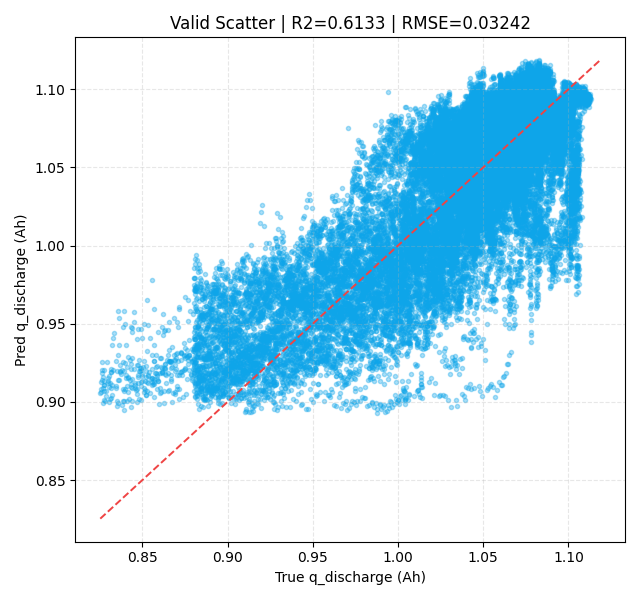

**图4-3 deltaAh 对照路线。** 来源路径：`outputs/analysis/lstm_charge_delta_ah_prefix_full_grid_colab_tpu_final/valid_scatter.png`。口径：deltaAh 序列预测 `q_discharge`。关键数值：valid `R2=0.6133295298`。解释：支撑 dQ/dV final 明显强于 deltaAh final。不能把不同目标口径混写。

**读图补充：** X/Y轴：横轴通常为真实 `q_discharge`，纵轴为 deltaAh LSTM 预测 `q_discharge`；数据来自充电 deltaAh 序列模型的验证预测。点云与 45 度线的偏离用于判断该路线相对 dQ/dV final 的误差结构，组合阅读时应与 dQ/dV LSTM 散点和指标表对照。该图对应序列特征表征与替代表征比较理论，能支持 deltaAh 是有信息但当前弱于 dQ/dV final 的对照路线；不能否定未来改进后的 deltaAh 特征。 字段核对：X/Y轴、数据来源、颜色/分组含义、组合含义、理论/方法口径、可支持结论与不能支持结论均需结合本段前文、原图注和来源路径一起读取。

dQ/dV 主峰特征是当前单步 SOH 建模中最有价值的表征之一。`outputs/analysis/dqdv_feature_retention_correlation/correlation_global.csv` 显示，`main_peak_area`、`main_peak_prominence`、`main_peak_height_dqdv` 与 retention 的 Spearman 相关分别为 `0.8575`、`0.8566`、`0.8565`。该分析只覆盖 9 个 dQ/dV 主峰/温度特征，明确不包含 `cycle_index_norm`。

dQ/dV LSTM 的主模型使用 `main_peak_temp_cycle` feature pack，即 9 个主峰/温度特征加 `cycle_index_norm`。在 `outputs/analysis/lstm_dqdv_retention_grid_colab_final/train_valid_metrics.csv` 中，该模型 retention valid `R2=0.926793`、`RMSE=0.012491`；换算成 q_discharge 后 valid `R2=0.935550`、`RMSE=0.013421`。

与充电区间 deltaAh LSTM 的交集比较显示，dQ/dV 路线明显更强。`outputs/analysis/lstm_method_comparison_colab_final/lstm_dqdv_vs_deltaah_comparison.md` 中，weighted retention 口径下 dQ/dV LSTM R2 为 `0.925716`，deltaAh LSTM 为 `0.560086`；weighted q_discharge 口径下分别为 `0.935087` 和 `0.613330`。

因此，报告应把 dQ/dV 路线写成“离线高精度单步 retention 主路线”，而不是纯 compact 特征或 BMS 端侧部署已经完成。若要讨论端侧候选，应单独引用 compact feature pack 或 bridge 结果。

工况到 dQ/dV/retention 的桥接图表揭示了一个更细的机制问题：工况特征能否重建电化学表征，并进一步解释 retention。已有数据表明，工况特征可较好预测 dQ/dV 的面积和峰高，compact4 deployable bridge 达到 `R2=0.897059`；然而同口径 direct retention baseline 达到 `R2=0.941887`，说明 bridge 的解释价值并未转化为当前最强可部署预测路线。综合来看，bridge 更适合说明工况和电化学表征之间的信息通道，而不是替代 direct baseline。

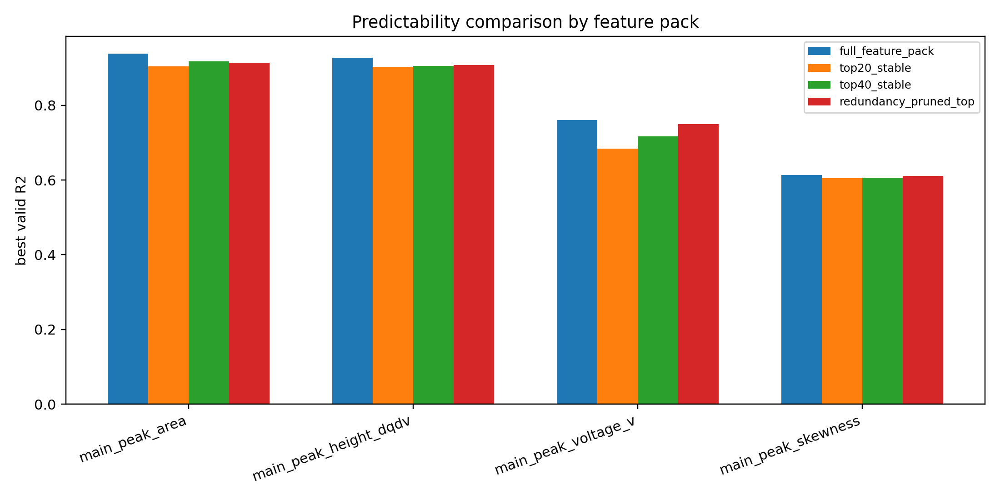

**图5-1 159 维工况到 dQ/dV target。** 来源路径：`outputs/analysis/interval_features_to_dqdv_correlation/predictability_r2_comparison.png`。口径：159 维工况输入预测 compact target。关键数值：area `R2≈0.9383`，height `R2≈0.9279`。解释：工况能预测部分 dQ/dV compact 表征。不能泛化成所有 dQ/dV target 都容易预测。

**读图补充：** X/Y轴：横轴为 dQ/dV compact target 或主峰目标，纵轴为工况特征预测这些 target 的 R2；数据来自 159 维区间工况特征到 dQ/dV target 的建模结果。柱形/分组表示不同 target 的可预测性，组合图说明哪些 dQ/dV 表征能被运行工况间接重建。该图对应两阶段表征桥接、可观测代理变量与可部署特征映射理论，能支持“部分 dQ/dV target 可由工况特征高 R2 预测”；不能支持 oracle bridge 可直接部署。

**图5-2 bridge 与 direct 的第一次对照。** 来源路径：`outputs/analysis/interval_feature_pack_compact2_retention_bridge/bridge_r2_comparison.png`。口径：compact2 oracle/deployable/direct。关键数值：oracle `R2=0.867750`，deployable `R2=0.854967`，direct55 `R2=0.944597`。解释：bridge 有解释价值但不是最强 predictor。不能把 oracle 写成可部署。

**读图补充：** X/Y轴：横轴为 oracle bridge、deployable bridge、direct retention 等路线，纵轴为 valid R2；数据来自 compact2 retention bridge 评估产物。不同柱表示真实 dQ/dV、预测 dQ/dV 和直接预测 retention 三类证据，组合在一起用于区分信息上限、可部署链路和直接基线。该图对应代理表征、两阶段回归与误差传递理论，能支持 bridge 路线有解释价值；不能把 oracle 结果写成可部署性能。

**图5-3 compact2/3/4 决策图。** 来源路径：`outputs/analysis/compact_target_pack_retention_decision/retention_r2_by_target_pack.png`。口径：固定 LightGBM 比较 target pack。关键数值：compact4 deployable55 `R2=0.897059`，direct55 `R2=0.941887`。解释：compact4 bridge 信息量更强。不能忽略 direct baseline。

**读图补充：** X/Y轴：横轴为 compact2/compact3/compact4 等 target pack 或路线组合，纵轴为 retention valid R2；数据来自 compact target pack 决策分析。颜色/分组区分 oracle、deployable 与 direct，组合图用于比较“增加 dQ/dV target 维度”与“可部署工况输入”之间的收益和误差传递。该图对应特征包选择、多任务代理目标和部署约束下的模型选择理论，能支持 compact pack 的决策排序；不能单独证明某个 pack 在外部数据上最优。 字段核对：X/Y轴、数据来源、颜色/分组含义、组合含义、理论/方法口径、可支持结论与不能支持结论均需结合本段前文、原图注和来源路径一起读取。

工况到 dQ/dV 的桥接路线回答的问题不是“哪个模型分数最高”，而是“可观测工况是否能解释 dQ/dV 峰形变化，并通过 dQ/dV 传递到 retention”。该路线的输入是 159 维 cycle 级工况统计特征，包含充电累计、充电增量、放电增量、放电累计和放电摘要；去冗余后形成 `recommended55` 输入包。

`outputs/analysis/interval_features_to_dqdv_correlation/predictability_metrics_by_target.csv` 显示，159 维工况对 `main_peak_area` 与 `main_peak_height_dqdv` 的可预测性较强，valid R2 分别为 `0.9383` 和 `0.9279`；`main_peak_voltage_v` 为 `0.7610`，`main_peak_skewness` 为 `0.6139`。这说明“工况 -> dQ/dV compact 表征”具备可行性，但峰形偏度仍较难预测。

retention bridge 需要同时区分三条路线：`oracle bridge` 使用真实 dQ/dV，是上限；`deployable bridge` 使用预测 dQ/dV，才接近部署；`direct retention baseline` 不经 dQ/dV，直接用工况预测 retention，是强对照。compact4 中，oracle bridge valid R2 为 `0.918027`，deployable55 为 `0.897059`，direct55 为 `0.941887`。因此 bridge 更适合作为中介解释和辅助约束，不宜替代 direct retention 主预测路径。

多步预测与 long-life holdout 图表说明，时间外推问题不能只看单步模型。H100/M50 中 `linear_last10 all R2=0.986496`，表明短期 retention 趋势本身非常强；单调 LSTM 可以改善曲线形态并引入物理先验；long-life H50/M100 则显示历史 retention summary 与 LightGBM 结合后在 H100 endpoint 上表现较好。这里的关键不是哪条线绝对胜出，而是必须区分历史 retention 增强、纯工况输入、趋势外推和长寿命留出四种不同证据。

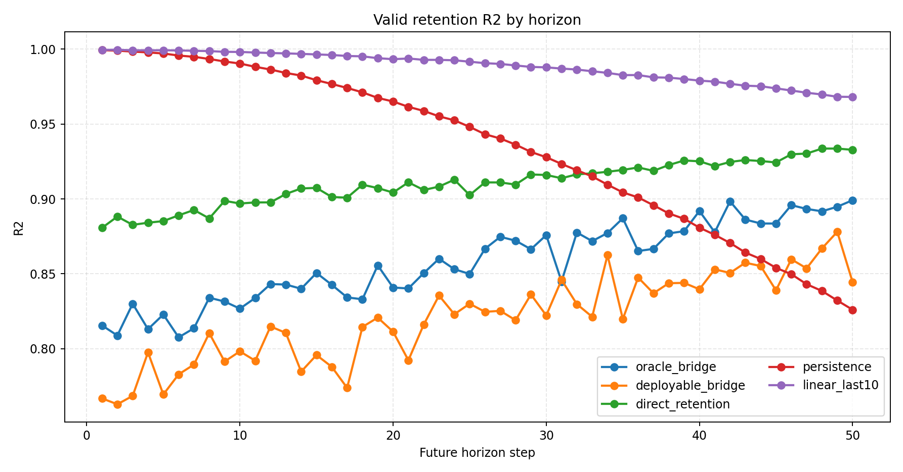

**图6-1 H100/M50 多步 R2 曲线。** 来源路径：`outputs/analysis/multistep_interval_to_dqdv_retention_blocks_h100_m50/retention_r2_by_horizon.png`。口径：history_len=100，horizon=50。关键数值：`linear_last10 all R2=0.986496`。解释：短窗口历史 retention 趋势极强。不能写成工况模型能力。

**读图补充：** X/Y轴：横轴为预测 horizon 或未来步长，纵轴为 retention R2；数据来自 H100/M50 多步 block 预测结果。多条线/分组表示 linear_last10、工况模型、LSTM 或桥接路线在不同 horizon 的表现，组合曲线用于观察预测难度随时间外推的变化。该图对应时间序列外推、递推误差累积与历史趋势基线理论，能支持 short-horizon 趋势基线很强；不能把 history-retention-enhanced 表现写成 pure operational 能力。

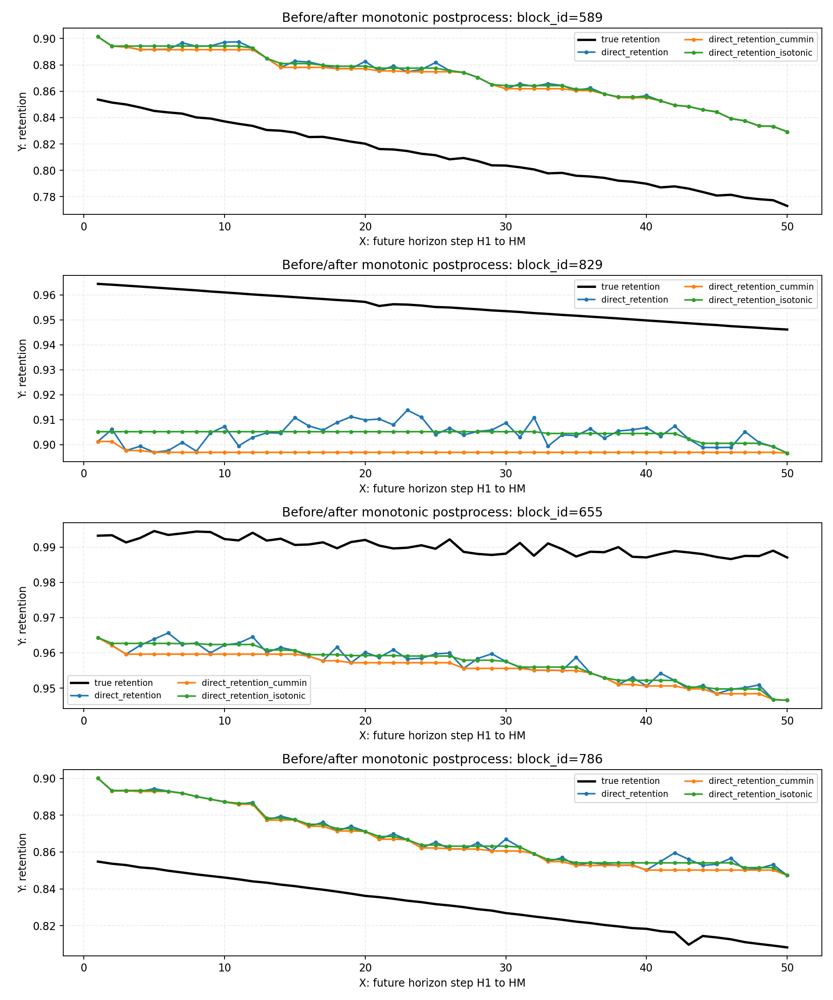

**图6-2 单调约束曲线前后对比。** 来源路径：`outputs/analysis/monotonic_lstm_multistep_retention_blocks_h100_m50/valid_monotonic_curves_before_after.png`。口径：monotonic LSTM 多步 retention。关键数值：最佳 H50 `RMSE=0.007888`，`R2=0.972918`。解释：单调先验可改善曲线形态。不能写成真实曲线逐点单调。

**读图补充：** X/Y轴：横轴为未来 cycle/horizon，纵轴为 retention；数据来自 monotonic LSTM 多步预测的验证曲线。子图或颜色对比单调约束前后的预测轨迹，组合在一起说明物理先验如何减少不合理上升或波动。该图对应容量随循环非增的物理约束、后处理约束与序列模型校准理论，能支持单调先验改善曲线形态；不能证明所有电芯均严格单调或模型因果正确。

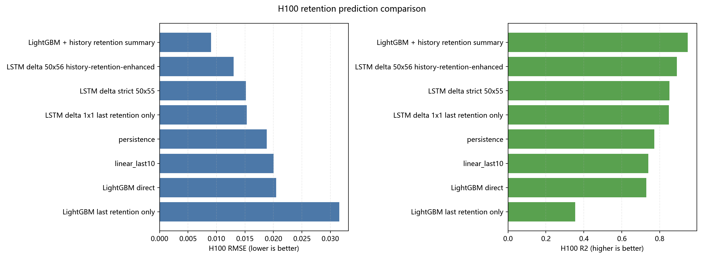

**图6-3 long-life H50/M100 endpoint。** 来源路径：`outputs/analysis/long_life_holdout_lgbm_lstm_blocks_h50_m100_figures/comparison_v2_h100_rmse_r2_bar.png`。口径：long-life holdout H100 endpoint。关键数值：LightGBM + history retention `RMSE=0.009033`，`R2=0.947182`。解释：更长预测窗口下 history summary 路线强于 simple trend。不能写成 pure operational 胜利。

**读图补充：** X/Y轴：横轴为 long-life holdout 下的候选路线，纵轴为 H100 endpoint 的 RMSE/R2；数据来自 H50/M100 long-life holdout 比较图。双指标柱或分组用于同时看误差尺度和解释方差，组合图强调外推验证与普通 fixed split 的差异。该图对应域外泛化、长寿命留出与 endpoint 评估理论，能支持特定 history-retention-enhanced 路线在该口径下表现更强；不能说明 pure operational 模型已经解决长寿命外推。

多步 retention 预测首先要区分样本构造口径。rolling window 指标容易偏乐观；fixed_origin 更接近严格早期预测但样本少；fixed_blocks 是折中。既有比较中，LightGBM rolling valid weighted all R2 为 `0.926646`，fixed_blocks 为 `0.807755`，fixed_origin 为 `0.521131`。这些数字不能混成一个模型性能。

在 H100/M50 非重叠 block 中，历史 retention 趋势非常强。`linear_last10` all-horizon R2 为 `0.986496`，H50 R2 为 `0.968077`；direct retention all R2 为 `0.913362`，deployable dQ/dV bridge all R2 为 `0.826557`。这说明短窗口任务中，局部 retention 平滑趋势本身就是最强信息源。

残差 LSTM 和单调 LSTM 的结论也需要谨慎。残差 LSTM 对 `linear_last10` 的 H50 RMSE 仅从 `0.008564` 降到 `0.008444`；单调 LSTM 最优版本 H50 RMSE 为 `0.007888`、R2 为 `0.972918`，但该最优版本依赖 history-retention-enhanced 输入，不是纯工况胜利。真实 retention 在 H1:H50 上也不严格单调，curve violation rate 为 `0.892430`，因此单调约束更像去噪先验而不是逐点真值规则。

long-life holdout 进一步说明预测窗口会改变结论。H100/M50 中 `linear_last10` 仍然很强，H50 RMSE 为 `0.005370`、R2 为 `0.981336`；但 H50/M100 中，预测更远的 H100 endpoint 时，`LightGBM + history retention summary` 取得 RMSE=`0.009033`、R2=`0.947182`，优于 `linear_last10` 的 RMSE=`0.020048`、R2=`0.739842`。总报告必须把 trend baseline、pure operational、history-retention-enhanced 和 last-retention-only 消融分开。

因果推断图表提供的是策略解释和实验排序证据。`window_mean +1C` 对未来 200 cycles 相对容量下降的估计效应为 `0.014658`，温度中介路径存在但占比较小，`NIE/TE=3.04%`。区间替代效应和容量-阻抗联合风险进一步说明，某些 SOC-rate-temp 区间可能同时影响短期容量和长期风险。然而，这些结果都依赖观测数据、支持域和混杂调整，因此只能为实验设计提供优先级，而不能替代随机或准实验验证。

**图7-1 window_mean +1C 观测因果效应。** 来源路径：`outputs/analysis/causal_initial_rate_effect/fig_delta_plus1c_curve_window_mean.png`。口径：GPS/AIPW 连续处理，H=200。关键数值：`effect_plus_1c=0.014658`。解释：真实执行倍率越高，后续容量下降风险越大。不能替代受控实验。

**读图补充：** X/Y轴：横轴为窗口或处理强度相关的倍率口径，纵轴为 `window_mean +1C` 对未来容量下降的估计效应及置信区间；数据来自 `outputs/analysis/causal_initial_rate_effect/` 的连续处理因果估计。曲线/误差带表示效应大小与不确定性，组合呈现不同窗口下效应稳定性。该图对应 GPS/AIPW 连续处理、剂量效应与潜在结果框架，能支持“观测数据中较高倍率与未来容量损伤风险增加相关且经调整后仍显著”的结论；不能替代随机受控实验。

**图7-2 温度中介路径。** 来源路径：`outputs/analysis/causal_rate_temp_mediation/fig_path_decomposition_global.png`。口径：`TE/NDE/NIE` 中介分解。关键数值：`NIE/TE=3.04%`。解释：直接倍率路径主导，温度路径小幅参与。不能写成温度无关或温度唯一机制。

**读图补充：** X/Y轴：横轴为 TE/NDE/NIE 等路径分解项，纵轴为对应效应估计值或占比；数据来自倍率-温度-容量衰减中介分析。柱形/颜色区分总效应、自然直接效应和自然间接效应，组合在一起拆解“倍率影响未来衰减”中温度路径贡献。该图对应因果中介分析、路径分解与潜在结果理论，能支持温度中介存在但占比较小的解释；不能写成温度无关或温度唯一机制。

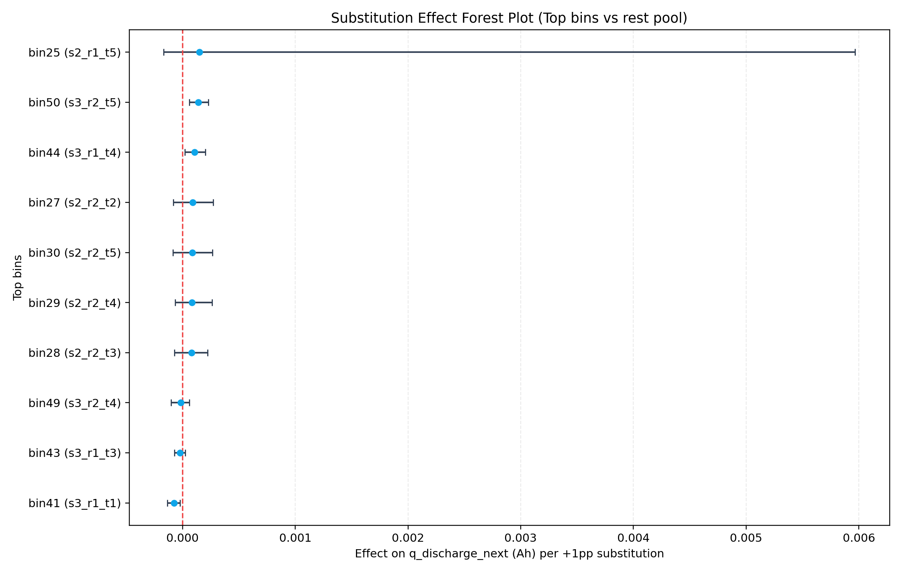

**图7-3 60 区间 DML 替代候选。** 来源路径：`outputs/analysis/charge_bin_substitution_causal/effect_forest_plot.png`。口径：Top10 区间 DML + bootstrap + BH-FDR。关键数值：`bin50 q=0`、`bin41 q=0.02`、`bin44 q=0.0667`。解释：用于实验排序。不能写成全 60 区间确定最优策略。

**读图补充：** X/Y轴：纵轴为 Top SOC-rate-temp 区间或 bin，横轴为替代效应估计及置信区间；数据来自 charge bin substitution 的 DML、bootstrap 和 BH-FDR 结果。点和误差线表示估计值及不确定性，组合森林图用于比较候选区间的方向、显著性和稳健性。该图对应双重机器学习、异质处理效应和多重检验控制理论，能支持受控实验候选排序；不能直接升级为上线策略。

**图7-4 容量-阻抗双风险。** 来源路径：`outputs/analysis/capacity_ir_joint_causal/fig_cross_bin_dual_risk_matrix.png`。口径：双结局 cross-bin 风险矩阵。关键数值：Spearman `0.635436`，Pearson `0.864076`。解释：容量下降与阻抗上升存在共同退化结构。不能把共变写成单向因果。

**读图补充：** X/Y轴：横轴和纵轴为 SOC-rate-temp cross-bin 或风险维度，颜色表示容量下降与阻抗上升的联合风险强弱；数据来自容量-阻抗联合因果分析。矩阵组合把两个退化结局放在同一风险空间中，帮助识别同时不利于容量和阻抗的工况区域。该图对应多结局因果风险、共同退化与代理安全约束理论，能支持容量与阻抗应联合监测；不能把共变关系直接写成单向因果链。

因果推断卷的增强重点是识别可信度，而不是堆叠结论。当前因果任务至少包含四条线：连续倍率对未来相对容量下降的 `GPS/AIPW` 估计，倍率经温度影响容量衰减的 `TE/NDE/NIE` 中介分解，60 区间份额替代的 `DML + bootstrap + BH-FDR`，以及容量-阻抗联合退化的趋势共变和双方向 AIPW。

在初始/窗口倍率效应中，`window_mean` 口径比 `initial` 更贴近真实执行强度。`outputs/analysis/causal_initial_rate_effect/causal_effect_global_treatment_compare.csv` 中，`window_mean` +1C 效应为 `0.014658`，`initial` 为 `0.013829`，方向一致，幅度相差约 `6%`。`window_mean` CI 为 `[0.012841, 0.016559]`，支持全局正向损伤效应，但这仍是观测因果估计，不等同受控实验。

温度中介显示温度路径存在但不是主导。`outputs/analysis/causal_rate_temp_mediation/mediation_effect_global.csv` 中，`TE=0.007918`，`NDE=0.007678`，`NIE=0.000241`，`NIE/TE=3.04%`。正确表述是“直接倍率路径主导，温度路径有小幅放大贡献”，而不是“温度不重要”。

60 区间替代效应应服务于实验排序。`bin50`、`bin41`、`bin44` 是较强候选，其中 `bin50 q=0`，`bin41 q=0.02`，`bin44 q=0.0667`。但这些结果来自 Top10 筛选后的 DML，不是全 60 个区间的同等强度因果估计。主/敏感性方向一致率约 `80%`，可支持排序稳定性，但不能支持直接上线。

容量-阻抗联合分析显示共同退化关系明显：窗口层面容量衰减与阻抗上升 Spearman 为 `0.635436`，Pearson 为 `0.864076`，共同恶化占比为 `73.16%`。但共变不是单向因果。`bin05` 虽是 raw 头部共同风险区间，但 `support_width_1_99=0.000106`，支持域极窄，必须列入禁止外推。高温结论也只能分层写：当前支持“低 SOC 层更强、跨 SOC 不单调”，不能写成全 SOC 单调高温风险。

因果证据等级建议如下：

| 等级 | 规则 | 当前候选 |
|---|---|---|
| A | CI 不跨 0，`q<=0.05` 或方向/敏感性稳定，支持域可接受 | `bin50`, `bin41` 下一循环替代效应；容量-阻抗双方向 AIPW |
| B | CI 不跨 0但 `0.05<q<=0.10`，或 bootstrap CI 稳定且支持域尚可 | `window_mean +1C` 全局容量损伤；温度 NIE 小幅正向；`bin44` |
| C | CI 跨 0、`q>0.10`、敏感性不稳或支持域偏窄 | 若干 Top10 观察项、`initial` 中介 TE |
| 禁止外推 | 极窄支持、zero-support、raw/norm 排名冲突、生产化表达越界 | `bin05` raw 巨大效应；“高温全 SOC 单调有害”；“可上线”直译 |

策略转译必须保守：战略层可以把 `>=3.5C` 风险作为实验上限或暴露约束；战术层可以把 `bin50 +5pp`、`bin44 +5pp`、`bin41 -5pp` 作为受控实验候选；决策层应把既有报告中的 `可上线` 改写为“受控实验候选/灰度候选”。所有动作必须通过 ITT/PP 双口径受控实验复核。

最后，工程复现与策略矩阵图表把模型证据转化为可审计流程。LightGBM 路线图和 Colab loss 曲线说明，正式产物需要保留输入、模型、预测、指标和日志之间的追溯关系；策略热图则把因果证据折叠为实验候选空间。由此可见，工程复现并非附属工作，而是防止 smoke/formal、oracle/deployable 和预测/因果混写的制度性保障。

**图8-1 LightGBM 路线工程示意。** 来源路径：`outputs/analysis/long_life_holdout_lgbm_lstm_blocks_h50_m100_figures/route_diagrams/route_lightgbm_gpt_image2.png`。口径：既有路线图。关键数值：性能以 long-life 比较报告为准。解释：说明工程链路需要把输入、模型和输出绑定。不能写成本轮新验证。

**读图补充：** X/Y轴：该路线图没有严格数值 X/Y 轴，横向流程表示输入、特征、模型和输出阶段，纵向或分支表示不同信息流；来源为既有 long-life holdout 工程路线示意。组合节点说明 LightGBM 路线如何把历史 retention、工况特征和评估产物串联起来。该图对应可复现机器学习流水线、数据契约和模型审计理论，能支持工程复现路径说明；不能作为新增模型性能证据。

**图8-2 Colab final 训练痕迹。** 来源路径：`outputs/analysis/lstm_dqdv_retention_grid_colab_final/loss_curve.png`。口径：既有 dQ/dV LSTM loss 曲线。关键数值：指标以 `train_valid_metrics.csv` 为准。解释：正式产物应保留可追溯训练曲线。不能替代 smoke/formal 契约检查。

**读图补充：** X/Y轴：横轴为训练 epoch 或迭代步，纵轴为训练/验证 loss；数据来自既有 Colab final 训练日志。多条曲线表示训练集和验证集损失变化，组合曲线用于观察收敛、过拟合和训练稳定性。该图对应优化过程监控、泛化间隙与训练可追溯理论，能支持“该产物具备训练过程证据”；不能替代固定验证集指标、smoke/formal 契约检查或外推验证。

工程层面的核心约束来自 `AGENTS.md`。当前默认 Python 环境为 `C:\Users\pal\pyenv\colab`，推荐在该环境目录执行 `pipenv run python <script>`。`logs/session_YYYY-MM-DD.md` 是强制会话日志，任务执行需按天追加，不覆盖历史。

Colab 长任务的最低门槛包括 CLI `--help` 契约、notebook 命令一致性、路径优先级、target 维度扫描、smoke tune/full-refresh、关键产物存在、checkpoint resume、PyTorch `torch.load(weights_only=...)` 兼容，以及输出列检查。本报告生成没有运行这些 smoke，只引用规则和既有历史证据。

外部 Colab 镜像 `C:/Users/pal/projects/colabs/batt_soh` 存在 `dq_dv_retention_train.ipynb`、`dq_dv_multistep_train.ipynb`、`interval_to_dqdv_retention_train.ipynb`、多个 guide、scripts 和 outputs。由于本轮只读检查未做 byte-identical 哈希、notebook AST 或 smoke full-refresh，报告只能写“Colab 镜像存在且历史上用于训练链路”，不能写“本轮重新验证镜像一致”。

一个需要明确标注的工程冲突是：`SCRIPT_CATALOG.md` 维护说明仍写旧环境 `C:\Users\pal\pyenv\ds_env`，与 `AGENTS.md` 当前默认 `C:\Users\pal\pyenv\colab` 不一致。总报告以 `AGENTS.md` 为准。

**图9-1 策略候选的证据等级入口。** 来源路径：`outputs/analysis/strategy_tactics_closed_loop/two_layer_decision_matrix_heatmap.png`。口径：策略与战术候选动作热图。关键数值：`bin50 +5pp`、`bin44 +5pp`、`bin41 -5pp` 属实验候选。解释：该图帮助把“已验证事实、合理解释、待验证假设”分开。不能把候选动作写成生产最优。

**读图补充：** X/Y轴：横轴通常为战术候选动作或区间替代方向，纵轴为战略目标/风险约束层；颜色表示推荐强度、风险等级或证据等级。数据来自 strategy tactics closed loop 的候选策略整理。组合热图把因果估计、约束和实验候选放在同一决策空间中。该图对应策略-战术两层决策、约束优化与证据分级理论，能支持“哪些动作值得进入受控实验”；不能支持直接上线执行。

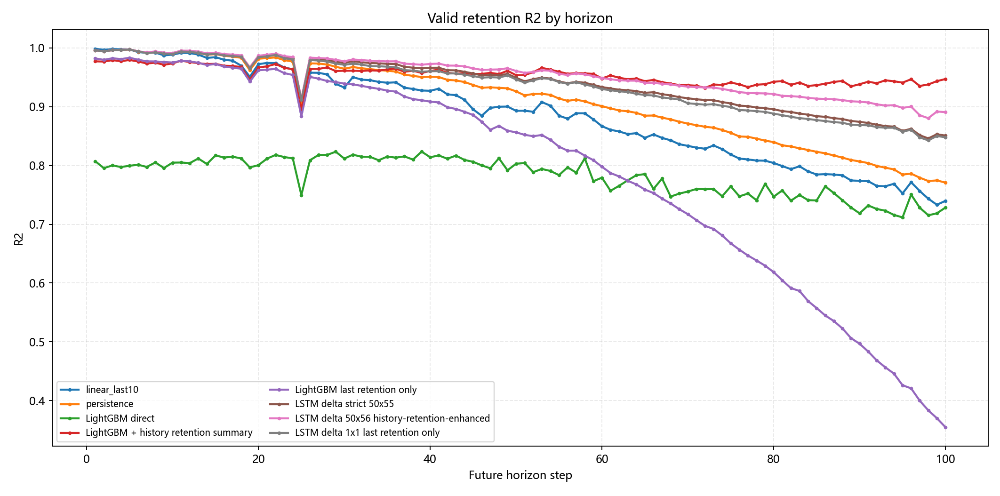

**图9-2 预测结论分级参考。** 来源路径：`outputs/analysis/long_life_holdout_lgbm_lstm_blocks_h50_m100_figures/comparison_v2_r2_by_horizon.png`。口径：H50/M100 long-life holdout。关键数值：H100 endpoint LightGBM + history retention `R2=0.947182`。解释：可作为“已验证固定 holdout 事实”，但仍不是未来批次的上线保证。不能把单一 holdout 等同外部验证。

**读图补充：** X/Y轴：横轴为 horizon 或未来预测步长，纵轴为 R2；数据来自 H50/M100 long-life holdout 的路线比较。多条线表示 LightGBM、LSTM、trend 或 history-retention-enhanced 路线，组合曲线用于比较随预测距离增加的外推衰减。该图对应长寿命留出、时间序列泛化和误差随 horizon 传播理论，能支持对预测结论分级；不能把高 R2 写成因果解释。

## 五、综合讨论

综合来看，当前项目最有价值的结果不是某一个模型指标，而是一套分层证据体系。数据层保证 `policy + cell_code` 样本口径和 `q_discharge/retention` 标签口径可追溯；表征层说明 dQ/dV 主峰能提供高信息量 SOH 表征；预测层显示传统非线性模型、dQ/dV LSTM 和多步 history-retention-enhanced 路线分别在不同任务中有效；因果层则把倍率、温度、SOC-rate-temp 区间和容量-阻抗联合退化纳入策略解释框架。

这一体系的优势在于，预测结果和机理解释可以互相校正。若某个特征在预测中表现强，但缺乏稳定的物理或因果解释，则应定位为经验性预测信号；若某个因果候选在观测数据中方向稳定，但支持域不足或敏感性较弱，则应定位为实验候选而非上线策略。与此相对应，dQ/dV 的强单步表现说明其表征价值，但不自动说明工况策略可控；`linear_last10` 的强多步表现说明历史趋势信息量高，但不代表工况模型已经掌握退化机制。

局限性同样需要明确。第一，现有结果主要基于本地已有产物，本文没有重新训练或刷新指标。第二，固定验证集、block 验证和 long-life holdout 的任务难度不同，指标不能横向无条件比较。第三，观测因果分析仍面临未观测混杂、支持域边缘和策略依从性问题。第四，VSCode 图片镜像解决了本地阅读问题，但也增加了报告目录中的镜像文件，需要在后续发布或归档时保持同步。

未来改进应沿三条路径推进。首先，在预测侧，应继续区分 pure operational 与 history-retention-enhanced，并在 long-life holdout 上评价端点误差和曲线形态。其次，在表征侧，应检验 compact dQ/dV target 是否能在更严格部署约束下保留足够信息。最后，在因果侧，应把 `bin50`、`bin41`、`bin44` 等候选转化为受控实验设计，并同步观测容量、阻抗和温度路径。

## 六、结论

本章进一步收束全文的数据证据与结论边界。本文将电池寿命预估与衰减因果推断重新组织为一个连续论证体系。研究表明，当前数据底座能够支持以 `policy + cell_code` 为单位的可追溯验证；dQ/dV 主峰表征在单步 SOH 预测中具有强信息价值；传统非线性模型构成必要基线；多步预测必须把历史 retention 趋势、工况输入和 long-life holdout 分开解释；观测因果推断则适合用于策略解释和实验排序。

从理论意义上看，系统论帮助识别电芯退化中的多变量耦合，信息论解释不同表征对 SOH 预测的信息贡献，控制理论则要求所有策略候选进入受控实验闭环。由此，本文的核心结论并不是某个单点 R2，而是预测、表征、因果和工程复现之间必须保持清晰边界。后续研究应在更严格的外推数据、受控实验和多结局安全约束下验证这些结论，使当前观测证据逐步转化为可执行、可审计、可复现的电池寿命管理策略。

因此，本文所有结论均按证据等级表达：预测指标只说明在给定切分、目标和输入口径下的误差表现，统计相关只说明变量之间的同步或单调关系，观测因果估计只说明在可观测混杂调整和支持域约束下的效应方向与量级，受控实验才是策略上线前的必要验证环节。报告中保留 `oracle/deployable/direct`、`history-retention-enhanced/pure operational`、`smoke/formal`、`观测因果/受控实验` 等边界词，目的正是防止将预测能力、解释能力和干预有效性混写。
