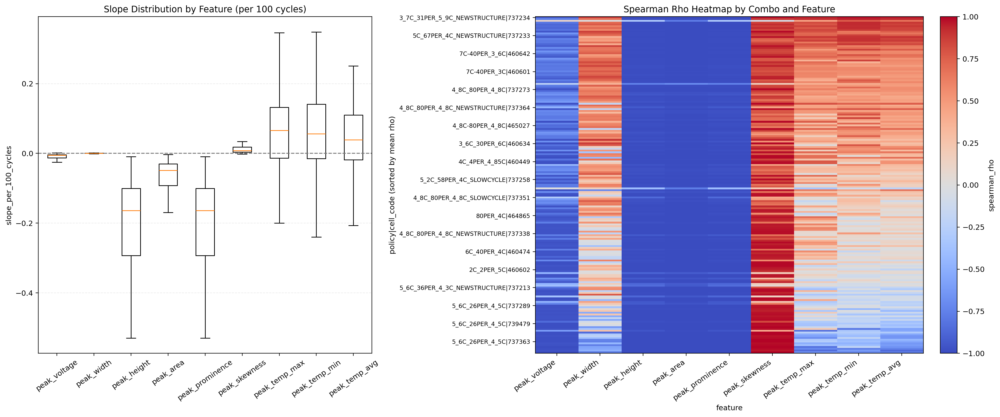

# 01 数据资产与问题定义分卷

## 一、问题背景与分卷定位

本卷讨论寿命预估研究的基础问题：数据如何被组织，标签如何被定义，训练与验证样本如何划分，以及这些口径为什么会影响后续模型和因果分析的解释边界。若数据层没有清晰的样本单元和标签来源，任何模型指标都可能被误读为泛化能力或策略效果。

## 二、技术原理与作用路径

从技术原理上看，当前工程以 `policy + cell_code` 作为样本单元，以 cycle 级 `q_discharge` 作为绝对容量标签，并在建模任务中派生 `retention`。这种设计的作用路径是先在同一策略和电芯内部建立早期参考容量，再把后续容量衰退转换为相对 SOH，从而减少不同电芯初始容量差异带来的尺度干扰。

## 三、理论机制

系统论视角下，`policy` 是外部策略输入，`cell_code` 是个体差异载体，`cycles` 是时间演化轴，`q_discharge` 与 `retention` 是容量状态输出。信息论视角下，样本划分决定训练和验证之间可共享的信息范围；若按 cycle 随机切分，模型可能学习同一电芯的局部轨迹而非跨样本泛化。

## 四、已有数据与实证材料分析

已有划分显示，总样本数为 `187`，训练集 `135`，验证集 `52`。验证集包含变电流工况样本，而训练集中无该类样本，因此评估并非简单分布内插值。进一步看，dQ/dV 主峰和统一相关性图说明，容量标签背后存在曲线表征和工况结构两类证据，这为后续从传统特征、dQ/dV 表征和因果解释三个方向展开提供了数据基础。

**图1 数据划分与寿命分布。** 来源路径：`data/processed/train_valid_hist_compare.png`。口径：固定 `policy + cell_code` 样本划分下的训练/验证寿命分布。关键数值：训练集 `135`、验证集 `52`、总样本 `187`。解释：该图用于确认验证集不是 cycle 随机切分，而是 policy-cell 粒度的留出集合。风险边界：该图不能证明模型泛化，只能说明样本分布与划分口径。

**读图补充：** 该图的 X 轴为每个 `policy + cell_code` 样本对应的寿命长度或最大循环数区间，Y 轴为落入相应区间的样本数量；数据来自 `data/processed/train_policy_cell_samples.csv` 与 `data/processed/valid_policy_cell_samples.csv` 中的 `policy`、`cell_code`、`max_cycles` 等字段。颜色或分组用于区分训练集与验证集，含义是同一寿命尺度下两类样本的分布对照，而不是同一电芯在不同阶段的轨迹对照。组合在一起的意义是检查固定划分是否在寿命范围上存在明显偏置，并说明后续模型评估面对的是 policy-cell 样本留出，而非 cycle 行级随机拆分。该图对应监督学习中的样本划分、标签分布核对和外推风险审查口径，可支持“训练/验证样本规模和寿命覆盖可被追溯”这一结论；不能支持“模型已经泛化良好”“寿命差异由某个 policy 因果导致”或“验证集与训练集完全同分布”等结论。

**图2 dQ/dV 主峰随循环演化的结构性线索。** 来源路径：`outputs/analysis/dqdv_main_peak_cycle_relation/main_peak_cycle_relation_overview.png`。口径：既有 dQ/dV 主峰与 cycle 关系概览图。关键数值：本卷引用其趋势形态，不把图像读数替代 CSV 指标。解释：该图帮助说明后续为什么会从 cycle 级容量标签转向 dQ/dV 表征。风险边界：它不是训练/验证性能图，也不能单独支持因果衰减结论。

**读图补充：** 该图通常以循环序号或归一化循环进程作为 X 轴，以 dQ/dV 主峰相关统计量作为 Y 轴，例如主峰面积、峰高、峰位电压或形态指标；这些字段来自既有 dQ/dV 主峰提取产物，并与 processed 层的 `policy`、`cell_code`、`cycles` 口径对齐。颜色、分组或子图用于呈现不同主峰特征、不同样本集合或不同演化视角，其含义是观察电化学曲线特征随循环推进的结构性变化，而不是展示某一模型的预测误差。若图中包含多个子图，组合含义是把“循环进程”和“主峰形态变化”放在同一证据框架下，说明容量衰减问题并非只有单一容量标签，还存在可解释的曲线表征层。该图对应 dQ/dV 增量容量分析、退化表征和特征工程入口方法，可支持“dQ/dV 主峰特征具有随循环变化的表征价值”；不能支持“某一主峰变化必然导致寿命衰减”“主峰特征已通过验证集预测检验”或“图中趋势等同于因果效应估计”等结论。

**图3 从原始曲线到 dQ/dV 主峰特征。** 来源路径：`outputs/analysis/dqdv_feature_explanation/dqdv_feature_extraction_illustration.png`。口径：既有 dQ/dV 特征提取说明图。关键数值：图中用于解释峰面积、峰高、电压位置等特征概念；数值证据需回到 `dqdv_feature_retention_correlation` CSV。解释：该图把 `q_discharge` 标签和 dQ/dV 特征之间的表征桥接可视化。风险边界：不能把特征提取示意写成模型训练结果。

**读图补充：** 该图的 X 轴通常为电压或与充放电曲线对齐的电压区间，Y 轴为容量变化率 `dQ/dV` 或由容量曲线转换得到的局部响应强度；底层数据来自原始或 processed 层充放电曲线字段，经 dQ/dV 转换、平滑和主峰定位后形成峰面积、峰高、峰位电压、峰宽或偏度等派生字段。颜色、标注或局部阴影用于说明被识别的峰区域、峰顶位置和面积积分范围，分组并不代表因果处理组，而是用于解释特征构造的不同组成部分。若图中同时展示原始曲线、dQ/dV 曲线和峰特征，组合含义是说明从可观测电池曲线到机器学习特征表的转换链条。该图对应增量容量分析和特征提取方法口径，可支持“后续相关性或建模使用的 dQ/dV 特征有明确物理曲线来源”；不能支持“这些特征一定优于全部其他特征”“图中单个样本代表全体样本规律”或“特征提取本身已经证明 policy 对寿命存在因果作用”等结论。

**图4 policy、充电与放电特征的统一相关性背景。** 来源路径：`outputs/analysis/correlation_unified/combo_correlation_comparison.png`。口径：加入 policy 三元参数后的组合相关性分析。关键数值：对应 CSV 中 `policy_plus_charge_plus_discharge R2=0.6451206994`。解释：该图说明数据问题从一开始就不是单变量容量拟合，而是 policy、充放电区间与寿命标签的组合结构。风险边界：这是 in-sample 相关性，不是验证集预测性能，也不是因果证据。

**读图补充：** 该图的 X 轴通常表示不同特征组合或特征来源，例如 policy 三元参数、充电区间统计、放电区间统计及其组合；Y 轴表示统一相关性或轻量预测评估指标，图注已明确引用的 `R2=0.6451206994` 来自对应 CSV 的 `policy_plus_charge_plus_discharge` 口径。数据字段来自 `policy_meaning.csv` 中的策略参数，以及 processed 或 analysis 产物中的充电/放电区间统计特征和寿命标签；颜色、分组或子图用于比较不同特征包在同一评价口径下与标签的关联强弱。组合在一起的意义是把 policy、充电过程和放电过程作为互补信息源进行横向比较，判断寿命问题是否需要多源特征共同描述。该图对应相关性筛查、特征组合消融和问题定义阶段的可解释建模口径，可支持“单一特征来源不足以完整概括寿命标签结构，组合特征具有更强关联背景”；不能支持“该 R2 是验证集最终性能”“policy 或某一充放电特征对寿命有因果效应”或“相关性较高的特征在所有模型和外推场景中都稳定有效”等结论。

## 五、综合分析

综合来看，本卷的结论是：数据资产已经具备可追溯研究底座，但任何后续指标都必须绑定样本粒度、标签派生方式和验证集外推压力。`q_discharge` 与 `retention` 的混写、policy-cell 与 cycle 行级样本的混写，都会直接破坏报告的解释有效性。

## 六、分卷结论与证据边界

本卷证据支持数据口径审计和问题定义，不支持模型泛化、因果效应或策略上线。

因此，本文所有结论均按证据等级表达：预测指标只说明在给定切分、目标和输入口径下的误差表现，统计相关只说明变量之间的同步或单调关系，观测因果估计只说明在可观测混杂调整和支持域约束下的效应方向与量级，受控实验才是策略上线前的必要验证环节。报告中保留 `oracle/deployable/direct`、`history-retention-enhanced/pure operational`、`smoke/formal`、`观测因果/受控实验` 等边界词，目的正是防止将预测能力、解释能力和干预有效性混写。
