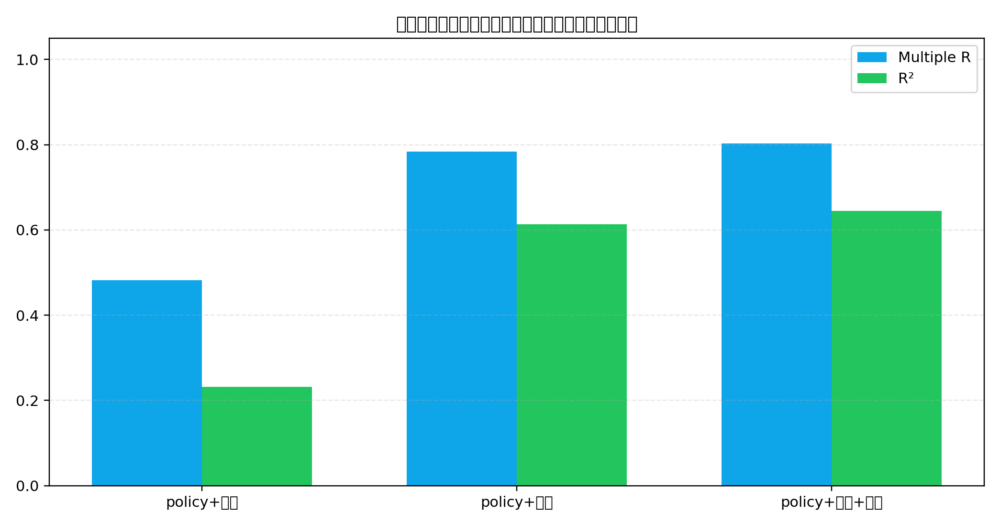
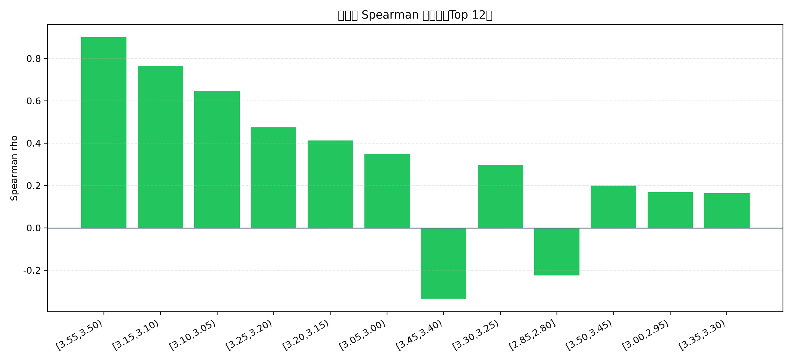
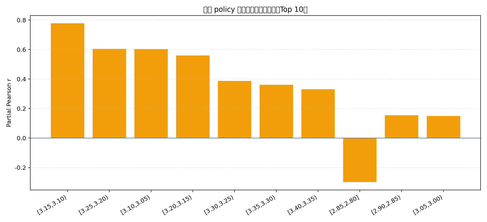
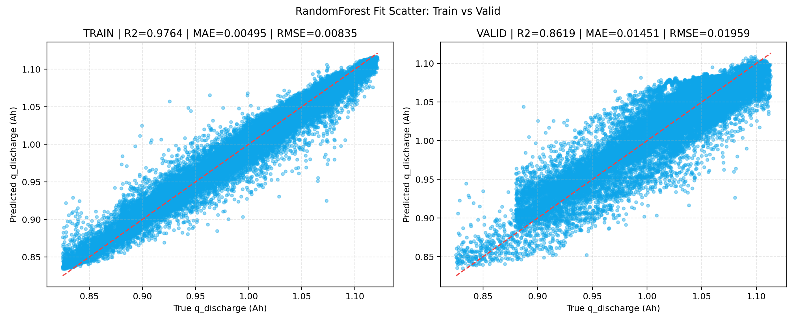
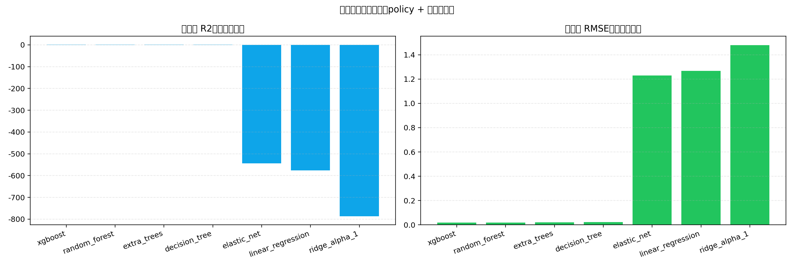

# 02 早期统计特征与传统 ML 基线分卷

## 一、问题背景与分卷定位

本卷回答早期统计特征是否足以构成寿命预测基线的问题。其重要性在于，传统 ML 基线既是深度模型的参照物，也是判断特征到容量映射是否具有非线性结构的最低成本工具。

## 二、技术原理与作用路径

技术上，相关性分析先检验充电、放电和 policy 特征与 `q_discharge` 的同步关系，偏相关进一步控制 policy 三元参数后观察放电区间的独立关联。RF 和 XGBoost 则通过非线性分裂捕捉区间统计之间的交互，避免线性模型把复杂曲线压缩为单一线性斜率。

## 三、理论机制

从信息论看，放电区间统计提供了关于容量状态的直接信息，而 policy 特征提供了运行策略背景。模型偏差-方差理论说明，线性模型偏差较高时，树模型可能通过分段近似降低系统性误差；但从因果理论看，相关性和偏相关仍只是统计关联，并不等同于干预效应。

## 四、已有数据与实证材料分析

已有结果显示，无 policy 口径下放电特征 in-sample R2 为 `0.6022507790`，高于充电特征的 `0.2280792375`；纳入 policy 后，组合 R2 达到 `0.6451206994`。固定验证集上，XGBoost valid R2 为 `0.8777216018`，RF 为 `0.8618745152`，线性类小模型则表现很弱。这说明容量预测存在非线性结构，也说明传统树模型是深度路线之前必须比较的强基线。

**图1 无 policy 时充放电组合的相关性对比。** 来源路径：`outputs/analysis/correlation_no_policy/combo_correlation_comparison.png`。口径：不纳入 policy 三元参数的 in-sample 组合相关性。关键数值：`discharge_only R2=0.6022507790`，`charge_only R2=0.2280792375`。解释：放电侧区间特征是早期容量统计信号的主来源。风险边界：in-sample R2 不能与验证集 R2 混排。

**读图补充：** X 轴是特征组合类型，依次表示仅充电区间统计、仅放电区间统计、充电加放电区间统计；Y 轴是同一组输入对 `q_discharge` 的 in-sample 线性拟合强度，蓝色柱为 Multiple R，绿色柱为 `R2`。数据来自 `charge_interval_features.csv`、`discharge_interval_features.csv` 与 `life_performance.csv` 合并后的 cycle 级特征，并由 `outputs/analysis/correlation_no_policy/combo_correlation_summary.csv` 汇总成图。组合在一起的含义，是在不引入 policy 三元参数时比较充电侧、放电侧及其联合输入的解释度。该图说明放电区间统计比充电区间统计更接近 `q_discharge` 的容量状态信号，充放电联合后有小幅互补增益；对应方法口径是多变量线性相关/回归的样本内解释度筛查。它支持“放电区间应作为传统 ML 基线的核心输入”这一特征工程结论，但不能支持因果损伤判断、泛化预测能力判断，也不能与 RF/XGB 的 fixed valid `R2` 直接排名。

**图2 纳入 policy 后的统一相关性。** 来源路径：`outputs/analysis/correlation_unified/combo_correlation_comparison.png`。口径：policy、充电、放电特征统一线性相关框架。关键数值：`policy_plus_charge_plus_discharge R2=0.6451206994`，`RMSE=0.0321542092`。解释：加入 policy 后组合相关性略提升，但主信号仍来自放电区间。风险边界：不能把该图解释成泛化预测能力。

**读图补充：** X 轴是纳入 policy 后的组合输入，分别对应 `policy+充电`、`policy+放电`、`policy+充电+放电`；Y 轴仍是样本内线性相关强度，蓝色表示 Multiple R，绿色表示 `R2`。数据字段来自 policy 三元参数表 `policy_meaning.csv`、充放电区间统计特征和 `life_performance.csv` 中的 `q_discharge`，图形汇总口径对应 `outputs/analysis/correlation_unified/combo_correlation_summary.csv`。该组合图的含义，是把工况设定与早期区间统计放入同一线性框架，观察 policy 是否解释掉区间特征信息。结果显示加入 policy 后整体解释度略有提高，但 `policy+放电` 已接近最高组合，说明放电统计仍是主要观测信号；理论上对应“控制或纳入混杂工况变量后的相关性描述”，不是因果识别。它支持后续模型至少应包含 policy 与放电特征的输入设计，但不能证明 policy 改变会导致容量变化，也不能证明该线性口径在验证集或跨策略外推中有效。

**图3 放电区间单变量相关性排序。** 来源路径：`outputs/analysis/discharge_policy_q_discharge_corr/univariate_spearman_top12.png`。口径：放电区间特征与 `q_discharge` 的单变量 Spearman。关键数值：`[3.15,3.10)` 区间 Spearman 约 `0.7654`。解释：中低电压放电区间与容量状态高度相关。风险边界：单变量相关不代表独立贡献，也不是因果效应。

**读图补充：** X 轴是放电电压区间特征名，采用类似 `[3.15,3.10)` 的电压 bin 表示首次出现区间；Y 轴是该单一放电区间特征与 `q_discharge` 的 Spearman rho，柱子高于零表示单调正相关，低于零表示单调负相关。数据来自 `discharge_interval_features.csv` 中的放电区间统计字段与 `life_performance.csv` 的 `q_discharge`，排序结果对应 `outputs/analysis/discharge_policy_q_discharge_corr/univariate_correlation.csv`。颜色在此图中主要用于标示同一类 Spearman 指标，分组含义由 X 轴不同电压区间承担。该图说明 3.10-3.15V 附近及相邻中低电压放电区间具有较强单调相关，适合作为非线性模型候选特征；方法口径对应非参数秩相关，能够捕捉单调非线性但不控制其他变量。它支持“放电区间存在可排序的单变量信号”这一结论，但不能支持该区间具有独立贡献、不能排除 policy 或其他区间共线性，也不能说明电压区间本身造成容量衰减。 字段核对：X/Y轴、数据来源、颜色/分组含义、组合含义、理论/方法口径、可支持结论与不能支持结论均需结合本段前文、原图注和来源路径一起读取。

**图4 控制 policy 后的放电区间偏相关。** 来源路径：`outputs/analysis/discharge_policy_q_discharge_corr/partial_corr_top10.png`。口径：在 policy 三元参数条件下估计放电区间与 `q_discharge` 的 partial correlation。关键数值：`[3.15,3.10)` partial Pearson 约 `0.7771`。解释：放电区间信号不是完全由 policy 参数解释。风险边界：偏相关仍是观测相关，不能升级为工况因果损伤。

**读图补充：** X 轴是控制 policy 后仍进入 Top10 的放电电压区间特征；Y 轴是 partial Pearson r，即先剔除 policy 三元参数线性影响后，放电区间残差与 `q_discharge` 残差之间的相关程度。数据来自 `discharge_interval_features.csv`、`policy_meaning.csv` 和 `life_performance.csv`，汇总表对应 `outputs/analysis/discharge_policy_q_discharge_corr/discharge_partial_corr_given_policy.csv`。橙色柱统一表示偏相关指标，零线用于区分正向和负向条件相关。该图的组合意义，是与图3的单变量 Spearman 形成对照：图3看未控制条件下的单调相关，图4看在 policy 条件下是否仍保留线性残差信号。它说明若只把 policy 当作工况混杂项，部分放电区间仍有较强独立统计关联；方法上对应偏相关而非 DML、IV 或实验干预。该图支持“放电区间信息不完全等价于 policy 编码”的结论，但不能支持充分混杂控制、不能证明区间特征是容量变化原因，也不能替代外部验证集或跨 cell 留一检验。

**图5 XGBoost 固定验证集拟合。** 来源路径：`outputs/analysis/xgb_policy_discharge/fit_scatter_train_valid.png`。口径：policy + 放电区间特征预测 `q_discharge`，固定 train/valid。关键数值：valid `R2=0.8777216018`，`RMSE=0.0184358088`。解释：非线性树模型构成强传统基线。风险边界：该图不能代表 long-life holdout 或跨策略外推。

**读图补充：** 左右两个子图分别是 TRAIN 与 VALID；X 轴为真实 `q_discharge (Ah)`，Y 轴为 XGBoost 预测的 `q_discharge (Ah)`，红色虚线是理想预测线 `y=x`，蓝色散点是 cycle 级样本。输入字段来自 policy 三元参数与放电首次出现区间统计特征，标签来自 `life_performance.csv` 的 `q_discharge`，训练/验证划分使用固定 train/valid policy-cell 口径，指标汇总见 `outputs/analysis/xgb_policy_discharge/train_valid_metrics_comparison.csv`。两个子图组合在一起的意义，是同时展示模型在样本内拟合和固定验证集上的误差扩散，观察是否存在明显过拟合或系统偏差。该图说明 XGB 能学习 `policy + 放电区间统计 -> q_discharge` 的非线性映射，并在固定验证集上保持较高 `R2`；方法上对应监督式梯度提升树回归基线。它支持将 XGB 作为传统 ML 强基线和后续深度模型的最低对照，但不能支持 long-life holdout、跨策略外推、跨数据集复现，也不能把散点贴近 `y=x` 解读为物理机制已被识别。

**图6 RandomForest 固定验证集拟合。** 来源路径：`outputs/analysis/rf_policy_discharge/fit_scatter_train_valid.png`。口径：与 XGB 同类 fixed split 基线。关键数值：valid `R2=0.8618745152`，`RMSE=0.0195940510`。解释：RF 次于 XGB 但仍显著优于线性小模型。风险边界：不能把 RF/XGB 差异解释成物理机制差异。

**读图补充：** 左子图为训练集、右子图为验证集；X 轴是真实 `q_discharge (Ah)`，Y 轴是 RandomForest 预测 `q_discharge (Ah)`，红色虚线表示理想一致线，蓝色散点表示固定划分下的 cycle 级预测点。数据和字段口径与图5一致，主要来自 policy 三元参数、放电区间统计特征和 `life_performance.csv` 标签，指标汇总见 `outputs/analysis/rf_policy_discharge/train_valid_metrics_comparison.csv`。组合图用于检查 RF 在 train 与 valid 两个口径下的拟合贴合度和误差带宽，并与 XGB 形成同任务、同划分、同标签的传统树模型对照。该图说明 RF 虽略低于 XGB，但仍能捕捉线性模型难以表达的非线性与交互结构；方法上对应袋外随机特征子采样的集成树回归。它支持“非线性树模型显著优于线性小模型”的稳健方向，但不能支持 RF 与 XGB 的指标差异具有机理含义，也不能证明该固定划分结果能迁移到 long-life holdout 或未见 policy。

**图7 小模型基线失效证据。** 来源路径：`outputs/analysis/model_benchmark_policy_discharge/small_model_benchmark_metrics.png`。口径：线性回归、Ridge、ElasticNet 与非线性基线对比。关键数值：线性类 valid R2 大幅为负。解释：当前特征到容量的映射存在明显非线性。风险边界：负 R2 只能说明该口径小模型不适用，不能证明所有线性结构在其他标签上无效。

**读图补充：** 该图由两个并列子图构成：左子图 X 轴为模型名称、Y 轴为验证集 `R2`，右子图 X 轴同为模型名称、Y 轴为验证集 `RMSE`。蓝色柱表示 `R2`，绿色柱表示 `RMSE`，模型分组覆盖 xgboost、random_forest、extra_trees、decision_tree 以及 elastic_net、linear_regression、ridge_alpha_1 等小模型。数据来自同一 `policy + 放电区间统计` 预测 `q_discharge` 的模型基线汇总，表格路径为 `outputs/analysis/model_benchmark_policy_discharge/small_model_benchmark_metrics.csv`。两个子图组合的含义，是同时用解释度和绝对误差刻画模型优劣：树模型在 `R2` 接近正值高区间且 RMSE 很低，而线性/正则化小模型出现负 `R2` 与高 RMSE。该图对应监督回归模型选择和基线比较口径，说明当前输入到容量标签的关系不是简单全局线性结构。它支持保留 RF/XGB 作为后续路线的强基线，也支持对线性小模型结论降权；但不能支持“所有线性方法无效”、不能排除特征变换后线性模型改善的可能，也不能把模型性能差异直接解释为电化学因果机制。

## 五、综合分析

综合来看，早期统计特征能够支撑有效的容量预测起点，但它们不能回答 long-life 外推和策略因果问题。固定验证集中的高 R2 说明特征和标签之间有可学习结构，却不能证明在长寿命样本、变电流工况或受控实验条件下仍保持同等效果。

## 六、分卷结论与证据边界

本卷证据支持非线性基线必要性和放电区间特征价值，不支持把 partial correlation 写成 causal effect，也不支持把 fixed valid 写成 long-life holdout。

因此，本文所有结论均按证据等级表达：预测指标只说明在给定切分、目标和输入口径下的误差表现，统计相关只说明变量之间的同步或单调关系，观测因果估计只说明在可观测混杂调整和支持域约束下的效应方向与量级，受控实验才是策略上线前的必要验证环节。报告中保留 `oracle/deployable/direct`、`history-retention-enhanced/pure operational`、`smoke/formal`、`观测因果/受控实验` 等边界词，目的正是防止将预测能力、解释能力和干预有效性混写。
