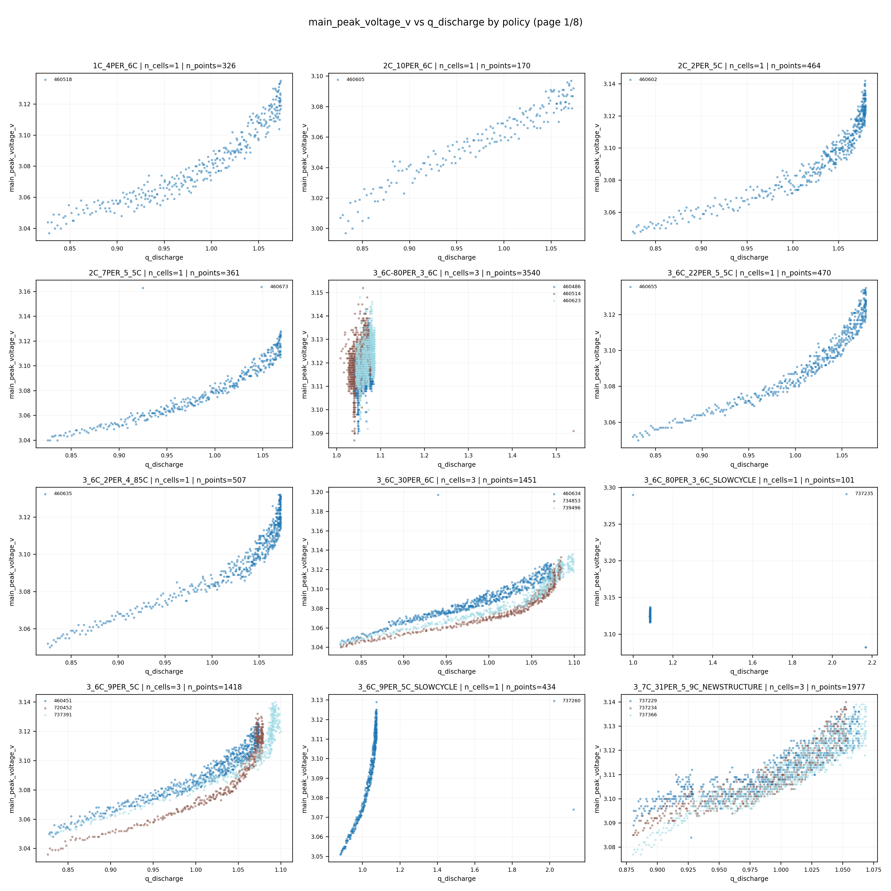

# 03 dQ/dV 表征与单步寿命预测分卷

## 一、问题背景与分卷定位

本卷聚焦 dQ/dV 表征与单步寿命预测。问题的核心在于，容量衰退不是只体现在绝对容量数值上，还体现在电压平台和增量容量峰形的演化中。

## 二、技术原理与作用路径

dQ/dV 的技术原理是把容量关于电压的局部变化显式化，从而把原始曲线转换为主峰面积、峰高、峰位电压、峰宽和偏度等可建模特征。LSTM 在此基础上利用循环序列位置和特征演化关系进行监督回归，使模型不仅看到单个峰形，还看到峰形随循环推进的状态。

## 三、理论机制

从电化学表征理论看，主峰位置和形态反映反应平台和活性材料状态变化；从信息论看，高 Spearman 相关说明这些峰形变量携带强 SOH 信息；从序列建模理论看，`cycle_index_norm` 提供了退化进程位置，使模型能更稳定地映射到 retention。

## 四、已有数据与实证材料分析

已有相关性结果显示，主峰面积、prominence 和峰高与 retention 的 Spearman 分别约为 `0.8575`、`0.8566`、`0.8565`。dQ/dV LSTM 使用 `main_peak_temp_cycle` 特征包，在固定验证集上达到 retention valid `R2=0.9267926812`、`RMSE=0.0124910391`。与 deltaAh LSTM 的 valid `R2=0.6133295298` 相比，dQ/dV final 明显更强。

**图1 dQ/dV 主峰特征的构造逻辑。** 来源路径：`outputs/analysis/dqdv_feature_explanation/dqdv_feature_extraction_illustration.png`。口径：主峰面积、峰高、电压位置、宽度、偏度等特征说明。关键数值：图中概念数值不替代模型指标。解释：该图说明 dQ/dV 为什么能作为容量状态表征。风险边界：它是特征提取说明，不是预测性能或因果结论。

**读图补充：** X 轴为放电过程中的电压区间，Y 轴为由容量对电压变化率构造的 `dQ/dV` 响应强度；数据字段对应既有放电 dQ/dV 主峰特征提取流程中的 `main_peak_voltage_v`、`main_peak_height_dqdv`、`main_peak_area`、`main_peak_width_v`、`main_peak_skewness`、`main_peak_prominence` 等派生字段。X 轴位置反映主峰出现的电压平台，Y 轴高度反映单位电压变化下的容量变化集中程度，阴影或标注区域对应主峰面积、宽度、峰高和偏度等 feature pack 候选变量；这些元素组合在一起表示从连续放电曲线中抽取峰位、峰形和峰强度的结构化表征。该图能说明 dQ/dV 主峰不是任意统计量，而是与电化学平台退化、容量释放区间变化相联系的特征工程入口；它对应增量容量分析和主峰表征方法口径，可支持后续使用主峰面积、峰高、prominence、峰位等变量进入相关性分析和 LSTM 建模。它不能支持模型精度、特征因果效应或跨数据集稳健性结论，也不能单独证明某个主峰特征优于其他特征。

**图2 dQ/dV 主峰特征与 retention 的秩相关。** 来源路径：`outputs/analysis/dqdv_feature_retention_correlation/spearman_global_bar.png`。口径：9 个 dQ/dV 主峰/温度特征，不包含 `cycle_index_norm`。关键数值：主峰面积、prominence、峰高 Spearman 分别约 `0.8575`、`0.8566`、`0.8565`。解释：主峰类特征是单步 SOH 的强相关表征。风险边界：相关性不是因果，且不同于包含 `cycle_index_norm` 的 LSTM 输入口径。

**读图补充：** X 轴为各个 dQ/dV 主峰/温度特征名称，Y 轴为这些特征与 `retention` 之间的全局 Spearman 秩相关系数或其绝对强度；数据来自 `outputs/analysis/dqdv_feature_retention_correlation/correlation_global.csv`，其中 `feature`、`spearman_rho`、`abs_spearman` 是解释该图的核心字段，标签 `retention` 由容量字段派生。柱形高度表示单个特征与单步容量保持率之间的单变量单调相关强度，颜色若用于区分正负或强弱，则只表示相关方向或排名层级，不表示干预效应。把多个柱子放在同一图中，含义是比较 feature pack 内不同主峰形态量、峰强度量和温度统计量对 retention 排序的相对贡献线索。该图能说明主峰面积、prominence、峰高等变量在当前样本和口径下具有较强单调关联，支持将其作为 dQ/dV compact feature pack 或 full feature pack 的候选核心变量；它对应 Spearman 秩相关分析方法，适合处理非线性但单调的统计关系。它不能支持主峰变化导致寿命衰退的因果结论，不能替代多变量模型验证，也不能解释包含 `cycle_index_norm` 的 LSTM 高分完全来自 dQ/dV 峰形本身。

**图3 dQ/dV 特征间及其与 retention 的相关结构。** 来源路径：`outputs/analysis/dqdv_feature_retention_correlation/correlation_heatmap.png`。口径：dQ/dV feature correlation heatmap。关键数值：强相关特征存在冗余，具体筛选需引用 CSV。解释：该图支持 feature pack 压缩和 compact 表征讨论。风险边界：不能只凭热图断言最优 feature pack。

**读图补充：** X 轴和 Y 轴均为 dQ/dV 主峰/温度特征及 `retention` 等分析变量，单元格颜色表示两两变量之间的相关系数方向和强度；数据来自 `dqdv_feature_retention_correlation` 目录下的相关性分析产物，具体数值应以对应 CSV 为准。横纵轴交叉单元表示一个变量对另一个变量的统计相关，颜色深浅用于识别强相关、弱相关或负相关结构；若存在对角线，则表示变量与自身相关，主要用于视觉参照。热图把 feature pack 内部变量和目标变量放在同一矩阵中，组合意义是同时观察特征对目标的相关强度以及特征之间是否彼此冗余。该图能说明主峰面积、峰高、prominence、宽度、峰位和温度统计量之间可能存在共线或信息重叠，为 compact4/compact5 等压缩表征提供统计依据；它对应相关矩阵和特征冗余诊断方法口径。它不能单独决定最优 feature pack，不能说明相关变量之间存在因果链，也不能替代交叉验证、消融实验或部署约束下的模型比较。

**图4 主峰电压与容量的样本级散点。** 来源路径：`outputs/analysis/dqdv_main_peak_capacity_scatter/main_peak_voltage_vs_capacity_page_01.png`。口径：主峰电压与容量关系的既有分页图。关键数值：用于展示形态，定量结论以 correlation CSV 为准。解释：该图帮助识别 dQ/dV 主峰位置随容量变化的可视化模式。风险边界：分页散点不能代表全局稳健性。

**读图补充：** X 轴为 dQ/dV 主峰电压位置，通常对应 `main_peak_voltage_v`；Y 轴为容量或容量保持相关字段，来自既有容量标签表中的 `q_discharge` 或由其派生的 retention 口径，具体定量解释以关联 CSV 和报告表为准。每个点表示一个 cycle 级样本或样本记录在主峰电压和容量状态上的配对观测，颜色、分组或分页若存在，通常用于区分样本批次、policy、cell 或页面分片，而不是表示因果处理组。该组合图的含义是把主峰位置漂移和容量状态变化放到同一二维空间中观察局部形态，帮助判断主峰电压是否随衰退呈现可见的分布迁移。它能支持主峰电压是 dQ/dV 表征中需要保留和检查的峰位变量，也能为后续相关性和模型输入提供直观解释；它对应样本级散点诊断和峰位-容量关系可视化方法。它不能支持全局稳健排名，不能由单页分页图推断所有 policy 或 cell 的一致模式，也不能把散点趋势直接写成退化机制的因果证明。

**图5 dQ/dV LSTM 单步验证集表现。** 来源路径：`outputs/analysis/lstm_dqdv_retention_grid_colab_final/valid_scatter.png`。口径：`main_peak_temp_cycle` feature pack，target=`retention`，固定验证集。关键数值：retention valid `R2=0.9267926812`，`RMSE=0.0124910391`。解释：dQ/dV 主峰 + 温度 + `cycle_index_norm` 是当前强单步路线。风险边界：不能写成纯 dQ/dV compact 或端侧部署已完成。

**读图补充：** X 轴为验证集真实 `retention`，Y 轴为 LSTM 模型预测的 `retention`；数据来自 `outputs/analysis/lstm_dqdv_retention_grid_colab_final` 下的验证预测与指标产物，输入字段对应 `main_peak_temp_cycle` feature pack，即 dQ/dV 主峰/温度特征加 `cycle_index_norm`，目标字段为 `retention`。每个散点表示固定验证集中的一个预测样本，理想对角线附近的点表示预测值接近真实值，偏离对角线的点表示残差较大；若颜色或分组存在，应理解为样本分层或显示辅助，而不是额外因果变量。该图把真实值、预测值和误差分布集中在一个验证集散点图中，组合意义是检查模型是否只在平均指标上好，还是在不同 retention 区间都有较好的拟合形态。它能支持 dQ/dV 主峰 + 温度 + 时序位置的 LSTM 在当前固定验证集上具备较强单步 retention 预测能力，并与 `R2`、`RMSE` 指标形成互证；它对应监督学习验证集预测散点和回归校准检查口径。它不能支持纯 dQ/dV compact 模型已经达到同等性能，不能支持端侧部署已完成，也不能证明模型在跨批次、跨 policy 留一或多步预测场景下仍保持同样精度。

**图6 dQ/dV LSTM 训练过程证据。** 来源路径：`outputs/analysis/lstm_dqdv_retention_grid_colab_final/loss_curve.png`。口径：Colab final 训练日志生成的 loss 曲线。关键数值：最终指标以 `train_valid_metrics.csv` 为准。解释：该图用于说明模型训练收敛过程存在可追溯曲线。风险边界：loss 曲线不能替代外推验证。

**读图补充：** X 轴为训练 epoch 或日志记录步数，Y 轴为 loss 数值；数据来自 `lstm_dqdv_retention_grid_colab_final` 的 Colab final 训练日志，通常对应训练集 loss 与验证集 loss 的逐 epoch 记录。不同颜色或曲线表示不同数据划分上的损失，例如 train loss 与 valid loss；曲线下降表示优化过程在当前损失函数下逐步降低误差，train 与 valid 之间的距离用于观察过拟合或欠拟合风险。该组合图的含义是把模型学习过程和验证过程放在同一坐标系中，检查高验证指标是否有基本的训练收敛证据支撑。它能支持本次 LSTM 结果不是孤立指标，而是有可追溯训练过程；它对应深度学习训练监控、早停选择和泛化误差观察的常规方法口径。它不能替代最终 `R2`、`RMSE` 指标，不能证明模型已经通过外推验证，也不能单凭曲线形态判断最佳 epoch 与所有下游报告口径完全一致。

**图7 deltaAh LSTM 对照路线。** 来源路径：`outputs/analysis/lstm_charge_delta_ah_prefix_full_grid_colab_tpu_final/valid_scatter.png`。口径：充电电压区间 deltaAh 序列预测 `q_discharge`。关键数值：valid `R2=0.6133295298`，`RMSE=0.0324195121`。解释：在当前 final 口径下，deltaAh 路线弱于 dQ/dV LSTM。风险边界：不能把它写成 retention 原生训练结果。

**读图补充：** X 轴为验证集真实 `q_discharge`，Y 轴为 deltaAh LSTM 预测的 `q_discharge`；数据来自 `outputs/analysis/lstm_charge_delta_ah_prefix_full_grid_colab_tpu_final` 的验证预测与指标产物，输入字段为充电电压区间 deltaAh 序列及其 mask，目标字段不是原生 `retention`，而是 `q_discharge`。每个点代表一个验证样本的真实容量与预测容量配对，靠近对角线表示预测准确，离散程度越大说明容量预测误差越大；若图中存在颜色或分组，应只作为样本显示或分层辅助理解。该图与 dQ/dV LSTM 验证散点形成方法对照：前者使用充电区间 deltaAh 序列预测容量，后者使用放电 dQ/dV 主峰/温度/位置特征预测 retention。它能支持在当前 Colab final 口径下 deltaAh LSTM 的验证表现弱于 dQ/dV LSTM，并为 deltaAh 作为对照路线而非当前最强路线提供证据；它对应序列回归模型的验证集散点检查方法。它不能支持 deltaAh 路线在所有窗口、所有批次或所有特征构造下都弱，也不能把 `q_discharge` 预测结果改写成 retention 原生训练结论。

**图8 deltaAh 非时序与序列模型对照。** 来源路径：`outputs/analysis/delta_ah_nonseq_baseline_cpu/baseline_vs_lstm_metrics.png`。口径：CPU 非时序 baseline 与 LSTM 对照。关键数值：历史对照中 LSTM seq `R2=0.746630`，RF `0.721270`。解释：deltaAh 序列化有收益，但仍不改变 dQ/dV final 更强的主结论。风险边界：不同批次/窗口口径不能直接和 Colab final 排名混写。

**读图补充：** X 轴为不同 deltaAh 建模方法或模型类别，Y 轴为对应评估指标值，通常包括 `R2`、`RMSE` 或相关误差指标；数据来自 `outputs/analysis/delta_ah_nonseq_baseline_cpu` 的 CPU baseline 与 LSTM 对照产物，字段口径以该目录下指标表为准。颜色或分组用于区分非时序 baseline、序列 LSTM 或不同指标，柱形/点位高度表示同一口径下模型性能差异；若为组合指标图，则同一图内多个子图或颜色共同表达模型类别和指标类型的交叉比较。该组合图的含义是评估 deltaAh 信息在非时序统计模型与序列模型之间是否存在建模收益，而不是直接重排 dQ/dV final 与 deltaAh final 的总榜。它能支持 deltaAh 序列化建模相对某些非时序 baseline 有收益，也能说明 deltaAh 路线仍需要和 dQ/dV 路线分开报告窗口、批次和目标口径；它对应 baseline ablation 和模型族对照方法。它不能支持跨批次、跨窗口与 Colab final 的无条件直接比较，不能否定 deltaAh 特征在其他任务或更强模型下的潜力，也不能替代交集验证集上的 dQ/dV vs deltaAh 主比较。

## 五、综合分析

综合来看，dQ/dV 是当前最强的单步 SOH 表征之一，其优势来自峰形信息与循环位置的结合。但该结论仍限定于离线特征和固定验证集口径，不能直接写成端侧部署结果，也不能把相关性排名解释为峰形变化对寿命的确定因果作用。

## 六、分卷结论与证据边界

本卷证据支持 dQ/dV 单步 retention 预测价值，不支持跨批次外推、纯 compact 输入胜利或因果机制证明。

因此，本文所有结论均按证据等级表达：预测指标只说明在给定切分、目标和输入口径下的误差表现，统计相关只说明变量之间的同步或单调关系，观测因果估计只说明在可观测混杂调整和支持域约束下的效应方向与量级，受控实验才是策略上线前的必要验证环节。报告中保留 `oracle/deployable/direct`、`history-retention-enhanced/pure operational`、`smoke/formal`、`观测因果/受控实验` 等边界词，目的正是防止将预测能力、解释能力和干预有效性混写。
