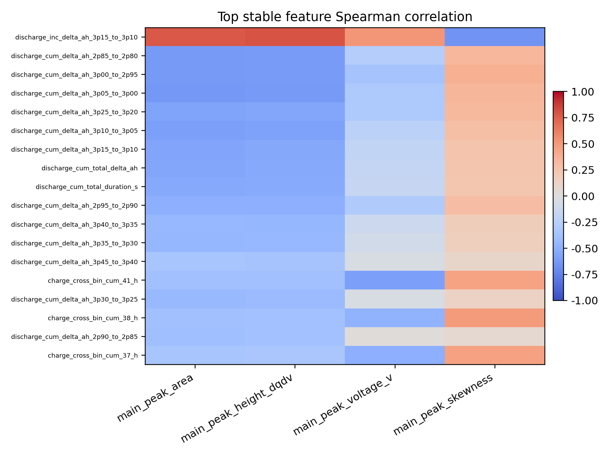
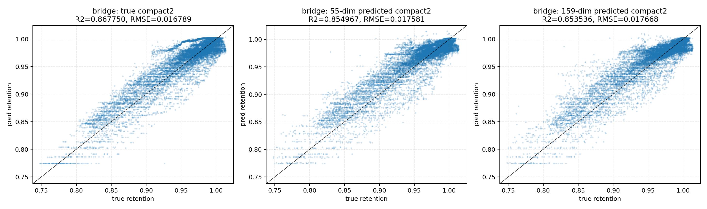
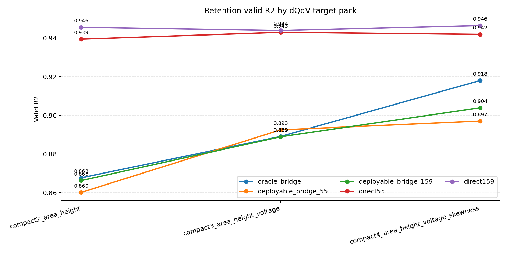
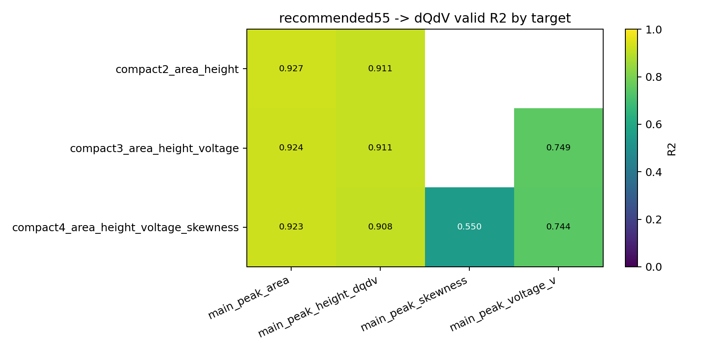

# 04 工况特征到 dQ/dV/retention 桥接分卷

## 一、问题背景与分卷定位

本卷讨论工况特征是否能够通过 dQ/dV 表征桥接到 retention。这个问题之所以重要，是因为 dQ/dV 具有较强 SOH 信息，但实际部署时未必总能直接获得完整电化学表征，因此需要检验工况特征能否重建其关键部分。

## 二、技术原理与作用路径

bridge 路线由两个阶段组成：第一阶段用 159 维工况区间特征或 recommended55 特征包预测 dQ/dV target；第二阶段用真实或预测的 dQ/dV target 预测 retention。`oracle bridge` 使用真实 dQ/dV，是信息上限；`deployable bridge` 使用预测 dQ/dV，是可部署链路；`direct retention` 则绕过 dQ/dV 直接预测 retention。

## 三、理论机制

从代理变量理论看，dQ/dV 是工况与容量之间的中间表征；从误差传播理论看，第一阶段 target 预测误差会传递到 retention；从信息瓶颈视角看，compact2/3/4 的目标是保留关键 SOH 信息，同时减少冗余和部署成本。

## 四、已有数据与实证材料分析

已有结果显示，工况特征对 `main_peak_area` 和 `main_peak_height_dqdv` 的预测 R2 分别约为 `0.9383` 和 `0.9279`，说明部分 dQ/dV target 可由工况信息较好重建。compact4 deployable55 的 retention R2 为 `0.897059`，但 direct55 baseline 达到 `0.941887`。这意味着 bridge 的解释价值明确，但当前不能替代 direct retention baseline。

**图1 工况特征到 dQ/dV target 的可预测性。** 来源路径：`outputs/analysis/interval_features_to_dqdv_correlation/predictability_r2_comparison.png`。口径：159 维工况输入预测 dQ/dV compact target。关键数值：`main_peak_area R2≈0.9383`，`main_peak_height_dqdv R2≈0.9279`。解释：工况统计能较好预测面积和峰高。风险边界：skewness 等目标更难预测，不能泛化成所有 dQ/dV 特征都同样可预测。

**读图补充：** 本图的横轴是不同 dQ/dV compact target，主要对应主峰面积、主峰高度、主峰电压位置和主峰偏度等低维表征；纵轴是 valid 集上的预测 `R2`，表示由 cycle 级工况统计特征解释目标方差的比例。数据字段来自 `interval_features_to_dqdv_correlation` 目录下的可预测性指标表，输入侧为 `charge_crossbin_discharge_capacity_stats` 定义的 159 维工况字段，目标侧为由 dQ/dV 曲线提取的 compact target。若图中使用颜色或并列柱形，颜色/分组表示不同 feature pack 或模型口径，核心含义是比较 full159 与去冗余输入包在各 target 上的可预测性。该组合图把多个 dQ/dV target 放在同一坐标系中，是为了区分“主峰核心量容易由工况预测”和“形状高阶量预测难度更高”这两个层次。它对应的是监督学习可预测性检验，而不是因果效应估计；能支持 159 维工况对 `main_peak_area`、`main_peak_height_dqdv` 具有强表征能力，也支持 compact2 作为低成本 bridge 起点。它不能支持所有 dQ/dV 形状信息都可由工况充分恢复，不能证明 recommended55 已经是唯一最优输入包，也不能把后续 retention 的 oracle bridge 解释为可部署结果。

**图2 工况特征与 dQ/dV target 的局部相关结构。** 来源路径：`outputs/analysis/interval_features_to_dqdv_correlation/correlation_heatmap_top_features.png`。口径：top feature 与 target 的相关性热图。关键数值：定量排序以 `predictability_metrics_by_target.csv` 和 `recommended_feature_pack_union.csv` 为准。解释：热图支持 recommended55 去冗余的必要性。风险边界：相关性热图不是部署模型性能。

**读图补充：** 本图的横轴和纵轴分别对应筛选出的 top 工况特征与 dQ/dV target；具体哪一侧放 feature、哪一侧放 target 以图中标签为准，单元格颜色表示二者的相关方向和相关强度，通常颜色越深代表绝对相关越强，正负颜色区分同向或反向变化。工况字段来自 159 维 cycle 级统计输入，dQ/dV 字段来自 compact2/3/4 候选 target，定量依据来自相关性、稳定性和互信息分析产物。子图或分块若存在，含义是把不同 target pack 或不同特征筛选口径放在一起观察，而不是表示独立训练集。组合在一起的目的，是展示 recommended55 不是随意降维，而是从大量相关、冗余、近邻的工况特征中保留对 dQ/dV target 更有信息量的一组。该图对应特征筛选和解释性诊断口径，能支持“工况特征与 dQ/dV 表征之间存在结构性关联”和“需要去冗余输入包”的结论；不能支持模型泛化性能、不能支持因果方向成立，也不能证明相关性最高的单个工况字段就是可干预的寿命因子。

**图3 compact2 bridge 路线对比。** 来源路径：`outputs/analysis/interval_feature_pack_compact2_retention_bridge/bridge_r2_comparison.png`。口径：真实 compact2、预测 compact2 与 direct retention 的 valid R2 对照。关键数值：oracle `R2=0.867750`，deployable `R2=0.854967`，direct55 `R2=0.944597`。解释：真实 dQ/dV 含有 retention 信息，但 direct baseline 更强。风险边界：oracle bridge 不能写成可部署结果。

**读图补充：** 本图的横轴是 retention 预测路径或模型阶段，至少包含 `oracle bridge`、`deployable bridge` 和 `direct retention baseline`；纵轴是 valid 集 retention 预测 `R2`。数据来自 `interval_feature_pack_compact2_retention_bridge/retention_bridge_metrics.csv` 同口径指标，compact2 目标通常由 `main_peak_area` 与 `main_peak_height_dqdv` 构成。颜色或分组用于区分真实 compact2 输入、由 159 维或 recommended55 工况预测得到的 compact2 输入，以及直接由工况预测 retention 的 baseline；三者组合在一起的意义，是把“机理中介上限”“可部署两阶段链路”和“直接工程预测对照”放在同一评价尺度中。该图对应 bridge method 的链路分解口径：oracle bridge 只回答真实 dQ/dV 表征中是否含有 retention 信息，deployable bridge 才接近工况 -> 预测 dQ/dV -> retention 的部署路线，direct 则检验中介路线是否优于直接预测。它能支持 compact2 bridge 可跑通且 dQ/dV 具有中介解释价值，也能支持当前 direct55 更强；不能支持 oracle bridge 可部署，不能支持 bridge 已经替代 direct 主线，也不能把 oracle 与 deployable 的差距忽略为随机噪声。

**图4 oracle 与 deployable bridge 的预测散点。** 来源路径：`outputs/analysis/interval_feature_pack_compact2_retention_bridge/retention_bridge_valid_scatter_oracle_55_159.png`。口径：valid retention bridge scatter。关键数值：与图3同口径，区分真实 dQ/dV 与预测 dQ/dV。解释：该图直观显示 bridge 链路的误差传播。风险边界：不能把预测 dQ/dV 的误差忽略掉。

**读图补充：** 本图的横轴通常是真实 `retention`，纵轴是模型预测 `retention`；对角线表示理想预测，即预测值等于真实值。数据来自 compact2 bridge valid 集散点输出，真实值字段为验证样本的 retention 标签，预测值字段分别来自 oracle bridge 和 deployable bridge。颜色、分组或子图用于区分使用真实 compact2 的 oracle 路径、使用预测 compact2 的 deployable 路径，以及可能存在的 55 维与 159 维输入包差异；若为组合散点图，其组合含义是比较同一验证标签下不同 bridge 路径的偏差形态、离散程度和系统性高估/低估。该图对应误差诊断而非单一指标汇总，能说明两阶段链路中的 dQ/dV 预测误差会传递到 retention 预测端，并帮助观察误差是否集中在高 retention 或低 retention 区间。它能支持“deployable bridge 的工程风险来自中间表征误差”和“oracle 只是上限参照”的结论；不能支持单凭散点视觉判断显著性，不能证明误差来源完全来自 dQ/dV 阶段，也不能把真实 compact2 路径描述成线上可获得的输入。 字段核对：X/Y轴、数据来源、颜色/分组含义、组合含义、理论/方法口径、可支持结论与不能支持结论均需结合本段前文、原图注和来源路径一起读取。

**图5 compact2/3/4 target pack 的 retention 表现。** 来源路径：`outputs/analysis/compact_target_pack_retention_decision/retention_r2_by_target_pack.png`。口径：固定 LightGBM 决策表，比较 oracle、deployable、direct。关键数值：compact4 oracle `R2=0.918027`，deployable55 `R2=0.897059`，direct55 `R2=0.941887`。解释：compact4 对 retention bridge 的信息量更高。风险边界：direct baseline 仍更强，不能把 bridge 写成主预测胜利。

**读图补充：** 本图的横轴是 dQ/dV target pack，通常包括 compact2、compact3 和 compact4；纵轴是 valid 集 retention 预测 `R2`。数据来自 `compact_target_pack_retention_decision` 目录下的 target pack 决策指标表，模型口径固定为同一套表格模型/LightGBM 决策流程，以减少横向比较中的模型差异。颜色或分组表示 `oracle bridge`、`deployable bridge` 和 `direct55` 三类路径：oracle 使用真实 dQ/dV target pack，deployable 使用 recommended55 工况输入预测出的 dQ/dV target pack，direct55 则直接用 recommended55 预测 retention。组合在一起的意义，是同时回答 target pack 维度增加是否提升 bridge 信息量，以及 bridge 路线是否能超过直接工况预测。该图对应 target pack selection 和三路径对照方法口径，能支持 compact4 比 compact2/3 在 retention bridge 中提供更多信息，也支持 compact4 deployable55 已具备较强中介链路性能；但它同样显示 direct55 仍是更强预测基线。因此不能支持“compact4 bridge 已经成为主预测胜利路线”，不能把 oracle compact4 写成部署指标，也不能把 compact4 的提升外推为所有 dQ/dV 高阶特征都值得加入。

**图6 recommended55 与 dQ/dV target 的热图。** 来源路径：`outputs/analysis/compact_target_pack_retention_decision/recommended55_dqdv_target_r2_heatmap.png`。口径：recommended55 输入包下不同 dQ/dV target 的预测 R2。关键数值：recommended55 是 `55` 个工况输入特征，不是 55 个 dQ/dV target。解释：该图支持低维工况包用于 bridge 的工程可行性。风险边界：不能把 recommended55 写成 dQ/dV feature pack。

**读图补充：** 本图的一个轴是 dQ/dV target 或 target pack 成员，另一个轴是模型、输入包或 compact pack 口径，具体排列以图中标签为准；颜色表示在 recommended55 工况输入包下预测对应 dQ/dV target 的 valid `R2`，颜色越接近高值越说明该 target 更容易由低冗余工况特征恢复。数据来自 `compact_target_pack_retention_decision` 中 recommended55 对 dQ/dV target 的预测评估输出，recommended55 字段来自 `recommended_feature_pack_union.csv` 所定义的 55 个工况输入特征。若热图包含 compact2/3/4 相关分组，其组合含义是比较低维输入包对不同 target pack 的可恢复程度，并解释为什么 compact4 虽然 retention 信息量更强，但其中某些 target 的预测难度可能高于 compact2 核心量。该图对应低维输入包的可部署性诊断口径，能支持 recommended55 作为工况 -> dQ/dV bridge 的工程候选输入，也能支持对 target pack 做难度分层；不能支持 recommended55 是 dQ/dV target pack，不能支持所有 compact4 成员都同等可靠，也不能单独证明 deployable bridge 的 retention 端最终优于 direct retention baseline。 字段核对：X/Y轴、数据来源、颜色/分组含义、组合含义、理论/方法口径、可支持结论与不能支持结论均需结合本段前文、原图注和来源路径一起读取。

## 五、综合分析

综合来看，工况到 dQ/dV 的桥接提供了理解工况如何影响电化学表征的中间层，但在预测任务上仍受误差传递限制。报告应把 bridge 写成解释和辅助路线，而不是当前主预测器。

## 六、分卷结论与证据边界

本卷必须保留 `oracle/deployable/direct` 三分法，不能把 oracle 上限写成可部署性能，也不能把 bridge 的解释价值写成 direct baseline 已被超越。

因此，本文所有结论均按证据等级表达：预测指标只说明在给定切分、目标和输入口径下的误差表现，统计相关只说明变量之间的同步或单调关系，观测因果估计只说明在可观测混杂调整和支持域约束下的效应方向与量级，受控实验才是策略上线前的必要验证环节。报告中保留 `oracle/deployable/direct`、`history-retention-enhanced/pure operational`、`smoke/formal`、`观测因果/受控实验` 等边界词，目的正是防止将预测能力、解释能力和干预有效性混写。
