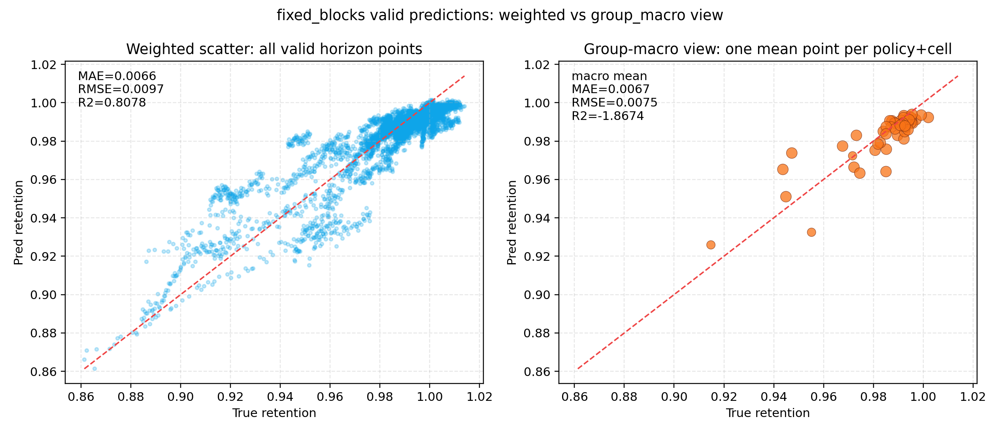
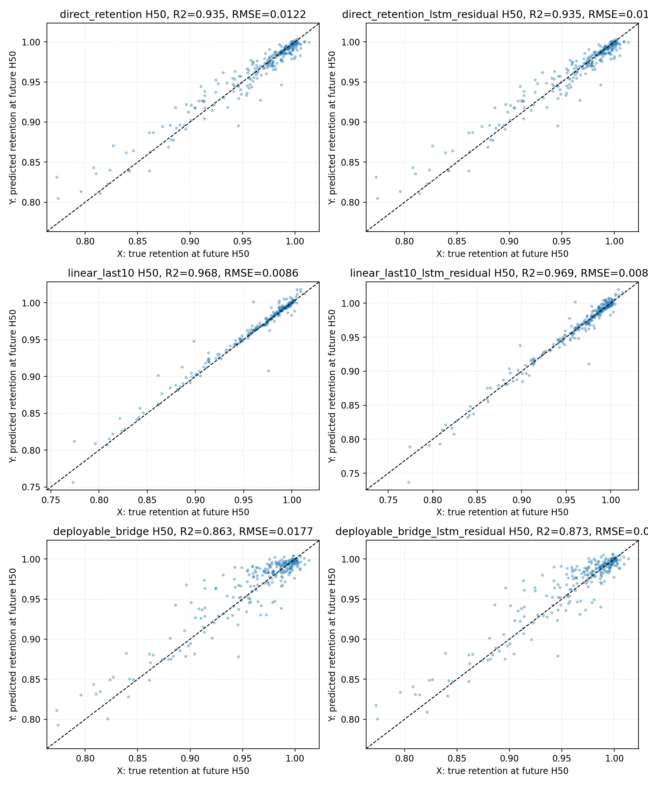

# 05 多步预测与 long-life holdout 分卷

## 一、问题背景与分卷定位

本卷讨论寿命预测从单步走向多步和长寿命外推时发生的口径变化。其核心问题是，短期 retention 轨迹本身具有强平滑性，因此多步模型必须与趋势基线和历史 retention 增强路线严格区分。

## 二、技术原理与作用路径

多步预测通过固定历史窗口预测未来多个 horizon。LightGBM operational multistep 强调表格工况和历史摘要，residual LSTM 试图修正趋势残差，monotonic LSTM 则引入容量随循环非增的物理先验。long-life holdout 进一步把验证对象推向更长寿命样本，以检验模型在外推场景下是否稳定。

## 三、理论机制

从时间序列理论看，近期 retention 对短期未来有强自相关；从控制和退化物理看，容量曲线大体应随循环非增，但局部测量噪声可能导致波动；从泛化理论看，H100/M50 与 H50/M100 的差异反映训练历史长度、预测距离和样本寿命分布共同改变任务难度。

## 四、已有数据与实证材料分析

已有 H100/M50 block 结果显示，`linear_last10 all R2=0.986496`，说明短期趋势基线非常强。monotonic LSTM 的最佳 H50 指标达到 `RMSE=0.007888`、`R2=0.972918`，说明单调先验能改善曲线形态。long-life H50/M100 中，LightGBM + history retention 在 H100 endpoint 上达到 `RMSE=0.009033`、`R2=0.947182`，表现优于简单趋势线。

**图1 rolling 口径下的多步 retention 散点。** 来源路径：`outputs/analysis/lgbm_operational_multistep_retention_compare_blocks/rolling_valid_retention_scatter_horizons.png`。口径：rolling window valid scatter。关键数值：rolling weighted all R2 在报告中为 `0.926646`。解释：rolling 能展示短期预测拟合能力。风险边界：相邻窗口重叠，不能与 fixed_origin/fixed_blocks 直接混写。

**读图补充：** 本图的横轴为验证样本的真实 retention，纵轴为模型预测 retention；点的颜色、分组或子图用于区分不同预测步长 horizon，因此每个面板或颜色层表达的是“同一 rolling window 取样口径下，在不同未来步长上的真实值-预测值贴合程度”。数据来自 `lgbm_operational_multistep_retention_compare_blocks` 生成的 rolling valid 预测结果，字段本质上对应真实 retention 标签、预测 retention 值和 horizon 标识。rolling 的方法口径是从同一电芯轨迹上滑动截取历史窗口与未来标签，适合观察短期局部拟合和误差是否随 horizon 扩散。组合在一起的含义是把多个 horizon 放在同一图形证据中比较，而不是把它们合并为独立样本实验。它能支持“rolling 口径下 LightGBM 对局部 retention 演化有较强拟合能力”和“短期多步预测存在较高表观 R2”的结论；不能支持“模型已经具备无重叠 block 或 long-life 外推能力”，也不能把 rolling 分数直接解释为 fixed_blocks 或 fixed_origin 下的泛化能力，因为 rolling 样本之间存在相邻窗口重叠。

**图2 fixed_blocks 的 weighted 与 group 口径差异。** 来源路径：`outputs/analysis/lgbm_operational_multistep_retention_compare_blocks/fixed_blocks_weighted_vs_group_scatter.png`。口径：fixed_blocks 多步验证图。关键数值：fixed_blocks weighted all R2 约 `0.807755`。解释：固定 block 更能降低窗口重叠带来的乐观性。风险边界：weighted 与 group-macro 表达不同，不能只取好看的数值。

**读图补充：** 本图横轴为 fixed_blocks 验证样本的真实 retention，纵轴为预测 retention；颜色、分组或左右子图用于呈现 weighted 汇总与按 policy/cell 或 block group 聚合后的差异。数据来自同一 `lgbm_operational_multistep_retention_compare_blocks` 结果目录中的 fixed_blocks 预测与分组评估字段，包括真实标签、预测值、horizon、group 标识和加权/分组指标。fixed_blocks 的理论口径是减少 rolling 相邻窗口高度重叠造成的乐观估计，把多步预测更接近为按离散 block 取样的泛化检验。组合图的意义在于同时展示样本量加权后整体拟合和 group-macro 下跨组稳定性，两者回答的问题不同：前者偏总体误差，后者偏不同组之间是否一致。该图能支持“fixed_blocks 比 rolling 更保守，且 weighted 与 group 视角必须并列报告”；不能支持“只要 weighted R2 较高就说明所有 policy/cell 组都稳定”，也不能把 group-macro 波动归因为某个单一工况因子，除非另有分层因果或误差审计证据。

**图3 H100/M50 各 horizon 的 retention R2。** 来源路径：`outputs/analysis/multistep_interval_to_dqdv_retention_blocks_h100_m50/retention_r2_by_horizon.png`。口径：history_len=100、horizon=50、block_stride=150。关键数值：`linear_last10 all R2=0.986496`，H50 R2=`0.968077`。解释：短窗口局部 retention 趋势非常强。风险边界：linear_last10 不是工况模型能力。

**读图补充：** 本图横轴为预测 horizon，通常表示从 H1 到 H50 的未来步长；纵轴为对应 horizon 上的 retention R2。不同颜色或线条表示不同路线，例如 `linear_last10`、direct retention、dQ/dV bridge、persistence 或其他对照模型。数据来自 `multistep_interval_to_dqdv_retention_blocks_h100_m50` 的 H100/M50 block 评估产物，字段对应 horizon、模型名、valid R2 和 retention 预测目标。该图的方法口径是 `history_len=100`、`horizon=50`、`block_stride=150` 的非重叠或低重叠 block 检验，用来比较不同输入信息和建模路线在短预测窗口内的 horizon 稳定性。多条曲线组合在一起的含义是区分“历史 retention 趋势基线”“history-retention-enhanced 模型”和“更接近 operational/dQdV 的路线”。它能支持 `linear_last10` 是 H100/M50 短窗口下必须保留的强基线，也能支持 direct retention 在该口径下优于 deployable dQ/dV bridge；不能支持把 `linear_last10` 写成纯工况模型能力，也不能把短窗口高 R2 外推为 H50/M100 或更长 forecast gap 下仍然最优。

**图4 H100/M50 各 horizon 的 RMSE。** 来源路径：`outputs/analysis/multistep_interval_to_dqdv_retention_blocks_h100_m50/retention_rmse_by_horizon.png`。口径：同图3。关键数值：不同路线 RMSE 随 horizon 变化，具体 endpoint 以报告表为准。解释：RMSE 曲线帮助判断误差是否随预测步长放大。风险边界：不能只用 all-horizon 均值掩盖 H50 endpoint 差异。

**读图补充：** 本图横轴同样为 H100/M50 block 设置下的预测 horizon，纵轴为 retention RMSE，数值越低表示预测误差越小；颜色或线条表示与图3一致的模型路线。数据来源与图3相同，来自多步 retention 评估表中的 horizon、模型名、真实 retention、预测 retention 和按 horizon 汇总的 RMSE 字段。R2 更强调解释方差比例，RMSE 则保留 retention 标尺上的绝对误差，因此本图与图3组合使用可以避免只看相关性或只看均值指标。组合曲线的含义是比较误差是否随预测步长系统性放大，以及不同路线在 endpoint 附近是否发生排序变化。它能支持“all-horizon 表现不能替代 H50 endpoint 审计”和“短期趋势基线虽强，但仍需看绝对误差大小”的结论；不能支持对训练机制、特征因果贡献或未来长窗口稳定性作单独判断，也不能用整体 RMSE 均值掩盖某些 horizon 的局部退化。 字段核对：X/Y轴、数据来源、颜色/分组含义、组合含义、理论/方法口径、可支持结论与不能支持结论均需结合本段前文、原图注和来源路径一起读取。

**图5 residual LSTM 对 H50 的修正效果。** 来源路径：`outputs/analysis/lstm_residual_multistep_retention_h100_m50/h50_retention_scatter.png`。口径：H100/M50 residual correction。关键数值：linear_last10 H50 RMSE 从 `0.008564` 到 `0.008444`，增益有限。解释：残差 LSTM 不是压倒性提升。风险边界：不能把小幅 RMSE 改善写成路线级突破。

**读图补充：** 本图横轴为 H50 endpoint 的真实 retention，纵轴为 residual LSTM 修正后的预测 retention；散点相对对角线的位置反映 endpoint 预测误差，颜色或点组若存在则对应样本组、误差方向或模型对照。数据来自 `lstm_residual_multistep_retention_h100_m50` 的 H100/M50 endpoint 预测结果，字段对应 H50 真实 retention、基线预测、残差修正预测和样本标识。方法上，residual LSTM 不是从零替代强基线，而是在 `linear_last10` 等历史趋势预测基础上学习剩余误差，因此它对应的是“残差校正”口径。该图与前两张 horizon 曲线组合后，表达的是强短期趋势基线之上是否还有可学习的系统偏差。它能支持“residual LSTM 对 H50 的 RMSE 有小幅改善但增益有限”；不能支持“LSTM 路线相对所有 tabular 或 trend 方法取得压倒性优势”，也不能把这类残差修正解释为纯 operational 特征能力，因为它依赖已有历史 retention 趋势基线。

**图6 单调约束前后曲线。** 来源路径：`outputs/analysis/monotonic_lstm_multistep_retention_blocks_h100_m50/valid_monotonic_curves_before_after.png`。口径：monotonic LSTM postprocess/constraint 可视化。关键数值：最优版本 H50 `RMSE=0.007888`，`R2=0.972918`。解释：单调先验可改善曲线形态。风险边界：真实 retention 违反单调的比例高，不能把单调约束写成逐点真值规则。

**读图补充：** 本图横轴为未来预测步长 horizon，纵轴为 retention；子图或线型通常区分单调处理前后的预测曲线，并与真实曲线或基线曲线形成对照。数据来自 `monotonic_lstm_multistep_retention_blocks_h100_m50` 的验证曲线输出，字段包括样本标识、horizon、真实 retention、约束前预测 retention 和约束后预测 retention。颜色和子图的含义不是不同工况的因果分组，而是展示同一批验证样本在 monotonic postprocess/constraint 前后的形态变化。组合图的意义在于把数值误差和曲线形态放到同一审计框架中：单调先验可以抑制不合理回升或震荡，但真实 retention 本身并非逐点严格单调。它能支持“单调约束作为去噪先验有助于改善曲线形态，并在当前 H100/M50 history-retention-enhanced 版本中取得较好 H50 指标”；不能支持“真实标签必须单调”或“单调 LSTM 是纯工况 LSTM 胜利”，因为最优版本仍依赖历史 retention 输入，且真实曲线存在较高单调违反率。

**图7 long-life H50/M100 各 horizon R2。** 来源路径：`outputs/analysis/long_life_holdout_lgbm_lstm_blocks_h50_m100_figures/comparison_v2_r2_by_horizon.png`。口径：long-life holdout，history_len=50，horizon=100。关键数值：H100 endpoint 上 LightGBM + history retention `R2=0.947182`。解释：长 forecast gap 下 history summary 模型超过简单 trend。风险边界：这是 history-retention-enhanced，不是 pure operational。

**读图补充：** 本图横轴为 H50/M100 long-life holdout 的预测 horizon，覆盖从近端到 H100 endpoint 的未来步长；纵轴为各 horizon 的 valid R2。不同颜色或线条表示路线对照，例如 LightGBM + history retention summary、LSTM-history、`linear_last10` 或其他基线。数据来自 `long_life_holdout_lgbm_lstm_blocks_h50_m100_figures` 对应的路线比较结果，字段核心为模型名、horizon、holdout 验证 R2、真实 retention 和预测 retention。long-life holdout 的方法口径强调长寿命样本上的外推压力，`history_len=50` 与 `horizon=100` 使预测间隔明显长于 H100/M50 短窗口设置。组合曲线的含义是观察不同路线在 forecast gap 拉长后是否仍保持 horizon 稳定性，尤其是 endpoint 排序是否改变。它能支持“在 H50/M100 long-life holdout 中，history-retention-enhanced 的 LightGBM history summary 在 H100 endpoint 上优于简单短期趋势外推”；不能支持“纯 operational 特征已经解决长寿命外推”，也不能把该结论反推到 H100/M50，二者历史长度、预测长度和样本压力均不同。

**图8 long-life H100 endpoint 路线对比。** 来源路径：`outputs/analysis/long_life_holdout_lgbm_lstm_blocks_h50_m100_figures/comparison_v2_h100_rmse_r2_bar.png`。口径：H50/M100 的 H100 endpoint。关键数值：LightGBM + history retention `RMSE=0.009033`，`R2=0.947182`；linear_last10 `R2=0.739842`。解释：预测窗口拉长后，简单趋势外推不再稳占第一。风险边界：不能把 H50/M100 结论反推到 H100/M50 短窗口。

**读图补充：** 本图的横轴为 H50/M100 long-life holdout 中参与 H100 endpoint 对比的模型路线，纵轴为 endpoint 指标；若采用双指标柱状或分面，颜色/子图分别对应 RMSE 与 R2，两者共同描述绝对误差和解释方差。数据来自 `long_life_holdout_lgbm_lstm_blocks_h50_m100_comparison.md` 及其图形目录中的 endpoint 汇总字段，包括模型名、H100 RMSE、H100 R2 和对应预测结果。该图的方法口径是把多步曲线压缩到最关键的远端决策点 H100，用于回答长 forecast gap 下哪类输入信息更有用。组合在一起的含义是同一模型路线必须同时接受 RMSE 和 R2 审计，不能只选一个更有利的指标。它能支持“预测窗口拉长后，LightGBM + history retention summary 在 H100 endpoint 上超过 `linear_last10`，短期趋势外推不再稳占第一”；不能支持“LightGBM 的优势来自纯工况特征”，因为这里的最佳路线是 history-retention-enhanced，也不能支持“所有 horizon 或所有 holdout 设置下 LightGBM 都稳定第一”，因为该图只对应 H50/M100 的 H100 endpoint。

## 五、综合分析

综合来看，多步预测的关键不在于孤立比较模型名称，而在于识别输入信息来源。history-retention-enhanced 的强表现主要来自历史容量轨迹的信息量，不能被写成 pure operational 工况模型能力；短期 trend baseline 的强表现也不能代表长期外推问题已经解决。

## 六、分卷结论与证据边界

本卷支持分 horizon、分 holdout 和分输入类型评价多步模型，不支持把 rolling/fixed/blocks、history-enhanced/pure operational 或 H100/M50/H50/M100 混写。

因此，本文所有结论均按证据等级表达：预测指标只说明在给定切分、目标和输入口径下的误差表现，统计相关只说明变量之间的同步或单调关系，观测因果估计只说明在可观测混杂调整和支持域约束下的效应方向与量级，受控实验才是策略上线前的必要验证环节。报告中保留 `oracle/deployable/direct`、`history-retention-enhanced/pure operational`、`smoke/formal`、`观测因果/受控实验` 等边界词，目的正是防止将预测能力、解释能力和干预有效性混写。
