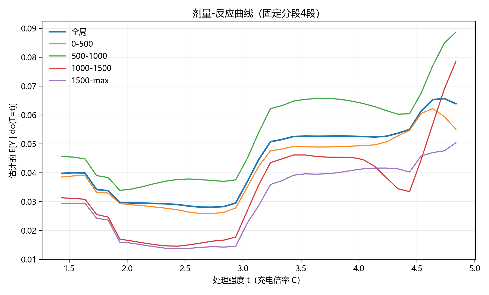
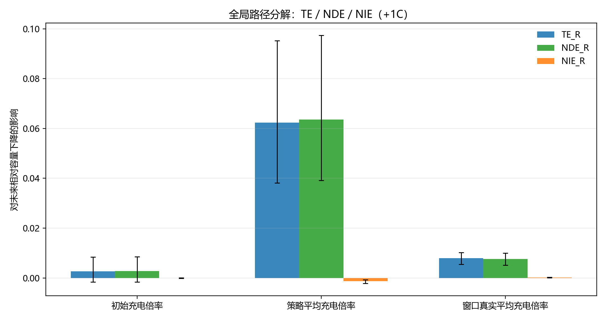
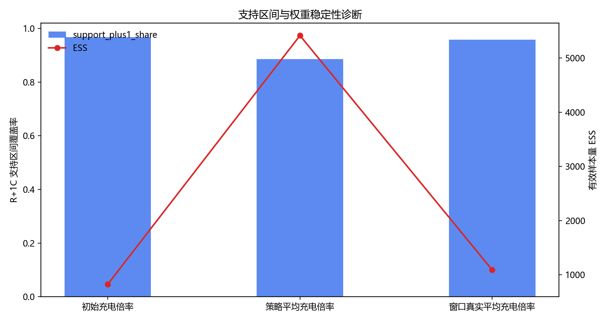
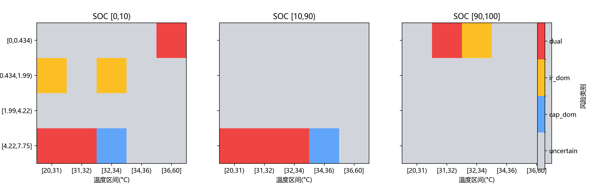
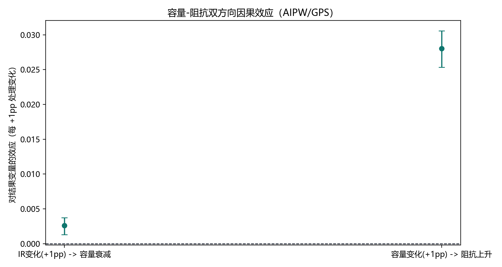

# 06 衰减因果推断与策略解释增强分卷

## 一、问题背景与分卷定位

本卷讨论观测因果分析如何用于解释衰减机制和形成策略实验候选。与预测模型不同，因果推断关注处理变量改变时结果变量可能如何变化，因此必须同时定义处理、结果、中介、支持域和识别假设。

## 二、技术原理与作用路径

倍率效应分析把 `window_mean` 等真实执行倍率作为连续处理变量，把未来 200 cycles 相对容量下降作为结果；温度中介分析进一步把 `R_t -> T_(t+1) -> Y_(t+200)` 拆解为 TE/NDE/NIE；区间替代分析用 DML 估计 SOC-rate-temp 份额变化对下一循环容量的边际效应；容量-阻抗联合因果则把容量下降与阻抗上升纳入双结局框架。

## 三、理论机制

潜在结果框架定义了处理改变下的反事实结果，AIPW 提供双重稳健估计，GPS 支持连续处理剂量响应，DML 用残差化降低高维混杂偏差，中介分析解释直接路径和温度路径的相对贡献。控制理论则要求这些观测估计最终只能转化为实验排序，而非直接上线策略。

## 四、已有数据与实证材料分析

已有数据表明，`window_mean +1C` 对未来 200 cycles 相对容量下降的估计效应为 `0.0146580672`，置信区间为 `[0.012841,0.016559]`。温度中介路径中 `TE=0.007918`、`NDE=0.007678`、`NIE=0.000241`，`NIE/TE=3.04%`，说明温度路径存在但不是主导。60 区间替代结果中 `bin50 q=0`、`bin41 q=0.02`、`bin44 q=0.0667`，适合进入实验排序。容量-阻抗联合分析显示两类退化指标存在明显共变，Spearman 为 `0.635436`，Pearson 为 `0.864076`。

**图1 窗口平均倍率 +1C 的容量损伤效应。** 来源路径：`outputs/analysis/causal_initial_rate_effect/fig_delta_plus1c_curve_window_mean.png`。口径：`window_mean` 连续处理，未来 200 cycles 相对容量下降。关键数值：`effect_plus_1c=0.0146580672`，CI `[0.012841,0.016559]`。解释：真实执行强度口径下，高倍率与后续容量下降正相关。风险边界：观测因果估计不等同受控实验。

**读图补充：** X 轴表示对窗口平均倍率处理变量 `window_mean` 施加的标准化 `+1C` shift 或其对应估计位置，Y 轴表示未来 200 cycles 相对容量下降 `y_rel_drop=(Q_t-Q_(t+200))/Q_t` 的因果效应估计；数据来自 `causal_initial_rate_effect` 的处理比较结果和 bootstrap 置信区间字段，处理变量由充电窗口真实执行倍率汇总而来，结果变量由同一 `policy + cell_code + cycle_t` 窗口向后对齐容量得到。颜色或误差线主要表达点估计与不确定性范围，而不是不同策略可直接上线的分组。该图对应 GPS/AIPW 连续处理平均边际效应口径，可说明在现有支持域内，更高真实执行倍率与后续容量损伤增加存在稳定正向观测因果证据，支持把 `window_mean` 作为风险强度口径；但它不能证明任意倍率外推都成立，不能替代受控实验，也不能把某个 `policy` 写成生产最优策略。 字段核对：X/Y轴、数据来源、颜色/分组含义、组合含义、理论/方法口径、可支持结论与不能支持结论均需结合本段前文、原图注和来源路径一起读取。

**图2 倍率 dose-response 曲线。** 来源路径：`outputs/analysis/causal_initial_rate_effect/fig_dose_response_window_mean.png`。口径：GPS/AIPW 连续处理响应曲线。关键数值：全局 +1C 效应以图1和 CSV 为准。解释：该图帮助观察倍率变化下效应是否近似线性或存在区间差异。风险边界：支持域边缘不能外推。

**读图补充：** X 轴为连续处理变量 `window_mean` 的取值或网格化 dose 水平，Y 轴为在相应 dose 下估计的未来 200 cycles 相对容量下降响应；数据来自 `causal_initial_rate_effect` 中 GPS/AIPW dose-response 估计，处理字段来自窗口平均倍率，结果字段来自 H=200 容量相对下降。曲线表达剂量响应均值，阴影或区间表达估计不确定性，若图中存在不同线型或颜色，则用于区分主估计与置信范围或辅助口径，而不是策略臂的实验随机分配。该组合含义是把单点 `+1C` 效应放回连续倍率区间中审视，判断效应是否局部线性、是否在高倍率端变陡以及支持域边缘是否稀疏。它支持“倍率风险具有连续处理响应结构”的解释，也支持把高倍率暴露列为受控实验优先检查对象；但不能支持超出样本覆盖区间的剂量外推，不能把曲线最低点解释成全局最优充电策略。

**图3 倍率经温度影响衰减的路径分解。** 来源路径：`outputs/analysis/causal_rate_temp_mediation/fig_path_decomposition_global.png`。口径：`R_t -> T_(t+1) -> Y_(t+200)` 中介分解。关键数值：`TE=0.007918`，`NDE=0.007678`，`NIE=0.000241`，`NIE/TE=3.04%`。解释：直接倍率路径主导，温度路径小幅参与。风险边界：不能写成温度不重要，也不能写成温度是唯一机制。

**读图补充：** X 轴通常对应路径分量类别，即总效应 `TE`、自然直接效应 `NDE`、自然间接效应 `NIE` 及可能的控制直接效应 `CDE`；Y 轴为对应路径对未来容量下降的效应大小。数据来自 `causal_rate_temp_mediation/mediation_effect_global.csv` 及配套图形产物，其中处理变量为 `R_t` 或 `window_mean` 倍率，中介变量为下一时点温度 `T_(t+1)` 的原始或模型化字段，结果变量为 `Y_(t+200)` 相对容量下降。颜色或柱形分组用于区分直接路径、温度中介路径和总路径，组合在一起的意义是检查 `TE≈NDE+NIE` 的路径闭合关系。该图对应因果中介分析的 TE/NDE/NIE 口径，支持“倍率直接路径占主导、温度路径有小幅正向参与”的结论；不能支持“温度可忽略”、不能支持“温度是唯一退化机制”，也不能排除未观测热管理差异造成的残余混杂。 字段核对：X/Y轴、数据来源、颜色/分组含义、组合含义、理论/方法口径、可支持结论与不能支持结论均需结合本段前文、原图注和来源路径一起读取。

**图4 温度中介权重与支持域诊断。** 来源路径：`outputs/analysis/causal_rate_temp_mediation/fig_overlap_weight_diagnostics.png`。口径：中介模型 overlap/weight diagnostics。关键数值：`window_mean` 口径 ESS 约 `1087.55`，权重存在局部放大。解释：该图提醒因果估计需要支持域和权重诊断。风险边界：权重诊断不佳的局部不能被写成稳健策略。

**读图补充：** X 轴通常表示权重大小、倾向/广义倾向得分区间或处理-中介支持域位置，Y 轴表示样本密度、样本数、有效样本量 `ESS` 或权重诊断统计；数据来自 `causal_rate_temp_mediation` 的 overlap/weight diagnostics，字段包括中介模型权重、处理变量 `window_mean`、温度中介以及相应支持域覆盖指标。颜色、分组或子图用于区分不同处理口径、不同权重分布段或不同诊断维度，组合图的意义是同时观察“样本是否覆盖”和“少数样本是否以大权重支配估计”。该图对应 GPS/中介模型的可识别性诊断口径，支持对 TE/NDE/NIE 结论进行可信度分层：ESS 尚可但局部权重放大时，应保留方向性解释并降低边缘区域结论等级；不能支持在低重叠区域做策略外推，不能把高权重点附近的估计写成全样本稳健规律。

**图5 60 区间替代效应森林图。** 来源路径：`outputs/analysis/charge_bin_substitution_causal/effect_forest_plot.png`。口径：Top10 SOC-rate-temp 区间的 DML + bootstrap + BH-FDR。关键数值：`bin50 q=0`，`bin41 q=0.02`，`bin44 q=0.0667`。解释：这些区间适合进入实验排序。风险边界：Top10 筛选不是全 60 区间的同等强度结论。

**读图补充：** X 轴为区间份额替代的边际效应估计，通常以 `effect_per_1pp_ah` 或等价 Ah/1pp 量纲呈现；Y 轴为入选的 SOC-rate-temp 区间编号，例如 `bin50`、`bin41`、`bin44` 等。数据来自 `charge_bin_substitution_causal/causal_substitution_effects.csv`，处理变量是目标区间 `share_i` 从其他 59 个区间替代增加的份额，结果变量是下一循环放电容量 `q_discharge_(t+1)` 或 `q_next`，字段还包括 bootstrap CI、`p_value` 与 BH-FDR 校正后的 `q_value`。点和横线分别表示点估计与置信区间，颜色或排序若存在则用于强调显著性、方向或 Top10 候选。该图对应 DML 残差化、聚类 bootstrap 与多重比较控制口径，支持把 q-value 较小且 CI 不跨 0 的区间列入受控实验排序；不能支持全 60 区间均已同等估计，不能把 `q_next` 的短期 Ah 改善直接等同于 H=200 长期 SOH 改善。 字段核对：X/Y轴、数据来源、颜色/分组含义、组合含义、理论/方法口径、可支持结论与不能支持结论均需结合本段前文、原图注和来源路径一起读取。

**图6 主分析与敏感性分析对照。** 来源路径：`outputs/analysis/charge_bin_substitution_causal/effect_main_vs_sensitivity_scatter.png`。口径：主结果与异常电芯剔除等敏感性结果比较。关键数值：方向一致率约 `80%`。解释：方向一致性支持排序稳定性。风险边界：一致率不是上线证明。

**读图补充：** X 轴为主分析中的区间替代效应估计，Y 轴为敏感性分析中的对应效应估计；数据来自 `charge_bin_substitution_causal` 主结果与异常电芯剔除等敏感性结果的合并比较，处理变量仍为 SOC-rate-temp 区间份额替代，结果变量仍为 `q_next` 或下一循环放电容量。颜色或点标签用于区分区间编号、显著性层级或方向一致/不一致状态，对角线含义是主分析与敏感性估计完全一致。组合在一起的意义是检验 DML 结论对样本扰动和异常电芯处理是否稳定。该图支持“多数候选方向具有排序稳定性”的审慎结论，能辅助 A/B/C 证据分层；但方向一致率不等于因果真实性证明，也不能替代 q-value、CI、支持域与受控实验复核。 字段核对：X/Y轴、数据来源、颜色/分组含义、组合含义、理论/方法口径、可支持结论与不能支持结论均需结合本段前文、原图注和来源路径一起读取。

**图7 容量-阻抗联合风险矩阵。** 来源路径：`outputs/analysis/capacity_ir_joint_causal/fig_cross_bin_dual_risk_matrix.png`。口径：SOC-rate-temp cross-bin 对容量下降与阻抗上升的双结局风险。关键数值：容量衰减与阻抗上升 Spearman `0.635436`，Pearson `0.864076`。解释：容量和阻抗呈明显共同退化结构。风险边界：共变不是单向因果。

**读图补充：** X 轴与 Y 轴通常分别表示 SOC-rate-temp cross-bin 的两个风险维度或矩阵坐标，例如容量下降风险与阻抗上升风险的分层位置；颜色深浅表示双结局风险强度、共同恶化比例或归一化风险等级。数据来自 `capacity_ir_joint_causal` 的 cross-bin 双结局产物和 `trend_capacity_ir_summary.csv`，处理变量是区间份额或 cross-bin 暴露，结果变量包括 H=200 容量下降 `y_cap_drop_h` 与阻抗上升 `y_ir_rise_h`。如果该图为热图，子格的组合含义是同一工况区间在容量与阻抗两个退化通道上的联合风险画像。它对应容量-阻抗共同退化与双结局风险筛查口径，支持“容量衰减和阻抗上升存在明显共变结构，应联合监测”的结论；不能支持容量必然单向导致阻抗变化，不能支持把颜色最深格直接解释为可操作策略建议，尤其在支持域窄的 bin 上不得外推。

**图8 容量-阻抗 crosslink 因果估计。** 来源路径：`outputs/analysis/capacity_ir_joint_causal/fig_causal_crosslink_effects.png`。口径：容量与阻抗双方向 AIPW 标准化 shift。关键数值：IR->容量约 `0.002614`，容量->IR 约 `0.028035`。解释：双方向结构支持联合风险监测。风险边界：两个方向物理量不同，不能直接比较大小。

**读图补充：** X 轴为 crosslink 方向或标准化 shift 处理类别，例如 `IR -> capacity` 与 `capacity -> IR`；Y 轴为相应方向下 AIPW 估计的效应大小。数据来自 `capacity_ir_joint_causal/causal_crosslink_effects.csv`，其中一个方向以阻抗相对变化 `dir_rel_1` 作为处理、容量下降作为结果，另一个方向以容量变化 `dq_rel_1` 作为处理、阻抗上升作为结果；字段包括 `effect_per_1pp`、CI 与 ESS 等诊断量。颜色或分组用于区分两个方向和置信区间，组合含义是把趋势共变进一步拆成两个方向的预测性因果结构。该图对应 AIPW 双重稳健标准化 shift 口径，支持“容量与阻抗应作为联合风险系统而非单一指标孤立监测”；但不能支持两个方向效应数值直接大小比较，不能证明完整物理机理闭环，也不能把观测方向性写成干预后必然响应。

**图9 策略闭环候选动作热图。** 来源路径：`outputs/analysis/strategy_tactics_closed_loop/two_layer_decision_matrix_heatmap.png`。口径：战略约束与战术候选动作的闭环矩阵。关键数值：候选包括 `bin50 +5pp`、`bin44 +5pp`、`bin41 -5pp`。解释：用于受控实验排序。风险边界：即使源表有强提示，也应写成实验/灰度候选，不写成生产最优策略。

**读图补充：** X 轴与 Y 轴通常分别表示战略约束维度和战术动作维度，例如倍率/温度/支持域约束与 `bin50 +5pp`、`bin44 +5pp`、`bin41 -5pp` 等候选替代动作；颜色表示综合推荐等级、预期短期容量变化、风险约束状态或动作优先级。数据来自 `strategy_tactics_closed_loop/strategy_tactics_decision_matrix.csv` 及其热图产物，处理变量是可调整的 SOC-rate-temp 区间份额动作，结果字段主要承接 `q_next` 的战术效应，同时受前文 H=200 容量衰减、阻抗风险、支持域、ESS 与 q-value 证据约束。组合图的意义不是给出生产策略，而是把 AIPW/GPS/DML、TE/NDE/NIE、支持域诊断和多重比较校正后的证据折叠成“受控实验候选矩阵”。该图支持制定实验臂排序、灰度验证优先级和 Go/No-Go 审核清单；不能支持直接上线，不能跳过 ITT/PP 双口径实验，也不能把源表中的强动作标签解释为已验证最优策略。

## 五、综合分析

综合来看，因果卷提供了从预测到策略解释的桥梁，但其可信度依赖支持域、ESS、q-value、敏感性分析和未观测混杂约束。即使某些区间替代方向稳定，也只能写成受控实验候选；策略热图的作用是排序和审计，而不是发布生产策略。

## 六、分卷结论与证据边界

本卷支持观测因果证据链和受控实验设计，不支持把 AIPW/GPS/DML 结果直接升级为上线策略。

因此，本文所有结论均按证据等级表达：预测指标只说明在给定切分、目标和输入口径下的误差表现，统计相关只说明变量之间的同步或单调关系，观测因果估计只说明在可观测混杂调整和支持域约束下的效应方向与量级，受控实验才是策略上线前的必要验证环节。报告中保留 `oracle/deployable/direct`、`history-retention-enhanced/pure operational`、`smoke/formal`、`观测因果/受控实验` 等边界词，目的正是防止将预测能力、解释能力和干预有效性混写。
