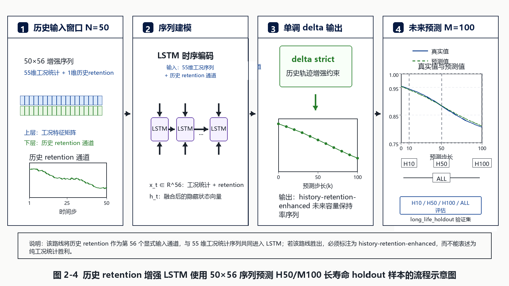
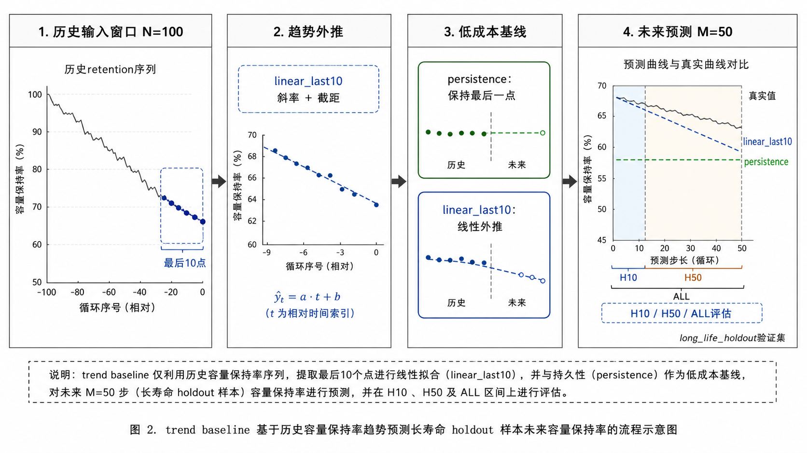
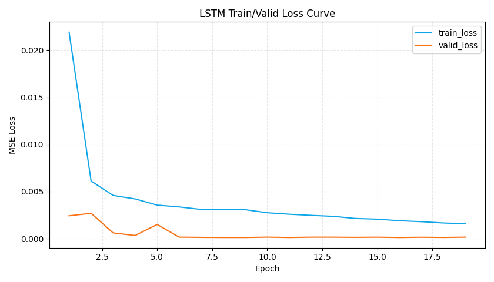

# 07 工程复现与 Colab 契约分卷

## 一、问题背景与分卷定位

本卷讨论工程复现为什么是寿命预测和因果分析报告的组成部分。复杂模型如果缺少脚本、Notebook、输出目录、checkpoint、resume 和日志契约，即使指标较高，也难以被复核、迁移或比较。

## 二、技术原理与作用路径

工程契约的核心是让输入、训练入口、输出目录、指标表、预测表、图像和日志形成闭环。Colab 契约要求 smoke 与 formal 分开，checkpoint/resume 逻辑可追踪，Notebook 命令与脚本 CLI 一致，输出路径不漂移。路线图和 loss/scatter 图在这里不是新增验证，而是说明产物应如何互相引用。

## 三、理论机制

从软件工程的可复现性理论看，模型结果必须具备可重复执行和可审计证据链；从控制理论看，任何策略或模型上线前都需要稳定的反馈记录；从信息治理角度看，smoke 产物只能验证链路，formal 产物才可进入性能讨论。

## 四、已有数据与实证材料分析

已有路线图展示了 LightGBM、LSTM history-retention 和 trend baseline 的工程链路，dQ/dV LSTM loss 曲线与验证散点展示了训练过程与预测结果的双重证据。它们共同说明，正式报告不能只引用一个指标值，还应能追溯到训练配置、预测文件、loss 曲线和验证散点。

**图1 LightGBM history-retention 路线示意。** 来源路径：`outputs/analysis/long_life_holdout_lgbm_lstm_blocks_h50_m100_figures/route_diagrams/route_lightgbm_gpt_image2.png`。口径：long-life holdout 路线说明图。关键数值：H50/M100 H100 endpoint 指标需回到比较报告。解释：该图用于说明 tabular history summary 的工程输入输出链路。风险边界：路线图不是本轮验证，也不能替代 formal metrics。

**读图补充：** X/Y轴：该路线图没有严格数值 X/Y 轴，横向流程表示输入、特征、模型和输出阶段，纵向或分支表示不同信息流；来源为既有 long-life holdout 工程路线示意。组合节点说明 LightGBM 路线如何把历史 retention、工况特征和评估产物串联起来。该图对应可复现机器学习流水线、数据契约和模型审计理论，能支持工程复现路径说明；不能作为新增模型性能证据。

**图2 LSTM history-retention 路线示意。** 来源路径：`outputs/analysis/long_life_holdout_lgbm_lstm_blocks_h50_m100_figures/route_diagrams/route_lstm_history_retention_gpt_image2.png`。口径：LSTM 历史 retention 输入路线图。关键数值：该图只说明链路，不报告新增指标。解释：帮助区分 history-retention-enhanced 与 pure operational。风险边界：不能把带历史 retention 的路线写成纯工况模型。

**读图补充：** X/Y轴：该路线图没有严格数值 X/Y 轴，横向流程表示历史 retention 序列进入 LSTM、产生未来 retention 预测并进入评估的链路；来源为既有 long-life holdout 路线图。分支/模块表示输入、序列模型、checkpoint 或输出产物之间的依赖。该图对应序列模型工程契约、checkpoint/resume 可追溯和 history-retention-enhanced 建模理论，能支持复现链路说明；不能证明该路线是 pure operational，也不能作为新训练结果。 字段核对：X/Y轴、数据来源、颜色/分组含义、组合含义、理论/方法口径、可支持结论与不能支持结论均需结合本段前文、原图注和来源路径一起读取。

**图3 trend baseline 路线示意。** 来源路径：`outputs/analysis/long_life_holdout_lgbm_lstm_blocks_h100_m50_figures/route_diagrams/route_trend_baseline_gpt_image2.png`。口径：linear_last10/trend baseline 路线图。关键数值：H100/M50 中 `linear_last10 all R2=0.986496`。解释：工程复现时必须保留低成本趋势基线。风险边界：trend baseline 不是工况模型。

**读图补充：** X/Y轴：该路线图没有严格数值 X/Y 轴，横向流程表示 linear_last10/trend baseline 从历史 retention 估计局部趋势并外推未来 endpoint；来源为既有 H100/M50 路线示意。组合模块说明趋势基线、评估 horizon 和输出图表之间的关系。该图对应局部线性外推、基线校准与可复现评估理论，能支持 trend baseline 是必要参照系；不能把 trend 表现写成工况特征模型能力。

**图4 Colab final 训练日志示例。** 来源路径：`outputs/analysis/lstm_dqdv_retention_grid_colab_final/loss_curve.png`。口径：既有 dQ/dV LSTM 训练产物。关键数值：性能指标以 `train_valid_metrics.csv` 为准。解释：该图说明正式训练产物应具备 loss 曲线等可追溯输出。风险边界：本卷未重新执行 Colab smoke 或 formal run。

**读图补充：** X/Y轴：横轴为训练 epoch 或迭代步，纵轴为训练/验证 loss；数据来自既有 Colab final 训练日志。多条曲线表示训练集和验证集损失变化，组合曲线用于观察收敛、过拟合和训练稳定性。该图对应优化过程监控、泛化间隙与训练可追溯理论，能支持“该产物具备训练过程证据”；不能替代固定验证集指标、smoke/formal 契约检查或外推验证。

**图5 Colab final 验证散点示例。** 来源路径：`outputs/analysis/lstm_dqdv_retention_grid_colab_final/valid_scatter.png`。口径：既有 dQ/dV LSTM 验证产物。关键数值：retention valid `R2=0.9267926812`。解释：报告产物应能从 metrics、predictions、scatter 和 loss 曲线互相追溯。风险边界：该图属于既有训练产物，不是本轮重新验证镜像一致性。

**读图补充：** X/Y轴：横轴通常为真实 `retention`，纵轴为 LSTM 预测 `retention`；数据来自 `lstm_dqdv_retention_grid_colab_final` 的固定验证集预测。点云贴近 45 度线表示单步预测误差较小，离散点提示局部样本或寿命段仍有误差。该图对应序列建模、监督回归与 dQ/dV 表征学习理论，能支持 dQ/dV LSTM 的单步 retention 预测能力；不能说明纯工况输入可达到同等表现，也不能写成因果结论。 字段核对：X/Y轴、数据来源、颜色/分组含义、组合含义、理论/方法口径、可支持结论与不能支持结论均需结合本段前文、原图注和来源路径一起读取。

## 五、综合分析

综合来看，工程复现章节承担的是证据治理功能。它不直接增加模型性能，但能防止路径漂移、checkpoint 失配、Notebook 与脚本不一致以及 smoke/formal 混写。对于长任务和 Colab 迁移，这一层是降低成本和风险的必要条件。

## 六、分卷结论与证据边界

本卷图片只作为工程产物示例，不作为本轮新训练或新验证证据；本轮未执行 Colab smoke，也未刷新任何模型产物。

因此，本文所有结论均按证据等级表达：预测指标只说明在给定切分、目标和输入口径下的误差表现，统计相关只说明变量之间的同步或单调关系，观测因果估计只说明在可观测混杂调整和支持域约束下的效应方向与量级，受控实验才是策略上线前的必要验证环节。报告中保留 `oracle/deployable/direct`、`history-retention-enhanced/pure operational`、`smoke/formal`、`观测因果/受控实验` 等边界词，目的正是防止将预测能力、解释能力和干预有效性混写。
