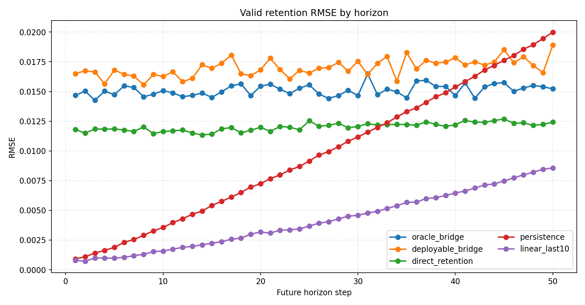
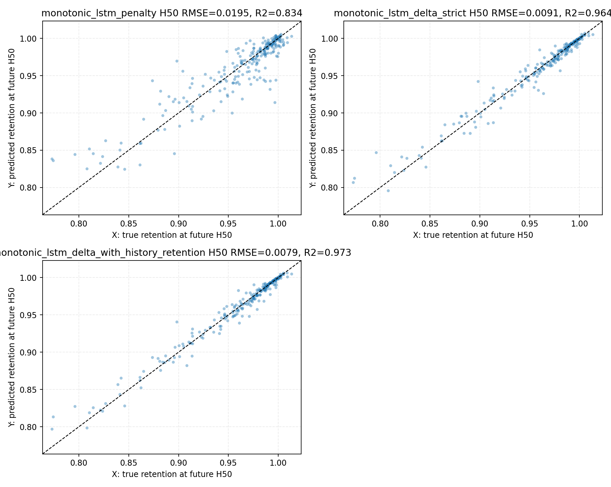

# 当前数据上的电池寿命研究总结

本文基于 `C:\Users\pal\projects\batt_soh` 仓库内既有会话日志、数据产物、分析报告、CSV 指标和 PNG 图表撰写。本文不重新训练模型、不刷新任何既有 CSV/PNG 数值，只做证据归纳和研究路线总结。

## 决策摘要

1. 当前研究最稳的基础口径是按 `policy + cell_code` 做电芯组合级划分，而不是按单个 cycle 随机混切；当前训练集为 135 个 `policy + cell_code` 样本，验证集为 52 个样本，且后续多条训练链路都沿用这个划分（来源：`data/processed/train_policy_cell_samples.csv` 行数、`data/processed/valid_policy_cell_samples.csv` 行数）。
2. 在容量保持率建模中，dQ/dV 主峰特征已经证明是强信息压缩表示：`main_peak_area`、`main_peak_prominence`、`main_peak_height_dqdv` 与 retention 的全局 Spearman 相关分别达到 0.8575、0.8566、0.8565，且组内中位相关也很高（来源：`outputs/analysis/dqdv_feature_retention_correlation/dqdv_feature_retention_correlation_report.md` / `feature, spearman_rho, group_spearman_median`）。
3. dQ/dV LSTM 是目前单步 retention 路线中最清晰的高精度结果之一：验证集 retention `R2=0.926793`，换算后的 `q_discharge` 验证集 `R2=0.935550`，并且输入维度只有 10 维（来源：`outputs/analysis/lstm_dqdv_retention_grid_colab_final/dqdv_lstm_academic_report.md` / `target, set_type, R2`）。
4. 与 deltaAh LSTM 相比，dQ/dV 路线在交集验证集上显著更优；以 weighted retention 为例，dQ/dV LSTM `R2=0.925716`，deltaAh LSTM `R2=0.560086`（来源：`outputs/analysis/lstm_method_comparison_colab_final/lstm_dqdv_vs_deltaah_comparison.md` / `target, aggregation, method, r2`）。
5. 159 维 cycle 级工况统计特征可以较好预测 compact dQ/dV 特征，但它本质仍是表格特征，不是原始时序；因此 `工况 -> compact2/compact4` 当前应优先用表格模型，LSTM 更适合“历史 N 圈序列 -> 当前或未来目标”的设定（来源：`outputs/analysis/interval_features_to_dqdv_correlation/interval_features_to_dqdv_correlation_report.md` / `input_feature_dim, model_name, r2`）。
6. dQ/dV bridge 适合做解释性中介，但暂不应替代 direct retention 主路径；在 compact4 判断中，`deployable_bridge_55` 的 valid `R2=0.897059`，仍低于 `direct_retention_55` 的 `R2=0.941887`（来源：`outputs/analysis/compact_target_pack_retention_decision/compact_target_pack_retention_decision_report.md` / `target_pack, stage, r2`）。
7. 多步预测里，retention 在 50 cycle 窗口内非常平滑，简单趋势外推是强基线；非重叠 block 口径下 `linear_last10` all-horizon `R2=0.986496`，高于 direct retention 的 `R2=0.913362` 和 deployable bridge 的 `R2=0.826557`（来源：`outputs/analysis/multistep_interval_to_dqdv_retention_blocks_h100_m50/multistep_interval_to_dqdv_retention_blocks_report.md` / `method, horizon, r2`）。
8. 单调约束不是无条件真理：真实 retention 曲线自身的曲线级违反率为 0.892430，因此单调约束更像物理去噪假设，不是逐点标签硬规则；当前最优单调 LSTM 版本为 `monotonic_lstm_delta_with_history_retention`，H50 `R2=0.972918`，但仍需要多随机种子和更大 forecast gap 验证（来源：`outputs/analysis/monotonic_lstm_multistep_retention_blocks_h100_m50/monotonic_lstm_report.md` / `series, curve_has_violation_rate, method, H50_R2`）。
9. 因果线给出的是策略风险解释，而不是预测模型替代品：`window_mean` 口径下充电倍率 `+1C` 对未来 200 cycles 相对容量下降的全局效应约为 0.014658，高于 `initial` 口径的 0.013829，说明真实执行倍率更贴近损伤强度（来源：`outputs/analysis/causal_initial_rate_effect/treatment_mode_compare_report.md` / `effect_plus_1c`）。
10. 策略闭环建议采用“战略先控倍率风险，再战术调配区间份额”的层级方案；当前闭环报告给出 3 项可上线、7 项待验证、0 项禁止外推，且战略冲突项为 0（来源：`outputs/analysis/strategy_tactics_closed_loop/strategy_tactics_integrated_report.md` / `decision_class, strategy_compatibility`）。

## 数据资产与样本口径

本项目的原始数据存放在 `data/raw`，处理后形成多个可复用表。寿命研究主线最常用的处理后文件包括 `data/processed/life_performance.csv`、`data/processed/charge_interval_features.csv`、`data/processed/discharge_interval_features.csv`、`data/processed/discharge_dqdv_peak_features_skill_full.csv`、`data/processed/train_policy_cell_samples.csv` 和 `data/processed/valid_policy_cell_samples.csv`。

训练/验证划分以 `policy + cell_code` 为样本单元，当前 train/valid 分别为 135/52 个组合；这个口径避免同一电芯不同 cycle 同时落入训练和验证，适合评估跨电芯、跨策略泛化（来源：`data/processed/train_policy_cell_samples.csv` 行数、`data/processed/valid_policy_cell_samples.csv` 行数）。

围绕寿命的标签主要有两类：一类是绝对放电容量 `q_discharge`，常用于早期 RF/XGB 与 deltaAh LSTM；另一类是容量保持率 `retention = q_discharge / q_ref`，其中 `q_ref` 通常定义为同一 `policy + cell_code` 前 5 个有效 cycle 的 `q_discharge` 中位数（来源：`outputs/analysis/lstm_dqdv_retention_grid_colab_final/dqdv_lstm_academic_report.md` / `q_ref` 定义）。

X轴：按训练/验证划分比较的寿命或策略分布变量。

Y轴：样本数量或分布密度。

关键结论：训练/验证划分不是 cycle 随机混切，而是围绕 `policy + cell_code` 的组合样本做覆盖。

业务解释：这个划分更接近真实部署时“新电芯/新策略组合”的泛化评估，能减少同一电芯泄漏带来的虚高指标。

## 特征工程路线总览

本项目的特征路线可以分成三层。

第一层是电压区间容量特征。`charge_interval_features.csv` 与 `discharge_interval_features.csv` 把充/放电过程按电压区间聚合，早期用于相关性、RF/XGB、deltaAh LSTM 和多步工况模型。deltaAh LSTM 每个时间步输入 24 维，即 12 维 `delta_ah` 加 12 维 mask（来源：`outputs/analysis/lstm_charge_delta_ah_prefix_full_grid_colab_tpu_final/lstm_charge_delta_ah_report.md` / `每个时间步输入维度`）。

第二层是 dQ/dV 主峰特征。`discharge_dqdv_peak_features_skill_full.csv` 提供主峰面积、高度、电压、宽度、偏度、prominence 和温度等特征；其中峰面积、prominence、高度、偏度、电压与 retention 呈强相关，温度特征在这个单独相关性口径下偏弱（来源：`outputs/analysis/dqdv_feature_retention_correlation/dqdv_feature_retention_correlation_report.md` / `correlation_class`）。

第三层是 159 维工况统计特征。该特征包由 60 个充电累计特征、60 个充电增量特征、16 个放电当前区间增量、16 个放电累计区间和 7 个放电汇总统计组成；分析脚本明确排除 `cycles`、`cycle_index_norm`、policy 标签和 policy 三元参数作为输入（来源：`outputs/analysis/interval_features_to_dqdv_correlation/interval_features_to_dqdv_correlation_report.md` / `input_feature_dim, excluded_input_columns_present`）。

X轴：dQ/dV 主峰特征名称。

Y轴：各特征与 retention 的全局 Spearman 相关系数。

关键结论：主峰面积、prominence、高度、偏度、电压是强相关特征，温度类主峰特征较弱。

业务解释：dQ/dV 主峰形态比单纯温度统计更直接承载容量衰退信息，适合作为物理启发的低维表征。

## 传统 ML 与统计分析路线

早期传统模型主要围绕 policy 和放电区间特征预测 `q_discharge`。小模型基准中，XGBoost 的验证集 `R2=0.877722`，RandomForest 的验证集 `R2=0.861875`，都明显优于线性回归、Ridge 和 ElasticNet；这说明当前特征和容量之间存在明显非线性（来源：`outputs/analysis/model_benchmark_policy_discharge/small_model_benchmark_report.md` / `valid_R2`）。

RF policy-discharge 报告中，验证集 `R2=0.861875`、RMSE=0.019594；XGBoost 报告中，验证集 `R2=0.877722`、RMSE=0.018436，最佳迭代轮次为 645（来源：`outputs/analysis/rf_policy_discharge/rf_policy_discharge_report.md` / `R2, RMSE`；`outputs/analysis/xgb_policy_discharge/xgb_policy_discharge_report.md` / `R2, RMSE, 最佳迭代轮次`）。

后续 RF charge aging 路线加入更多全量特征后，最优模型 `F2_F1_plus_60inc_plus_stats` 的验证集 `R2=0.821084`，没有达到 `R2>=0.9` 目标，且存在 train-valid 差距，说明单纯堆叠传统特征并不自动带来泛化提升（来源：`outputs/analysis/rf_charge_aging_q_discharge/rf_charge_aging_q_discharge_report.md` / `最优验证集R2`）。

X轴：候选模型名称。

Y轴：验证集指标，核心关注 valid R2、RMSE 和 MAE。

关键结论：XGBoost 与 RandomForest 是早期 policy + 放电特征路线中最强的传统模型。

业务解释：电池容量衰减与工况特征之间有非线性关系，树模型比线性模型更适合作为表格基线。

## LSTM 与序列建模路线

deltaAh LSTM 使用充电电压区间 `delta_ah` 序列预测 `q_discharge`，每步输入维度为 24，正式 Colab TPU 结果中验证集 `R2=0.613330`、RMSE=0.032420（来源：`outputs/analysis/lstm_charge_delta_ah_prefix_full_grid_colab_tpu_final/lstm_charge_delta_ah_report.md` / `set_type, R2, RMSE`）。

dQ/dV LSTM 使用放电 dQ/dV 主峰 9 维特征加 `cycle_index_norm` 形成 10 维时间步输入，直接预测 retention，再换算回 `q_discharge`；验证集 retention `R2=0.926793`、`q_discharge` `R2=0.935550`（来源：`outputs/analysis/lstm_dqdv_retention_grid_colab_final/dqdv_lstm_academic_report.md` / `target, set_type, R2`）。

交集样本对比显示，dQ/dV LSTM 在 weighted `q_discharge` 上 `R2=0.935087`，deltaAh LSTM 为 0.613330；在 weighted retention 上，dQ/dV LSTM `R2=0.925716`，deltaAh LSTM 为 0.560086（来源：`outputs/analysis/lstm_method_comparison_colab_final/lstm_dqdv_vs_deltaah_comparison.md` / `eval_scope, target, aggregation, method, r2`）。

X轴：验证集真实 retention 或换算后的真实容量。

Y轴：模型预测 retention 或换算后的预测容量。

关键结论：点云整体贴近理想线，说明 dQ/dV 主峰序列能较稳定地预测容量保持率。

业务解释：dQ/dV 把退化相关的曲线形态压缩为低维序列，降低了输入维度，同时保留了对寿命衰减最敏感的信息。

X轴：训练 epoch。

Y轴：训练集和验证集 loss。

关键结论：报告中保存策略最佳 epoch 为 6，而原始最小 valid loss 出现在 epoch 16，二者差异来自 `min_delta` 保存规则。

业务解释：模型选择需要声明 checkpoint 保存口径，不能只拿 raw loss 最小点和最终权重混用。

## dQdV 与 retention 建模路线

dQ/dV 特征解释文档把主峰高度、面积、prominence、偏度、电压等特征映射到可解释的电化学曲线形态；相关性报告进一步证明这些特征与 retention 的统计关系稳定（来源：`outputs/analysis/dqdv_feature_explanation/dqdv_feature_explanation.md` / 主峰特征说明；`outputs/analysis/dqdv_feature_retention_correlation/dqdv_feature_retention_correlation_report.md` / `feature, correlation_class`）。

从模型效果看，dQ/dV 单步 retention LSTM 是“物理启发压缩 + 序列模型”的成功路线；从解释性看，主峰面积和高度代表可用容量相关的曲线强度，主峰电压和偏度提供峰位与形态变化信息，而温度主峰统计更适合作辅助变量，不宜单独承担寿命解释（来源：`outputs/analysis/dqdv_feature_retention_correlation/dqdv_feature_retention_correlation_report.md` / `strong, moderate, weak/negligible`）。

X轴：dQ/dV 主峰特征与 retention 相关变量。

Y轴：dQ/dV 主峰特征与 retention 相关变量。

关键结论：强相关特征集中在峰面积、峰高、prominence、偏度和峰位电压。

业务解释：这支持把 dQ/dV 主峰作为电池寿命研究中的“状态表征层”，连接物理曲线和容量标签。

## interval features -> dQdV -> retention 桥接路线

159 维工况统计特征到 dQ/dV 的分析显示，`compact2` 在初始比较中是最优 target pack；compact2 的 median valid R2 为 0.9112，Top 稳定性均值为 0.6420，推荐特征包 `recommended_feature_pack_union.csv` 包含 55 个去冗余特征（来源：`outputs/analysis/interval_features_to_dqdv_correlation/interval_features_to_dqdv_correlation_report.md` / `compact2, median valid R2, recommended_feature_pack_union`）。

短链路验证中，55 维推荐特征预测 compact2 的最佳平均 valid R2 为 0.919829；真实 compact2 到 retention 的 oracle bridge valid R2 为 0.867750；预测 compact2 到 retention 的 deployable bridge valid R2 为 0.854967；direct recommended55 retention baseline 的 valid R2 为 0.944597（来源：`outputs/analysis/interval_feature_pack_compact2_retention_bridge/interval_feature_pack_compact2_retention_bridge_report.md` / `mean_valid_r2, r2`）。

后续 compact target pack 决策显示，如果继续走 dQ/dV 中介，compact4 比 compact2 更值得作为中介表征：compact4 的 `oracle_bridge` valid R2 为 0.918027，`deployable_bridge_55` valid R2 为 0.897059；但 direct 55 维 retention baseline 仍为 0.941887，更适合作主预测路径（来源：`outputs/analysis/compact_target_pack_retention_decision/compact_target_pack_retention_decision_report.md` / `oracle_bridge_valid_r2, deployable_bridge_55_valid_r2, direct55_valid_r2`）。

这条路线的关键边界是：oracle bridge 使用真实 dQ/dV，是中介表征上限；deployable bridge 使用预测 dQ/dV，才是可部署路径。两者必须分开报告，否则会夸大端到端能力（来源：`outputs/analysis/interval_feature_pack_compact2_retention_bridge/interval_feature_pack_compact2_retention_bridge_report.md` / `oracle_bridge, deployable_bridge`）。

X轴：dQ/dV target 与 feature pack / 模型组合。

Y轴：验证集 R2。

关键结论：主峰面积和主峰高度可预测性较强，偏度和电压相对更难。

业务解释：工况统计特征可以预测部分 dQ/dV 状态，但不同 dQ/dV 目标的噪声和可预测性不一致。

X轴：direct retention、oracle bridge、deployable bridge 等链路。

Y轴：验证集 R2。

关键结论：deployable bridge 明显低于 direct retention baseline。

业务解释：dQ/dV 中介适合解释和辅助，不宜在当前证据下替代直接 retention 预测主路径。

X轴：compact2、compact3、compact4 等 dQ/dV target pack。

Y轴：oracle、deployable 和 direct retention 链路的验证集 R2。

关键结论：compact4 的 retention bridge 表现最好，但 direct retention baseline 仍更强。

业务解释：扩展 dQ/dV 目标能提升解释性中介的信息量，但主预测路线仍应保留 direct baseline。

## 多步预测与短期偏差问题

早期 dQ/dV multistep LSTM smoke 暴露了 H1/H10 短步长低估问题；加入 short-horizon loss 后，smoke 仍只应解释为链路验收，不应解释为性能结论，因为 tiny/少 epoch smoke 指标可能很差（来源：`outputs/analysis/lstm_dqdv_multistep_h50_short_bias_smoke/lstm_dqdv_multistep_report.md` / `horizon, R2`）。

LightGBM operational multistep 比较表明，滑窗口径 weighted all R2 为 0.926646，而分段固定起点 weighted all R2 为 0.807755，固定起点 weighted all R2 为 0.521131；同一模型在不同样本构造下指标差异很大，因此必须同时说明 rolling、fixed_origin 和 fixed_blocks 口径（来源：`outputs/analysis/lgbm_operational_multistep_retention_compare_blocks/report.md` / `window_mode, aggregation, horizon, R2`）。

非重叠 block 的 compact4 多步短闭环报告显示，all-horizon 口径下 `linear_last10` R2=0.986496，direct retention R2=0.913362，deployable bridge R2=0.826557，oracle bridge R2=0.863171；这说明短期 50 cycle retention 预测中，历史 retention 趋势本身是极强信号（来源：`outputs/analysis/multistep_interval_to_dqdv_retention_blocks_h100_m50/multistep_interval_to_dqdv_retention_blocks_report.md` / `method, horizon, r2`）。

残差 LSTM 报告进一步验证：相对 direct retention，LSTM 残差修正没有显著收益；相对 `linear_last10` 和 deployable bridge，残差修正有小幅 RMSE 降低，但规模有限（来源：`outputs/analysis/lstm_residual_multistep_retention_h100_m50/lstm_residual_multistep_retention_report.md` / `method, rmse, r2`）。

单调 LSTM 报告给出更进一步的边界：真实 retention 并不逐点单调，`true_retention` 的 curve-level violation rate 为 0.892430；当前最优 `monotonic_lstm_delta_with_history_retention` H50 R2 为 0.972918，但它把历史 retention 加入输入，因此不是纯工况输入模型（来源：`outputs/analysis/monotonic_lstm_multistep_retention_blocks_h100_m50/monotonic_lstm_report.md` / `curve_has_violation_rate, method, H50_R2`）。

X轴：未来预测步 horizon。

Y轴：验证集 retention R2。

关键结论：`linear_last10` 在 H1 到 H50 上都非常强，direct retention 明显强于 deployable bridge。

业务解释：短期容量保持率很平滑，简单趋势基线已经很难被复杂链路超越。

X轴：未来预测步 horizon。

Y轴：验证集 RMSE。

关键结论：`linear_last10` 误差最低，deployable bridge 误差更高。

业务解释：在 50 cycle 预测窗口内，先做 residual/delta 或更大 forecast gap，通常比直接上更复杂序列模型更低成本。

X轴：真实 H50 retention。

Y轴：LSTM 预测 H50 retention。

关键结论：最优单调 LSTM 需要与 direct LightGBM 和 `linear_last10` 同表比较，不能孤立看图。

业务解释：单调约束可作为物理先验，但它是否提升业务预测，要看与强基线的稳定差异。

## 因果推断与机理解释路线

因果推断路线回答的不是“哪个模型预测最好”，而是“哪些工况可能导致容量衰减、温度路径占比如何、容量与阻抗是否共同恶化”。当前因果总结已经覆盖倍率到容量、倍率到温度再到容量、容量-阻抗联合因果、60 区间替代效应四条线（来源：`outputs/analysis/causal_inference_step_by_step_guide.md` / 文档摘要）。

倍率主线中，窗口真实平均倍率 `window_mean` 的 `+1C` 效应为 0.014658，初始倍率 `initial` 的 `+1C` 效应为 0.013829，二者方向一致但 window_mean 幅度高约 6.00%（来源：`outputs/analysis/causal_initial_rate_effect/treatment_mode_compare_report.md` / `effect_plus_1c`）。

温度中介主线中，`window_mean` 口径下 `TE=0.007918`、`NDE=0.007678`、`NIE=0.000241`，温度中介贡献占比约 3.04%；这说明直接倍率路径主导，但温度路径不是 0（来源：`outputs/analysis/causal_rate_temp_mediation/mediation_report.md` / `TE, NDE, NIE, NIE/TE`）。

容量-阻抗联合主线中，窗口层容量衰减和阻抗上升的 Spearman=0.6354、Pearson=0.8641，两者同时恶化占比为 73.16%；双方向 AIPW 显示 `IR变化(+1pp) -> 容量衰减` 效应为 0.002614，`容量变化(+1pp) -> 阻抗上升` 效应为 0.028035（来源：`outputs/analysis/capacity_ir_joint_causal/capacity_ir_joint_causal_report.md` / `trend_capacity_ir_summary, causal_crosslink_effects`）。

60 区间联合因果中，容量和阻抗 raw 头部共同高风险区间都是 `bin05`，但 `bin05` 的 `support_width_1_99=0.000106`，必须与支持域归一口径一起解释；否则 raw `+1pp` 斜率会被误读成普遍可外推策略（来源：`outputs/analysis/capacity_ir_joint_causal/capacity_ir_joint_causal_report.md` / `support_width_1_99`）。

区间替代 DML 报告给出 Top10 干预候选，其中主分析与敏感性方向一致率约 80.00%，但 Top10 只代表筛选后的候选，不等于 60 个区间全部完成同等强度因果确认（来源：`outputs/analysis/charge_bin_substitution_causal/causal_report.md` / `方向一致率, Top10`）。

X轴：处理变量口径，包含初始充电倍率和窗口真实平均充电倍率。

Y轴：`+1C` 对未来相对容量下降的估计影响。

关键结论：window_mean 的效应略高于 initial，但方向一致。

业务解释：真实执行倍率更贴近实际损伤强度，策略设定倍率仍可作为可控变量。

X轴：TE、NDE、NIE 等因果路径分量。

Y轴：对未来容量衰减的边际影响。

关键结论：NDE 主导，NIE 非零但占比较小。

业务解释：控倍率仍是主杠杆，热管理是辅助但不可忽略的路径。

X轴：容量风险或阻抗风险分类维度。

Y轴：60 个 SOC × 倍率 × 温度区间的风险分布。

关键结论：双头部风险集中在少数区间，多数区间证据仍不足。

业务解释：风险矩阵用于排序治理优先级，不能把“不显著”直接解释成“安全”。

X轴：将 1pp 充电时间替代到目标区间后的容量变化效应。

Y轴：Top10 候选区间。

关键结论：正向区间 7 个、负向区间 3 个，显著且 CI 不跨 0 的区间为 3 个。

业务解释：该图适合指导受控实验优先级，而不是直接宣布生产策略上线。

## 关键图表与证据索引

| 研究路线 | 主证据目录/文件 | 主要结论口径 |
| --- | --- | --- |
| 数据划分 | `data/processed/train_policy_cell_samples.csv`, `data/processed/valid_policy_cell_samples.csv` | train/valid 为 135/52 个 `policy + cell_code` 组合 |
| 小模型与 RF/XGB | `outputs/analysis/model_benchmark_policy_discharge/`, `outputs/analysis/rf_policy_discharge/`, `outputs/analysis/xgb_policy_discharge/` | XGBoost/RF 强于线性模型，valid R2 约 0.86-0.88 |
| deltaAh LSTM | `outputs/analysis/lstm_charge_delta_ah_prefix_full_grid_colab_tpu_final/` | 24 维 deltaAh 输入，valid R2=0.613330 |
| dQ/dV retention LSTM | `outputs/analysis/lstm_dqdv_retention_grid_colab_final/` | 10 维 dQ/dV 输入，retention valid R2=0.926793 |
| dQ/dV vs deltaAh | `outputs/analysis/lstm_method_comparison_colab_final/` | dQ/dV 在交集验证集显著优于 deltaAh |
| dQ/dV 相关性 | `outputs/analysis/dqdv_feature_retention_correlation/` | 主峰面积、峰高、prominence 等强相关 |
| 工况到 dQ/dV | `outputs/analysis/interval_features_to_dqdv_correlation/` | 159 维输入，推荐 55 维特征包，compact2 初始最优 |
| compact bridge | `outputs/analysis/interval_feature_pack_compact2_retention_bridge/`, `outputs/analysis/compact_target_pack_retention_decision/` | compact4 中介更完整，但 direct retention baseline 更强 |
| operational multistep | `outputs/analysis/lgbm_operational_multistep_retention_compare_blocks/` | rolling/fixed/block 指标差异大，必须分口径解释 |
| 非重叠多步闭环 | `outputs/analysis/multistep_interval_to_dqdv_retention_blocks_h100_m50/` | `linear_last10` 是极强短期基线 |
| 残差与单调 LSTM | `outputs/analysis/lstm_residual_multistep_retention_h100_m50/`, `outputs/analysis/monotonic_lstm_multistep_retention_blocks_h100_m50/` | 单调 LSTM 有潜力，但要和趋势基线公平比较 |
| 因果推断 | `outputs/analysis/causal_initial_rate_effect/`, `outputs/analysis/causal_rate_temp_mediation/`, `outputs/analysis/capacity_ir_joint_causal/`, `outputs/analysis/charge_bin_substitution_causal/` | 解释工况风险、温度路径和容量-阻抗共变 |
| 策略闭环 | `outputs/analysis/strategy_tactics_closed_loop/` | 战略控倍率 + 战术区间配时，3 项可上线、7 项待验证 |

## 当前显著结论

第一，当前数据中 dQ/dV 主峰表征比 deltaAh 区间特征更接近容量衰退状态。它既有强相关性，也在 LSTM 验证集上取得更高 R2（来源：`outputs/analysis/dqdv_feature_retention_correlation/dqdv_feature_retention_correlation_report.md` / `spearman_rho`；`outputs/analysis/lstm_method_comparison_colab_final/lstm_dqdv_vs_deltaah_comparison.md` / `r2`）。

第二，cycle 级统计特征到 dQ/dV 的问题更像表格学习问题，不应默认上 LSTM。`recommended55_hist_gradient_boosting` 预测 compact2 的平均 valid R2 为 0.919829，说明表格模型已能打通这个中介预测环节（来源：`outputs/analysis/interval_feature_pack_compact2_retention_bridge/interval_feature_pack_compact2_retention_bridge_report.md` / `model_name, mean_valid_r2`）。

第三，direct retention baseline 是所有 bridge 路线都必须面对的强对照。无论 compact2 还是 compact4，dQ/dV bridge 更适合解释和辅助，不宜直接替代 direct retention 主预测（来源：`outputs/analysis/compact_target_pack_retention_decision/compact_target_pack_retention_decision_report.md` / `direct55_valid_r2, deployable_bridge_55_valid_r2`）。

第四，短期多步 retention 预测中，历史 retention 趋势是最强信息。`linear_last10` 在非重叠 block all-horizon 口径下 R2=0.986496，这意味着任何 LSTM/Transformer 长任务都必须证明自己超过这个低成本基线（来源：`outputs/analysis/multistep_interval_to_dqdv_retention_blocks_h100_m50/multistep_interval_to_dqdv_retention_blocks_report.md` / `linear_last10, all, r2`）。

第五，因果结果支持“真实执行倍率影响容量衰减、温度路径存在但不是主导、容量与阻抗共同恶化、少数区间存在共同高风险”的综合判断；这些结论适合制定实验优先级和风险边界，不应直接替代受控实验（来源：`outputs/analysis/causal_inference_step_by_step_guide.md` / 决策摘要）。

## 尚未验证的风险与边界

1. 多个 smoke 目录只验证脚本、产物、路径和 dataset checks，不代表正式模型性能；例如 dQ/dV multistep short-bias smoke 的负 R2 不应用作正式质量判断（来源：`outputs/analysis/lstm_dqdv_multistep_h50_short_bias_smoke/lstm_dqdv_multistep_report.md` / `horizon, R2`）。
2. rolling window 指标可能因相邻窗口高度重叠而偏乐观；固定起点和分段固定起点更接近严格早期预测，但样本更少、波动更大（来源：`outputs/analysis/lgbm_operational_multistep_retention_compare_blocks/report.md` / `window_mode, aggregation, R2`）。
3. 单调约束的物理直觉成立于长期退化趋势，但真实 retention 标签存在短期上升或噪声；因此“单调”更适合作去噪先验，而不是逐点真值约束（来源：`outputs/analysis/monotonic_lstm_multistep_retention_blocks_h100_m50/monotonic_lstm_report.md` / `true_retention, curve_has_violation_rate`）。
4. 因果区间的 raw `effect_per_1pp` 必须结合支持域宽度解释，尤其 `bin05` 这类极窄支持区间不能直接外推为大幅调参建议（来源：`outputs/analysis/capacity_ir_joint_causal/capacity_ir_joint_causal_report.md` / `support_width_1_99`）。
5. 仓库当前没有 `notebooks/` 目录；Colab 链路证据主要来自脚本、会话日志、输出报告和外部镜像记录，因此本文不把 notebook 本体作为本仓库内可引用产物。

## 下一步研究路线建议

1. 对单步寿命估计，保留 dQ/dV LSTM 作为主表征路线，同时用 direct retention 表格模型作为强基线；新增路线必须在同一 train/valid split 下对比 MSE、RMSE、MAE、R2。
2. 对 `工况 -> dQ/dV -> retention`，短期不要再优先 compact2 长窗口 LSTM；若继续中介路线，优先 compact4，并同时保留 compact3 作为低维稳健备选（来源：`outputs/analysis/compact_target_pack_retention_decision/compact_target_pack_retention_decision_report.md` / `最终建议`）。
3. 对多步预测，优先做 residual/delta 任务或扩大 forecast gap；只有当模型超过 `linear_last10`、persistence 和 direct retention 的同口径强基线后，才值得投入更重的 LSTM/TCN/Transformer 长训练。
4. 对单调约束，建议做不同随机种子、不同 forecast gap、不同 valid policy 分组的稳定性复核；如果提升只依赖历史 retention 输入，则要明确它是“带历史标签的预测器”，不是纯工况模型。
5. 对因果结果，下一步应按策略闭环报告挑选少量 A/B 受控实验，而不是继续无限扩展观测分析；优先验证 `可上线` 且与战略倍率约束兼容的区间动作（来源：`outputs/analysis/strategy_tactics_closed_loop/strategy_tactics_integrated_report.md` / `decision_class, final_action`）。

## 附录：历史会话覆盖

本次盘点覆盖 `logs/session_2026-03-19.md` 至 `logs/session_2026-05-11.md` 中与寿命、SOH、容量保持率、dQ/dV、LSTM、多步预测、因果推断和 Colab 训练链路相关的任务记录。重点会话包括早期相关性与 RF/XGB 基线、deltaAh LSTM、dQ/dV retention、dQ/dV multistep、interval feature pack 到 compact dQ/dV、LightGBM/RF operational multistep、残差/单调 LSTM、因果推断教学文档和策略闭环。
