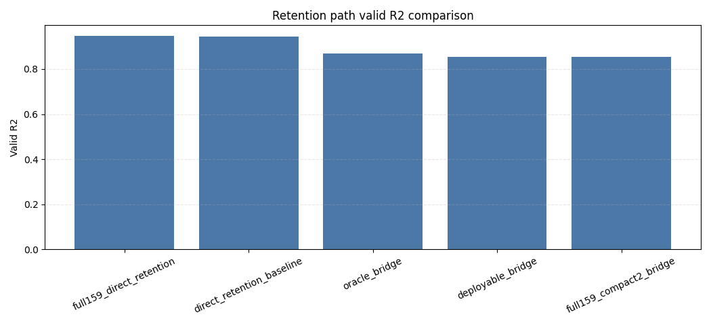
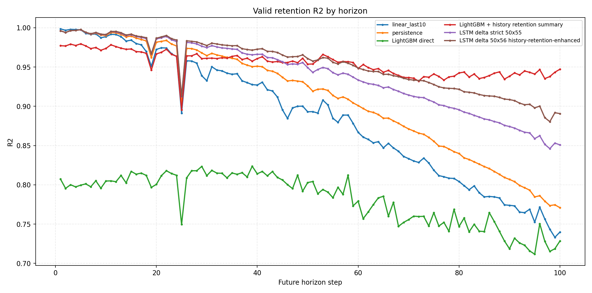
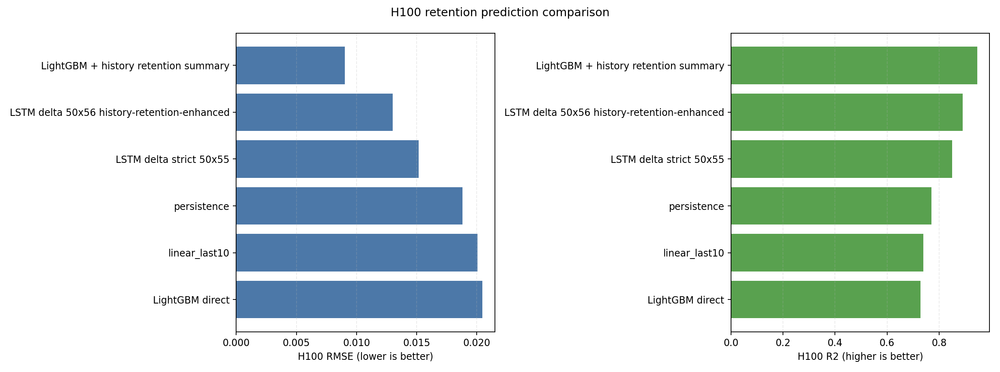
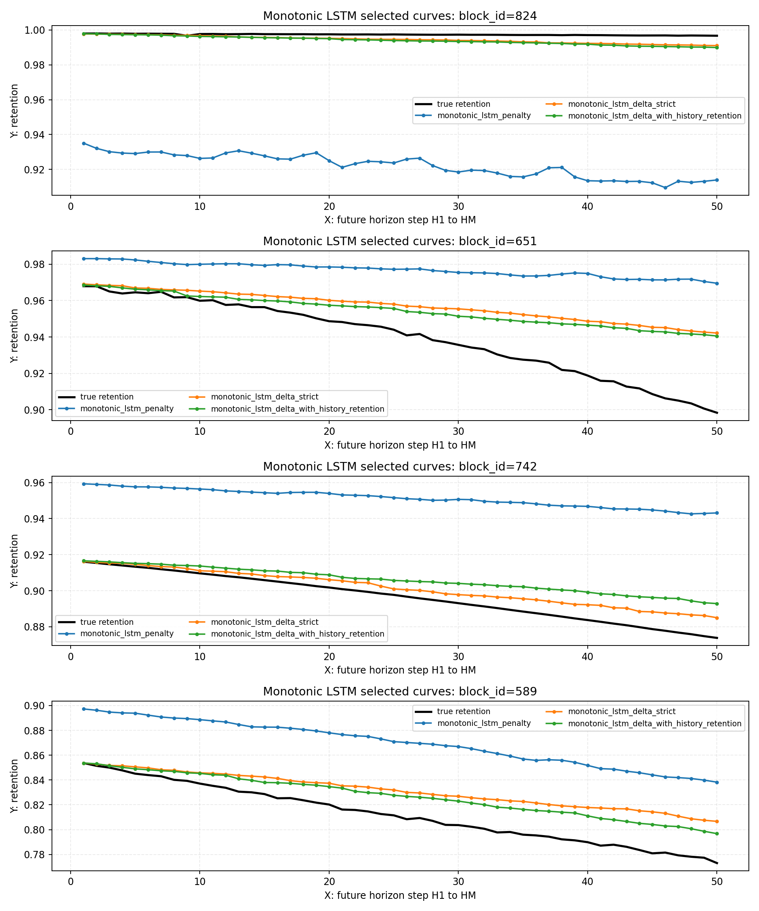
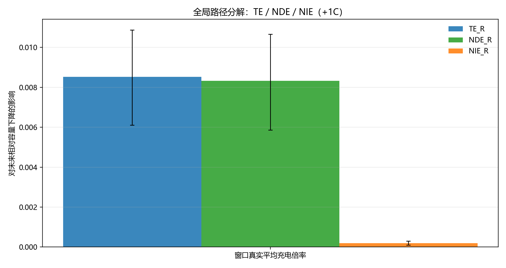

# 当前数据上的电池寿命研究总结 V2

本文基于本仓库截至 2026-05-18 的历史会话、已有分析产物与公开文献背景，重新汇总“当前数据上的电池寿命研究”。文中把结论分为三类：**本地结果支持的事实**、**由理论和数据共同指向的可能解释**、**仍需后续验证的假设**。所有本地性能数值均来自既有 CSV、Markdown 报告或 PNG，不重新训练模型，不刷新既有分析结果。

## 决策摘要

1. 当前数据上，最值得保留为主线的不是单一路线，而是“dQ/dV 表征 + retention 目标 + 可部署工况特征 + 多步趋势基线”的组合框架。dQ/dV 主峰面积、主峰 prominence、主峰高度与 retention 的全局 Spearman 相关分别为 `0.8575`、`0.8566`、`0.8565`，说明放电曲线形态是强寿命表征；这与公开文献中用早期电压曲线变化预测寿命的思路一致，但本地结论只来自本项目数据（来源：`outputs/analysis/dqdv_feature_retention_correlation/correlation_global.csv`，字段：`feature, spearman_rho`；外部背景：Severson et al., [Nature Energy 2019](https://www.nature.com/articles/s41560-019-0356-8)）。

2. 单步容量保持率预测中，dQ/dV LSTM 是目前最清晰的高精度路线之一：验证集 retention `R2=0.926793`、`RMSE=0.012491`，换算到 `q_discharge` 后验证集 `R2=0.935550`、`RMSE=0.013421`；输入为 10 维，即 9 个 dQ/dV 主峰/温度特征加 `cycle_index_norm`（来源：`outputs/analysis/lstm_dqdv_retention_grid_colab_final/train_valid_metrics.csv`，字段：`target, set_type, r2, rmse`；`outputs/analysis/lstm_dqdv_retention_grid_colab_final/dqdv_lstm_academic_report.md`）。

3. dQ/dV 路线显著强于 deltaAh LSTM：在交集验证集 weighted retention 口径下，dQ/dV LSTM `R2=0.925716`，deltaAh LSTM `R2=0.560086`；在 weighted `q_discharge` 口径下，dQ/dV LSTM `R2=0.935087`，deltaAh LSTM `R2=0.613330`（来源：`outputs/analysis/lstm_method_comparison_colab_final/lstm_dqdv_vs_deltaah_comparison.md`，表：`eval_scope, target, aggregation, method, r2`）。

4. cycle 级 159 维工况统计特征到 dQ/dV compact 表征的问题，更像表格学习而不是原始时序学习；当前应默认优先用 LightGBM/RandomForest/HistGradientBoosting 等表格模型，LSTM 更适合“历史多圈序列 -> 当前或未来目标”的设定。159 维由 60 个充电累计特征、60 个充电增量特征、16 个放电增量特征、16 个放电累计特征和 7 个 summary stats 构成，推荐去冗余 union 特征包为 55 维（来源：`outputs/analysis/interval_features_to_dqdv_correlation/dataset_checks.csv`，字段：`input_feature_dim, details`；`outputs/analysis/interval_features_to_dqdv_correlation/recommended_feature_pack_union.csv`）。

5. bridge 路线适合做“工况如何影响 dQ/dV、再影响 retention”的解释性中介，但暂不应替代 direct retention 主预测路径。compact4 中，`oracle_bridge` valid `R2=0.918027`，`deployable_bridge_55` valid `R2=0.897059`，而 `direct55_valid_r2=0.941887`；oracle 使用真实 dQ/dV，deployable 使用预测 dQ/dV，两者必须分开解释（来源：`outputs/analysis/compact_target_pack_retention_decision/compact_target_pack_summary.csv`，字段：`target_pack, oracle_bridge_valid_r2, deployable_bridge_55_valid_r2, direct55_valid_r2`）。

6. 多步预测结论必须按历史窗口和预测窗口区分。H100/M50 口径下，短期 retention 平滑性让 `linear_last10` 成为极强基线，all-horizon `R2=0.986496`；但 H50/M100 口径下，预测更远时 `LightGBM + history retention summary` 在 H100 上 `RMSE=0.009033`、`R2=0.947182`，明显优于 `linear_last10` 的 `RMSE=0.020048`、`R2=0.739842`（来源：`outputs/analysis/multistep_interval_to_dqdv_retention_blocks_h100_m50/multistep_interval_to_dqdv_retention_blocks_report.md`，字段：`method, horizon, r2`；`outputs/analysis/long_life_holdout_lgbm_lstm_blocks_h50_m100_comparison.md`，表：`H100_RMSE, H100_R2`）。

7. 因果分析当前更适合做 BMS 策略风险解释，而不是替代预测模型。窗口真实平均充电倍率的全局 `+1C` 效应为 `0.014658`，初始倍率口径为 `0.013829`；容量-阻抗联合分析中，未来容量衰减与阻抗上升的 Spearman 为 `0.6354`，Pearson 为 `0.8641`，同窗口同时恶化占比为 `73.16%`（来源：`outputs/analysis/causal_initial_rate_effect/causal_effect_global_window_mean.csv`；`outputs/analysis/causal_initial_rate_effect/causal_initial_rate_report_initial.md`；`outputs/analysis/capacity_ir_joint_causal/trend_capacity_ir_summary.csv`）。

8. 下一步建议是“两条线并行”：预测线优先做 long-life holdout 的多随机种子与更大 forecast gap 验证；解释线优先把 dQ/dV、温度、倍率、阻抗放进同一套分层因果/中介框架。公开快充优化研究说明策略闭环需要实验反馈和约束优化，但本仓库当前证据仍停留在离线观测数据分析，应避免直接宣称可在线优化充电策略（外部背景：Attia et al., [Nature 2020](https://www.nature.com/articles/s41586-020-1994-5)）。

## 数据资产与样本口径

本项目的基本训练/验证划分以 `policy + cell_code` 为样本单元，而不是以单条 cycle 随机打散。当前 `AGENTS.md` 记录的样本总数为 `187`，训练集 `135`，验证集 `52`，对应文件为 `data/processed/train_policy_cell_samples.csv` 与 `data/processed/valid_policy_cell_samples.csv`；这种划分能降低同一电芯跨集合泄漏，并让验证集保留变电流工况覆盖（来源：`AGENTS.md`；`data/processed/train_policy_cell_samples.csv`；`data/processed/valid_policy_cell_samples.csv`）。

主要标签有两类。第一类是绝对放电容量 `q_discharge`，多用于早期 RF/XGB、deltaAh LSTM 和容量衰退统计；第二类是容量保持率 `retention = q_discharge / q_ref`，其中 `q_ref` 通常按同一 `policy + cell_code` 前 5 个有效 cycle 的 `q_discharge` 中位数定义。retention 更适合跨电芯归一化比较，也更贴近 BMS 中 SOH/容量保持率的业务语言（来源：`outputs/analysis/lstm_dqdv_retention_grid_colab_final/dqdv_lstm_academic_report.md`；`outputs/analysis/lstm_method_comparison_colab_final/lstm_dqdv_vs_deltaah_comparison.md`）。

当前稳定数据资产包括：区间容量特征 `charge_interval_features.csv`、`discharge_interval_features.csv`，寿命曲线 `life_performance.csv`，dQ/dV 主峰特征 `discharge_dqdv_peak_features_skill_full.csv`，以及策略元数据 `policy_meaning.csv`。这些文件支持从“工况输入 -> 电压曲线表征 -> retention/q_discharge 目标 -> 策略风险解释”的完整离线链路（来源：`data/processed/` 目录；`scripts/extract_voltage_interval_features.py`；`scripts/extract_discharge_dqdv_peak_features.py`）。

X轴：`policy + cell_code` 样本的寿命或循环分布分箱。  
Y轴：训练集与验证集样本数量或频率。  
关键结论：当前划分不是 cycle 随机切分，而是按策略与电芯组合控制验证集合。  
业务解释：后续模型表现应解释为“跨 policy-cell 样本泛化”，不能简单等同于同一电芯内部插值精度。

## 外部理论锚点与本地证据边界

公开研究给本文提供三个理论参照。第一，Severson 等的早期寿命预测研究强调，早期电压曲线差异可作为寿命预测信号，这为本项目重视 dQ/dV 与电压曲线形态提供了理论背景，但不代表本项目可直接复用其特征或寿命标签（外部背景：[Nature Energy 2019](https://www.nature.com/articles/s41560-019-0356-8)）。第二，增量容量分析和微分电压分析常被用于 SOH、容量估计和退化诊断，因此本项目把 dQ/dV 主峰面积、高度、峰位和偏度作为物理启发表征是合理的，但特征方向和数值强弱必须以本地相关性与验证集表现为准（外部背景：[Batteries 2021](https://www.mdpi.com/2313-0105/7/1/2)；[Energy 2018](https://www.sciencedirect.com/science/article/pii/S0360544218304213)）。第三，阻抗与容量共同恶化是电池健康管理的重要主题，因此容量-阻抗联合因果分析对 BMS 风险解释有价值，但本地阻抗字段的采样、清洗和混杂结构仍需单独验证（外部背景：[Springer Nature 2023](https://link.springer.com/article/10.1186/s41601-023-00314-w)）。

本文的边界是：外部资料只解释“为什么值得研究”，不提供本地性能结论；所有 R2、RMSE、Spearman、因果效应和样本数都来自仓库已有产物。本地事实、理论解释与后续假设会分开写，避免把“看起来符合电池机理”误写成“已经被当前数据证明”。

## 特征工程路线总览

第一条路线是电压区间容量特征。充电侧和放电侧按电压区间聚合 `delta_ah`、累计容量、区间统计量，早期用于相关性、RF/XGB 和 deltaAh LSTM；deltaAh LSTM 每个时间步输入 24 维，即 12 维 `delta_ah` 加 12 维 mask（来源：`outputs/analysis/lstm_charge_delta_ah_prefix_full_grid_colab_tpu_final/lstm_charge_delta_ah_report.md`）。

第二条路线是 dQ/dV 主峰特征。dQ/dV 近似描述容量随电压变化的密度，主峰面积与高度可视作可用容量和反应平台强度的压缩信号，主峰电压对应平台位移，主峰偏度对应峰形非对称变化。当前数据中，主峰面积、prominence、高度是最强相关特征，`main_peak_skewness` 也达到 `abs_spearman=0.6130`，`main_peak_voltage_v` 达到 `abs_spearman=0.5728`（来源：`outputs/analysis/dqdv_feature_retention_correlation/correlation_global.csv`，字段：`feature, abs_spearman`）。

第三条路线是工况统计特征。`charge_crossbin_discharge_capacity_stats` 形成 159 维 cycle 级表格特征，覆盖充电 SOC-倍率-温度交叉区间和放电容量区间，再通过去冗余 union 降为 55 维推荐特征包；它适合先用表格模型判断是否能预测 compact dQ/dV 或 retention（来源：`outputs/analysis/interval_features_to_dqdv_correlation/dataset_checks.csv`；`outputs/analysis/interval_features_to_dqdv_correlation/recommended_feature_pack_union.csv`）。

第四条路线是因果区间特征。充电过程被拆成 SOC、倍率、温度交叉 bin，用于估计“某类区间充电份额增加 1pp”对未来容量下降或阻抗上升的影响；该路线更偏策略解释和风险筛查，不能直接当作预测精度路线（来源：`outputs/analysis/charge_bin_substitution_causal/causal_report.md`；`outputs/analysis/capacity_ir_joint_causal/capacity_ir_joint_causal_report.md`）。

X轴：dQ/dV 主峰、温度与曲线形态特征。  
Y轴：各特征与 retention 的全局 Spearman 相关系数。  
关键结论：主峰面积、prominence 和高度是当前最强的 retention 相关特征。  
业务解释：BMS 若无法直接使用复杂模型，dQ/dV 主峰摘要可以作为低维健康状态代理量。

## 传统 ML 与统计分析路线

早期传统模型验证了当前数据不是简单线性关系。小模型基线中，XGBoost 验证集 `R2=0.877722`、`RMSE=0.018436`，RandomForest 验证集 `R2=0.861875`、`RMSE=0.019594`，均明显强于线性回归、Ridge 和 ElasticNet；这说明 policy、放电区间容量与容量目标之间存在显著非线性结构（来源：`outputs/analysis/model_benchmark_policy_discharge/small_model_benchmark_metrics.csv`，字段：`model_name, valid_r2, valid_rmse`）。

这一路线的理论意义在于：电池容量衰退受倍率、SOC、温度、循环阶段和电芯差异共同影响，线性模型很容易把非线性阈值、交互效应和阶段性退化压平。工程意义在于：表格模型训练成本低、调参和解释工具成熟，适合作为每条深度学习路线的强基线，而不是只把它当作“简单模型”（来源：`scripts/benchmark_small_models_policy_discharge.py`；`scripts/train_rf_policy_discharge.py`；`scripts/train_xgb_policy_discharge.py`）。

X轴：XGBoost、RandomForest、ExtraTrees、线性模型等基线。  
Y轴：验证集误差与拟合指标，核心关注 valid R2 和 RMSE。  
关键结论：树模型显著优于线性类模型。  
业务解释：容量衰退建模应默认保留非线性表格基线，否则容易高估复杂序列模型的增益。

## LSTM 与序列建模路线

deltaAh LSTM 是第一条深度学习序列闭环。它把历史充电电压区间 `delta_ah` 序列输入 LSTM 来预测 `q_discharge`，正式 Colab TPU 结果中验证集 `R2=0.613330`、`RMSE=0.032420`。这说明序列链路可运行，但当前特征和目标组合并不是最强寿命表征（来源：`outputs/analysis/lstm_charge_delta_ah_prefix_full_grid_colab_tpu_final/train_valid_metrics.csv`，字段：`set_type, r2, rmse`）。

dQ/dV LSTM 则把放电 dQ/dV 主峰特征作为低维物理表征，并以 retention 为训练目标。该路线验证集 retention `R2=0.926793`，明显高于 deltaAh LSTM 的 weighted retention `R2=0.560086`；同样换算到 `q_discharge`，dQ/dV LSTM 的 weighted `R2=0.935087` 也高于 deltaAh LSTM 的 `0.613330`（来源：`outputs/analysis/lstm_dqdv_retention_grid_colab_final/train_valid_metrics.csv`；`outputs/analysis/lstm_method_comparison_colab_final/lstm_dqdv_vs_deltaah_comparison.md`）。

这并不意味着“LSTM 一定优于表格模型”。更准确的边界是：LSTM 适合输入具有时间顺序的信息，例如历史 N 圈特征到当前/未来 retention；若输入是同一 cycle 的 159 维聚合统计或 compact dQ/dV 表格，当前应先用表格模型建立强基线，再判断序列模型是否有额外信息（来源：`outputs/analysis/interval_features_to_dqdv_correlation/interval_features_to_dqdv_correlation_report.md`；`outputs/analysis/long_life_holdout_lgbm_lstm_blocks_h50_m100_comparison.md`）。

X轴：验证集真实 retention 或换算后的真实容量目标。  
Y轴：dQ/dV LSTM 预测值。  
关键结论：点云整体贴近对角线，说明 dQ/dV 低维表征对单步 retention 有较强解释力。  
业务解释：对 BMS 讲授时应强调这是“离线验证集精度”，不是已经上线的在线 SOH 估计器。

X轴：训练 epoch。  
Y轴：训练集与验证集 loss。  
关键结论：训练过程形成可追踪收敛曲线，支持 Colab 训练链路闭环。  
业务解释：loss 曲线是工程可复现证据，但最终性能仍以固定验证口径下的 R2/RMSE 为准。

## dQdV 与 retention 建模路线

dQ/dV 路线的理论出发点是：电极相变平台、极化增长和活性物质损失都会改变容量-电压曲线形状；把 `dQ/dV` 提取成主峰面积、高度、峰位、宽度、偏度等特征，相当于把一条曲线压缩成少数与退化状态相关的形态量。公开 ICA/DVA 文献也常把曲线峰位和峰形变化作为 SOH 与退化诊断线索，但本文只把这些文献作为解释背景（外部背景：[Batteries 2021](https://www.mdpi.com/2313-0105/7/1/2)；[Energy 2018](https://www.sciencedirect.com/science/article/pii/S0360544218304213)）。

本地数据支持三点事实。第一，dQ/dV 主峰强度类特征和 retention 强相关，且样本量为 `140560` 行（来源：`outputs/analysis/dqdv_feature_retention_correlation/correlation_global.csv`，字段：`n_samples`）。第二，dQ/dV LSTM 用 10 维输入就达到 retention valid `R2=0.926793`（来源：`outputs/analysis/lstm_dqdv_retention_grid_colab_final/train_valid_metrics.csv`）。第三，交集对比中 dQ/dV 在不同 cycle bin 与 policy group 上整体优于 deltaAh，但 VARCHARGE 子集的 retention R2 仍低于非变电流组，提示变电流工况仍是泛化风险点（来源：`outputs/analysis/lstm_method_comparison_colab_final/lstm_dqdv_vs_deltaah_comparison.md`，表：`policy_group, target, method, r2`）。

可能解释是：dQ/dV 直接来自放电曲线本身，更接近容量状态和电压平台变化；deltaAh 充电区间特征更偏工况过程量，受策略、阶段和电芯差异影响更大。这是合理解释，但仍不是严格机理证明。若后续要形成论文式结论，应补充跨电芯留一、跨 policy 留一、不同 q_ref 定义和不同 dQ/dV 平滑参数的敏感性分析。

## interval features -> dQdV -> retention 桥接路线

桥接路线回答的问题不是“哪个模型最高分”，而是“BMS 可观测工况能否先预测 dQ/dV 表征，再通过 dQ/dV 解释 retention”。159 维工况统计特征到 dQ/dV 的报告显示，初始推荐 target pack 为 `compact2`，其 median valid R2 为 `0.9112`，Top 稳定性均值为 `0.6420`；推荐 55 维去冗余 union 特征包用于后续 bridge（来源：`outputs/analysis/interval_features_to_dqdv_correlation/interval_features_to_dqdv_correlation_report.md`，字段：`compact2, median valid R2, Top稳定性均值`）。

短链路 bridge 结果显示，推荐 55 维特征预测 compact2 的最佳平均 valid R2 为 `0.919829`，真实 compact2 到 retention 的 `oracle_bridge` valid R2 为 `0.867750`，预测 compact2 到 retention 的 `deployable_bridge` valid R2 为 `0.854967`，而 direct recommended55 retention baseline valid R2 为 `0.944597`（来源：`outputs/analysis/interval_feature_pack_compact2_retention_bridge/retention_bridge_metrics.csv`；`outputs/analysis/interval_feature_pack_compact2_retention_bridge/interval_feature_pack_compact2_retention_bridge_report.md`）。

后续 compact pack 决策把中介路线推进到 compact4：compact4 的 `oracle_bridge_valid_r2=0.918027`，`deployable_bridge_55_valid_r2=0.897059`，`direct55_valid_r2=0.941887`。因此当前结论是：dQ/dV bridge 有解释价值，但 direct retention 仍是更强主预测路径；oracle bridge 代表上限，deployable bridge 才代表可落地链路，不能混写（来源：`outputs/analysis/compact_target_pack_retention_decision/compact_target_pack_summary.csv`）。

X轴：dQ/dV target 与特征包/模型组合。  
Y轴：验证集 R2。  
关键结论：159 维工况统计特征可以较好预测 compact dQ/dV 特征。  
业务解释：这支持把 dQ/dV 作为“工况与寿命之间的中介解释层”，但不自动证明端到端预测最优。

X轴：direct retention、oracle bridge、deployable bridge 等链路。  
Y轴：验证集 R2。  
关键结论：deployable bridge 低于 direct retention baseline。  
业务解释：若要给 BMS 做可部署方案，应优先报告 deployable 指标，oracle 只作为机理中介上限。

X轴：compact2、compact3、compact4 等 dQ/dV target pack。  
Y轴：oracle、deployable 和 direct retention 链路的验证集 R2。  
关键结论：compact4 的 bridge 表现更完整，但 direct retention baseline 仍更强。  
业务解释：compact pack 选择应服务于解释与部署成本，而不是只看 oracle 分数。

## 多步预测与短期偏差问题

多步预测的核心难点是样本构造。rolling、fixed_origin、fixed_blocks 和 non-overlapping blocks 的指标不可混用，因为它们对应不同程度的样本重叠、未来窗口难度和验证独立性。LightGBM operational multistep 比较曾显示，滑窗口径 weighted all R2 为 `0.926646`，而固定分段 block 口径 weighted all R2 为 `0.807755`，固定起点 weighted all R2 为 `0.521131`；这说明口径改变会显著改变性能解读（来源：`outputs/analysis/lgbm_operational_multistep_retention_compare_blocks/report.md`，字段：`window_mode, aggregation, horizon, R2`）。

H100/M50 的 compact4 多步闭环显示，`linear_last10` 在短期 50 cycle retention 预测中非常强，all-horizon `R2=0.986496`，H50 `R2=0.968077`；direct retention all-horizon `R2=0.913362`，deployable bridge all-horizon `R2=0.826557`。这说明短期保持率曲线非常平滑，历史 retention 趋势本身已经携带了大量未来信息（来源：`outputs/analysis/multistep_interval_to_dqdv_retention_blocks_h100_m50/multistep_interval_to_dqdv_retention_blocks_report.md`；`outputs/analysis/monotonic_lstm_multistep_retention_blocks_h100_m50/monotonic_lstm_report.md`）。

H50/M100 的 long-life holdout 则改变了结论重点。预测窗口拉长到 M100 后，`LightGBM + history retention summary` 在 H100 上 `RMSE=0.009033`、`R2=0.947182`，优于 `linear_last10` 的 `RMSE=0.020048`、`R2=0.739842`；这意味着趋势外推不是全场景最强，只在短窗口和强平滑口径下特别强（来源：`outputs/analysis/long_life_holdout_lgbm_lstm_blocks_h50_m100_comparison.md`，表：`H100排名, H100_RMSE, H100_R2`）。

单调约束也需要谨慎。真实 retention 曲线在 H1:H50 上并非逐点单调，`true_retention` 的 curve-level violation rate 为 `0.892430`；因此单调约束更像物理去噪和未来趋势先验，不应当作逐点标签硬真值。当前最优单调 LSTM 是 `monotonic_lstm_delta_with_history_retention`，H50 `RMSE=0.007888`、`R2=0.972918`，但它显式输入历史 retention，因此结论必须写成“history-retention-enhanced LSTM”，不能写成纯工况 LSTM 胜利（来源：`outputs/analysis/monotonic_lstm_multistep_retention_blocks_h100_m50/monotonic_lstm_report.md`，字段：`curve_has_violation_rate, method, H50_RMSE, H50_R2`）。

X轴：未来 horizon step，从 H1 到 H50。  
Y轴：验证集 retention R2。  
关键结论：H100/M50 口径下，`linear_last10` 是非常强的短期趋势基线。  
业务解释：BMS 短期 SOH 预测不能只和复杂模型比，也要和低成本趋势外推比。

X轴：未来 horizon step，从 H1 到 H100。  
Y轴：不同路线的验证集 R2。  
关键结论：预测窗口变长后，history-retention-enhanced 表格/序列模型优于简单 `linear_last10`。  
业务解释：长期预测需要显式吸收历史 retention summary 或序列信息，不能把短期强基线外推成全局最优。

X轴：trend baseline、LightGBM direct、LightGBM enhanced、LSTM pure operational、LSTM enhanced 等路线。  
Y轴：左侧为 H100 RMSE，右侧为 H100 R2。  
关键结论：`LightGBM + history retention summary` 在 H100 上排名第一。  
业务解释：对较长 forecast gap，应把“历史 retention 是否作为输入”作为模型类别边界单独汇报。

X轴：未来 horizon step，即 H1 到 H50。  
Y轴：真实与预测 retention。  
关键结论：硬约束 delta LSTM 能保证预测曲线不升，但真实曲线本身有短期波动。  
业务解释：物理先验有助于去噪，但如果把观测噪声当成严格违反，会带来过度约束风险。

## 因果推断与机理解释路线

因果主线一是“倍率 -> 容量衰减”。窗口真实平均充电倍率口径下，全局 `+1C` 对未来相对容量下降的估计效应为 `0.014658`，95% CI 为 `0.012841 ~ 0.016559`；初始充电倍率口径下，全局 `+1C` 效应为 `0.013829`，95% CI 为 `0.010753 ~ 0.017071`。这支持“更高倍率与更大未来容量下降相关”的方向性结论，但仍依赖观测数据、GPS/AIPW 建模和重叠性诊断（来源：`outputs/analysis/causal_initial_rate_effect/causal_effect_global_window_mean.csv`；`outputs/analysis/causal_initial_rate_effect/causal_initial_rate_report_initial.md`）。

因果主线二是“倍率 -> 温度 -> 容量”。窗口真实平均倍率主口径下，TE=`0.007918`，NDE=`0.007678`，NIE=`0.000241`，`NIE/TE=0.0304`；这说明当前口径下温度中介路径存在但占比较小，主导路径仍是直接路径或未完全由温度解释的路径（来源：`outputs/analysis/causal_rate_temp_mediation/mediation_contribution_summary.csv`，字段：`te_r, nde_r, nie_r, nie_share`）。

因果主线三是“容量-阻抗联合恶化”。在 H=200 窗口口径下，容量衰减与阻抗上升 Spearman=`0.635436`、Pearson=`0.864076`，同窗口两者同时恶化占比为 `0.731579`；双方向 AIPW 中，`IR变化(+1pp) -> 容量衰减` 效应为 `0.002614`，`容量变化(+1pp) -> 阻抗上升` 效应为 `0.028035`。这些结果支持容量和阻抗联合监测，但两个 `+1pp` 不是同一物理量，不能直接当作物理强弱比较（来源：`outputs/analysis/capacity_ir_joint_causal/trend_capacity_ir_summary.csv`；`outputs/analysis/capacity_ir_joint_causal/causal_crosslink_effects.csv`）。

因果主线四是“区间替代与策略闭环”。区间替代分析把 SOC、倍率、温度分箱后估计充电份额变化的边际影响，能帮助找出候选高风险工况。例如容量和阻抗联合报告指出 `bin05（SOC [0,10) / 倍率 [0,0.434) / 温度 [36,60]）` 是容量和阻抗 raw 风险头部，但其 `support_width_1_99=0.000106`，支持域极窄，应防止外推放大（来源：`outputs/analysis/capacity_ir_joint_causal/capacity_ir_joint_causal_report.md`，字段：`cross_bin, support_width_1_99`）。

X轴：窗口真实平均充电倍率或评估倍率点。  
Y轴：`+1C` 对未来相对容量下降的增量影响。  
关键结论：当前支持区间内，倍率升高与未来容量下降增加方向一致。  
业务解释：这类图适合做策略风险提示，不适合直接给出在线控制阈值。

X轴：倍率处理口径或路径分解类别。  
Y轴：总效应、直接效应与温度中介效应。  
关键结论：窗口真实平均倍率口径下，温度中介占比约 `3.04%`。  
业务解释：温度是重要安全和寿命变量，但本地离线数据中容量下降并不能主要由温度中介解释。

X轴：SOC、倍率、温度交叉区间或其排序。  
Y轴：容量衰减与阻抗上升风险强度。  
关键结论：存在容量与阻抗共同高风险区间，但头部区间也可能存在支持域极窄问题。  
业务解释：BMS 策略筛查应同时看效应大小、置信区间、支持宽度和多重比较显著性。

X轴：区间份额增加 1pp 对容量结果的估计效应及置信区间。  
Y轴：筛选出的 SOC-倍率-温度区间。  
关键结论：部分区间显示显著或边缘显著影响，但许多区间仍有不确定性。  
业务解释：策略闭环应先把这些区间当作候选风险清单，再通过受控实验或更严格反事实设计验证。

## Colab 训练链路与工程实现

本仓库已形成较完整的本地-云端训练链路。深度学习路线使用 PyTorch，训练脚本包括 `scripts/train_lstm_charge_delta_ah.py`、`scripts/tune_lstm_charge_delta_ah_grid.py`、`scripts/train_lstm_dqdv_retention.py`、`scripts/tune_lstm_dqdv_retention_grid.py`、`scripts/train_lstm_dqdv_multistep.py`、`scripts/train_monotonic_lstm_multistep_retention.py`；传统和表格路线包括 `scripts/train_rf_policy_discharge.py`、`scripts/train_xgb_policy_discharge.py`、`scripts/analyze_interval_features_to_dqdv.py`、`scripts/train_interval_feature_pack_compact2_retention_bridge.py`、`scripts/train_multistep_interval_to_dqdv_retention_blocks.py`（来源：`scripts/` 目录）。

工程上，smoke 结果必须只解释为“接口契约、路径、输出文件和最小链路闭环通过”，不能写成正式性能结论。例如多个 `*_smoke` 目录证明训练入口、checkpoint、metrics、predictions、loss 曲线和 report 能生成，但 tiny 样本、少 epoch 或临时输出目录下的 R2 不应和 full Colab 或正式 holdout 结果混排（来源：`outputs/analysis/*_smoke/`；`AGENTS.md` 第 13.7 节）。

当前仓库没有 `notebooks/` 目录，Colab 链路主要通过脚本、报告、会话日志和外部 Colab 镜像记录归纳；因此本文不声称 notebook 是本地证据源，只把 Colab 作为历史训练链路和复现路径的一部分（来源：本轮只读检查：`notebooks` 目录不存在；`logs/session_*.md`）。

## 关键图表与证据索引

| 路线 | 关键证据目录 | 当前结论 |
|---|---|---|
| 数据划分 | `data/processed/train_policy_cell_samples.csv`, `data/processed/valid_policy_cell_samples.csv` | 以 `policy + cell_code` 为样本单元，降低同电芯泄漏 |
| 小模型/RF/XGB | `outputs/analysis/model_benchmark_policy_discharge/`, `outputs/analysis/rf_policy_discharge/`, `outputs/analysis/xgb_policy_discharge/` | 树模型 valid R2 约 `0.86-0.88`，强于线性基线 |
| deltaAh LSTM | `outputs/analysis/lstm_charge_delta_ah_prefix_full_grid_colab_tpu_final/` | 24 维输入，valid `R2=0.613330` |
| dQ/dV retention LSTM | `outputs/analysis/lstm_dqdv_retention_grid_colab_final/` | 10 维输入，retention valid `R2=0.926793` |
| dQ/dV vs deltaAh | `outputs/analysis/lstm_method_comparison_colab_final/` | dQ/dV 在交集验证集显著优于 deltaAh |
| 工况到 dQ/dV | `outputs/analysis/interval_features_to_dqdv_correlation/` | 159 维输入，55 维推荐特征包，compact2 初始最优 |
| compact bridge | `outputs/analysis/interval_feature_pack_compact2_retention_bridge/`, `outputs/analysis/compact_target_pack_retention_decision/` | bridge 有解释价值，direct retention 仍更强 |
| 多步预测 H100/M50 | `outputs/analysis/multistep_interval_to_dqdv_retention_blocks_h100_m50/` | `linear_last10` 是短期极强基线 |
| long-life H50/M100 | `outputs/analysis/long_life_holdout_lgbm_lstm_blocks_h50_m100_comparison.md` | `LightGBM + history retention summary` 在 H100 更强 |
| 单调 LSTM | `outputs/analysis/monotonic_lstm_multistep_retention_blocks_h100_m50/` | 最优版本需标注为 history-retention-enhanced |
| 倍率因果 | `outputs/analysis/causal_initial_rate_effect/` | 更高倍率与未来容量下降方向一致 |
| 温度中介 | `outputs/analysis/causal_rate_temp_mediation/` | 温度中介存在但当前主口径占比较小 |
| 容量-阻抗联合 | `outputs/analysis/capacity_ir_joint_causal/` | 容量衰减与阻抗上升多数窗口共同恶化 |
| 区间替代 | `outputs/analysis/charge_bin_substitution_causal/` | 适合输出候选高风险区间，不宜直接当控制策略 |

## 当前显著结论

第一，dQ/dV 主峰表征是当前数据中最有价值的寿命表征之一。它既有强相关性，也在 LSTM retention 预测中取得高验证集 R2；这条路线应继续作为 SOH 建模和电池机理解释的共同主线（来源：`outputs/analysis/dqdv_feature_retention_correlation/correlation_global.csv`；`outputs/analysis/lstm_dqdv_retention_grid_colab_final/train_valid_metrics.csv`）。

第二，表格模型不是过渡方案，而是许多当前问题的默认强基线。159 维或 55 维 cycle 级统计特征本质是聚合表格，不保留原始时间序列；对 `compact2/compact4` 或 direct retention，应先用 LightGBM/RF/HistGradientBoosting 建立同口径基线，再谈 LSTM 是否必要（来源：`outputs/analysis/interval_features_to_dqdv_correlation/dataset_checks.csv`；`outputs/analysis/interval_feature_pack_compact2_retention_bridge/retention_bridge_metrics.csv`）。

第三，LSTM 的价值在“历史序列到未来曲线”。H50/M100 中，history-retention-enhanced LSTM 和 LightGBM-history 都明显强于纯工况 LightGBM direct，但一旦使用历史 retention，就必须把模型类别写清楚，不能把结果归因于纯工况特征（来源：`outputs/analysis/long_life_holdout_lgbm_lstm_blocks_h50_m100_comparison.md`）。

第四，oracle bridge 和 deployable bridge 是两种不同证据。oracle 说明真实 dQ/dV 中介信息足够强，deployable 才说明“用可观测工况预测出的 dQ/dV”能否用于端到端部署；当前 deployable bridge 仍低于 direct retention baseline（来源：`outputs/analysis/compact_target_pack_retention_decision/compact_target_pack_summary.csv`）。

第五，因果推断路线提供的是策略解释层。倍率、温度、SOC 区间和阻抗共同给出了风险候选，但当前结果仍来自离线观测数据，容易受未观测混杂、支持域极窄区间和策略分布不均衡影响；因此它适合给出“优先排查和实验设计方向”，不适合直接给出线上控制律（来源：`outputs/analysis/causal_initial_rate_effect/causal_initial_rate_report_window_mean.md`；`outputs/analysis/capacity_ir_joint_causal/capacity_ir_joint_causal_report.md`）。

## 尚未验证的风险与边界

1. 当前许多高分结果仍依赖固定 train/valid 划分，尚未系统完成跨随机种子、跨 policy 留一、跨 cell 留一和长寿命 holdout 的全量一致验证。
2. dQ/dV 特征提取依赖曲线质量、平滑方式、峰检测和有效容量过滤；这些参数变化可能影响主峰特征和 retention 相关性。
3. `linear_last10` 的强表现来自 retention 的短期平滑性，不能推广到缺少历史 retention、预测窗口更长或工况突变场景。
4. 使用历史 retention 的模型更接近在线 SOH 递推器，使用纯工况统计的模型更接近策略/工况预测器；两类模型的输入可得性和业务含义不同。
5. 因果估计仍受观测数据限制，特别是高温、低 SOC、极端倍率等区间可能支持域窄；这些结果应优先指导实验和安全审查，而不是直接闭环控制。
6. smoke 目录中的结果仅代表链路闭环和接口验收，不构成正式性能结论。
7. 公开文献只作为理论参照；本地数据的电芯体系、测试策略、温度范围、容量定义与外部文献并不完全一致。

## 下一步研究路线建议

1. 预测主线：以 `retention` 为主目标，建立统一的 long-life holdout benchmark，至少包含 `linear_last10`、LightGBM direct、LightGBM + history retention summary、LSTM pure operational、LSTM history-retention-enhanced、last-retention-only ablation。
2. dQ/dV 主线：继续评估 compact4 或 compact5，但报告中必须同时给出 oracle、deployable 和 direct 三类结果；若 deployable bridge 长期落后 direct，应把 bridge 定位为解释层而不是主预测器。
3. BMS 落地主线：把输入分成三层可用性，分别是在线易得的历史容量/retention、运行过程工况统计、离线可提取 dQ/dV；每个模型必须标注需要哪类输入。
4. 因果主线：把倍率、温度、SOC 区间和阻抗合并成统一风险表，优先验证支持域宽、CI 稳定、业务可控的区间；对支持域极窄的头部区间做单独标注。
5. 工程主线：保留 Colab smoke 验收门槛，所有正式训练报告输出 metrics、predictions、run_config、loss curve、checkpoint 和 Markdown 报告；所有性能对比必须在同一数据口径下完成。

## 附录：本文引用的外部资料

- Severson, K. A. et al. Data-driven prediction of battery cycle life before capacity degradation. [Nature Energy 2019](https://www.nature.com/articles/s41560-019-0356-8)。
- Attia, P. M. et al. Closed-loop optimization of fast-charging protocols for batteries. [Nature 2020](https://www.nature.com/articles/s41586-020-1994-5)。
- Incremental capacity analysis / ICA 作为 SOH 指标的公开综述与案例背景：[Batteries 2021](https://www.mdpi.com/2313-0105/7/1/2)。
- 微分电压/容量分析用于车载容量估计的公开背景：[Energy 2018](https://www.sciencedirect.com/science/article/pii/S0360544218304213)。
- 阻抗和 SOH 估计相关公开背景：[Springer Nature 2023](https://link.springer.com/article/10.1186/s41601-023-00314-w)。

