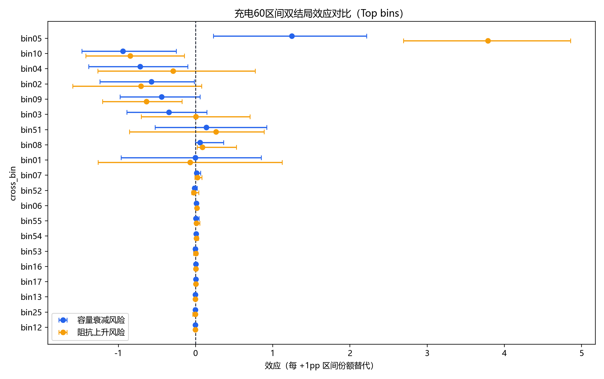

# 容量-阻抗联合因果分析报告（充电60区间）

## 1. 执行摘要
- 在 `H=200` 的窗口口径下，容量衰减与阻抗上升存在稳定的共同恶化关系：`Spearman=0.6354`，`Pearson=0.8641`，且同窗口两者同时变坏的占比为 `73.16%`。
- pooled 全局看，`cycle~q_t` 呈强负相关（`-0.7092`），`cycle~ir_t` 的 pooled 相关较弱（`-0.2231`），但 cell 内中位趋势显示 `q_t` 下降、`ir_t` 上升同时成立，`84.88%` 的 cell 呈现“容量下降+阻抗上升”的反向趋势组合。
- 双方向 AIPW 显示：`IR变化(+1pp) -> 容量衰减` 的效应为 `0.002614`，`容量变化(+1pp) -> 阻抗上升` 的效应为 `0.028035`；当前标准化口径下，后者点估计更大。
- 容量风险最大的区间是 `bin05（SOC [0,10) / 倍率 [0,0.434) / 温度 [36,60]）`，阻抗风险最大的区间也是 `bin05（SOC [0,10) / 倍率 [0,0.434) / 温度 [36,60]）`；这说明存在头部共同高风险工况。
- 60 个区间中，`dual_risk=7`、`cap_dominant=2`、`ir_dominant=3`、`uncertain=48`；多数区间仍属证据不足，不能直接解读为安全。

## 2. 样本与口径说明
- 时间窗：`H=200` cycles。
- 样本过滤：`0.300 <= q_t <= 1.300`，`ir_t>0`。
- 排除策略前缀：`VARCHARGE`。
- 因果方法：趋势层 + 双方向 `AIPW/GPS` + 区间替代 `DML + cluster bootstrap + BH-FDR`。
- bootstrap：`n=400`，后端 `numpy`，设备 `cpu`，DML nuisance 模型 `linear`。
- 数值解释：`effect_per_1pp` 表示将某区间充电份额额外增加 `1pp` 时，对未来 `H=200` 窗口结果的边际影响；`ci_low/ci_high` 为 95% bootstrap CI；`q_value` 为 BH-FDR 多重比较后的显著性。
- `significant_positive=True` 表示 95%CI 全部大于 0；`ci_cross_zero=True` 表示 CI 跨 0。
| metric | value | notes |
|---|---|---|
| life_rows | 138867.000000 | life_performance 过滤后行数 |
| window_rows | 98893.000000 | 窗口样本行数 |
| analysis_rows | 98893.000000 | 合并后分析样本行数 |
| ir_non_positive_filtered_share | 0.287858 | 窗口构造后样本保留差异（含ir>0等条件影响） |
| unique_clusters | 173.000000 | policy+cell cluster 数 |
| bootstrap_iters | 400.000000 | bootstrap 迭代次数 |
| dml_nuisance_model | nan | DML nuisance 模型: linear |

## 3. 容量变化与阻抗增加的相关性结论
| metric | value | notes |
|---|---|---|
| rows_window | 98893.000000 | 窗口样本行数 |
| spearman_cycle_q | -0.709202 | 全局 cycle~q_t Spearman |
| spearman_cycle_ir | -0.223128 | 全局 cycle~ir_t Spearman |
| spearman_y_capdrop_vs_y_irrise | 0.635436 | 全局 y_cap_drop_h 与 y_ir_rise_h Spearman |
| pearson_y_capdrop_vs_y_irrise | 0.864076 | 全局 y_cap_drop_h 与 y_ir_rise_h Pearson |
| share_both_worsen | 0.731579 | 同窗口容量衰减>0 且阻抗上升>0 占比 |
| cell_median_rho_cycle_q | -0.994224 | cell 内 cycle~q_t Spearman 中位数 |
| cell_median_rho_cycle_ir | 0.558026 | cell 内 cycle~ir_t Spearman 中位数 |
| cell_share_opposite_sign_trend | 0.848837 | cell 内容量下降+阻抗上升趋势占比 |

- 全局 pooled 结果显示，容量随循环下降的趋势非常强（`cycle~q_t Spearman=-0.7092`）；阻抗的 pooled 结果较弱且方向与 cell 内结果不完全一致（`cycle~ir_t Spearman=-0.2231`），说明阻抗更容易受到不同 policy、不同电芯基线和取样窗口混杂。
- cell 内中位趋势更值得信赖：`cycle~q_t` 的中位 Spearman 为 `-0.9942`，`cycle~ir_t` 的中位 Spearman 为 `0.5580`，且 `84.88%` 的 cell 同时表现出“容量下降 + 阻抗上升”。
- 在 `H=200` 的窗口层面，`y_cap_drop_h` 与 `y_ir_rise_h` 的 `Spearman=0.6354`、`Pearson=0.8641`。Pearson 明显高于 Spearman，说明当窗口内老化加速时，容量衰减与阻抗上升会出现更强的线性共振，头部恶化窗口的共变更突出。
- 同窗口两者同时恶化的占比达到 `73.16%`，因此“容量下降”和“阻抗增加”不是彼此孤立的退化信号，而是大多数窗口中共同出现。
- 这里的结论首先是“趋势共变”而非“严格机理单向因果”；真正的方向性判断，需要结合下一节的双方向 AIPW 结果。

## 4. 双方向因果效应解读
| direction | direction_label | effect_per_1pp | ci_low | ci_high | bootstrap_success | n_rows | n_clusters | support_shift_share | weight_p95 | weight_p99 | weight_max | ess | treatment_std | gps_sigma | clip_threshold |
|---|---|---|---|---|---|---|---|---|---|---|---|---|---|---|---|
| dir_rel_1_to_y_cap_drop_h | IR变化(+1pp) -> 容量衰减 | 0.002614 | 0.001293 | 0.003743 | 400 | 98893 | 173 | 0.999990 | 1.196593 | 14.533334 | 14.535072 | 11048.824716 | 0.006563 | 0.006511 | 14.535072 |
| dq_rel_1_to_y_ir_rise_h | 容量变化(+1pp) -> 阻抗上升 | 0.028035 | 0.025324 | 0.030584 | 400 | 98893 | 173 | 0.999990 | 0.448105 | 0.565768 | 0.565775 | 97544.077073 | 0.007093 | 0.007090 | 0.565775 |

- `IR变化(+1pp) -> 容量衰减` 的效应估计为 `0.002614`，95%CI 为 `[0.001293, 0.003743]`。
- `容量变化(+1pp) -> 阻抗上升` 的效应估计为 `0.028035`，95%CI 为 `[0.025324, 0.030584]`。
- 两个方向的 CI 都没有跨 0，说明在当前标准化处理定义下，容量与阻抗之间不仅共同变坏，而且具有稳定的方向性预测结构。
- 需要注意，这两个 `+1pp` 并不是同一个物理量的加法，因此它们更适合作为“标准化强度对比”，而不是直接拿来做物理量级比较。当前结果更像是在说：近期容量损失是更强的阻抗恶化先行信号，而近期阻抗上跳也会对应后续容量更快下降。

## 5. 容量衰减高风险区间
- 按 `cap_effect_per_1pp` 排序，容量风险头部区间是 `bin05（SOC [0,10) / 倍率 [0,0.434) / 温度 [36,60]）`，点估计为 `1.246480`。
- 在 Top10 中，CI 全正的容量风险区间主要包括：bin05（SOC [0,10) / 倍率 [0,0.434) / 温度 [36,60]）、bin17（SOC [0,10) / 倍率 [4.22,7.75] / 温度 [31,32)）、bin16（SOC [0,10) / 倍率 [4.22,7.75] / 温度 [20,31)）、bin18（SOC [0,10) / 倍率 [4.22,7.75] / 温度 [32,34)）。
- 需要区分两类区间：一类是“幅度极大但不确定性更宽”的极端区间，另一类是“幅度中等但 CI 更稳”的稳定风险区间。
- 例如 `bin05（SOC [0,10) / 倍率 [0,0.434) / 温度 [36,60]）` 的效应远高于其他区间，说明它是绝对头部风险；但其 `q_value=0.055000`，属于多重比较下的边缘显著，需要与稳定显著区间分开看。
- 相比之下，像 `bin17（SOC [0,10) / 倍率 [4.22,7.75] / 温度 [31,32)）、bin16（SOC [0,10) / 倍率 [4.22,7.75] / 温度 [20,31)）、bin18（SOC [0,10) / 倍率 [4.22,7.75] / 温度 [32,34)）` 这类区间，虽然点估计不如头部极端区间夸张，但更适合被视为稳定的容量治理重点。
| effect_rank | cross_bin | cross_label | condition_text | effect_per_1pp | ci_low | ci_high | q_value | significant_positive | ci_cross_zero | risk_category |
|---|---|---|---|---|---|---|---|---|---|---|
| 1 | 5 | s1_r1_t5 | SOC [0,10) / 倍率 [0,0.434) / 温度 [36,60] | 1.246480 | 0.230307 | 2.214980 | 0.055000 | 是 | 否 | dual_risk |
| 2 | 51 | s3_r3_t1 | SOC [90,100] / 倍率 [1.99,4.22) / 温度 [20,31) | 0.140462 | -0.525701 | 0.921160 | 0.325000 | 否 | 是 | uncertain |
| 3 | 8 | s1_r2_t3 | SOC [0,10) / 倍率 [0.434,1.99) / 温度 [32,34) | 0.056905 | -0.001859 | 0.363852 | 0.137500 | 否 | 是 | ir_dominant_risk |
| 4 | 7 | s1_r2_t2 | SOC [0,10) / 倍率 [0.434,1.99) / 温度 [31,32) | 0.013630 | -0.005287 | 0.064631 | 0.176000 | 否 | 是 | uncertain |
| 5 | 6 | s1_r2_t1 | SOC [0,10) / 倍率 [0.434,1.99) / 温度 [20,31) | 0.010112 | -0.005770 | 0.018850 | 0.176000 | 否 | 是 | ir_dominant_risk |
| 6 | 54 | s3_r3_t4 | SOC [90,100] / 倍率 [1.99,4.22) / 温度 [34,36) | 0.007990 | -0.001805 | 0.022770 | 0.244444 | 否 | 是 | uncertain |
| 7 | 55 | s3_r3_t5 | SOC [90,100] / 倍率 [1.99,4.22) / 温度 [36,60] | 0.004522 | -0.009672 | 0.044726 | 0.589286 | 否 | 是 | uncertain |
| 8 | 17 | s1_r4_t2 | SOC [0,10) / 倍率 [4.22,7.75] / 温度 [31,32) | 0.004344 | 0.002403 | 0.006168 | 0.000000 | 是 | 否 | dual_risk |
| 9 | 16 | s1_r4_t1 | SOC [0,10) / 倍率 [4.22,7.75] / 温度 [20,31) | 0.003564 | 0.000567 | 0.006955 | 0.080882 | 是 | 否 | dual_risk |
| 10 | 18 | s1_r4_t3 | SOC [0,10) / 倍率 [4.22,7.75] / 温度 [32,34) | 0.002128 | 0.000306 | 0.003542 | 0.068750 | 是 | 否 | cap_dominant_risk |

## 6. 阻抗增加高风险区间
- 按 `ir_effect_per_1pp` 排序，阻抗风险头部区间是 `bin05（SOC [0,10) / 倍率 [0,0.434) / 温度 [36,60]）`，点估计为 `3.787507`。
- 在 Top10 中，CI 全正的阻抗风险区间主要包括：bin05（SOC [0,10) / 倍率 [0,0.434) / 温度 [36,60]）、bin08（SOC [0,10) / 倍率 [0.434,1.99) / 温度 [32,34)）、bin06（SOC [0,10) / 倍率 [0.434,1.99) / 温度 [20,31)）、bin16（SOC [0,10) / 倍率 [4.22,7.75] / 温度 [20,31)）。
- 阻抗风险的头部结构与容量风险并不完全相同：有些区间对阻抗非常敏感，但对容量的直接影响尚不够稳定。
- `bin05（SOC [0,10) / 倍率 [0,0.434) / 温度 [36,60]）` 同时也是双结局共同高风险区间，说明它更接近“共损伤工况”；而某些 `ir_dominant_risk` 区间则更像“先推高阻抗、对容量短期影响尚不够稳定”的工况。
| effect_rank | cross_bin | cross_label | condition_text | effect_per_1pp | ci_low | ci_high | q_value | significant_positive | ci_cross_zero | risk_category |
|---|---|---|---|---|---|---|---|---|---|---|
| 1 | 5 | s1_r1_t5 | SOC [0,10) / 倍率 [0,0.434) / 温度 [36,60] | 3.787507 | 2.693289 | 4.856201 | 0.000000 | 是 | 否 | dual_risk |
| 2 | 51 | s3_r3_t1 | SOC [90,100] / 倍率 [1.99,4.22) / 温度 [20,31) | 0.265315 | -0.856468 | 0.888418 | 0.303448 | 否 | 是 | uncertain |
| 3 | 8 | s1_r2_t3 | SOC [0,10) / 倍率 [0.434,1.99) / 温度 [32,34) | 0.090377 | 0.020304 | 0.527988 | 0.055000 | 是 | 否 | ir_dominant_risk |
| 4 | 7 | s1_r2_t2 | SOC [0,10) / 倍率 [0.434,1.99) / 温度 [31,32) | 0.024989 | -0.008464 | 0.081815 | 0.220000 | 否 | 是 | uncertain |
| 5 | 6 | s1_r2_t1 | SOC [0,10) / 倍率 [0.434,1.99) / 温度 [20,31) | 0.017809 | 0.000267 | 0.027698 | 0.161765 | 是 | 否 | ir_dominant_risk |
| 6 | 55 | s3_r3_t5 | SOC [90,100] / 倍率 [1.99,4.22) / 温度 [36,60] | 0.010172 | -0.006096 | 0.054654 | 0.372581 | 否 | 是 | uncertain |
| 7 | 54 | s3_r3_t4 | SOC [90,100] / 倍率 [1.99,4.22) / 温度 [34,36) | 0.009683 | -0.000797 | 0.036972 | 0.212500 | 否 | 是 | uncertain |
| 8 | 53 | s3_r3_t3 | SOC [90,100] / 倍率 [1.99,4.22) / 温度 [32,34) | 0.004871 | -0.026198 | 0.028553 | 0.864286 | 否 | 是 | uncertain |
| 9 | 16 | s1_r4_t1 | SOC [0,10) / 倍率 [4.22,7.75] / 温度 [20,31) | 0.004386 | 0.000934 | 0.008180 | 0.042308 | 是 | 否 | dual_risk |
| 10 | 3 | s1_r1_t3 | SOC [0,10) / 倍率 [0,0.434) / 温度 [32,34) | 0.004131 | -0.703910 | 0.705829 | 0.897642 | 否 | 是 | uncertain |

## 7. 双结局共同高风险区间
### 7.1 风险类别统计
| risk_category | n_bins | mean_cap_effect | mean_ir_effect |
|---|---|---|---|
| uncertain | 48 | -0.066997 | -0.052902 |
| dual_risk | 7 | 0.179845 | 0.542844 |
| ir_dominant_risk | 3 | 0.022374 | 0.036207 |
| cap_dominant_risk | 2 | 0.001353 | 0.000858 |

- 头部绝对风险区间是 `bin05（SOC [0,10) / 倍率 [0,0.434) / 温度 [36,60]）`：它在容量和阻抗两个结果上都显著高于其他区间，应优先被当作最强共损伤工况。
- 除头部极端区间外，更稳定的共损伤区间包括：bin16（SOC [0,10) / 倍率 [4.22,7.75] / 温度 [20,31)）、bin17（SOC [0,10) / 倍率 [4.22,7.75] / 温度 [31,32)）、bin36（SOC [10,90) / 倍率 [4.22,7.75] / 温度 [20,31)）、bin37（SOC [10,90) / 倍率 [4.22,7.75] / 温度 [31,32)）、bin38（SOC [10,90) / 倍率 [4.22,7.75] / 温度 [32,34)）、bin42（SOC [90,100] / 倍率 [0,0.434) / 温度 [31,32)）。
- 容量优先治理区间：bin18（SOC [0,10) / 倍率 [4.22,7.75] / 温度 [32,34)）、bin39（SOC [10,90) / 倍率 [4.22,7.75] / 温度 [34,36)）。
- 阻抗优先治理区间：bin08（SOC [0,10) / 倍率 [0.434,1.99) / 温度 [32,34)）、bin06（SOC [0,10) / 倍率 [0.434,1.99) / 温度 [20,31)）、bin43（SOC [90,100] / 倍率 [0,0.434) / 温度 [32,34)）。
- `uncertain` 区间有 `48/60` 个，占比 `80.00%`。这里的含义是“当前证据不足”，不是“这些区间一定安全”。
### 7.2 dual_risk 重点区间
| cross_bin | cross_label | condition_text | soc_bin | rate_bin | temp_bin | cap_effect_per_1pp | cap_ci_low | cap_ci_high | ir_effect_per_1pp | ir_ci_low | ir_ci_high |
|---|---|---|---|---|---|---|---|---|---|---|---|
| 5 | s1_r1_t5 | SOC [0,10) / 倍率 [0,0.434) / 温度 [36,60] | 1 | 1 | 5 | 1.246480 | 0.230307 | 2.214980 | 3.787507 | 2.693289 | 4.856201 |
| 16 | s1_r4_t1 | SOC [0,10) / 倍率 [4.22,7.75] / 温度 [20,31) | 1 | 4 | 1 | 0.003564 | 0.000567 | 0.006955 | 0.004386 | 0.000934 | 0.008180 |
| 17 | s1_r4_t2 | SOC [0,10) / 倍率 [4.22,7.75] / 温度 [31,32) | 1 | 4 | 2 | 0.004344 | 0.002403 | 0.006168 | 0.002970 | 0.001045 | 0.004962 |
| 36 | s2_r4_t1 | SOC [10,90) / 倍率 [4.22,7.75] / 温度 [20,31) | 2 | 4 | 1 | 0.001553 | 0.000450 | 0.002393 | 0.002104 | 0.000657 | 0.003409 |
| 37 | s2_r4_t2 | SOC [10,90) / 倍率 [4.22,7.75] / 温度 [31,32) | 2 | 4 | 2 | 0.001551 | 0.000896 | 0.003299 | 0.001534 | 0.000760 | 0.003434 |
| 38 | s2_r4_t3 | SOC [10,90) / 倍率 [4.22,7.75] / 温度 [32,34) | 2 | 4 | 3 | 0.001159 | 0.000733 | 0.001723 | 0.000989 | 0.000472 | 0.001640 |
| 42 | s3_r1_t2 | SOC [90,100] / 倍率 [0,0.434) / 温度 [31,32) | 3 | 1 | 2 | 0.000260 | 0.000023 | 0.000503 | 0.000418 | 0.000138 | 0.000729 |

## 8. 图表解读

- X轴：cell 内 `cycle~q_t` 与 `cycle~ir_t` 的 Spearman 相关系数。
- Y轴：cell 数量。
- 关键结论：容量在 cell 内几乎普遍随循环下降，阻抗在 cell 内多数呈上升趋势。
- 业务解释：如果只看 pooled 全局相关，很容易低估阻抗上升趋势；cell 内分布更能反映真实老化方向。


- X轴：两种方向性问题（`IR变化->容量衰减`、`容量变化->阻抗上升`）。
- Y轴：每 +1pp 处理变化对应的结果变化。
- 关键结论：两条方向的 CI 都未跨 0，但“容量变化->阻抗上升”的标准化效应更大。
- 业务解释：近期容量损失可被看作更强的阻抗恶化先行信号之一，同时 IR 上跳也不应被忽视。


- X轴：`cap_effect_per_1pp`。
- Y轴：容量风险 Top 区间。
- 关键结论：容量风险头部区间高度集中在少数工况，且头部极端区间与稳定显著区间需要分开看。
- 业务解释：用于优先确定“先做哪个容量保护实验”。


- X轴：`ir_effect_per_1pp`。
- Y轴：阻抗风险 Top 区间。
- 关键结论：阻抗风险的头部区间与容量风险部分重合，但也存在偏阻抗主导的区间。
- 业务解释：用于优先确定“先做哪个内阻抑制实验”。


- X轴：容量衰减效应。
- Y轴：阻抗增加效应。
- 关键结论：大多数共同高风险区间位于第一象限，说明容量与阻抗的风险往往共向增强。
- 业务解释：第一象限远离原点的区间应优先被归入“共损伤治理清单”。


- X轴：每 +1pp 区间份额替代的效应。
- Y轴：cross_bin（按综合风险排序）。
- 关键结论：可直接比较同一区间对容量和阻抗的相对伤害程度。
- 业务解释：适合用来挑选“先做联合优化”还是“先做单指标优化”的目标区间。


- X轴：温度分位 bin（T1~T5）。
- Y轴：倍率分位 bin（R1~R4）。
- 关键结论：风险并不是均匀分布的，而是在特定 SOC 层中沿倍率/温度组合聚集。
- 业务解释：这张图最适合转成分层控制策略或优先实验矩阵。

## 9. 结论与使用建议
- 第一，容量下降和阻抗增加在当前样本上存在稳定相关性，而且这种关系在窗口层和 cell 内层都成立。
- 第二，方向性分析说明两者不只是“同时坏”，而是具有可用于监测和预警的先后结构。
- 第三，优先治理应分两层：先锁定头部共损伤区间，再区分容量优先区间和阻抗优先区间。
- 第四，`uncertain` 区间很多，说明后续更值得补的是支持域和样本稳定性，而不是贸然把其余区间都判成安全。

## 10. 关键输出文件
- `trend_capacity_ir_summary.csv`
- `causal_crosslink_effects.csv`
- `causal_substitution_effects_capacity_drop_h.csv`
- `causal_substitution_effects_ir_rise_h.csv`
- `cross_bin_dual_outcome_compare.csv`
- `cross_bin_interpretation_table.csv`
- `capacity_risk_top_bins.csv`
- `ir_risk_top_bins.csv`
- `runtime_backend_info.csv` 与 `runtime_library_versions.csv`

## 11. 复现命令
```bash
pipenv run python scripts/analyze_capacity_ir_joint_causal.py --horizon-cycles 200 --bootstrap-iters 400 --bootstrap-backend numpy --device cpu --output-dir outputs/analysis/capacity_ir_joint_causal
```