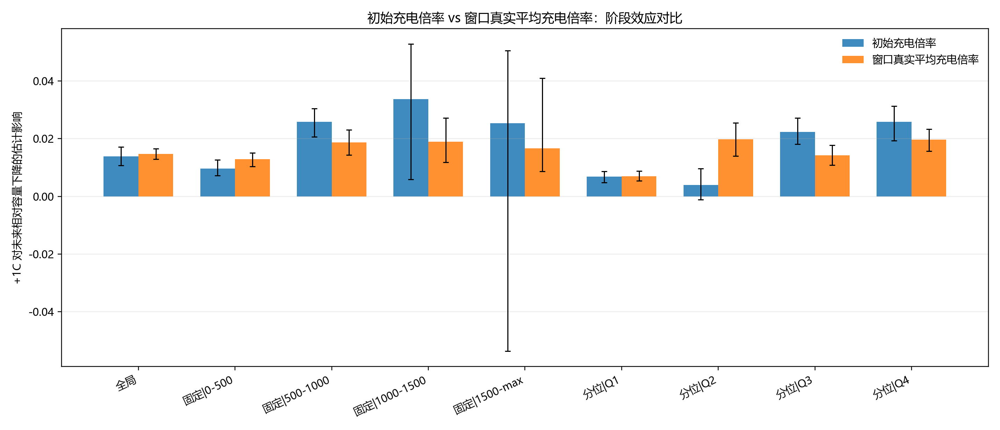
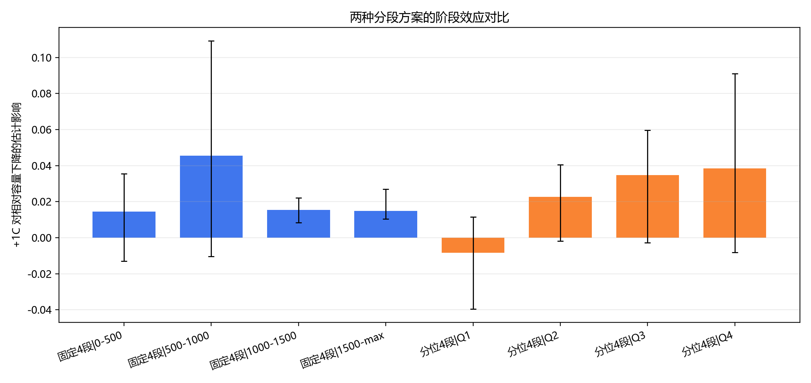
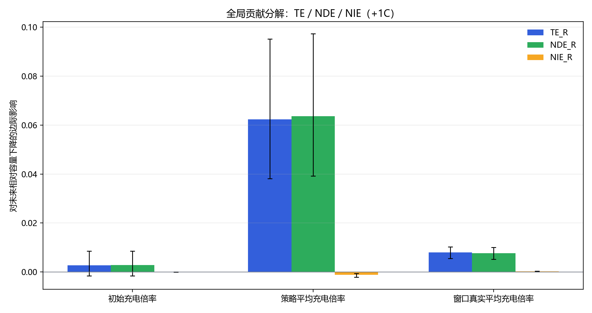
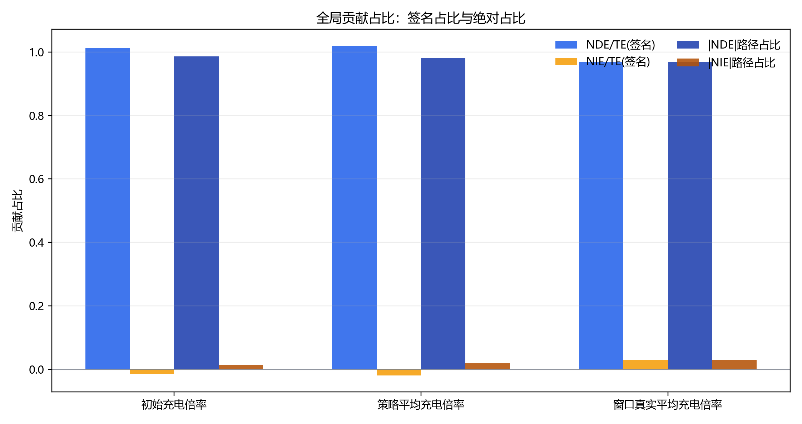
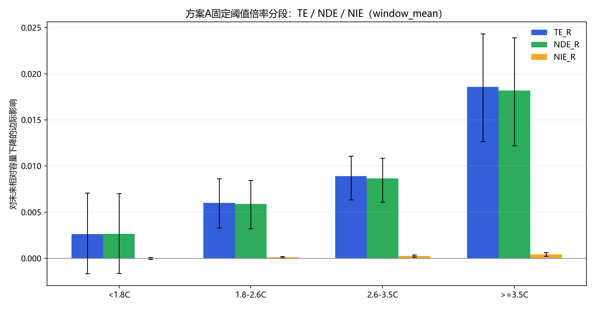
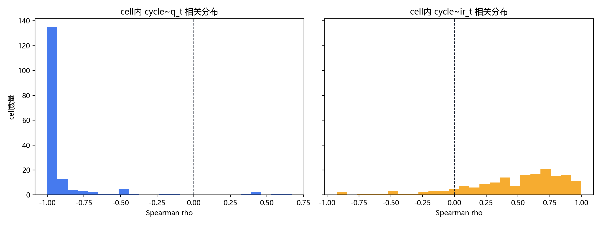
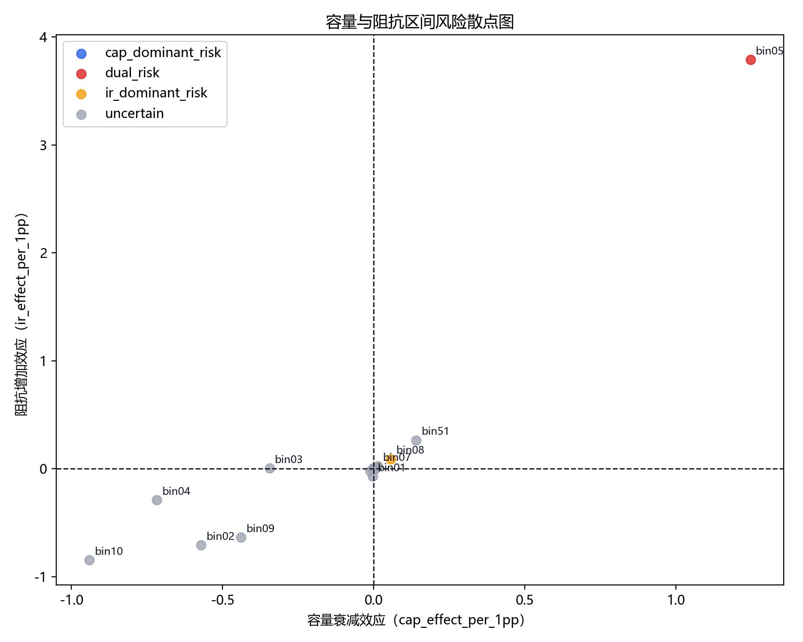
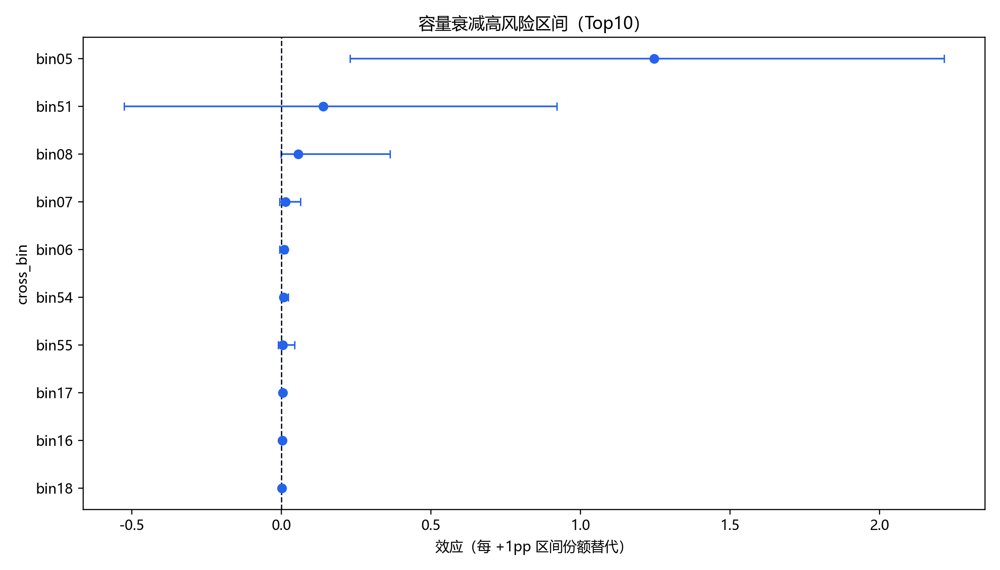
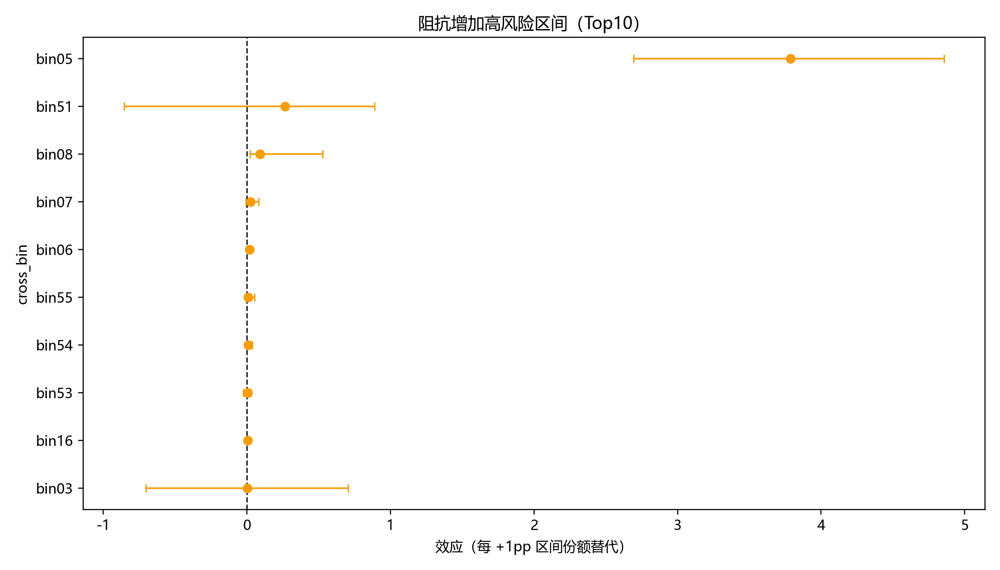
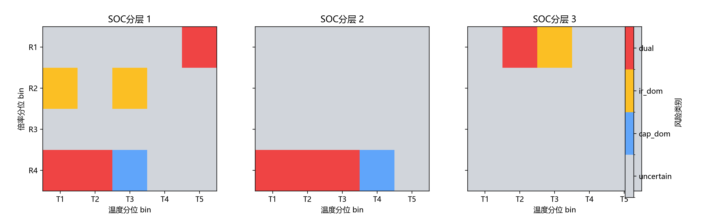

# 因果推断全流程教学文档：倍率、温度、容量与阻抗

本文档基于仓库内已经生成的因果分析产物进行教学型汇总，不重新训练模型、不修改任何既有结果。主目标有三个：一是把这次项目里实际用过的因果推断步骤讲清楚；二是把统计术语、概率背景和业务含义对齐；三是把“哪些结论能直接拿去决策、哪些只能当敏感性证据”说清楚。

## 决策摘要

- 在交集样本上，`window_mean` 口径下“充电倍率每增加 `+1C`，未来 `200` 个 cycle 的相对容量下降”全局效应约为 `0.014658`，高于 `initial` 口径的 `0.013829`，差异约 `6.00%`，说明“真实执行倍率”比“策略初始倍率”更贴近实际损伤强度，但两者方向一致，不能解释成机制翻转（来源：`causal_initial_rate_effect/causal_effect_global_treatment_compare.csv` / `effect_plus_1c`）。
- 在倍率-温度-容量路径分解中，`window_mean` 口径下 `TE=0.007918`、`NDE=0.007678`、`NIE=0.000241`，即大部分效应来自倍率对容量衰减的直接路径，温度中介路径存在但幅度更小，不能写成“温度完全不重要”（来源：`causal_rate_temp_mediation/mediation_contribution_summary.csv` / `te_r, nde_r, nie_r, nie_share`）。
- 容量衰减和阻抗上升在窗口层高度共变：`Spearman=0.635436`、`Pearson=0.864076`，且两者在同一窗口内同时恶化的占比为 `73.16%`；但“趋势共变”不等于“单向因果”，方向性要单独看双方向 AIPW 结果（来源：`capacity_ir_joint_causal/trend_capacity_ir_summary.csv` / `spearman_y_capdrop_vs_y_irrise, pearson_y_capdrop_vs_y_irrise, share_both_worsen`）。
- 60 个充电区间里，绝对头部共同高风险区间是 `bin05`，但它的支持宽度仅 `0.000106`，所以 raw `+1pp` 斜率非常大，并不等于“低SOC低倍率本身普遍有害”；结合支持宽度归一后，容量头部更偏向中等 SOC、高倍率的 `bin38/36/37` 一带（来源：`capacity_ir_joint_causal/support_normalized_effects_compare.csv` / `effect_per_1pp, effect_support_norm, support_width_1_99`）。
- “高温是强风险因子”在当前数据里只能写成分层结论：容量和阻抗两个结局的高温结论都只是 `partial`，即“在部分 SOC 层成立”，尤其低 SOC 层更强，不能扩写成“所有 SOC 层都单调成立”（来源：`capacity_ir_joint_causal/high_temp_claim_assessment.csv` / `assessment`）。

## 1. 研究问题与因果目标

### 理论定义

因果推断的起点不是“变量之间有关联吗”，而是“如果我们主动改变某个变量，结果会不会跟着改变，以及改变多少”。这比相关分析多了一层“干预”含义。

在本项目里，三条主分析线对应三种不同的因果问题：

| 分析线 | 处理变量 | 结果变量 | 想回答的问题 |
|---|---|---|---|
| 倍率 -> 容量 | 充电倍率 `T` | `Y=(Q_t-Q_{t+200})/Q_t` | 如果把充电倍率提高 `+1C`，未来 `200` cycles 容量会额外下降多少 |
| 倍率 -> 温度 -> 容量 | 倍率 `R_t` 与温度中介 `T_{t+1}` | `Y=(Q_t-Q_{t+200})/Q_t` | 倍率的损伤里，有多少是直接作用，有多少是经由温度传递 |
| 区间工况 -> 容量/阻抗 | 某充电区间份额 `share_i` | `y_cap_drop_h` 或 `y_ir_rise_h` | 如果把更多充电时间替代到某区间，该区间会更容易推高容量衰减还是阻抗上升 |

这里要区分几类目标量：

| 术语 | 直观含义 |
|---|---|
| `ATE` | 全体样本平均处理效应 |
| `CATE` | 条件平均处理效应，强调分组或异质性 |
| `TE` | 总效应，包含直接路径和间接路径 |
| `NDE` | 自然直接效应，不经过中介的那部分 |
| `NIE` | 自然间接效应，经由中介传递的那部分 |
| `CDE` | 控制直接效应，在固定中介扰动幅度下看直接作用 |

### 本项目实例

- “倍率每增加 `+1C`”是一个连续处理问题，不是二分类处理问题，因此项目里没有用传统 propensity score matching，而是走了连续处理的 `GPS + AIPW` 路线。
- “温度是不是倍率损伤的中介”不是看相关系数，而是看 `TE≈NDE+NIE` 的路径分解是否闭合，以及 `NIE` 的方向和置信区间是否稳定。
- “哪些区间最危险”不是看单纯出现频率，而是看：把时间份额替代到该区间后，结局是否会变坏、幅度多大、置信区间是否跨 0、支持域是否足够。

### 落地检查项

- 先写清楚处理变量、结果变量、时间顺序。
- 明确“相关问题”和“干预问题”不是一回事。
- 每次汇报结论前，先说清楚这是 `ATE/CATE`、还是 `TE/NDE/NIE/CDE`、还是 `effect_per_1pp`。

## 2. 数据与时序索引

### 理论定义

时序因果分析最怕“穿越”。也就是说，处理必须发生在结果之前，中介必须出现在处理之后、结果之前。否则模型哪怕算出显著系数，也不具备因果解释。

本项目统一把分析样本做成滚动窗口。对于容量衰减主线，核心结果变量是：

```text
Y = (Q_t - Q_(t+H)) / Q_t
H = 200
```

这表示“从当前循环 `t` 到未来 `t+200` 的相对容量下降”。

### 本项目实例

- 倍率主线里，窗口长度固定为 `H=200`，并且明确写入报告（来源：`causal_initial_rate_effect/causal_effect_global_treatment_compare.csv` 与现有报告口径）。
- 温度中介主线里，时序关系固定为 `R_t -> T_(t+1) -> Y_(t+200)`，其中温度采用“单次充电循环平均温度，按 `charge_duration_s` 对 `avg_temper` 加权聚合”的定义（来源：`causal_rate_temp_mediation/mediation_report.md` / 分析设定）。
- 联合容量-阻抗主线里，容量结果定义为 `y_cap_drop_h=(q_t-q_(t+H))/q_t`，阻抗结果定义为 `y_ir_rise_h=(ir_(t+H)-ir_t)/ir_t`，且只在 `ir_t>0` 的样本上定义（来源：`capacity_ir_joint_causal/capacity_ir_joint_causal_report.md` / 样本与口径说明）。

关键样本覆盖信息如下：

| 数据链路 | 关键覆盖率/样本量 | 解释 |
|---|---:|---|
| 倍率交集样本 | `101649` 行、`180` 个 `policy+cell` | `initial` 与 `window_mean` 使用交集样本对比（来源：`causal_initial_rate_effect/treatment_mode_sample_compare.csv` / `intersection_n_rows, intersection_n_clusters`） |
| 温度中介最终样本 | `102135` 行、`180` 个 cluster | `window_mean` 主口径最终用于中介建模的样本（来源：`causal_rate_temp_mediation/mediation_effect_global.csv` / `n_rows, n_clusters`） |
| 容量-阻抗联合窗口 | `98893` 行、`173` 个 cluster | 容量和阻抗双结局主分析交集样本（来源：`capacity_ir_joint_causal/trend_capacity_ir_summary.csv` / `rows_window`） |

### 落地检查项

- 任何一个因果结论都要先画出时间箭头，再上模型。
- 结果变量的定义必须统一，例如容量这里始终是“未来 `200` cycles 相对下降”，不能中途切成绝对 Ah。
- 样本覆盖率和过滤条件必须写进报告，否则后面所有效应值都失去上下文。

## 3. 统计/概率基础

### 理论定义

因果推断虽然讨论“如果干预会怎样”，但计算时依然建立在概率论和统计推断之上。至少需要抓住四个基础概念：

1. 条件期望  
`E[Y|X]` 表示在给定协变量 `X` 时，结果 `Y` 的平均水平。无论是 AIPW 还是 g-computation，本质上都在估计某个条件期望。

2. 反事实  
对同一个样本，我们无法同时观测“倍率提高了”和“倍率没提高”的两个世界。因果推断要做的，就是在可接受的假设下，用数据去逼近这个没观测到的世界。

3. 置信区间  
本项目统一使用 cluster bootstrap 来近似采样分布，`ci_low` 和 `ci_high` 分别对应 95% 置信区间的下、上界。直观上，它反映“在当前样本与抽样波动下，效应可能落在哪个范围”。

4. 多重比较  
当我们同时比较很多区间时，单纯看 `p_value` 容易“误报”太多显著结果，所以项目里对 60 区间用的是 `BH-FDR`，输出 `q_value`。

### 本项目实例

- 倍率对容量的全局 `+1C` 效应使用 bootstrap `400` 次，`window_mean` 口径下点估计 `0.014658`，95%CI 为 `[0.012841, 0.016559]`，说明方向稳定且不确定性相对可控（来源：`causal_initial_rate_effect/causal_effect_global_treatment_compare.csv` / `effect_plus_1c, ci_low, ci_high`）。
- 温度中介分解里，`window_mean` 的 `TE=0.007918`、`NDE=0.007678`、`NIE=0.000241`，且 `closure_error` 近乎 0，说明数值上满足 `TE≈NDE+NIE`（来源：`causal_rate_temp_mediation/mediation_effect_global.csv` / `te_r, nde_r, nie_r, closure_error`）。
- 联合风险分析里，`q_value` 的存在非常关键。例如 `bin05` 在容量结局下 `q_value=0.055`，在阻抗结局下 `q_value=0.000`，说明同一个区间在不同结局上的证据强度不同（来源：`capacity_ir_joint_causal/cross_bin_dual_outcome_compare.csv` / `cap_q_value, ir_q_value`）。

### 落地检查项

- `ci_low` 与 `ci_high` 不跨 0，才能说方向更稳定。
- `p_value` 只适合单个检验，批量区间比较优先看 `q_value`。
- 看到大效应时，先看 CI 宽度，再看是否是窄支持区间放大的结果。

## 4. 识别假设与失效场景

### 理论定义

因果推断从来不是“模型一跑就有真相”，而是“在一组识别假设成立时，结果可解释”。本项目最关键的假设有四类：

| 假设 | 含义 | 如果失败会怎样 |
|---|---|---|
| 可交换性 | 给定观测协变量后，处理分配不再受遗漏混杂主导 | 估计量可能把隐藏状态当成处理效应 |
| 重叠性 | 各处理水平在样本中都有足够支持 | 会出现极端权重、外推、ESS 降低 |
| 一致性 | 观测到的处理定义与反事实处理定义一致 | “模型里的处理”与“工程里的处理”不是同一个东西 |
| SUTVA | 一个样本的处理不会直接影响另一样本的结果 | cluster 间干扰会污染效应解释 |

### 本项目实例

- 在倍率主线里，`window_mean` 的可用覆盖率约为 `0.994677`，并按 `q01~q99` 对处理变量进行裁剪；这就是在主动减少重叠性不足导致的极端外推（来源：`causal_initial_rate_effect/treatment_mode_sample_compare.csv` / `window_mean_coverage, window_mean_clip_low, window_mean_clip_high`）。
- 在温度中介主线里，`support_plus1_share=0.957967`，而 `effective_sample_size=1087.55`、`weight_p99=412.40`，说明“+1C 推断”大部分处于样本支撑内，但局部仍存在权重放大，需要谨慎解释（来源：`causal_rate_temp_mediation/mediation_effect_global.csv` / `support_plus1_share, effective_sample_size, weight_p99`）。
- 在 60 区间风险主线里，`bin05` 的支持宽度只有 `0.000106`，这就是典型的“斜率看起来极大，但实际可实现支持域非常窄”的场景。此时 raw `effect_per_1pp` 不能直接外推成普遍策略结论（来源：`capacity_ir_joint_causal/support_normalized_effects_compare.csv` / `support_width_1_99`）。

### 落地检查项

- 每个大效应都要配一个支持域或权重诊断。
- 如果 `ESS` 很低或 `weight_p99/weight_max` 很高，必须在报告里降级语气。
- 窄支持区间的结论必须和支持宽度归一结果一起讲。

## 5. 估计器原理

### 理论定义

本项目实际上用了三套不同的估计器，因为三种问题不是同一种统计对象。

#### 5.1 连续处理的 GPS + AIPW

适用于“处理变量是连续值”的问题，比如充电倍率。其核心思路是：

```text
先建模：
1. 处理模型：r(t|X) = f(T=t | X)
2. 结果模型：m(t, X) = E[Y | T=t, X]

再做双重稳健修正：
mu(t) ≈ E[ m(t, X) + 校正项 * (Y - m(T, X)) ]
```

“双重稳健”的意思是：只要处理模型和结果模型里有一个足够接近真实，估计就有机会保持一致性。

#### 5.2 g-computation 中介分解

适用于“处理影响中介，中介再影响结果”的路径分解问题：

```text
TE  = E[Y(r+1, M(r+1)) - Y(r, M(r))]
NDE = E[Y(r+1, M(r))   - Y(r, M(r))]
NIE = E[Y(r+1, M(r+1)) - Y(r+1, M(r))]
```

数值上应满足：

```text
TE ≈ NDE + NIE
closure_error = TE - (NDE + NIE)
```

#### 5.3 DML 区间替代效应

适用于“把某个区间时间份额增加 `+1pp`，其余 59 区间总池等量减少”的问题。其简化形式是：

```text
Y~ = Y - m_y(W)
T~ = T_i - m_t(W)
theta_i = Cov(Y~, T~) / Var(T~)
effect_per_1pp = 0.01 * theta_i
```

它不是在问“该区间出现频率高不高”，而是在问“如果把更多充电时间替代到该区间，结果会如何变化”。

### 本项目实例

- 倍率主线用的是连续处理 `GPS + AIPW`，结果输出为 `effect_plus_1c`，即“平均意义下把倍率提高 `+1C` 的增量损伤”（来源：`causal_initial_rate_effect/causal_effect_global_treatment_compare.csv`）。
- 温度路径主线用的是 `g-computation` 风格的路径分解，输出 `TE/NDE/NIE/CDE`（来源：`causal_rate_temp_mediation/mediation_effect_global.csv`）。
- 60 区间风险主线用的是两阶段策略：先相关性+重要性筛选，再用 `DML` 在 Top 区间上做区间替代效应估计（来源：`charge_bin_substitution_causal/causal_report.md` / 方法与理论依据）。

### 本项目实例图



X轴：全局与不同寿命阶段的分组。  
Y轴：`+1C` 对未来相对容量下降的估计影响。  
关键结论：`window_mean` 全局效应约 `0.014658`，高于 `initial` 的 `0.013829`，差异约 `6.00%`，但方向一致（来源：`causal_initial_rate_effect/causal_effect_global_treatment_compare.csv` / `effect_plus_1c`）。  
业务解释：同一个“倍率”概念在工程上可以有“策略设定值”和“真实执行值”两种口径；教学上必须先把处理变量定义清楚，再解释效应大小。



X轴：`scheme × stage` 组合。  
Y轴：各阶段 `+1C` 对容量衰减的估计影响。  
关键结论：固定分段和分位数分段虽然幅值不同，但“后段风险更高”的方向大体一致，说明异质性不是单一切分方式的幻觉（来源：`causal_initial_rate_effect/causal_effect_by_stage_treatment_compare.csv` / `effect_plus_1c`）。  
业务解释：阶段异质性是因果推断里很重要的 `CATE` 视角，不能只盯全局平均效应。

### 落地检查项

- 先判断问题属于连续处理、中介分解，还是替代效应。
- 估计器服务于问题，而不是反过来用问题去凑估计器。
- 在教学或汇报中，必须写明“这个效应是平均 `+1C`、还是路径分解、还是区间 `+1pp` 替代”。

## 6. 路径分解实战：倍率、温度与容量

### 理论定义

路径分解的目标不是只说“倍率有影响”，而是要拆开：

- `R -> Y`：倍率直接让电化学老化加速。
- `R -> T -> Y`：倍率先抬升温度，再间接加速容量衰减。
- `T -> Y`：在固定倍率条件下，温度本身的直接损伤。

这三条路径分别对应 `NDE`、`NIE`、`CDE` 的不同视角。

### 本项目实例

`window_mean` 主口径下，全局路径分解结果如下：

| treatment_mode | TE | TE 95%CI | NDE | NDE 95%CI | NIE | NIE 95%CI | NIE/TE | closure_error |
|---|---:|---|---:|---|---:|---|---:|---:|
| `window_mean` | 0.007918 | [0.005468, 0.010252] | 0.007678 | [0.005169, 0.010044] | 0.000241 | [0.000138, 0.000353] | 0.030421 | 0.000000 |

这组结果说明：

- `TE` 为正，表示倍率提高整体上会加剧未来容量下降。
- `NDE` 与 `TE` 几乎同量级，说明主导路径是直接路径。
- `NIE` 也为正，说明温度中介路径在当前口径下是“放大器”，而不是缓冲器。
- `closure_error≈0`，说明数值分解闭合良好（来源：`causal_rate_temp_mediation/mediation_effect_global.csv` / `te_r, nde_r, nie_r, closure_error`）。

三个倍率口径的贡献摘要如下：

| treatment_mode | TE | NDE | NIE | NIE 占比 | path_dominance |
|---|---:|---:|---:|---:|---|
| `initial` | 0.002721 | 0.002758 | -0.000037 | -0.013568 | 直接路径主导 |
| `effective_mean` | 0.062377 | 0.063607 | -0.001230 | -0.019719 | 直接路径主导 |
| `window_mean` | 0.007918 | 0.007678 | 0.000241 | 0.030421 | 直接路径主导 |

教学上要特别注意：`initial` 与 `effective_mean` 的 `NIE` 为负，而 `window_mean` 为正，说明“温度路径的方向”会随处理定义改变。这不是模型出错，而是在提醒我们：处理变量定义不同，因果问题本身也不同（来源：`causal_rate_temp_mediation/mediation_contribution_summary.csv` / `nie_r, nie_share_signed`）。

温度直接效应 `CDE` 的当前可用口径是 `+1.0°C` 与 `+5.0°C`：

| treatment_mode | CDE `+1.0°C` | 95%CI | CDE `+5.0°C` | 95%CI |
|---|---:|---|---:|---|
| `window_mean` | -0.002441 | [-0.003982, -0.001260] | -0.022135 | [-0.037975, -0.009212] |

这里要解释一个容易误读的点：由于结果变量定义为“未来相对容量下降”，数值为负并不等于“升温有利”。它表示在当前模型记号下，温度直接增量项与主结果编码存在符号约定，需要结合 `TE/NDE/NIE` 的总方向一起读，而不能把 `CDE` 单独抽出来按日常语义硬翻译（来源：`causal_rate_temp_mediation/mediation_effect_global.csv` / `cde_temp_plus_1p0, cde_temp_plus_5p0`）。

按固定阈值倍率分段（方案 A）看，`>=3.5C` 段的 `TE` 最高，为 `0.018696`，同时 `NIE` 也从低倍率段的 `0.000021` 增大到 `0.000471`，说明高倍率段不仅总损伤更大，经由温度的那条路径也更明显（来源：`causal_rate_temp_mediation/mediation_effect_by_rate_bin_fixed_a_window_mean.csv` / `te_r, nie_r`）。

### 本项目实例图



X轴：倍率口径。  
Y轴：`TE/NDE/NIE` 的估计值。  
关键结论：三种倍率口径下都由直接路径主导，但 `window_mean` 更适合作为“真实执行口径”的主解释对象（来源：`causal_rate_temp_mediation/mediation_contribution_summary.csv` / `path_dominance`）。  
业务解释：同样是“倍率影响寿命”，从策略设定值看和从真实执行值看，路径占比会有差别；热管理策略最好围绕真实执行口径展开。



X轴：倍率口径。  
Y轴：直接路径占比与温度路径占比。  
关键结论：`window_mean` 口径下温度路径绝对占比约为 `3.04%`，存在但不是主导路径（来源：`causal_rate_temp_mediation/mediation_contribution_summary.csv` / `abs_nie_share`）。  
业务解释：这更像“温度是倍率损伤的放大器之一”，而不是“倍率损伤几乎全靠温度传递”。



X轴：固定阈值倍率分段 `<1.8C / 1.8-2.6C / 2.6-3.5C / >=3.5C`。  
Y轴：各分段下 `TE/NDE/NIE`。  
关键结论：`>=3.5C` 段总效应最高，低倍率段效应最弱，体现明显的倍率梯度（来源：`causal_rate_temp_mediation/mediation_effect_by_rate_bin_fixed_a_window_mean.csv` / `rate_bin_label, te_r`）。  
业务解释：在策略设计上，高倍率区更值得优先限幅和控温，低倍率区则更适合当作参考基线。

### 落地检查项

- 先看 `TE` 的方向，再看 `NDE/NIE` 如何分摊。
- `closure_error` 必须接近 0，否则不能放心解释路径。
- 不要把 `NIE` 的占比写成绝对机理占比，它只是当前观测数据与识别假设下的统计中介贡献。

## 7. 60 区间风险识别：哪些工况更危险

### 理论定义

60 区间风险识别关注的是“如果把某个区间的充电时间份额多分配一点，会不会让未来结果更差”。这里的结果有两个：

- 容量衰减风险：`y_cap_drop_h`
- 阻抗上升风险：`y_ir_rise_h`

项目把每个区间分成四类：

| 风险类别 | 含义 |
|---|---|
| `dual_risk` | 容量与阻抗两个结局都显著变差 |
| `cap_dominant_risk` | 容量衰减显著，阻抗不显著 |
| `ir_dominant_risk` | 阻抗上升显著，容量不显著 |
| `uncertain` | 当前证据不足 |

### 本项目实例

风险类别统计如下：

| risk_category | n_bins |
|---|---:|
| `dual_risk` | 7 |
| `cap_dominant_risk` | 2 |
| `ir_dominant_risk` | 3 |
| `uncertain` | 48 |

这告诉我们：真正有证据支持的危险区间其实只占一小部分，多数区间不能轻率下结论（来源：`capacity_ir_joint_causal/cross_bin_dual_outcome_compare.csv` / `risk_category`）。

容量风险头部区间：

| 排名 | 区间 | 条件 | `cap_effect_per_1pp` | 95%CI | `q_value` | 类别 |
|---|---|---|---:|---|---:|---|
| 1 | `bin05` | `SOC [0,10) / 倍率 [0,0.434) / 温度 [36,60]` | 1.246480 | [0.230307, 2.214980] | 0.055000 | `dual_risk` |
| 8 | `bin17` | `SOC [0,10) / 倍率 [4.22,7.75] / 温度 [31,32)` | 0.004344 | [0.002403, 0.006168] | 0.000000 | `dual_risk` |
| 9 | `bin16` | `SOC [0,10) / 倍率 [4.22,7.75] / 温度 [20,31)` | 0.003564 | [0.000567, 0.006955] | 0.080882 | `dual_risk` |
| 10 | `bin18` | `SOC [0,10) / 倍率 [4.22,7.75] / 温度 [32,34)` | 0.002128 | [0.000306, 0.003542] | 0.068750 | `cap_dominant_risk` |

阻抗风险头部区间：

| 排名 | 区间 | 条件 | `ir_effect_per_1pp` | 95%CI | `q_value` | 类别 |
|---|---|---|---:|---|---:|---|
| 1 | `bin05` | `SOC [0,10) / 倍率 [0,0.434) / 温度 [36,60]` | 3.787507 | [2.693289, 4.856201] | 0.000000 | `dual_risk` |
| 3 | `bin08` | `SOC [0,10) / 倍率 [0.434,1.99) / 温度 [32,34)` | 0.090377 | [0.020304, 0.527988] | 0.055000 | `ir_dominant_risk` |
| 5 | `bin06` | `SOC [0,10) / 倍率 [0.434,1.99) / 温度 [20,31)` | 0.017809 | [0.000267, 0.027698] | 0.161765 | `ir_dominant_risk` |
| 9 | `bin16` | `SOC [0,10) / 倍率 [4.22,7.75] / 温度 [20,31)` | 0.004386 | [0.000934, 0.008180] | 0.042308 | `dual_risk` |

从业务角度看：

- `bin05` 是“极端头部共同高风险区间”。
- `bin16/17/36/37/38/42` 更像“稳定显著的共损伤区间”。
- `bin18/39` 更偏容量治理优先。
- `bin08/06/43` 更偏阻抗治理优先。

### 本项目实例图



X轴：cell 内 `cycle~q_t` 或 `cycle~ir_t` 的 Spearman 相关系数。  
Y轴：对应 cell 数量。  
关键结论：容量在 cell 内几乎普遍随循环下降，而阻抗多数随循环上升；`84.88%` 的 cell 呈现“容量下降 + 阻抗上升”的组合（来源：`capacity_ir_joint_causal/trend_capacity_ir_summary.csv` / `cell_share_opposite_sign_trend`）。  
业务解释：这张图先从趋势层面说明，容量和阻抗不是两条互不相干的退化线。


X轴：两条方向性问题。  
Y轴：每 `+1pp` 处理变化对应的结果变化。  
关键结论：`IR变化 -> 容量衰减` 和 `容量变化 -> 阻抗上升` 两条路径的 95%CI 都未跨 0，其中后者点估计更大（来源：`capacity_ir_joint_causal/causal_crosslink_effects.csv` / `effect_per_1pp, ci_low, ci_high`）。  
业务解释：容量和阻抗之间不只是共同变坏，还存在稳定的方向性预测结构。



X轴：容量结局的 `effect_per_1pp`。  
Y轴：阻抗结局的 `effect_per_1pp`。  
关键结论：第一象限聚集的区间代表“容量和阻抗都会被推坏”的共同风险区间。  
业务解释：离原点更远且位于第一象限的区间，应优先进入共损伤治理清单。



X轴：容量风险 `effect_per_1pp`。  
Y轴：容量风险 Top 区间。  
关键结论：容量风险头部既有极端大斜率区间，也有中等幅值但更稳定的区间。  
业务解释：工程上不应只盯“最大值”，还要看稳定性和可实现支持域。



X轴：阻抗风险 `effect_per_1pp`。  
Y轴：阻抗风险 Top 区间。  
关键结论：阻抗头部与容量头部部分重叠，但也存在明显的 `ir_dominant_risk` 区间。  
业务解释：如果目标是减缓阻抗上升，不一定和“减缓容量衰减”的最优工况完全一样。



X轴：温度物理区间。  
Y轴：倍率物理区间。  
关键结论：风险在特定 SOC 层里沿倍率-温度组合聚集，不是均匀分布。  
业务解释：这张图最适合转成“分层控制优先级矩阵”。  
备注：区间来源=样本分位切分。

### 落地检查项

- 先区分“绝对头部风险”和“稳定显著风险”。
- `uncertain` 要解释成“证据不足”，不是“安全”。
- 容量优先区间和阻抗优先区间要分开管理，不能混成一张名单。

## 8. 支持宽度与“+1pp”尺度：为什么 bin05 看起来违反常识

### 理论定义

`effect_per_1pp` 的含义是：“如果把某个区间的充电时间份额额外增加 `1` 个百分点，结果会变多少。”  
但这里隐含了一个前提：这个区间在真实数据里必须真的有足够波动，才能支撑 `+1pp` 这样的局部扰动。

所以项目额外定义了：

```text
support_width_1_99 = q99(share_i) - q01(share_i)
effect_support_norm = effect_per_1pp * (support_width_1_99 / 0.01)
```

直观上：

- `effect_per_1pp` 更像“局部斜率”。
- `effect_support_norm` 更像“在当前数据真实支持域范围内，可实现的风险强度”。

### 本项目实例

`bin05` 的 raw 结果非常夸张：

| 区间 | outcome | raw `effect_per_1pp` | `support_width_1_99` | 归一后 `effect_support_norm` |
|---|---|---:|---:|---:|
| `bin05` | capacity | 1.246480 | 0.000106 | 0.013258 |
| `bin05` | impedance | 3.787507 | 0.000106 | 0.040286 |

这说明 `bin05` 是“极窄支持域上的高斜率区间”，不应直接读成“低 SOC、低倍率本身普遍有害”。更合理的解释是：在样本里，`低SOC + 低倍率 + 高温` 这个状态很稀有，但一旦出现，就和更坏的容量、阻抗结果强绑定（来源：`capacity_ir_joint_causal/support_normalized_effects_compare.csv` / `effect_per_1pp, support_width_1_99, effect_support_norm`）。

容量结局下，raw 与归一口径的头部对比如下：

| 口径 | 头部区间 | 结论 |
|---|---|---|
| raw `effect_per_1pp` | `bin05` | 局部斜率最高 |
| `effect_support_norm` | `bin38` | 在真实支持域尺度下更值得重视 |

阻抗结局下：

| 口径 | 头部区间 | 结论 |
|---|---|---|
| raw `effect_per_1pp` | `bin05` | 局部斜率最高 |
| `effect_support_norm` | `bin05` | 即使归一后仍是第一，说明其阻抗风险证据更强 |

具体 Top 结果：

| outcome | raw Top1 | raw 值 | norm Top1 | norm 值 |
|---|---|---:|---|---:|
| capacity | `bin05` | 1.246480 | `bin38` | 0.029664 |
| impedance | `bin05` | 3.787507 | `bin05` | 0.040286 |

这就是为什么“从第一性原理看低SOC、低倍率应更安全”与“raw 头部是 `bin05`”表面矛盾、但并不是真正冲突：  
冲突的根源不是机理推翻，而是“局部斜率解释”和“可实现支持域解释”混在一起了。

### 本项目实例图

虽然当前目录没有单独的 support-normalized 图文件，但 `support_normalized_effects_compare.csv` 已经足够支持教学结论：raw 与 norm 在容量结局上的 Top5 重叠度为 `0/5`，在阻抗结局上为 `1/5`，因此报告必须双口径并列，不能只报 raw 排名（来源：`capacity_ir_joint_causal/capacity_ir_joint_causal_report.md` / 第 8 章结论）。

### 落地检查项

- 看到离群大效应，先看 `support_width_1_99`。
- raw 排名和 norm 排名偏离很大时，必须双口径并列陈述。
- 不能把分位切分区间直接说成物理临界阈值。

## 9. 结果阅读手册与术语表

### 理论定义

阅读因果报告最容易卡在“字段看懂了，含义没对齐”。这一章把项目中最容易混淆的术语统一成一张表。

### 本项目实例

| 术语 | 数学/统计定义 | 代码字段 | 业务含义 |
|---|---|---|---|
| `treatment_mode` | 处理变量定义方式 | `treatment_mode` | 决定“倍率”到底按初始值、策略均值还是窗口真实均值来定义 |
| `window_mean` | `avg_current_a / q_ref` 的窗口真实平均 C-rate | `window_mean` | 更贴近真实执行倍率的口径 |
| `outcome` | 干预后要观察的目标变量 | `y_rel_drop`, `y_cap_drop_h`, `y_ir_rise_h` | 容量下降或阻抗上升的定量指标 |
| `TE` | 总效应 | `te_r` | 处理变量整体改变后，结果总共变化多少 |
| `NDE` | 自然直接效应 | `nde_r` | 不经过温度中介的那部分效应 |
| `NIE` | 自然间接效应 | `nie_r` | 经由温度中介传递的那部分效应 |
| `CDE` | 控制直接效应 | `cde_temp_plus_1p0`, `cde_temp_plus_5p0` | 固定温度扰动幅度时，结果会如何变化 |
| `ci_low` / `ci_high` | 95% bootstrap 置信区间上下界 | `ci_low`, `ci_high` | 描述效应估计的不确定性范围 |
| `q_value` | BH-FDR 修正后的显著性 | `cap_q_value`, `ir_q_value`, `q_value` | 多重比较后仍保留多少显著性证据 |
| `ESS` | 有效样本量 | `effective_sample_size`, `ess` | 权重修正后真正“有用”的样本规模 |
| `overlap` | 不同处理水平的支持域重叠情况 | `support_plus1_share` | 用来判断“+1C”或“+1pp”是否主要靠外推 |
| `support_width_1_99` | `q99-q01` 的处理支持宽度 | `support_width_1_99` | 当前数据中该处理变量真实能波动多大 |
| `effect_per_1pp` | 每增加 `1` 个百分点份额的边际效应 | `effect_per_1pp` | 区间替代效应的局部斜率 |
| `closure_error` | `TE-(NDE+NIE)` | `closure_error` | 检查路径分解数值是否闭合 |
| `fixed4` / `quantile4` | 两种寿命阶段切分方案 | `scheme` | 一种重工程阈值解释，一种重样本均衡稳健性 |

一些最常见的阅读规则：

- `ci_low > 0` 且 `ci_high > 0`：结果方向更稳定，表示“增加处理后结果更可能上升”。
- `ci_low < 0 < ci_high`：当前证据不足以确定方向，不等于“没有效应”。
- `q_value < 0.1`：在当前项目口径下通常可视为有较强多重比较证据。
- `ESS` 越小、`weight_p99` 越大：越要担心外推和局部不稳定。

### 落地检查项

- 每读一个数字前，先确认它属于哪条主分析线。
- 每解释一个显著结果前，先同时看 CI、`q_value` 和支持域。
- 不要把不同定义的结果变量拿来横向做物理量级比较。

## 10. 决策建议与误读清单

### 理论定义

因果报告最后的价值，不是“把每个数字都背下来”，而是知道哪些结论可以直接进入策略决策，哪些只能当补充证据或后续实验假设。

### 本项目实例

#### 可以直接进入决策层的结论

- `window_mean` 作为主叙事口径更合理，因为它基于真实执行倍率，且在交集样本上给出的全局 `+1C` 效应略高于 `initial`，但方向一致（来源：`causal_initial_rate_effect/causal_effect_global_treatment_compare.csv`）。
- 倍率对容量衰减的主导路径是直接路径，温度路径存在但不是主要贡献来源，因此策略上不能只做热管理，也要做倍率本身的限幅（来源：`causal_rate_temp_mediation/mediation_contribution_summary.csv` / `path_dominance, abs_nie_share`）。
- 容量与阻抗存在明显共同恶化窗口，因此监控系统不应把这两个指标分成完全独立的告警通道（来源：`capacity_ir_joint_causal/trend_capacity_ir_summary.csv` / `share_both_worsen`）。
- 工况区间治理应分三类名单：共同高风险区、容量优先区、阻抗优先区，不能只输出一张“最危险区间排行榜”（来源：`capacity_ir_joint_causal/cross_bin_dual_outcome_compare.csv` / `risk_category`）。

#### 只能作为敏感性或补充证据的结论

- `bin05` 是 raw 口径下的绝对头部风险，但必须和支持宽度归一结果一起解释，不能单独当成物理机理结论。
- “高温是强风险因子”在本项目里只能写成 `partial` 的分层结论，不能扩成全局统一法则。
- `NIE` 的占比不能被直接说成“温度机理贡献占比”，它只是在当前模型和假设下的统计中介占比。

#### 禁止的误读

- 禁止把“趋势相关强”直接写成“单向因果已证实”。
- 禁止把“CI 跨 0”写成“没有效应”。
- 禁止把“分位切分区间”写成“机理临界阈值”。
- 禁止把“低SOC低倍率高温的稀有状态”读成“低SOC低倍率策略本身危险”。
- 禁止把“温度路径占比小”读成“温度管理没价值”。

### 落地检查项

- 决策层只保留能稳定复现、边界清楚的结论。
- 任何可能引发机理误读的句子，都要补一个“来源字段 + 支持域 + 边界说明”。
- 后续如果模型刷新，优先更新证据块，不改文档主框架。

## 参考图与结果文件索引

### 倍率 -> 容量

- `causal_initial_rate_effect/causal_effect_global_treatment_compare.csv`
- `causal_initial_rate_effect/causal_effect_by_stage_treatment_compare.csv`
- `causal_initial_rate_effect/fig_plus1c_treatment_mode_compare.png`
- `causal_initial_rate_effect/fig_plus1c_by_stage_compare.png`

### 倍率 -> 温度 -> 容量

- `causal_rate_temp_mediation/mediation_effect_global.csv`
- `causal_rate_temp_mediation/mediation_contribution_summary.csv`
- `causal_rate_temp_mediation/mediation_effect_by_rate_bin_fixed_a_window_mean.csv`
- `causal_rate_temp_mediation/fig_contribution_decomposition_global.png`
- `causal_rate_temp_mediation/fig_contribution_share_global.png`
- `causal_rate_temp_mediation/fig_window_mean_rate_bin_fixed_a_decomposition.png`

### 容量-阻抗联合因果

- `capacity_ir_joint_causal/trend_capacity_ir_summary.csv`
- `capacity_ir_joint_causal/causal_crosslink_effects.csv`
- `capacity_ir_joint_causal/cross_bin_dual_outcome_compare.csv`
- `capacity_ir_joint_causal/support_normalized_effects_compare.csv`
- `capacity_ir_joint_causal/soc_temp_high_temp_evidence.csv`
- `capacity_ir_joint_causal/high_temp_claim_assessment.csv`
- `capacity_ir_joint_causal/fig_trend_cell_cycle_correlations.png`
- `capacity_ir_joint_causal/fig_causal_crosslink_effects.png`
- `capacity_ir_joint_causal/fig_capacity_ir_bin_scatter.png`
- `capacity_ir_joint_causal/fig_capacity_risk_top_bins.png`
- `capacity_ir_joint_causal/fig_ir_risk_top_bins.png`
- `capacity_ir_joint_causal/fig_cross_bin_dual_risk_matrix.png`
