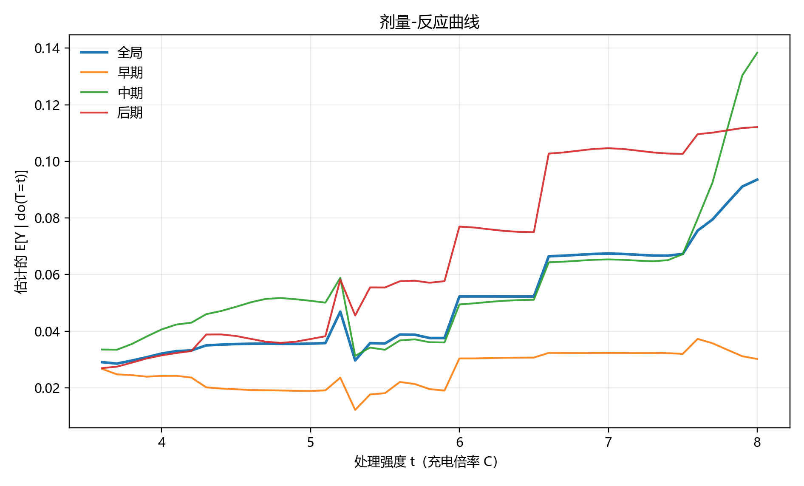
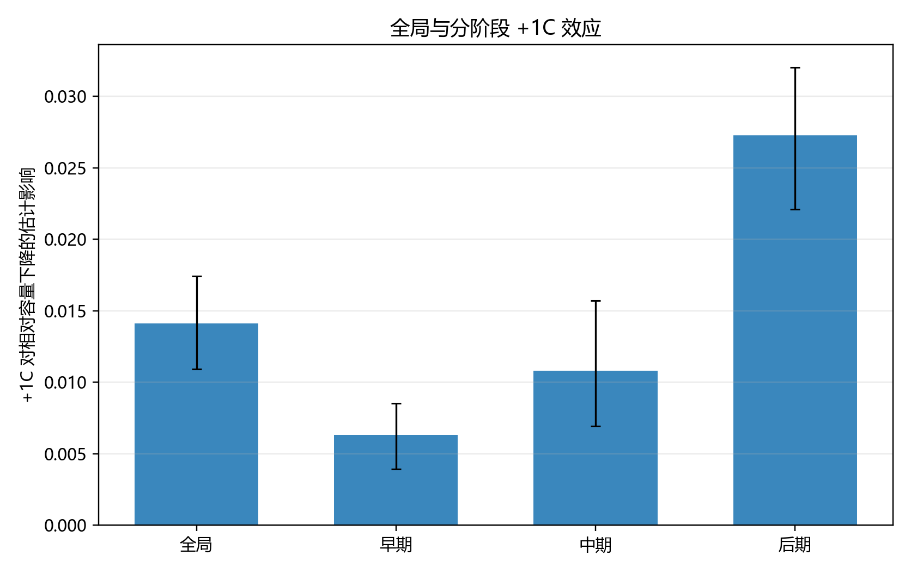
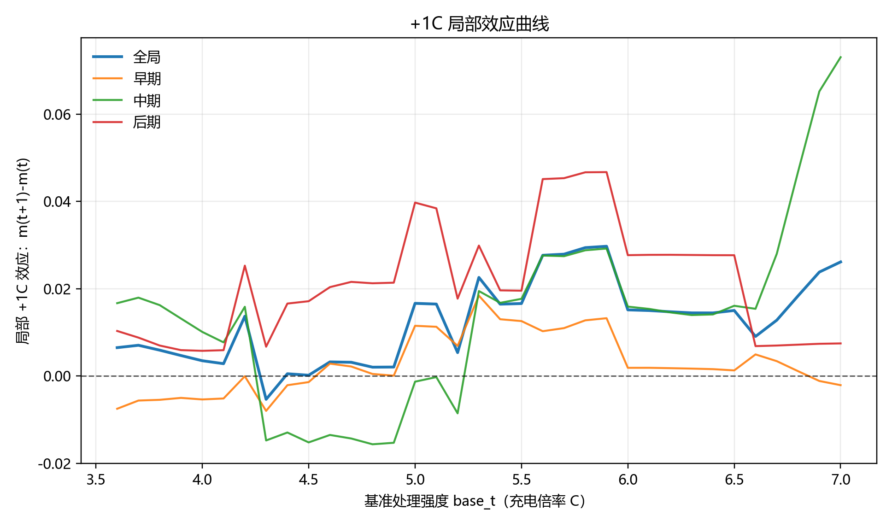
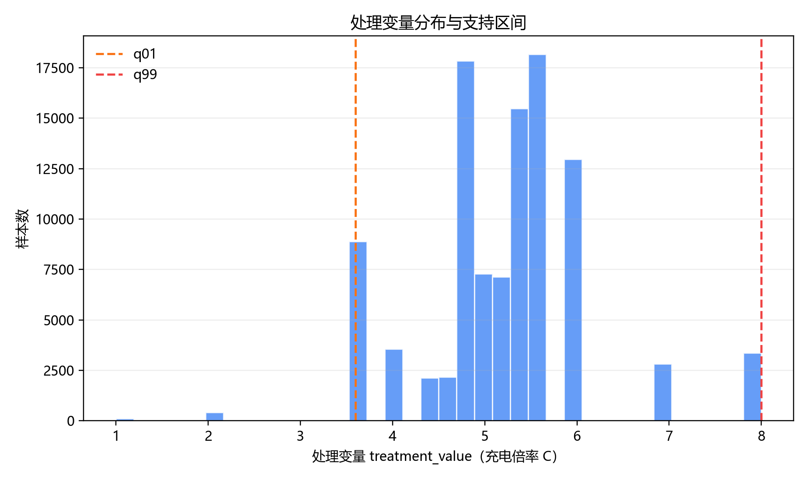
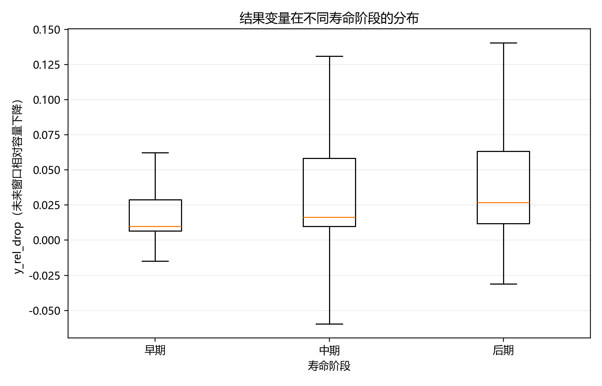
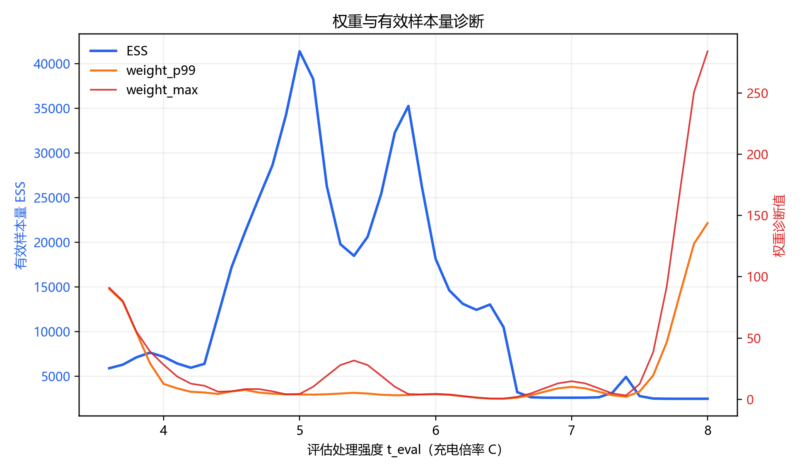

# 因果效应报告：初段充电倍率对未来相对容量下降的影响

## 1. 分析设定
- 运行时间：2026-03-27 17:00:30
- Python解释器：`C:\Users\pal\.virtualenvs\colab-OixbOpvz\Scripts\python.EXE`
- 预测窗口长度（horizon_cycles）：`200`
- 处理变量定义（treatment_mode）：`initial`
- 排除策略前缀（exclude_policy_prefix）：`VARCHARGE`

## 2. 主要结论
- 全局 +1C 效应：**0.014137** （95%置信区间：0.010914 ~ 0.017428)

## 3. 分寿命阶段 +1C 效应
| 分组 | effect_plus_1c | ci_low | ci_high | n_rows | n_clusters | bootstrap_success |
|---|---:|---:|---:|---:|---:|---:|
| 全局 | 0.014137 | 0.010914 | 0.017428 | 102449 | 180 | 400 |
| 早期 | 0.006327 | 0.003938 | 0.008519 | 34150 | 180 | 400 |
| 中期 | 0.010797 | 0.006928 | 0.015722 | 34149 | 177 | 400 |
| 后期 | 0.027261 | 0.022107 | 0.032012 | 34150 | 95 | 400 |

## 4. 关键诊断指标
- n_rows: `102449`
- n_policy_cell: `180`
- treatment_min: `1.0`
- treatment_max: `8.0`
- bandwidth: `0.2`

## 5. 图表解读
### 图1：剂量-反应曲线

- X轴含义：处理强度 `t_eval`（充电倍率 C）。
- Y轴含义：`E[Y | do(T=t)]`，即在干预到倍率 t 时的未来窗口相对容量下降期望。
- 关键性结论：全局曲线范围约 `0.02857 ~ 0.09357`，说明不同倍率下损失水平存在系统差异。
- 业务解释：这张图回答“把倍率设为某个具体值时，预期衰减水平是多少”。

### 图2：全局与分阶段 +1C 效应

- X轴含义：分组（全局、早期、中期、后期）。
- Y轴含义：`+1C` 对未来相对容量下降的增量影响。
- 关键性结论：后期效应最大（`0.027261`），高于早期阶段。
- 业务解释：同样增加 1C，在寿命后段带来的额外损失更明显。

### 图3：+1C 局部效应曲线

- X轴含义：基准处理强度 `base_t`（当前倍率）。
- Y轴含义：`m(t+1)-m(t)`，即在该基准倍率处再提高 1C 的局部影响。
- 关键性结论：全局局部效应均值约 `0.012517`，区间约 `-0.005331 ~ 0.029721`。
- 业务解释：这张图回答“在不同当前倍率下，再加 1C 的边际代价是否一致”。

### 图4：处理变量分布与支持区间

- X轴含义：处理变量 `treatment_value`（充电倍率 C）。
- Y轴含义：样本数（直方图频数）。
- 关键性结论：主要样本支持区间集中在 `q01=3.600` 到 `q99=8.000`。
- 业务解释：结论应优先解释在该支持区间内，避免超出样本支撑范围外推。

### 图5：结果变量分阶段分布

- X轴含义：寿命阶段（早期、中期、后期）。
- Y轴含义：`y_rel_drop`，即未来窗口相对容量下降。
- 关键性结论：后期均值相对早期上升约 `0.021801`。
- 业务解释：样本本身在后段衰减更快，是解释阶段异质效应的重要背景。

### 图6：权重与有效样本量诊断

- X轴含义：评估处理强度 `t_eval`（充电倍率 C）。
- Y轴含义：左轴为 ESS（有效样本量），右轴为高分位权重诊断（`weight_p99`、`weight_max`）。
- 关键性结论：最小 ESS 约 `2468.93`（出现在 t≈8.00），最大 p99 权重约 `143.85`。
- 业务解释：ESS 过低或高分位权重过大时，局部估计的不确定性会增加。

## 6. 参数来源详解
- 摘要说明：下表给出报告中关键参数的来源、字段与计算规则。
- 完整追溯文件：`report_parameter_sources.csv`。

| parameter_name | section | source_file | source_columns | formula_or_rule | notes |
|---|---|---|---|---|---|
| run_time | 分析设定 | 运行时系统时钟 | N/A | datetime.now() | 报告生成时间，不来自数据表。 |
| python_executable | 分析设定 | 运行时环境 | N/A | sys.executable | 用于复现解释器路径。 |
| python_version | 分析设定 | 运行时环境 | N/A | sys.version.split()[0] | 用于复现 Python 主版本。 |
| horizon_cycles | 分析设定 | 命令行参数 | --horizon-cycles | window_end_cycle = window_start_cycle + horizon_cycles | 本次默认 200，但输出命名不显式包含 200。 |
| treatment_mode | 分析设定 | 命令行参数 | --treatment-mode | initial 或 effective_mean | 本次默认 initial。 |
| exclude_policy_prefix | 分析设定 | 命令行参数 | --exclude-policy-prefix | policy.startswith(prefix) 的样本被排除 | 本次默认排除 VARCHARGE。 |
| treatment_value | 处理变量 | data/processed/policy_meaning.csv | initial_c_rate, switch_soc_percent, post_switch_c_rate | initial 模式: treatment_value=initial_c_rate; effective_mean 模式: C1*SOC + C2*(1-SOC) | 按 policy 级定义后并入窗口样本。 |
| y_rel_drop | 结果变量 | data/processed/life_performance.csv | q_discharge, cycles | y_rel_drop=(Q_t - Q_{t+h}) / Q_t | Q_t 与 Q_{t+h} 由窗口连接得到。 |
| life_stage | 分阶段定义 | analysis_dataset_windows.csv(中间表) | window_start_cycle | 按 window_start_cycle 排名后 qcut 三分位: early/mid/late | 用于分阶段效应估计。 |
| effect_plus_1c | 主效应与分阶段效应 | delta_plus_1c_curve.csv(中间结果) | delta_global, delta_early, delta_mid, delta_late, weight_* | effect=Σ weight(t)*[m(t+1)-m(t)] | 全局与分阶段分别加权汇总。 |
| ci_low / ci_high | 主效应与分阶段效应 | analysis_dataset_windows.csv(中间表) | cluster_id | 按 cluster_id 进行 bootstrap，取 2.5% 与 97.5% 分位 | bootstrap 次数由 --n-bootstrap 控制。 |
| n_rows | 样本规模 | analysis_dataset_windows.csv | 全部行 | n_rows=len(df) | 滚动窗口样本行数。 |
| n_policy / n_cell / n_policy_cell | 样本规模 | analysis_dataset_windows.csv | policy, cell_code, cluster_id | nunique 统计 | policy_cell 由 policy\|cell_code 组成。 |
| treatment_min / treatment_max / treatment_q01 / treatment_q99 / treatment_std | 处理变量诊断 | analysis_dataset_windows.csv | treatment_value | min/max/quantile/std | 用于支持区间与分布诊断。 |
| grid_base_min / grid_base_max / grid_base_points / grid_eval_points | 估计网格 | 模型配置 + treatment_value | --grid-step, --trim-quantile, treatment_value | build_grids() 生成 base_grid 和 eval_grid | base_grid 用于 m(t+1)-m(t) 计算。 |
| bandwidth | 核平滑设置 | analysis_dataset_windows.csv | treatment_value | max(1.06*std*n^(-1/5),0.2) | 用于 kernel/GPS 权重。 |
| treatment_residual_std | GPS 建模 | analysis_dataset_windows.csv | treatment_value, switch_soc_percent, post_switch_c_rate, window_start_cycle | LinearRegression 残差标准差 | GPS 密度按高斯残差近似。 |
| weight_mean / weight_std / weight_p95 / weight_p99 / weight_max / effective_sample_size / clip_threshold | 权重诊断 | diagnostics_weights.csv | 各权重统计列 | 按每个 t_eval 对 raw_w=kernel/gps 统计并裁剪 | 用于判断重叠性和稳定性。 |
| n_bootstrap | 复现命令参数 | 命令行参数 | --n-bootstrap | bootstrap 重采样次数 | 本次默认 400。 |
| grid_step / trim_quantile / weight_clip_quantile / seed / encoding | 复现命令参数 | 命令行参数 | --grid-step, --trim-quantile, --weight-clip-quantile, --seed, --encoding | 直接控制网格、裁剪、随机种子与读写编码 | 保证复现可控。 |

## 7. 复现命令
```bash
pipenv run python scripts/estimate_causal_initial_rate_effect.py --treatment-mode initial --exclude-policy-prefix VARCHARGE
```

## 8. 说明
- 本报告估计的是在当前调整变量条件下的“总效应”。
- 输出目录与文件命名未显式使用 200。