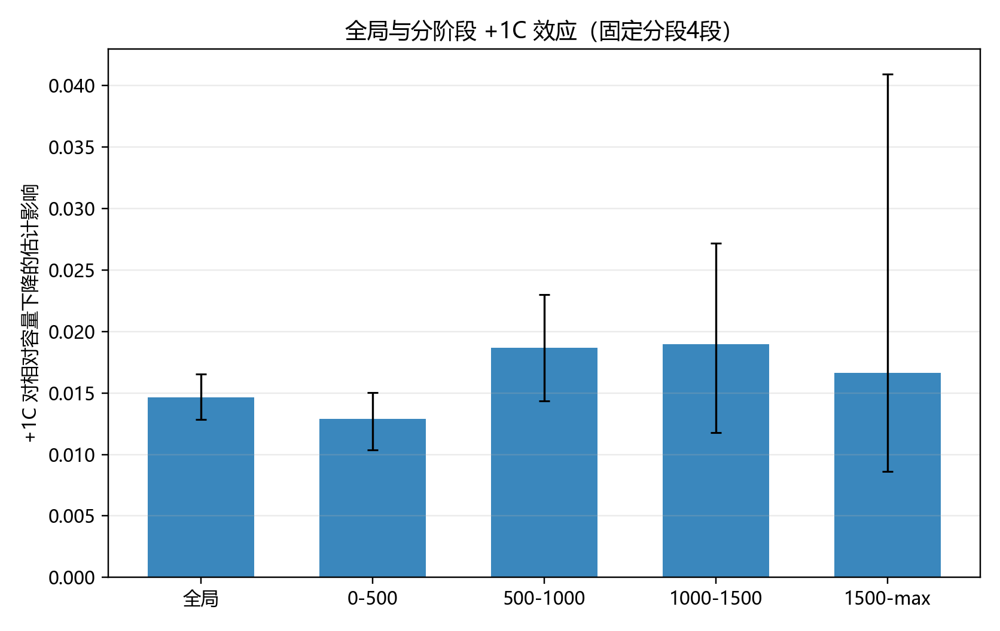
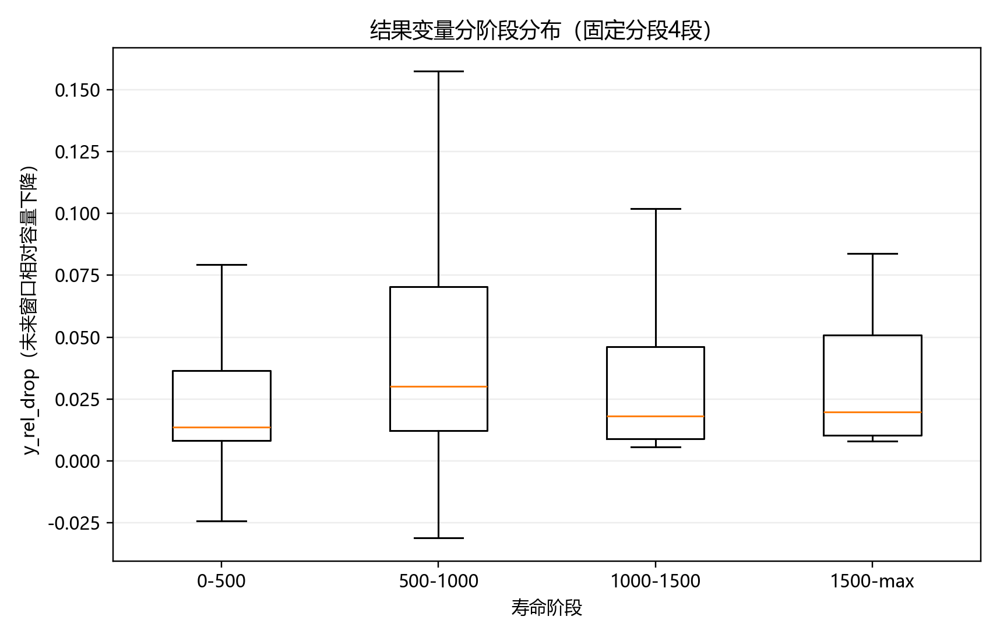
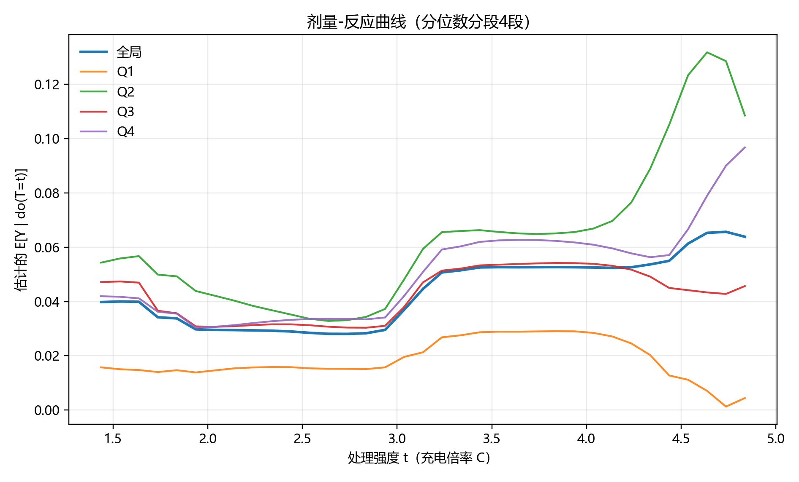
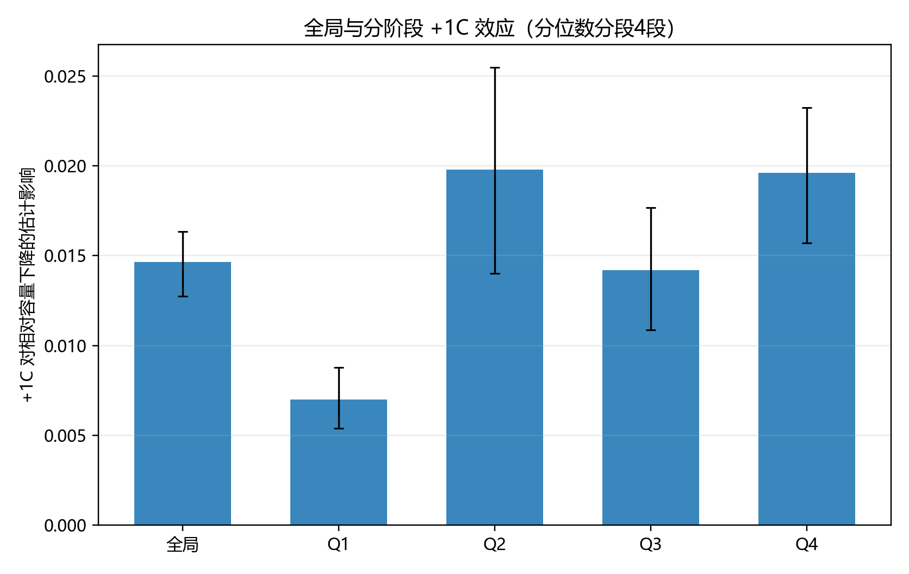
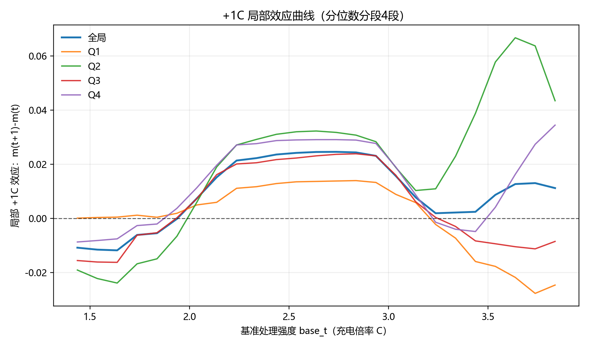
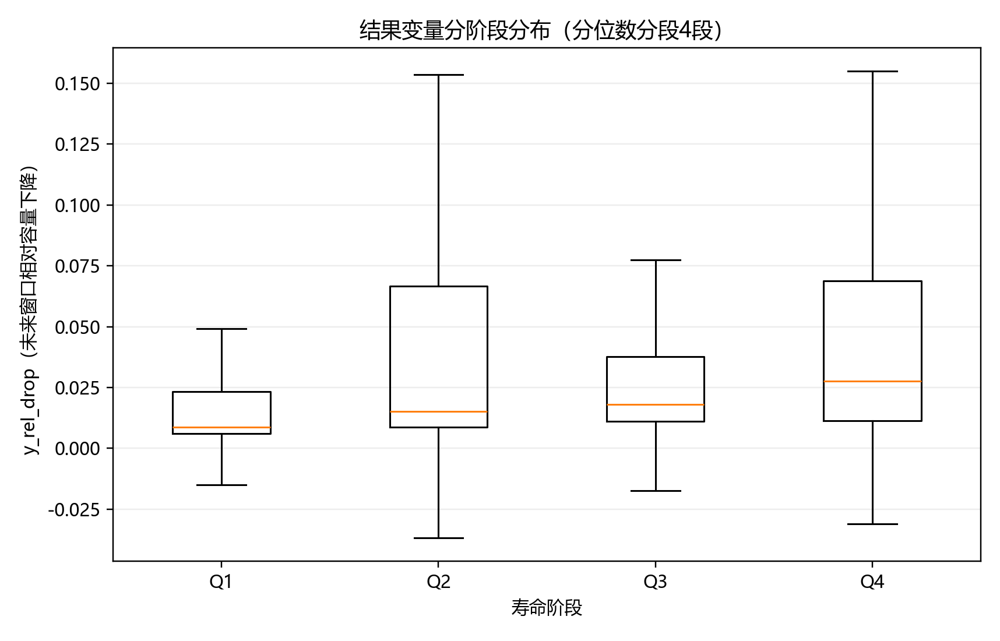
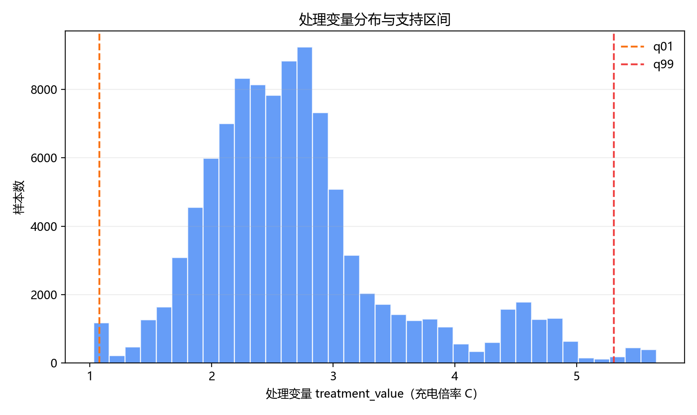
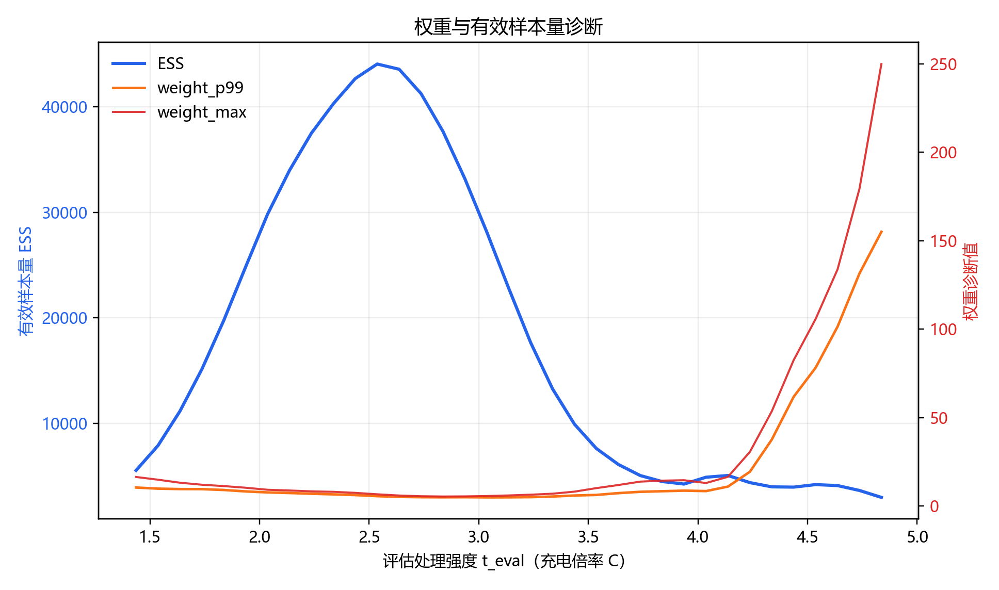
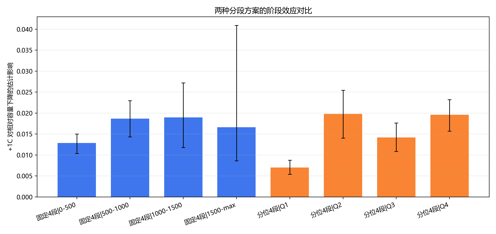

# 因果效应报告：窗口真实平均充电倍率对未来相对容量下降的影响

## 1. 分析设定
- 运行时间：2026-03-28 16:13:52
- Python解释器：`C:\Users\pal\.virtualenvs\colab-OixbOpvz\Scripts\python.EXE`
- 预测窗口长度（horizon_cycles）：`200`
- 处理变量定义（treatment_mode）：窗口真实平均充电倍率（window_mean）
- 排除策略前缀（exclude_policy_prefix）：`VARCHARGE`

## 2. 主要结论
- 全局 +1C 效应：**0.014658** （95%置信区间：0.012841 ~ 0.016559)

## 3. 分段方案并行结果
### 3.1 固定分段4段（0-500 / 500-1000 / 1000-1500 / 1500-max）
| 分组 | effect_plus_1c | ci_low | ci_high | n_rows | n_clusters | bootstrap_success |
|---|---:|---:|---:|---:|---:|---:|
| 0-500 | 0.012871 | 0.010386 | 0.015030 | 72096 | 180 | 400 |
| 500-1000 | 0.018666 | 0.014331 | 0.022979 | 24133 | 92 | 400 |
| 1000-1500 | 0.018978 | 0.011771 | 0.027194 | 3924 | 14 | 400 |
| 1500-max | 0.016636 | 0.008633 | 0.040916 | 1496 | 5 | 400 |

### 3.2 分位数分段4段（Q1 / Q2 / Q3 / Q4）
| 分组 | effect_plus_1c | ci_low | ci_high | n_rows | n_clusters | bootstrap_success |
|---|---:|---:|---:|---:|---:|---:|
| Q1 | 0.007000 | 0.005396 | 0.008793 | 25413 | 180 | 400 |
| Q2 | 0.019802 | 0.014028 | 0.025470 | 25412 | 178 | 400 |
| Q3 | 0.014188 | 0.010868 | 0.017666 | 25412 | 140 | 400 |
| Q4 | 0.019611 | 0.015711 | 0.023229 | 25412 | 83 | 400 |

### 3.3 分段方案对比摘要（详见图11）
- 固定分段强调工程阈值可解释性，分位数分段强调统计稳健性。
- 对比可视化与图表解读见“图11：固定分段与分位数分段阶段效应对比”。

### 3.4 两方案样本量对比
| scheme | 分组 | n_rows | n_clusters | start_cycle_min | start_cycle_max |
|---|---|---:|---:|---:|---:|
| 固定分段4段 | 0-500 | 72096 | 180 | 1 | 499 |
| 固定分段4段 | 500-1000 | 24133 | 92 | 500 | 999 |
| 固定分段4段 | 1000-1500 | 3924 | 14 | 1000 | 1499 |
| 固定分段4段 | 1500-max | 1496 | 5 | 1500 | 2037 |
| 分位数分段4段 | Q1 | 25413 | 180 | 1 | 143 |
| 分位数分段4段 | Q2 | 25412 | 178 | 143 | 295 |
| 分位数分段4段 | Q3 | 25412 | 140 | 295 | 548 |
| 分位数分段4段 | Q4 | 25412 | 83 | 548 | 2037 |

### 3.5 两方案量化对比结论
- 阶段效应方向一致性：固定分段正向阶段 `4/4`，分位数分段正向阶段 `4/4`，跨方案一致性约 `100.00%`（全部正向）。
- 首末阶段效应差：固定分段 `1500-max - 0-500 = 0.003766`；分位数分段 `Q4 - Q1 = 0.012611`。
- 不确定性对比（CI宽度）：固定分段均值 `0.015249`、最大 `0.032283`；分位数分段均值 `0.007289`、最大 `0.011442`。
- 样本均衡性（n_rows离散度）：固定分段 CV=`1.1156`、max/min=`48.19`；分位数分段 CV=`0.0000`、max/min=`1.00`。

## 4. 关键诊断指标
- n_rows: `101649`
- n_policy_cell: `180`
- treatment_min: `1.0296835890160763`
- treatment_max: `5.656836776246979`
- bandwidth: `0.2`

## 5. 图表解读
### 5.1 固定分段4段（4张）
#### 图1：剂量-反应曲线（固定分段4段）

- X轴含义：处理强度 `t_eval`（充电倍率 C）。
- Y轴含义：`E[Y | do(T=t)]`，即在干预到倍率 t 时的未来窗口相对容量下降期望。
- 关键性结论：固定分段全局曲线范围约 `0.02806 ~ 0.06567`，说明不同倍率下损失水平存在系统差异。
- 业务解释：这张图回答“把倍率设为某个具体值时，预期衰减水平是多少”。

#### 图2：全局与分阶段 +1C 效应（固定分段4段）

- X轴含义：分组（全局、0-500、500-1000、1000-1500、1500-max）。
- Y轴含义：`+1C` 对未来相对容量下降的增量影响。
- 关键性结论：固定分段后段效应（1500-max）约 `0.016636`。
- 业务解释：同样增加 1C，在寿命后段带来的额外损失更明显。

#### 图3：+1C 局部效应曲线（固定分段4段）

- X轴含义：基准处理强度 `base_t`（当前倍率）。
- Y轴含义：`m(t+1)-m(t)`，即在该基准倍率处再提高 1C 的局部影响。
- 关键性结论：固定分段下，全局局部效应均值约 `0.009601`，区间约 `-0.011806 ~ 0.024579`。
- 业务解释：这张图回答“在不同当前倍率下，再加 1C 的边际代价是否一致”。

#### 图4：结果变量分阶段分布（固定分段4段）

- X轴含义：寿命阶段（固定分段4段）。
- Y轴含义：`y_rel_drop`，即未来窗口相对容量下降。
- 关键性结论：固定分段下，1500-max 阶段均值相对 0-500 阶段变化 `0.000302`。
- 业务解释：该图给出阶段基线差异，是解释异质效应的背景信息。

### 5.2 分位数分段4段（4张）
#### 图5：剂量-反应曲线（分位数分段4段）

- X轴含义：处理强度 `t_eval`（充电倍率 C）。
- Y轴含义：`E[Y | do(T=t)]`，即在干预到倍率 t 时的未来窗口相对容量下降期望。
- 关键性结论：分位数分段全局曲线范围约 `0.02806 ~ 0.06567`。
- 业务解释：用于在样本更均衡分段下复核倍率干预的整体趋势。

#### 图6：全局与分阶段 +1C 效应（分位数分段4段）

- X轴含义：分组（全局、Q1、Q2、Q3、Q4）。
- Y轴含义：`+1C` 对未来相对容量下降的增量影响。
- 关键性结论：分位数分段后段效应（Q4）约 `0.019611`。
- 业务解释：在样本量更均衡的阶段定义下，后段仍表现出更高边际损失。

#### 图7：+1C 局部效应曲线（分位数分段4段）

- X轴含义：基准处理强度 `base_t`（当前倍率）。
- Y轴含义：`m(t+1)-m(t)`，即在该基准倍率处再提高 1C 的局部影响。
- 关键性结论：分位数分段下，全局局部效应均值约 `0.009601`，区间约 `-0.011806 ~ 0.024579`。
- 业务解释：用于检验在分位数分段口径下，边际代价曲线是否与固定分段一致。

#### 图8：结果变量分阶段分布（分位数分段4段）

- X轴含义：寿命阶段（分位数分段4段，Q1~Q4）。
- Y轴含义：`y_rel_drop`，即未来窗口相对容量下降。
- 关键性结论：分位数分段下，Q4 阶段均值相对 Q1 阶段变化 `0.027107`。
- 业务解释：在等样本量切分下比较衰减分布，减少样本不均衡干扰。

### 5.3 通用诊断图（2张）
#### 图9：处理变量分布与支持区间

- X轴含义：处理变量 `treatment_value`（充电倍率 C）。
- Y轴含义：样本数（直方图频数）。
- 关键性结论：主要样本支持区间集中在 `q01=1.077` 到 `q99=5.305`。
- 业务解释：结论应优先解释在该支持区间内，避免超出样本支撑范围外推。

#### 图10：权重与有效样本量诊断

- X轴含义：评估处理强度 `t_eval`（充电倍率 C）。
- Y轴含义：左轴为 ESS（有效样本量），右轴为高分位权重诊断（`weight_p99`、`weight_max`）。
- 关键性结论：最小 ESS 约 `3004.55`（出现在 t≈4.84），最大 p99 权重约 `155.07`。
- 业务解释：ESS 过低或高分位权重过大时，局部估计的不确定性会增加。

### 5.4 方案对比图（1张）
#### 图11：固定分段与分位数分段阶段效应对比

- X轴含义：`scheme × stage` 组合分组（固定4段与分位数4段）。
- Y轴含义：各阶段 `+1C` 对未来相对容量下降的估计影响（含置信区间）。
- 关键性结论：固定分段首末差 `0.003766`、分位数分段首末差 `0.012611`，且分位数分段 CI 宽度均值更小（`0.007289` vs `0.015249`）。
- 业务解释：两方案方向结论一致时，固定分段强调工程阈值可解释性，分位数分段强调统计稳健性。

## 6. 参数来源详解
- 摘要说明：下表给出报告中关键参数的来源、字段与计算规则。
- 完整追溯文件：`report_parameter_sources.csv`。

| parameter_name | section | source_file | source_columns | formula_or_rule | notes |
|---|---|---|---|---|---|
| run_time | 分析设定 | 运行时系统时钟 | N/A | datetime.now() | 报告生成时间，不来自数据表。 |
| python_executable | 分析设定 | 运行时环境 | N/A | sys.executable | 用于复现解释器路径。 |
| python_version | 分析设定 | 运行时环境 | N/A | sys.version.split()[0] | 用于复现 Python 主版本。 |
| horizon_cycles | 分析设定 | 命令行参数 | --horizon-cycles | window_end_cycle = window_start_cycle + horizon_cycles | 本次默认 200，但输出命名不显式包含 200。 |
| treatment_mode | 分析设定 | 命令行参数 | --treatment-mode | initial / effective_mean / window_mean | window_mean 为窗口真实平均充电倍率口径。 |
| exclude_policy_prefix | 分析设定 | 命令行参数 | --exclude-policy-prefix | policy.startswith(prefix) 的样本被排除 | 本次默认排除 VARCHARGE。 |
| treatment_value | 处理变量 | data/processed/policy_meaning.csv + data/processed/charge_interval_features.csv + data/processed/life_performance.csv | initial_c_rate, switch_soc_percent, post_switch_c_rate, delta_ah, charge_duration_s, q_discharge | initial: initial_c_rate; effective_mean: C1*SOC + C2*(1-SOC); window_mean: (Σdelta_ah/Σduration_h)/q_ref | window_mean 中 q_ref 取每 policy+cell 前 N 个有效循环 q_discharge 中位数，并按分位数裁剪后用于建模。 |
| y_rel_drop | 结果变量 | data/processed/life_performance.csv | q_discharge, cycles | y_rel_drop=(Q_t - Q_{t+h}) / Q_t | Q_t 与 Q_{t+h} 由窗口连接得到。 |
| life_stage | 分阶段定义 | analysis_dataset_windows.csv(中间表) | window_start_cycle | 并行双方案：fixed4=[0,500)/[500,1000)/[1000,1500)/[1500,+∞)；quantile4=rank(window_start_cycle)后qcut(4) | 固定4段与分位数4段并行估计，用于敏感性对比。 |
| effect_plus_1c | 主效应与分阶段效应 | delta_plus_1c_curve.csv(中间结果) | delta_global, delta_<stage>, weight_global, weight_<stage> | effect=Σ weight(t)*[m(t+1)-m(t)] | 全局与分阶段分别加权汇总。 |
| ci_low / ci_high | 主效应与分阶段效应 | analysis_dataset_windows.csv(中间表) | cluster_id | 按 cluster_id 进行 bootstrap，取 2.5% 与 97.5% 分位 | bootstrap 次数由 --n-bootstrap 控制。 |
| n_rows | 样本规模 | analysis_dataset_windows.csv | 全部行 | n_rows=len(df) | 滚动窗口样本行数。 |
| n_policy / n_cell / n_policy_cell | 样本规模 | analysis_dataset_windows.csv | policy, cell_code, cluster_id | nunique 统计 | policy_cell 由 policy\|cell_code 组成。 |
| treatment_min / treatment_max / treatment_q01 / treatment_q99 / treatment_std | 处理变量诊断 | analysis_dataset_windows.csv | treatment_value | min/max/quantile/std | 用于支持区间与分布诊断。 |
| grid_base_min / grid_base_max / grid_base_points / grid_eval_points | 估计网格 | 模型配置 + treatment_value | --grid-step, --trim-quantile, treatment_value | build_grids() 生成 base_grid 和 eval_grid | base_grid 用于 m(t+1)-m(t) 计算。 |
| bandwidth | 核平滑设置 | analysis_dataset_windows.csv | treatment_value | max(1.06*std*n^(-1/5),0.2) | 用于 kernel/GPS 权重。 |
| treatment_residual_std | GPS 建模 | analysis_dataset_windows.csv | treatment_value, switch_soc_percent, post_switch_c_rate, window_start_cycle | LinearRegression 残差标准差 | GPS 密度按高斯残差近似。 |
| weight_mean / weight_std / weight_p95 / weight_p99 / weight_max / effective_sample_size / clip_threshold | 权重诊断 | diagnostics_weights.csv | 各权重统计列 | 按每个 t_eval 对 raw_w=kernel/gps 统计并裁剪 | 用于判断重叠性和稳定性。 |
| n_bootstrap | 复现命令参数 | 命令行参数 | --n-bootstrap | bootstrap 重采样次数 | 本次默认 400。 |
| grid_step / trim_quantile / weight_clip_quantile / seed / encoding | 复现命令参数 | 命令行参数 | --grid-step, --trim-quantile, --weight-clip-quantile, --seed, --encoding | 直接控制网格、裁剪、随机种子与读写编码 | 保证复现可控。 |

## 7. 复现命令
```bash
pipenv run python scripts/estimate_causal_initial_rate_effect.py --treatment-mode window_mean --exclude-policy-prefix VARCHARGE
```

## 8. 说明
- 本报告估计的是在当前调整变量条件下的“总效应”。
- 分段方案并行输出用于敏感性分析：固定分段偏工程可解释，分位数分段偏统计稳健。
- 输出目录与文件命名未显式使用 200。