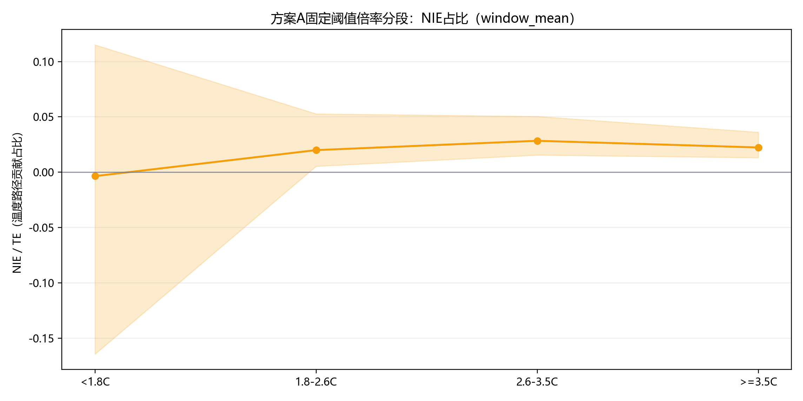
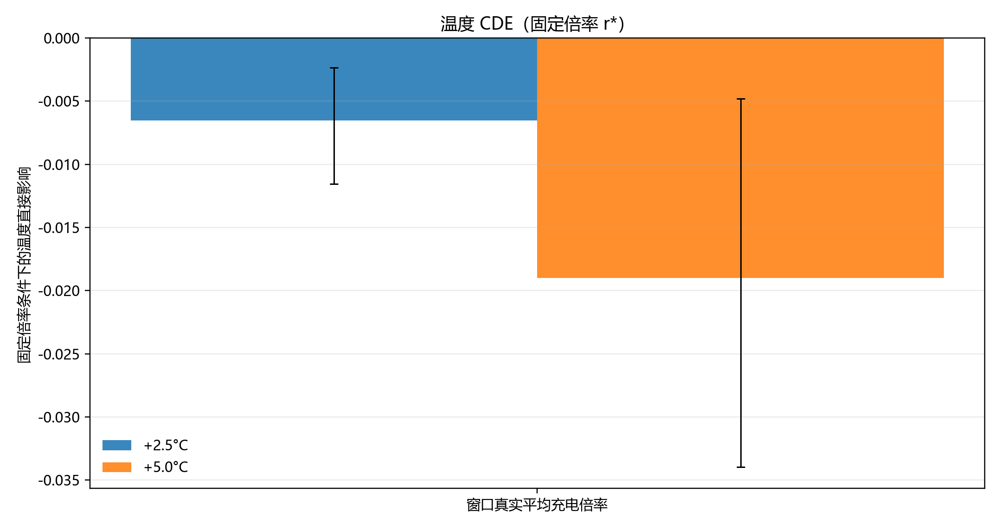
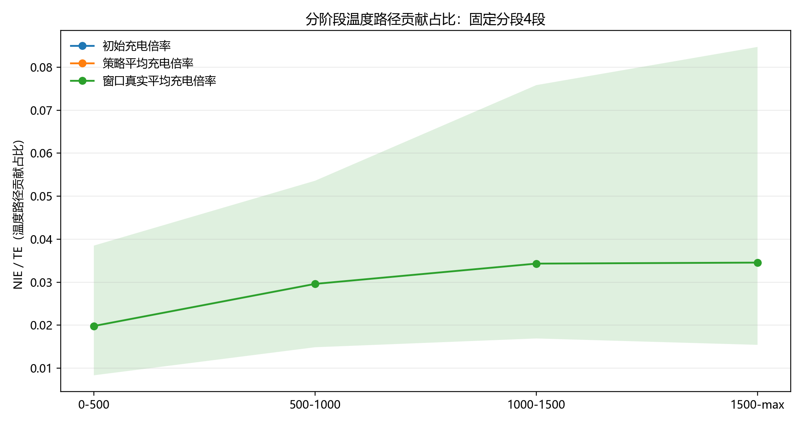
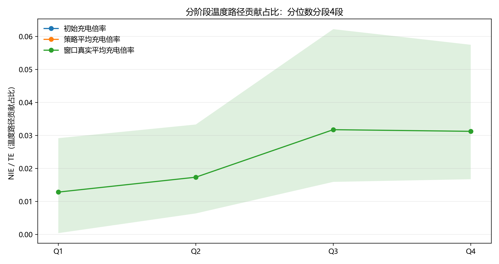
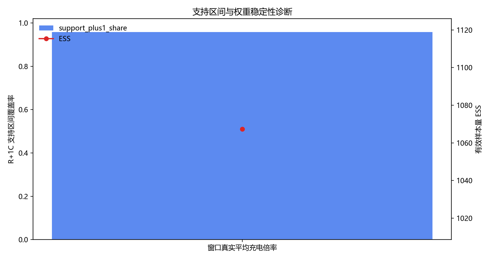

# 因果路径分解报告：固定阈值倍率分段（方案A）

## 1. 分析设定
- 运行时间：2026-03-30 16:43:00
- Python解释器：`C:\Users\pal\.virtualenvs\colab-OixbOpvz\Scripts\python.EXE`
- 结果定义：`Y=(Q_t-Q_(t+H))/Q_t`，其中 `H=200`
- 主口径：`window_mean`（窗口真实平均充电倍率）。
- 路径分解：`TE = NDE + NIE`。
- 中介时序：`R_t -> T_(t+1) -> Y_(t+H)`。
- 温度定义：单次充电循环平均温度，按 `charge_duration_s` 对 `avg_temper` 加权聚合。
- 温度过滤：`[0.0, 70.0]`；建模裁剪：`q01~q99`。
- 方案A固定倍率分段：`<1.8C`、`1.8-2.6C`、`2.6-3.5C`、`>=3.5C`。
- 温度直接效应 CDE：`+2.5°C`、`+5.0°C`。

## 2. 执行摘要（window_mean + 方案A）
- `TE`: 0.008528（95%CI: 0.006106, 0.010866）
- `NDE`: 0.008330（95%CI: 0.005863, 0.010662）
- `NIE`: 0.000198（95%CI: 0.000104, 0.000298）
- 温度中介贡献占比：`NIE/TE=0.0232`；`|NIE|路径占比=0.0232`。
- 温度直接效应（固定倍率）：`+2.5°C` 为 -0.006526（95%CI: -0.011554, -0.002345）；`+5.0°C` 为 -0.018988（95%CI: -0.033961, -0.004812）。
- 路径主导类型：**直接路径主导**。
- 判读规则：95%CI 跨 0 表示方向不稳定，不跨 0 表示方向更稳定。

## 3. 方案A固定倍率分段主结果
| rate_bin_label | te_r | te_r_ci_low | te_r_ci_high | nde_r | nde_r_ci_low | nde_r_ci_high | nie_r | nie_r_ci_low | nie_r_ci_high | nie_share | closure_error | n_rows | n_clusters |
| --- | --- | --- | --- | --- | --- | --- | --- | --- | --- | --- | --- | --- | --- |
| <1.8C | 0.002629 | -0.001669 | 0.007071 | 0.002639 | -0.001644 | 0.007023 | -0.000009 | -0.000106 | 0.000093 | -0.003570 | 0.000000 | 7911.000000 | 152.000000 |
| 1.8-2.6C | 0.006014 | 0.003303 | 0.008632 | 0.005894 | 0.003228 | 0.008459 | 0.000120 | 0.000034 | 0.000213 | 0.019933 | -0.000000 | 43868.000000 | 172.000000 |
| 2.6-3.5C | 0.008903 | 0.006334 | 0.011070 | 0.008650 | 0.006084 | 0.010854 | 0.000253 | 0.000133 | 0.000373 | 0.028370 | 0.000000 | 36111.000000 | 172.000000 |
| >=3.5C | 0.018588 | 0.012667 | 0.024336 | 0.018173 | 0.012214 | 0.023896 | 0.000415 | 0.000226 | 0.000620 | 0.022336 | -0.000000 | 14252.000000 | 167.000000 |

- X轴含义：固定阈值倍率分段（方案A）。
- Y轴含义：`TE/NDE/NIE` 对未来相对容量下降的边际影响。
- 关键性结论：直接展示不同倍率区间的总效应、直接效应与温度中介效应。
- 业务解释：用于设定分倍率区间的差异化控温与控倍率策略。

- X轴含义：固定阈值倍率分段（方案A）。
- Y轴含义：`NIE/TE`（温度路径贡献占比）。
- 关键性结论：定位温度路径在不同倍率区间中的相对重要性。
- 业务解释：若高倍率段 `NIE/TE` 更高，说明高倍率区更需优先强化热管理。

## 4. 全局对照与贡献摘要
| treatment_mode | te_r | te_r_ci_low | te_r_ci_high | nde_r | nde_r_ci_low | nde_r_ci_high | nie_r | nie_r_ci_low | nie_r_ci_high | nie_share | closure_error | cde_temp_plus_2p5 | cde_temp_plus_2p5_ci_low | cde_temp_plus_2p5_ci_high | cde_temp_plus_5p0 | cde_temp_plus_5p0_ci_low | cde_temp_plus_5p0_ci_high |
| --- | --- | --- | --- | --- | --- | --- | --- | --- | --- | --- | --- | --- | --- | --- | --- | --- | --- |
| window_mean | 0.008528 | 0.006106 | 0.010866 | 0.008330 | 0.005863 | 0.010662 | 0.000198 | 0.000104 | 0.000298 | 0.023217 | 0.000000 | -0.006526 | -0.011554 | -0.002345 | -0.018988 | -0.033961 | -0.004812 |

| treatment_mode | te_r | nde_r | nie_r | nie_share_signed | abs_nde_share | abs_nie_share | te_significant | nde_significant | nie_significant | cde_temp_plus_2p5_significant | cde_temp_plus_5p0_significant | path_dominance |
| --- | --- | --- | --- | --- | --- | --- | --- | --- | --- | --- | --- | --- |
| window_mean | 0.008528 | 0.008330 | 0.000198 | 0.023217 | 0.976783 | 0.023217 | True | True | True | True | True | 直接路径主导 |

- X轴含义：倍率口径。
- Y轴含义：固定倍率条件下温度上调 `ΔT` 的容量衰减增量。
- 关键性结论：给出温度本身对衰减的直接边际贡献。
- 业务解释：可直接用于温控收益评估。

## 5. 附录：生命周期分段稳定性对照
固定分段4段：
| treatment_mode | group_label | te_r | nde_r | nie_r | nie_share | n_rows | n_clusters |
| --- | --- | --- | --- | --- | --- | --- | --- |
| window_mean | 0-500 | 0.008230 | 0.008067 | 0.000163 | 0.019806 | 72477.000000 | 180.000000 |
| window_mean | 500-1000 | 0.008906 | 0.008643 | 0.000264 | 0.029604 | 24229.000000 | 92.000000 |
| window_mean | 1000-1500 | 0.010569 | 0.010207 | 0.000363 | 0.034322 | 3940.000000 | 14.000000 |
| window_mean | 1500-max | 0.011432 | 0.011037 | 0.000395 | 0.034556 | 1496.000000 | 5.000000 |

分位数分段4段：
| treatment_mode | group_label | te_r | nde_r | nie_r | nie_share | n_rows | n_clusters |
| --- | --- | --- | --- | --- | --- | --- | --- |
| window_mean | Q1 | 0.008295 | 0.008188 | 0.000106 | 0.012838 | 25536.000000 | 180.000000 |
| window_mean | Q2 | 0.008984 | 0.008828 | 0.000156 | 0.017348 | 25535.000000 | 178.000000 |
| window_mean | Q3 | 0.007461 | 0.007224 | 0.000237 | 0.031742 | 25535.000000 | 140.000000 |
| window_mean | Q4 | 0.009372 | 0.009079 | 0.000293 | 0.031241 | 25536.000000 | 83.000000 |

- X轴含义：固定寿命阶段。
- Y轴含义：`NIE/TE`。
- 关键性结论：寿命阶段视角下温度路径贡献变化。
- 业务解释：用于验证主结论是否受分段口径影响。

- X轴含义：分位阶段（Q1~Q4）。
- Y轴含义：`NIE/TE`。
- 关键性结论：样本均衡切分下方向是否一致。
- 业务解释：与固定分段交叉验证稳健性。

## 6. 识别诊断与数据附录
| treatment_mode | support_plus1_share | effective_sample_size | weight_p99 | weight_max | treatment_q01 | treatment_q99 | mediator_q01 | mediator_q99 |
| --- | --- | --- | --- | --- | --- | --- | --- | --- |
| window_mean | 0.957970 | 1067.297008 | 381.859535 | 5480.498914 | 1.077161 | 5.277871 | 29.803554 | 39.402557 |

- X轴含义：倍率口径。
- Y轴含义：左轴 `support_plus1_share`，右轴 ESS。
- 关键性结论：判断 +1C 推断是否依赖外推。
- 业务解释：覆盖与ESS越稳，结论可信度越高。

样本与预处理诊断：
| rows_before_dropna | q_future_availability | temp_t_availability | mediator_availability | charge_temp_t_matchable_share | charge_temp_tpluslag_matchable_share | charge_temp_joint_matchable_share | charge_temp_segment_rows_clean | charge_temp_segment_rows_positive_duration | charge_temp_segment_positive_duration_share | charge_temp_cycle_rows | charge_temp_cycle_min | charge_temp_cycle_max | charge_temp_cycle_q01 | charge_temp_cycle_q99 | charge_temp_duration_sum_min | charge_temp_duration_sum_q50 | charge_temp_duration_sum_q99 | rows_after_basic_clean | charge_temp_effective_share_after_basic_clean | temp_physical_keep_share | charge_temp_effective_share_after_physical_filter | rows_final | n_clusters | temp_model_clip_low | temp_model_clip_high | temp_model_clip_low_share | temp_model_clip_high_share | temp_mediator_min | temp_mediator_max | temp_t_min | temp_t_max | cycle_t_min | cycle_t_max | window_mean_raw_min | window_mean_raw_max | window_mean_raw_q01 | window_mean_raw_q99 | window_mean_clip_low | window_mean_clip_high | window_mean_clip_low_share | window_mean_clip_high_share | window_mean_qref_cycles | treatment_mode | scenario | mode_order | scenario_order | treatment_mode_display |
| --- | --- | --- | --- | --- | --- | --- | --- | --- | --- | --- | --- | --- | --- | --- | --- | --- | --- | --- | --- | --- | --- | --- | --- | --- | --- | --- | --- | --- | --- | --- | --- | --- | --- | --- | --- | --- | --- | --- | --- | --- | --- | --- | --- | --- | --- | --- | --- |
| 138082.000000 | 0.740792 | 1.000000 | 0.994387 | 1.000000 | 0.994387 | 0.994387 | 707416.000000 | 707416.000000 | 1.000000 | 138093.000000 | -24.664210 | 88.750627 | 29.652835 | 39.488400 | 0.173700 | 1029.976200 | 2773.090420 | 102142.000000 | 0.739720 | 1.000000 | 0.739720 | 102142.000000 | 180.000000 | 29.803554 | 39.402557 | 0.010006 | 0.010006 | 24.687359 | 41.355555 | 24.687359 | 41.355555 | 1.000000 | 2037.000000 | 0.005270 | 280.755844 | 1.029684 | 5.656837 | 1.029684 | 5.656837 | 0.010001 | 0.010001 | 20.000000 | window_mean | baseline_tplus1_temp0_70 | 2 | 0 | 窗口真实平均充电倍率 |
| 138082.000000 | 0.740792 | 1.000000 | 1.000000 | 1.000000 | 1.000000 | 1.000000 | 707416.000000 | 707416.000000 | 1.000000 | 138093.000000 | -24.664210 | 88.750627 | 29.652835 | 39.488400 | 0.173700 | 1029.976200 | 2773.090420 | 102290.000000 | 0.740792 | 1.000000 | 0.740792 | 102290.000000 | 180.000000 | 29.804826 | 39.401336 | 0.010001 | 0.010001 | 24.687359 | 41.355555 | 24.687359 | 41.355555 | 1.000000 | 2037.000000 | 0.005270 | 280.755844 | 1.029684 | 5.656837 | 1.029684 | 5.656837 | 0.010001 | 0.010001 | 20.000000 | window_mean | sensitivity_t_as_mediator | 2 | 1 | 窗口真实平均充电倍率 |
| 138082.000000 | 0.740792 | 1.000000 | 0.994387 | 1.000000 | 0.994387 | 0.994387 | 707416.000000 | 707416.000000 | 1.000000 | 138093.000000 | -24.664210 | 88.750627 | 29.652835 | 39.488400 | 0.173700 | 1029.976200 | 2773.090420 | 102142.000000 | 0.739720 | 1.000000 | 0.739720 | 102142.000000 | 180.000000 | 29.803554 | 39.402557 | 0.010006 | 0.010006 | 24.687359 | 41.355555 | 24.687359 | 41.355555 | 1.000000 | 2037.000000 | 0.005270 | 280.755844 | 1.029684 | 5.656837 | 1.029684 | 5.656837 | 0.010001 | 0.010001 | 20.000000 | window_mean | sensitivity_temp_5_60 | 2 | 2 | 窗口真实平均充电倍率 |

敏感性结果：
| te_r | nde_r | nie_r | nie_share | closure_error | n_rows | n_clusters | cycle_t_min | cycle_t_max | cde_temp_plus_2p5 | cde_temp_plus_5p0 | treatment_min | treatment_max | treatment_q01 | treatment_q99 | support_plus1_share | mediator_min | mediator_max | mediator_q01 | mediator_q99 | treatment_sigma | weight_mean | weight_std | weight_p95 | weight_p99 | weight_max | weight_clip_threshold | effective_sample_size | treatment_mode | scenario | mode_order | scenario_order | treatment_mode_display |
| --- | --- | --- | --- | --- | --- | --- | --- | --- | --- | --- | --- | --- | --- | --- | --- | --- | --- | --- | --- | --- | --- | --- | --- | --- | --- | --- | --- | --- | --- | --- | --- | --- |
| 0.008334 | 0.008380 | -0.000046 | -0.005517 | 0.000000 | 102290.000000 | 180.000000 | 1.000000 | 2037.000000 | -0.017146 | -0.040353 | 1.029684 | 5.656837 | 1.076641 | 5.315914 | 0.957493 | 24.687359 | 41.355555 | 29.804826 | 39.401336 | 0.725299 | 43.830974 | 418.502121 | 21.216140 | 406.281619 | 5309.427484 | 5309.427484 | 1109.844828 | window_mean | sensitivity_t_as_mediator | 2 | 1 | 窗口真实平均充电倍率 |
| 0.008528 | 0.008330 | 0.000198 | 0.023217 | 0.000000 | 102142.000000 | 180.000000 | 1.000000 | 2037.000000 | -0.006526 | -0.018988 | 1.029684 | 5.656837 | 1.077161 | 5.277871 | 0.957970 | 24.687359 | 41.355555 | 29.803554 | 39.402557 | 0.722615 | 43.554926 | 423.853597 | 21.171725 | 381.859535 | 5480.498914 | 5480.498914 | 1067.297008 | window_mean | sensitivity_temp_5_60 | 2 | 2 | 窗口真实平均充电倍率 |

## 7. 自动结论
- 主口径 `窗口真实平均充电倍率` 下，`TE=0.008528`，`NIE/TE=0.0232`。
- 路径主导：**直接路径主导**。
- 方案A中 `TE` 最高倍率段为 **>=3.5C**，点估计 `0.018588`。
- 闭合误差最大值 `|TE-(NDE+NIE)|` 为 `0.000000`。
- 解释口径：主结论优先看方向与CI，幅值结论结合样本量与诊断联合判断。