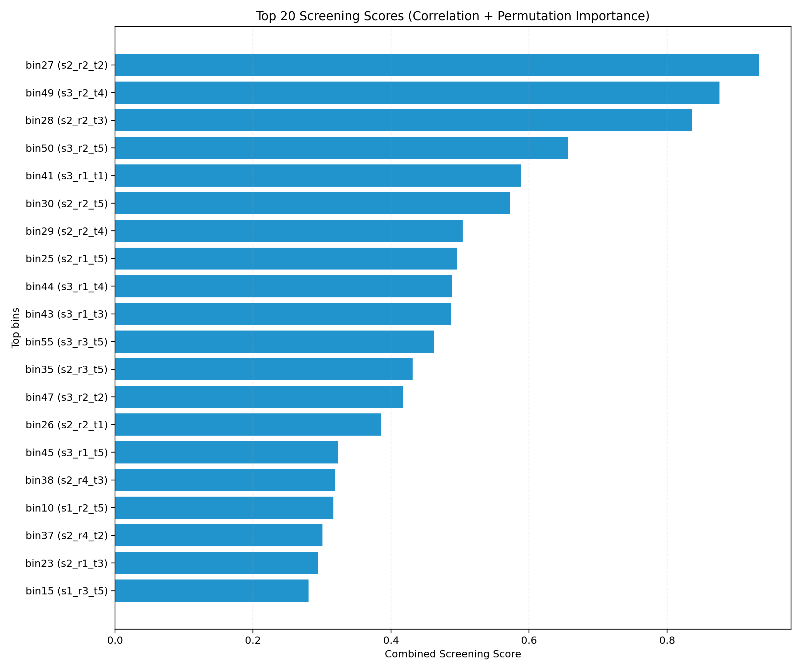
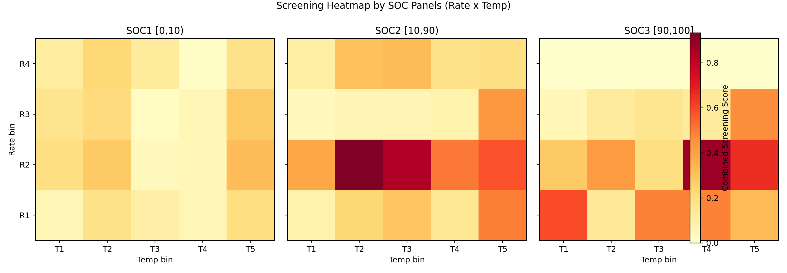
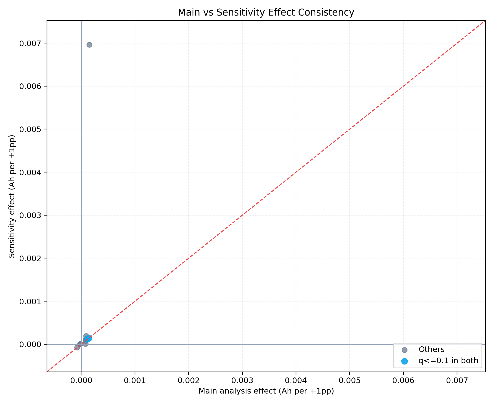

# 60区间容量衰减影响分析报告（论文式）

## 摘要
- 本研究基于 `0.3 <= q_discharge <= 1.3` 的 cycle 级样本，目标估计“将充电时间份额从其余59区间替代到目标区间”对下一循环容量 `q_discharge_(t+1)` 的因果影响。
- 在 Top10 区间主分析中，`q<=0.1` 的区间数为 `3`，其中 `q<=0.05` 为 `2`；CI跨0区间数为 `7`。
- 综合筛选得分最高区间为 `bin27 (s2_r2_t2)`，得分 `0.933018`。
- 结论定位为“策略优先级建议”，并通过受控实验方案给出可落地验证路径。

## 1. 研究问题与因果识别目标
- 研究问题：60个 `soc×rate×temp` 区间中，哪些区间时间份额变化最影响下一循环放电容量。
- 处理变量：`T_i = share_i`（第 i 区间在当前 cycle 的充电时间份额）。
- 结果变量：`Y = q_discharge_(t+1)`。
- 目标效应：将其余59区间总池中 `+1pp` 份额替代到区间 `i` 的边际影响。

## 2. 数据、样本与质量控制
- 运行时间：2026-04-07 16:42:20
- Python解释器：`C:\Users\pal\.virtualenvs\colab-OixbOpvz\Scripts\python.exe`
- 字体回退：`DejaVu Sans`
- 时序原始行数/清洗后行数：`8,433,900` / `8,433,900`。
- cycle样本数（过滤 `cycle_total_charge_h<=0` 前/后）：`140,565` / `140,565`。
- 标签过滤剔除：`<q_min`=46，`>q_max`=12，保留后 `140,565`。
- share求和校验区间：`[1.000000, 1.000000]`（目标 `[0.999,1.001]`）。
- train/valid 样本行数：`98,550` / `40,072`；group数：`135` / `48`。
- 主分析样本中异常电芯占比：`32.77%`。
- Top10 稳定性（同种子重跑重合率）：`100.00%`。

## 3. 方法与理论依据
### 3.1 两阶段分析框架
- 阶段一（筛选）：`Spearman(|corr|)` + `RF permutation importance`，归一化后取均值得到综合得分。
- 阶段二（因果）：对 Top10 区间做残差化 DML，输出 `Ah/1pp`、`Ah/5pp`、95%CI、`p`、`q`。

### 3.2 估计公式
```text
Y~ = Y - m_y(W)
T~ = T_i - m_t(W)
theta_i = Cov(Y~, T~) / Var(T~)
effect_per_1pp = 0.01 * theta_i
effect_per_5pp = 0.05 * theta_i
```
- 其中 `W` 包含：`q_t`、`cycles_t`、policy三元参数、`cycle_total_charge_h`、`nonzero_cross_bin_count_cycle`、`is_abnormal_cell`。
- 不确定性：`policy+cell` 聚类 bootstrap（500次）给95%CI；多重比较采用 BH-FDR 得到 `q-value`。

### 3.3 因果识别假设（解释边界）
- 一致性：观测到的份额替代对应同定义下的潜在结果。
- 可交换性：在给定 `W` 后，未观测混杂可忽略（强假设）。
- 重叠性：各区间份额在样本支持域内有足够变化。
- SUTVA：电芯间干预不相互影响。

## 4. 实验结果
### 4.1 Top10 区间因果估计（主文）
| rank | cross_bin | 区间标签 | effect(Ah/1pp) | 95%CI | p | q | 方向一致性(主/敏) | 证据等级 |
|---:|---:|---|---:|---:|---:|---:|---:|---|
| 1 | 27 | s2_r2_t2 | 0.000090 | [-0.000083, 0.000272] | 0.396000 | 0.440000 | 是 | 证据不足（CI跨0） |
| 2 | 49 | s3_r2_t4 | -0.000017 | [-0.000102, 0.000061] | 0.692000 | 0.692000 | 否 | 证据不足（CI跨0） |
| 3 | 28 | s2_r2_t3 | 0.000081 | [-0.000071, 0.000221] | 0.232000 | 0.394286 | 是 | 证据不足（CI跨0） |
| 4 | 50 | s3_r2_t5 | 0.000141 | [0.000060, 0.000229] | 0.000000 | 0.000000 | 是 | 强证据 |
| 5 | 41 | s3_r1_t1 | -0.000077 | [-0.000135, -0.000023] | 0.004000 | 0.020000 | 是 | 强证据 |
| 6 | 30 | s2_r2_t5 | 0.000086 | [-0.000086, 0.000264] | 0.364000 | 0.440000 | 是 | 证据不足（CI跨0） |
| 7 | 29 | s2_r2_t4 | 0.000084 | [-0.000065, 0.000261] | 0.264000 | 0.394286 | 是 | 证据不足（CI跨0） |
| 8 | 25 | s2_r1_t5 | 0.000151 | [-0.000166, 0.005967] | 0.224000 | 0.394286 | 是 | 证据不足（CI跨0） |
| 9 | 44 | s3_r1_t4 | 0.000108 | [0.000021, 0.000203] | 0.020000 | 0.066667 | 是 | 中等证据 |
| 10 | 43 | s3_r1_t3 | -0.000023 | [-0.000071, 0.000024] | 0.276000 | 0.394286 | 否 | 证据不足（CI跨0） |

### 4.2 CI跨0区间的标准化解释
- `bin27 (s2_r2_t2)`：95%CI 跨0，解释为“当前证据不足以确认方向”，并非“确定无效应”；建议进入后续受控实验优先级清单。
- `bin49 (s3_r2_t4)`：95%CI 跨0，解释为“当前证据不足以确认方向”，并非“确定无效应”；建议进入后续受控实验优先级清单。
- `bin28 (s2_r2_t3)`：95%CI 跨0，解释为“当前证据不足以确认方向”，并非“确定无效应”；建议进入后续受控实验优先级清单。
- `bin30 (s2_r2_t5)`：95%CI 跨0，解释为“当前证据不足以确认方向”，并非“确定无效应”；建议进入后续受控实验优先级清单。
- `bin29 (s2_r2_t4)`：95%CI 跨0，解释为“当前证据不足以确认方向”，并非“确定无效应”；建议进入后续受控实验优先级清单。
- `bin25 (s2_r1_t5)`：95%CI 跨0，解释为“当前证据不足以确认方向”，并非“确定无效应”；建议进入后续受控实验优先级清单。
- `bin43 (s3_r1_t3)`：95%CI 跨0，解释为“当前证据不足以确认方向”，并非“确定无效应”；建议进入后续受控实验优先级清单。

### 4.3 证据分层汇总（统计显著性 + 效应量 + 工程意义）
- `bin50`：`q=0.0000`，`+1pp=0.000141 Ah`，`+5pp=0.000703 Ah`。
- `bin41`：`q=0.0200`，`+1pp=-0.000077 Ah`，`+5pp=-0.000383 Ah`。

## 5. 关键图表解读（逐图给出坐标说明与结论）
### 图1：Top20 综合筛选得分

- X轴说明：综合筛选得分（相关性与重要性归一化平均）。
- Y轴说明：区间标识 `binXX (s_r_t)`，按得分排序。
- 结论：Top1 为 `bin27`，Top20末位得分为 `0.280601`，前后差值 `0.652417`，说明筛选区分度明确。

### 图2：60区间筛选热力图（SOC分面）

- X轴说明：温度分位区间 `temp_bin(T1~T5)`。
- Y轴说明：倍率分位区间 `rate_bin(R1~R4)`。
- 结论：全局最高得分区间为 `bin27 (s2_r2_t2)`；平均得分最高的 SOC 分层为 `SOC2`，提示该SOC段更值得优先优化。

### 图3：Top区间替代效应森林图

- X轴说明：将 `+1pp` 份额替代到目标区间时，对 `q_discharge_(t+1)` 的效应（Ah）。
- Y轴说明：Top区间（`binXX + 区间标签`）。
- 结论：正向区间 `7` 个、负向区间 `3` 个；`q<=0.1` 区间 `3` 个，CI跨0区间 `7` 个。

### 图4：主分析与敏感性分析一致性

- X轴说明：保留异常电芯时的效应估计（Ah/1pp）。
- Y轴说明：剔除异常电芯后的敏感性效应估计（Ah/1pp）。
- 结论：两口径效应相关系数约 `0.439`，方向一致率 `80.00%`，说明主结论在异常样本处理上整体稳定。

## 6. 稳健性、支持域与不外推清单
- 置换负对照：`|平均绝对效应|=5.376378e-07 Ah/1pp`，接近0，未见系统性伪相关信号。
- 支持域声明：本报告仅对观测支持域内（样本具有足够份额波动）的区间给出解释，不建议对超出支持域的替代幅度做外推。
| cross_bin | cross_label | share_q01 | share_q50 | share_q99 | width(q99-q01) | var_treatment |
|---:|---|---:|---:|---:|---:|---:|
| 27 | s2_r2_t2 | 0.0000 | 0.0000 | 0.1531 | 0.1531 | 0.001067 |
| 49 | s3_r2_t4 | 0.0000 | 0.0000 | 0.2196 | 0.2196 | 0.002678 |
| 28 | s2_r2_t3 | 0.0000 | 0.0000 | 0.1601 | 0.1601 | 0.001642 |
| 50 | s3_r2_t5 | 0.0000 | 0.0000 | 0.2421 | 0.2421 | 0.001960 |
| 41 | s3_r1_t1 | 0.0000 | 0.0410 | 0.4772 | 0.4772 | 0.009272 |
| 30 | s2_r2_t5 | 0.0000 | 0.0000 | 0.1700 | 0.1700 | 0.001494 |
| 29 | s2_r2_t4 | 0.0000 | 0.0001 | 0.1428 | 0.1428 | 0.001183 |
| 25 | s2_r1_t5 | 0.0000 | 0.0000 | 0.0020 | 0.0020 | 0.000013 |
| 44 | s3_r1_t4 | 0.0000 | 0.0000 | 0.2255 | 0.2255 | 0.002049 |
| 43 | s3_r1_t3 | 0.0000 | 0.0000 | 0.3564 | 0.3564 | 0.005113 |

### 不外推清单（建议谨慎解释）
- `bin25 (s2_r1_t5)`：支持域宽度 `0.0020`，建议不做高幅度策略外推。

## 7. 策略建议与受控验证路径
- 建议优先验证以下试验臂（详见 `controlled_experiment_protocol.md`）：
- 试验臂1：`bin50 (s3_r2_t5)`，固定 `+5pp` 替代。
- 试验臂2：`bin41 (s3_r1_t1)`，固定 `+5pp` 替代。
- 试验臂3：`bin44 (s3_r1_t4)`，固定 `+5pp` 替代。

## 8. 局限性
- 未观测混杂仍可能存在，观测因果不等于机制证明。
- Top10 以筛选策略决定，未覆盖全60区间DML估计。
- 部分区间 CI 跨0，需通过受控实验进一步收敛不确定性。

## 附录A：Top10 入选逻辑
- Step1：在 train 集计算 `spearman_abs` 与 `rf_perm_importance`。
- Step2：两者分别 min-max 归一化，综合分数 `combined_score = (A+B)/2`。
- Step3：按 `combined_score`、`spearman_abs`、`rf_perm_importance` 依次排序取 Top10。

## 附录B：60区间全量筛选总表
| rank | cross_bin | cross_label | soc_label | rate_label | temp_label | spearman_abs | perm_importance | combined_score |
|---:|---:|---|---|---|---|---:|---:|---:|
| 1 | 27 | s2_r2_t2 | [10,90) | [0.434,1.99) | [31,32) | 0.419498 | 0.000020 | 0.933018 |
| 2 | 49 | s3_r2_t4 | [90,100] | [0.434,1.99) | [34,36) | 0.315495 | 0.000023 | 0.876038 |
| 3 | 28 | s2_r2_t3 | [10,90) | [0.434,1.99) | [32,34) | 0.409219 | 0.000016 | 0.836617 |
| 4 | 50 | s3_r2_t5 | [90,100] | [0.434,1.99) | [36,60] | 0.381858 | 0.000009 | 0.655876 |
| 5 | 41 | s3_r1_t1 | [90,100] | [0,0.434) | [20,31) | 0.217190 | 0.000015 | 0.588487 |
| 6 | 30 | s2_r2_t5 | [10,90) | [0.434,1.99) | [36,60] | 0.132299 | 0.000019 | 0.572252 |
| 7 | 29 | s2_r2_t4 | [10,90) | [0.434,1.99) | [34,36) | 0.153303 | 0.000015 | 0.503897 |
| 8 | 25 | s2_r1_t5 | [10,90) | [0,0.434) | [36,60] | 0.063533 | 0.000019 | 0.495339 |
| 9 | 44 | s3_r1_t4 | [90,100] | [0,0.434) | [34,36) | 0.338895 | 0.000004 | 0.487797 |
| 10 | 43 | s3_r1_t3 | [90,100] | [0,0.434) | [32,34) | 0.247070 | 0.000009 | 0.486469 |
| 11 | 55 | s3_r3_t5 | [90,100] | [1.99,4.22) | [36,60] | 0.277427 | 0.000006 | 0.462376 |
| 12 | 35 | s2_r3_t5 | [10,90) | [1.99,4.22) | [36,60] | 0.239362 | 0.000007 | 0.431459 |
| 13 | 47 | s3_r2_t2 | [90,100] | [0.434,1.99) | [31,32) | 0.249432 | 0.000006 | 0.417967 |
| 14 | 26 | s2_r2_t1 | [10,90) | [0.434,1.99) | [20,31) | 0.212003 | 0.000006 | 0.385546 |
| 15 | 45 | s3_r1_t5 | [90,100] | [0,0.434) | [36,60] | 0.250549 | 0.000001 | 0.323354 |
| 16 | 38 | s2_r4_t3 | [10,90) | [4.22,7.75] | [32,34) | 0.224668 | 0.000002 | 0.318602 |
| 17 | 10 | s1_r2_t5 | [0,10) | [0.434,1.99) | [36,60] | 0.231387 | 0.000002 | 0.316320 |
| 18 | 37 | s2_r4_t2 | [10,90) | [4.22,7.75] | [31,32) | 0.202547 | 0.000003 | 0.300663 |
| 19 | 23 | s2_r1_t3 | [10,90) | [0,0.434) | [32,34) | 0.199291 | 0.000003 | 0.293742 |
| 20 | 15 | s1_r3_t5 | [0,10) | [1.99,4.22) | [36,60] | 0.228250 | 0.000000 | 0.280601 |
| 21 | 7 | s1_r2_t2 | [0,10) | [0.434,1.99) | [31,32) | 0.094258 | 0.000008 | 0.278717 |
| 22 | 46 | s3_r2_t1 | [90,100] | [0.434,1.99) | [20,31) | 0.197239 | 0.000002 | 0.277981 |
| 23 | 22 | s2_r1_t2 | [10,90) | [0,0.434) | [31,32) | 0.163689 | 0.000002 | 0.233721 |
| 24 | 17 | s1_r4_t2 | [0,10) | [4.22,7.75] | [31,32) | 0.168072 | 0.000001 | 0.232650 |
| 25 | 12 | s1_r3_t2 | [0,10) | [1.99,4.22) | [31,32) | 0.078436 | 0.000006 | 0.215484 |
| 26 | 6 | s1_r2_t1 | [0,10) | [0.434,1.99) | [20,31) | 0.056826 | 0.000006 | 0.198938 |
| 27 | 48 | s3_r2_t3 | [90,100] | [0.434,1.99) | [32,34) | 0.073160 | 0.000005 | 0.197576 |
| 28 | 5 | s1_r1_t5 | [0,10) | [0,0.434) | [36,60] | 0.165019 | 0.000000 | 0.197373 |
| 29 | 40 | s2_r4_t5 | [10,90) | [4.22,7.75] | [36,60] | 0.143469 | 0.000001 | 0.192809 |
| 30 | 2 | s1_r1_t2 | [0,10) | [0,0.434) | [31,32) | 0.035483 | 0.000006 | 0.178872 |
| 31 | 39 | s2_r4_t4 | [10,90) | [4.22,7.75] | [34,36) | 0.081129 | 0.000004 | 0.178396 |
| 32 | 20 | s1_r4_t5 | [0,10) | [4.22,7.75] | [36,60] | 0.146650 | 0.000000 | 0.178320 |
| 33 | 11 | s1_r3_t1 | [0,10) | [1.99,4.22) | [20,31) | 0.077531 | 0.000004 | 0.170648 |
| 34 | 53 | s3_r3_t3 | [90,100] | [1.99,4.22) | [32,34) | 0.130414 | 0.000000 | 0.158439 |
| 35 | 24 | s2_r1_t4 | [10,90) | [0,0.434) | [34,36) | 0.085178 | 0.000002 | 0.151947 |
| 36 | 42 | s3_r1_t2 | [90,100] | [0,0.434) | [31,32) | 0.047328 | 0.000004 | 0.135789 |
| 37 | 18 | s1_r4_t3 | [0,10) | [4.22,7.75] | [32,34) | 0.109773 | 0.000000 | 0.130838 |
| 38 | 52 | s3_r3_t2 | [90,100] | [1.99,4.22) | [31,32) | 0.106617 | 0.000000 | 0.127077 |
| 39 | 54 | s3_r3_t4 | [90,100] | [1.99,4.22) | [34,36) | 0.096819 | 0.000000 | 0.123802 |
| 40 | 16 | s1_r4_t1 | [0,10) | [4.22,7.75] | [20,31) | 0.082115 | 0.000001 | 0.116971 |
| 41 | 36 | s2_r4_t1 | [10,90) | [4.22,7.75] | [20,31) | 0.060667 | 0.000001 | 0.103828 |
| 42 | 3 | s1_r1_t3 | [0,10) | [0,0.434) | [32,34) | 0.030891 | 0.000003 | 0.100295 |
| 43 | 21 | s2_r1_t1 | [10,90) | [0,0.434) | [20,31) | 0.067515 | 0.000000 | 0.086420 |
| 44 | 34 | s2_r3_t4 | [10,90) | [1.99,4.22) | [34,36) | 0.054310 | 0.000001 | 0.081559 |
| 45 | 33 | s2_r3_t3 | [10,90) | [1.99,4.22) | [32,34) | 0.045250 | 0.000001 | 0.068211 |
| 46 | 32 | s2_r3_t2 | [10,90) | [1.99,4.22) | [31,32) | 0.027203 | 0.000002 | 0.067493 |
| 47 | 14 | s1_r3_t4 | [0,10) | [1.99,4.22) | [34,36) | 0.054779 | 0.000000 | 0.065291 |
| 48 | 1 | s1_r1_t1 | [0,10) | [0,0.434) | [20,31) | 0.016059 | 0.000002 | 0.060218 |
| 49 | 4 | s1_r1_t4 | [0,10) | [0,0.434) | [34,36) | 0.050293 | 0.000000 | 0.059945 |
| 50 | 51 | s3_r3_t1 | [90,100] | [1.99,4.22) | [20,31) | 0.047294 | 0.000000 | 0.056369 |
| 51 | 9 | s1_r2_t4 | [0,10) | [0.434,1.99) | [34,36) | 0.046637 | 0.000000 | 0.055586 |
| 52 | 8 | s1_r2_t3 | [0,10) | [0.434,1.99) | [32,34) | 0.028841 | 0.000000 | 0.043330 |
| 53 | 31 | s2_r3_t1 | [10,90) | [1.99,4.22) | [20,31) | 0.006680 | 0.000001 | 0.036549 |
| 54 | 13 | s1_r3_t3 | [0,10) | [1.99,4.22) | [32,34) | 0.016537 | 0.000000 | 0.024274 |
| 55 | 19 | s1_r4_t4 | [0,10) | [4.22,7.75] | [34,36) | 0.014454 | 0.000000 | 0.017227 |
| 56 | 56 | s3_r4_t1 | [90,100] | [4.22,7.75] | [20,31) | 0.000000 | 0.000000 | 0.000000 |
| 57 | 57 | s3_r4_t2 | [90,100] | [4.22,7.75] | [31,32) | 0.000000 | 0.000000 | 0.000000 |
| 58 | 58 | s3_r4_t3 | [90,100] | [4.22,7.75] | [32,34) | 0.000000 | 0.000000 | 0.000000 |
| 59 | 59 | s3_r4_t4 | [90,100] | [4.22,7.75] | [34,36) | 0.000000 | 0.000000 | 0.000000 |
| 60 | 60 | s3_r4_t5 | [90,100] | [4.22,7.75] | [36,60] | 0.000000 | 0.000000 | 0.000000 |