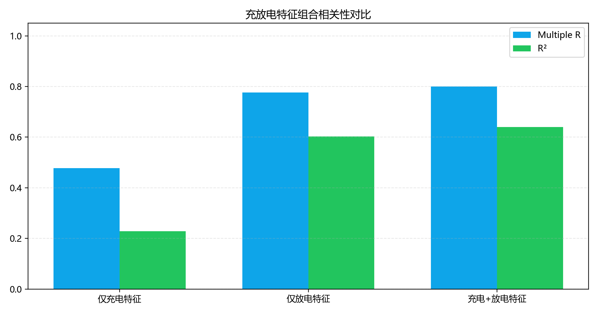

# 相关性汇总报告（无Policy）

## 1. 分析范围
- 仅分析：充电电压区间特征、放电电压区间特征，以及两者联合。
- 明确不纳入：任何 policy 三元参数字段。
- 区间口径：仅使用 `range_count == 1` 的首次出现区间特征。

## 2. 数据规模与特征
- 执行时间：2026-04-03 15:44:24
- Python解释器：`C:\Users\pal\.virtualenvs\ds_env-dSiSRDYH\Scripts\python.EXE`
- 中文字体回退链：`Microsoft YaHei, SimHei`
- 样本点（cycle级）：**139,474**
- 充电特征数：**12**；放电特征数：**16**

## 3. 组合关联性对比
| 组合 | n | 特征数 | Multiple R | R² | MAE | RMSE |
|---|---:|---:|---:|---:|---:|---:|
| 仅充电特征 | 139474 | 12 | 0.4776 | 0.2281 | 0.035118 | 0.047585 |
| 仅放电特征 | 139474 | 16 | 0.7760 | 0.6023 | 0.024214 | 0.034157 |
| 充电+放电特征 | 139474 | 28 | 0.8001 | 0.6401 | 0.023343 | 0.032492 |

### 3.1 相对联合模型（充电+放电）的增益
| 对比基线 | ΔR² | ΔMultiple R | MAE改善(%) | RMSE改善(%) |
|---|---:|---:|---:|---:|
| 仅充电特征 | 0.41201 | 0.32248 | 33.53% | 31.72% |
| 仅放电特征 | 0.03783 | 0.02401 | 3.60% | 4.87% |

## 4. 充电区间相关性摘要
| 区间 | Spearman | Pearson | n |
|---|---:|---:|---:|
| [3.00,3.05) | 0.1479 | 0.2129 | 12121 |
| [3.05,3.10) | 0.1559 | 0.1985 | 14194 |
| [3.10,3.15) | 0.1641 | 0.2100 | 16264 |
| [3.15,3.20) | 0.1742 | 0.2166 | 18046 |
| [3.20,3.25) | 0.1803 | 0.3836 | 19382 |
| [3.25,3.30) | 0.1871 | 0.0565 | 20867 |
| [3.30,3.35) | 0.2075 | 0.1886 | 22739 |
| [3.35,3.40) | -0.0958 | 0.0215 | 36514 |
| [3.40,3.45) | 0.0777 | 0.0329 | 80712 |
| [3.45,3.50) | -0.0170 | -0.0313 | 111155 |
| [3.50,3.55) | 0.4752 | 0.2656 | 116951 |
| [3.55,3.60] | 0.3455 | 0.2706 | 126219 |

## 5. 放电区间相关性摘要
| 区间 | Spearman | Pearson | n |
|---|---:|---:|---:|
| [2.85,2.80] | -0.2249 | -0.2959 | 24069 |
| [2.90,2.85) | 0.0900 | 0.1445 | 18026 |
| [2.95,2.90) | -0.0558 | 0.0092 | 10560 |
| [3.00,2.95) | 0.1681 | 0.0841 | 25770 |
| [3.05,3.00) | 0.3487 | 0.1354 | 73743 |
| [3.10,3.05) | 0.6475 | 0.5879 | 132103 |
| [3.15,3.10) | 0.7654 | 0.7684 | 133083 |
| [3.20,3.15) | 0.4125 | 0.5374 | 38497 |
| [3.25,3.20) | 0.4741 | 0.6164 | 16232 |
| [3.30,3.25) | 0.2972 | 0.4063 | 24079 |
| [3.35,3.30) | 0.1643 | 0.3855 | 22276 |
| [3.40,3.35) | 0.0351 | 0.3513 | 19344 |
| [3.45,3.40) | -0.3342 | 0.0379 | 4802 |
| [3.50,3.45) | 0.2000 | 0.9814 | 5 |
| [3.55,3.50) | 0.9000 | 0.9950 | 5 |
| [3.60,3.55) | nan | nan | 1 |

## 6. 图表

## 7. 结论
- R²最高组合：**充电+放电特征**。
- 该结果仅反映无 policy 条件下的统计关联，不直接等价于泛化预测能力。