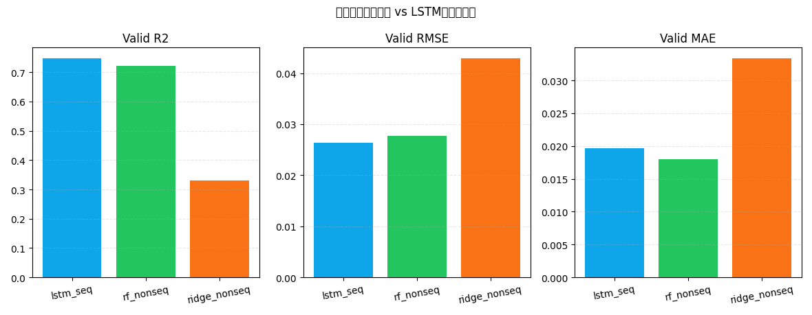

# 非时序基线对照报告（delta_ah 同口径）

## 1. 运行摘要
- 时间：2026-04-07 16:46:33
- Python：`C:\Users\pal\.virtualenvs\colab-OixbOpvz\Scripts\python.exe`
- 窗口口径对齐：仅保留 `seq_index >= 29` 的样本
- 标签过滤：`0.3 <= q_discharge <= 1.3`

## 2. 数据规模
- 窗口对齐后总样本：**134,295**
- 训练/验证样本：**94,264 / 40,031**
- 输入维度：**24**（`12 delta_ah + 12 mask`）

## 3. 验证集指标
| 模型 | MSE | RMSE | MAE | R2 |
|---|---:|---:|---:|---:|
| lstm_seq | 0.00069542 | 0.026371 | 0.019643 | 0.746630 |
| rf_nonseq | 0.00076502 | 0.027659 | 0.017997 | 0.721270 |
| ridge_nonseq | 0.00183762 | 0.042868 | 0.033317 | 0.330477 |

## 4. 图表

## 5. 结论
- 在当前口径下，验证集 R2 最优模型为 **lstm_seq**，R2=0.746630。
- 该对照用于判断时序建模的真实收益，避免仅凭模型复杂度做判断。