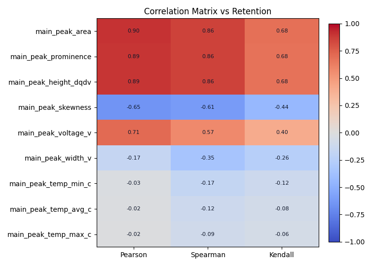
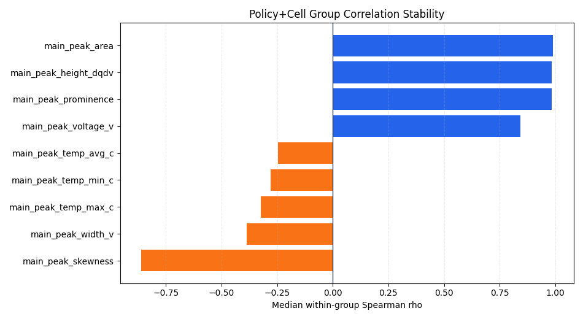
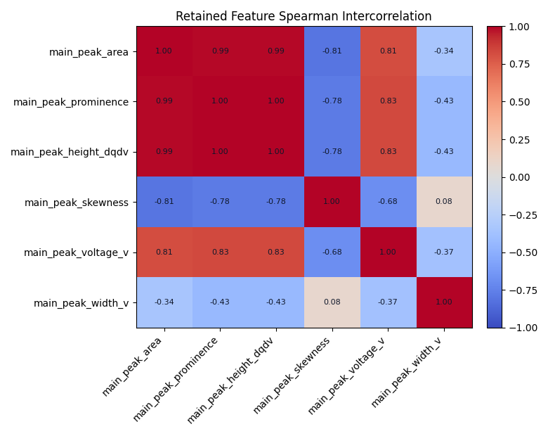
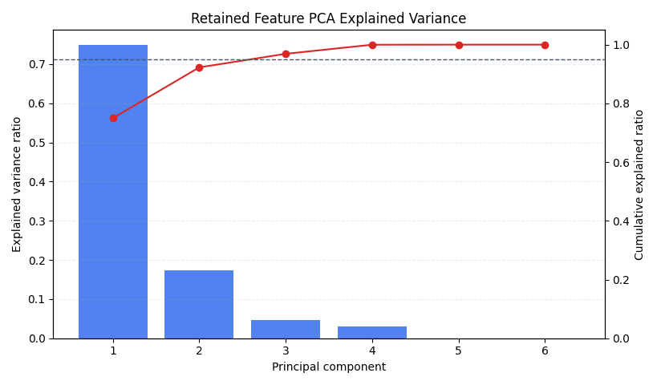

# dQ/dV 9 特征与容量保持率相关性分析

## 1. 分析摘要

本分析复用 dQ/dV + LSTM 的 retention 标签口径，仅评估 9 个 dQ/dV 主峰输入特征与容量保持率的相关性。`cycles` 和 `cycle_index_norm` 不作为解释特征，仅用于数据对齐、排序和分组。

- 合并后样本数：**140,560**
- 训练集样本数：**98,686**
- 验证集样本数：**41,874**
- `policy + cell_code` 分组数：**187**
- strong 特征：main_peak_area, main_peak_prominence, main_peak_height_dqdv, main_peak_skewness, main_peak_voltage_v
- moderate 特征：main_peak_width_v
- weak/negligible 特征：main_peak_temp_min_c, main_peak_temp_avg_c, main_peak_temp_max_c

## 2. 数据与口径

- dQ/dV 特征文件：`C:\Users\pal\projects\batt_soh\data\processed\discharge_dqdv_peak_features_skill_full.csv`
- 容量标签文件：`C:\Users\pal\projects\batt_soh\data\processed\life_performance.csv`
- q 过滤：`0.3 <= q_discharge <= 1.3`
- `q_ref`：每个 `policy + cell_code` 前 `5` 个有效循环 `q_discharge` 中位数
- retention 过滤：`0.3 <= retention <= 1.1`
- 缺失 dQ/dV 特征按 LSTM 输入口径进行数值化和 0 填充。

## 3. 全局相关性排序

| feature | n_samples | pearson_r | spearman_rho | kendall_tau | abs_spearman | correlation_class |
| --- | --- | --- | --- | --- | --- | --- |
| main_peak_area | 140560 | 0.9039 | 0.8575 | 0.6818 | 0.8575 | strong |
| main_peak_prominence | 140560 | 0.8947 | 0.8566 | 0.6782 | 0.8566 | strong |
| main_peak_height_dqdv | 140560 | 0.8949 | 0.8565 | 0.6782 | 0.8565 | strong |
| main_peak_skewness | 140560 | -0.6548 | -0.6130 | -0.4397 | 0.6130 | strong |
| main_peak_voltage_v | 140560 | 0.7098 | 0.5728 | 0.4039 | 0.5728 | strong |
| main_peak_width_v | 140560 | -0.1681 | -0.3496 | -0.2556 | 0.3496 | moderate |
| main_peak_temp_min_c | 140560 | -0.0308 | -0.1738 | -0.1214 | 0.1738 | weak |
| main_peak_temp_avg_c | 140560 | -0.0204 | -0.1182 | -0.0817 | 0.1182 | weak |
| main_peak_temp_max_c | 140560 | -0.0153 | -0.0944 | -0.0640 | 0.0944 | negligible |

## 4. 训练/验证分集一致性

| scope | feature | n_samples | spearman_rho | abs_spearman | correlation_class |
| --- | --- | --- | --- | --- | --- |
| train | main_peak_area | 98686 | 0.8776 | 0.8776 | strong |
| valid | main_peak_area | 41874 | 0.8112 | 0.8112 | strong |
| train | main_peak_height_dqdv | 98686 | 0.8779 | 0.8779 | strong |
| valid | main_peak_height_dqdv | 41874 | 0.8063 | 0.8063 | strong |
| train | main_peak_prominence | 98686 | 0.8779 | 0.8779 | strong |
| valid | main_peak_prominence | 41874 | 0.8064 | 0.8064 | strong |
| train | main_peak_skewness | 98686 | -0.6256 | 0.6256 | strong |
| valid | main_peak_skewness | 41874 | -0.5859 | 0.5859 | strong |
| train | main_peak_temp_avg_c | 98686 | -0.1171 | 0.1171 | weak |
| valid | main_peak_temp_avg_c | 41874 | -0.1249 | 0.1249 | weak |
| train | main_peak_temp_max_c | 98686 | -0.0978 | 0.0978 | negligible |
| valid | main_peak_temp_max_c | 41874 | -0.0903 | 0.0903 | negligible |
| train | main_peak_temp_min_c | 98686 | -0.1605 | 0.1605 | weak |
| valid | main_peak_temp_min_c | 41874 | -0.2091 | 0.2091 | weak |
| train | main_peak_voltage_v | 98686 | 0.5886 | 0.5886 | strong |
| valid | main_peak_voltage_v | 41874 | 0.5394 | 0.5394 | strong |
| train | main_peak_width_v | 98686 | -0.3326 | 0.3326 | moderate |
| valid | main_peak_width_v | 41874 | -0.3825 | 0.3825 | moderate |

## 5. 组内稳健性

组内稳健性按 `policy + cell_code` 计算每个特征与 retention 的 Spearman 相关，再汇总中位数、IQR 和方向一致率。该口径用于判断全局相关是否被少数长寿命或高样本电芯主导。

| feature | n_valid_groups | group_spearman_median | group_spearman_iqr | direction_consistency | median_abs_group_spearman |
| --- | --- | --- | --- | --- | --- |
| main_peak_area | 187 | 0.9905 | 0.0215 | 1.0000 | 0.9905 |
| main_peak_height_dqdv | 187 | 0.9836 | 0.0266 | 1.0000 | 0.9836 |
| main_peak_prominence | 187 | 0.9836 | 0.0266 | 1.0000 | 0.9836 |
| main_peak_skewness | 187 | -0.8623 | 0.1925 | 0.9947 | 0.8623 |
| main_peak_voltage_v | 187 | 0.8444 | 0.2049 | 0.9947 | 0.8444 |
| main_peak_width_v | 187 | -0.3866 | 0.6817 | 0.7166 | 0.3866 |
| main_peak_temp_max_c | 187 | -0.3237 | 0.5489 | 0.7594 | 0.3237 |
| main_peak_temp_min_c | 187 | -0.2793 | 0.5761 | 0.7273 | 0.2793 |
| main_peak_temp_avg_c | 187 | -0.2465 | 0.5182 | 0.7380 | 0.2465 |

## 6. 降维建议

| feature | spearman_rho | correlation_class | group_spearman_median | direction_consistency | reduction_recommendation |
| --- | --- | --- | --- | --- | --- |
| main_peak_temp_min_c | -0.1738 | weak | -0.2793 | 0.7273 | drop_candidate |
| main_peak_temp_avg_c | -0.1182 | weak | -0.2465 | 0.7380 | drop_candidate |
| main_peak_temp_max_c | -0.0944 | negligible | -0.3237 | 0.7594 | drop_candidate |
| main_peak_area | 0.8575 | strong | 0.9905 | 1.0000 | keep_priority |
| main_peak_prominence | 0.8566 | strong | 0.9836 | 1.0000 | keep_priority |
| main_peak_height_dqdv | 0.8565 | strong | 0.9836 | 1.0000 | keep_priority |
| main_peak_skewness | -0.6130 | strong | -0.8623 | 0.9947 | keep_priority |
| main_peak_voltage_v | 0.5728 | strong | 0.8444 | 0.9947 | keep_priority |
| main_peak_width_v | -0.3496 | moderate | -0.3866 | 0.7166 | keep_priority |

- 优先保留：main_peak_area, main_peak_prominence, main_peak_height_dqdv, main_peak_skewness, main_peak_voltage_v, main_peak_width_v
- 优先消融候选：main_peak_temp_min_c, main_peak_temp_avg_c, main_peak_temp_max_c

建议将 `drop_candidate` 和 `watch_instability` 特征优先纳入后续 LSTM 消融实验；
若删除后验证集 RMSE/R2 基本不变，可进一步减少输入维度和推理计算。

## 7. 优先保留特征内部降维可行性

本节只针对第一轮 `keep_priority` 特征做统计冗余分析，不训练 LSTM。判断依据包括保留特征之间的 Spearman/Pearson 相关、VIF 共线性、PCA 累计解释率和冗余组。

- 第一轮优先保留特征数：**6**
- 近似冗余阈值：`abs_spearman >= 0.9`
- 高度相关阈值：`abs_spearman >= 0.75`
- PCA `95%` 累计解释率所需主成分数：**3**

近似冗余特征对：
| feature_a | feature_b | spearman_rho | pearson_r | abs_spearman | redundancy_class |
| --- | --- | --- | --- | --- | --- |
| main_peak_prominence | main_peak_height_dqdv | 0.9999 | 0.9995 | 0.9999 | near_redundant |
| main_peak_area | main_peak_prominence | 0.9914 | 0.9907 | 0.9914 | near_redundant |
| main_peak_area | main_peak_height_dqdv | 0.9913 | 0.9910 | 0.9913 | near_redundant |

高度相关但未达到近似冗余的特征对：
| feature_a | feature_b | spearman_rho | pearson_r | abs_spearman | redundancy_class |
| --- | --- | --- | --- | --- | --- |
| main_peak_height_dqdv | main_peak_voltage_v | 0.8316 | 0.8721 | 0.8316 | highly_related |
| main_peak_prominence | main_peak_voltage_v | 0.8316 | 0.8705 | 0.8316 | highly_related |
| main_peak_area | main_peak_voltage_v | 0.8146 | 0.8675 | 0.8146 | highly_related |
| main_peak_area | main_peak_skewness | -0.8060 | -0.7788 | 0.8060 | highly_related |
| main_peak_prominence | main_peak_skewness | -0.7780 | -0.7601 | 0.7780 | highly_related |
| main_peak_height_dqdv | main_peak_skewness | -0.7779 | -0.7554 | 0.7779 | highly_related |

VIF 共线性诊断：
| feature | r2_from_other_retained_features | vif | vif_severity |
| --- | --- | --- | --- |
| main_peak_height_dqdv | 0.9998 | 4330.3141 | severe_collinearity |
| main_peak_prominence | 0.9994 | 1633.5454 | severe_collinearity |
| main_peak_area | 0.9990 | 1022.4309 | severe_collinearity |
| main_peak_width_v | 0.9538 | 21.6516 | severe_collinearity |
| main_peak_voltage_v | 0.7837 | 4.6240 | acceptable |
| main_peak_skewness | 0.6640 | 2.9766 | acceptable |

PCA 解释率：
| component | explained_variance_ratio | cumulative_explained_ratio |
| --- | --- | --- |
| PC1 | 0.7496 | 0.7496 |
| PC2 | 0.1729 | 0.9225 |
| PC3 | 0.0463 | 0.9687 |
| PC4 | 0.0309 | 0.9997 |
| PC5 | 0.0003 | 1.0000 |
| PC6 | 0.0000 | 1.0000 |

冗余组与代表特征建议：
| redundancy_group | n_features | features | recommended_representative | max_abs_spearman_within_group | group_type |
| --- | --- | --- | --- | --- | --- |
| group_01 | 3 | main_peak_area;main_peak_height_dqdv;main_peak_prominence | main_peak_area | 0.9999 | redundant_cluster |
| group_02 | 1 | main_peak_skewness | main_peak_skewness | nan | singleton |
| group_03 | 1 | main_peak_voltage_v | main_peak_voltage_v | nan | singleton |
| group_04 | 1 | main_peak_width_v | main_peak_width_v | nan | singleton |

结论：优先保留特征内部仍存在进一步降维空间。
`main_peak_area`、`main_peak_height_dqdv` 与 `main_peak_prominence` 共同构成峰强度/面积冗余组，建议下一轮 LSTM 消融优先测试在三者中保留 1-2 个；同时保留 `main_peak_skewness`、`main_peak_voltage_v` 和 `main_peak_width_v` 作为峰形、峰位和宽度信息。
统计上可先尝试从 6 个优先保留特征压缩到 4-5 个：`main_peak_area`（或峰高/ prominence 的代表项）+ `main_peak_skewness` + `main_peak_voltage_v` + `main_peak_width_v`，再用 LSTM 消融验证性能损失。

## 8. 局限性

- 相关性不是因果结论，只能作为降维和消融实验的筛选依据。
- 全局相关仍可能受到老化阶段、工况和电芯差异影响，因此报告同时给出组内稳健性。
- 本分析刻意不纳入 `cycles`/`cycle_index_norm`，因此不评估循环进程本身对 retention 的解释力。
- 单变量相关不能刻画多特征互补关系；弱相关特征仍可能在 LSTM 中提供非线性组合信息。
- 保留特征内部降维结论来自统计冗余分析，不能替代后续 LSTM 消融验证。

## 9. 输出文件

- `correlation_global.csv`
- `correlation_by_split.csv`
- `correlation_group_stability.csv`
- `feature_reduction_recommendation.csv`
- `retained_feature_intercorrelation.csv`
- `retained_feature_vif.csv`
- `retained_feature_pca_summary.csv`
- `retained_feature_redundancy_groups.csv`
- `dataset_diagnostics.csv`
- `spearman_global_bar.png`
- `correlation_heatmap.png`
- `group_stability_bar.png`
- `retained_feature_spearman_heatmap.png`
- `retained_feature_pca_scree.png`

## 10. 诊断摘要

| item | value |
| --- | --- |
| merged_rows | 140560.0000 |
| train_rows | 98686.0000 |
| valid_rows | 41874.0000 |
| policy_cell_groups | 187.0000 |
| feature_count_analyzed | 9.0000 |
| cycle_index_norm_included | 0.0000 |
| q_min | 0.3000 |
| q_max | 1.3000 |
| q_ref_cycles | 5.0000 |
| retention_min | 0.3000 |
| retention_max | 1.1000 |
| main_peak_voltage_v_missing_before_zero_fill | 0.0000 |
| main_peak_width_v_missing_before_zero_fill | 0.0000 |
| main_peak_height_dqdv_missing_before_zero_fill | 0.0000 |
| main_peak_area_missing_before_zero_fill | 0.0000 |
| main_peak_prominence_missing_before_zero_fill | 0.0000 |
| main_peak_skewness_missing_before_zero_fill | 0.0000 |
| main_peak_temp_max_c_missing_before_zero_fill | 0.0000 |
| main_peak_temp_min_c_missing_before_zero_fill | 0.0000 |
| main_peak_temp_avg_c_missing_before_zero_fill | 0.0000 |

_Generated at 2026-04-25 13:27:00_
