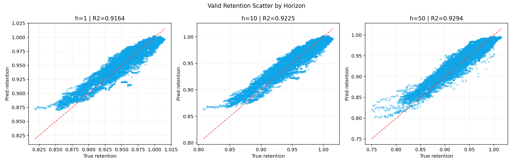

# LightGBM 多步容量保持率预测报告（5类工况特征）

## 1. 运行摘要
- 运行时间：2026-05-08 16:52:18
- Python解释器：`C:\Users\pal\.virtualenvs\colab-OixbOpvz\Scripts\python.exe`
- 字体回退：`DejaVu Sans`
- 任务口径：`1:100 -> 101:150`
- retention口径：`q_ref=前5个有效循环中位数`，过滤 `q∈[0.3,1.3]`，`retention∈[0.3,1.1]`

## 2. 特征口径
- 充电cross-bin累计：**60** 列
- 充电cross-bin当前增量：**60** 列
- 放电当前区间容量增量：**16** 列
- 放电累计区间容量：**16** 列
- 放电汇总统计：**7** 列
- raw特征维度：**159**
- 聚合后特征维度（last/mean/std/slope）：**636**
- 放电区间口径：`range_count == 1`

## 3. 数据规模
- merged cycle级样本：**140,282**
- 训练组/验证组：**134 / 52**
- 可构造窗口组（train/valid）：**132 / 51**
- 训练窗口数：**73,826**
- 验证窗口数：**32,279**
- charge/discharge cycle行数：**140,565 / 140,292**

## 4. 指标结果
| set_type | aggregation | horizon | n_windows | n_points | n_groups | MAE | RMSE | R2 |
|---|---|---:|---:|---:|---:|---:|---:|---:|
| train | weighted | 1 | 73826 | 73826 | 132 | 0.004318 | 0.005964 | 0.966501 |
| train | group_macro | 1 | 73826 | 73826 | 132 | 0.005044 | 0.006357 | -1.199056 |
| train | weighted | 10 | 73826 | 73826 | 132 | 0.004555 | 0.006266 | 0.966934 |
| train | group_macro | 10 | 73826 | 73826 | 132 | 0.005381 | 0.006773 | -2.717333 |
| train | weighted | 50 | 73826 | 73826 | 132 | 0.006034 | 0.008411 | 0.965891 |
| train | group_macro | 50 | 73826 | 73826 | 132 | 0.007443 | 0.009472 | -7.306920 |
| train | weighted | all | 73826 | 3691300 | 132 | 0.005110 | 0.007097 | 0.966605 |
| train | group_macro | all | 73826 | 3691300 | 132 | 0.006174 | 0.007871 | 0.708681 |
| valid | weighted | 1 | 32279 | 32279 | 51 | 0.006613 | 0.009092 | 0.916402 |
| valid | group_macro | 1 | 32279 | 32279 | 51 | 0.007637 | 0.009386 | 0.631960 |
| valid | weighted | 10 | 32279 | 32279 | 51 | 0.006749 | 0.009204 | 0.922484 |
| valid | group_macro | 10 | 32279 | 32279 | 51 | 0.007664 | 0.009448 | 0.726487 |
| valid | weighted | 50 | 32279 | 32279 | 51 | 0.008261 | 0.011189 | 0.929445 |
| valid | group_macro | 50 | 32279 | 32279 | 51 | 0.009139 | 0.011541 | 0.803530 |
| valid | weighted | all | 32279 | 1613950 | 51 | 0.007334 | 0.009921 | 0.926646 |
| valid | group_macro | all | 32279 | 1613950 | 51 | 0.008177 | 0.010243 | 0.784243 |

## 5. 模型配置
- 模型：每个 horizon 独立训练一个 `LGBMRegressor`
- n_estimators：`50`
- learning_rate：`0.05`
- num_leaves/max_depth：`31` / `6`
- min_child_samples：`100`
- subsample/colsample_bytree：`0.8` / `0.8`
- reg_alpha/reg_lambda：`0.0` / `1.0`
- n_jobs：`4`

## 6. 结论
- 短期预测（h=1）R2：train=0.966501，valid=0.916402，gap=0.050099。
- 长期预测（h=50）R2：train=0.965891，valid=0.929445，gap=0.036446。
- 验证集 `all` 指标：weighted R2=0.926646，group-macro R2=0.784243。
- 若 weighted 与 group-macro 差距较大，优先以 group-macro 结论为准。

## 7. 数据一致性检查
| check_item | pass_flag | value |
|---|---:|---:|
| check_split_overlap_zero | 1 | 0 |
| check_target_after_input | 1 | 1 |
| check_consecutive_horizon | 1 | 1 |
| check_feature_dim_159_raw | 1 | 159 |
| check_feature_dim_636_aggregated | 1 | 636 |
| check_no_nan_inf_features | 1 | 1 |

## 8. 散点图
