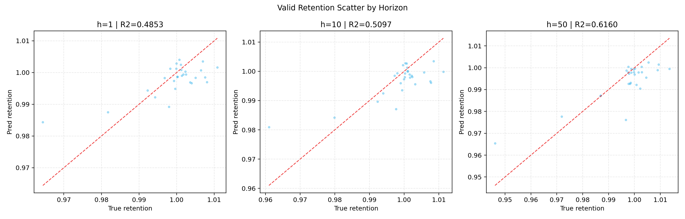
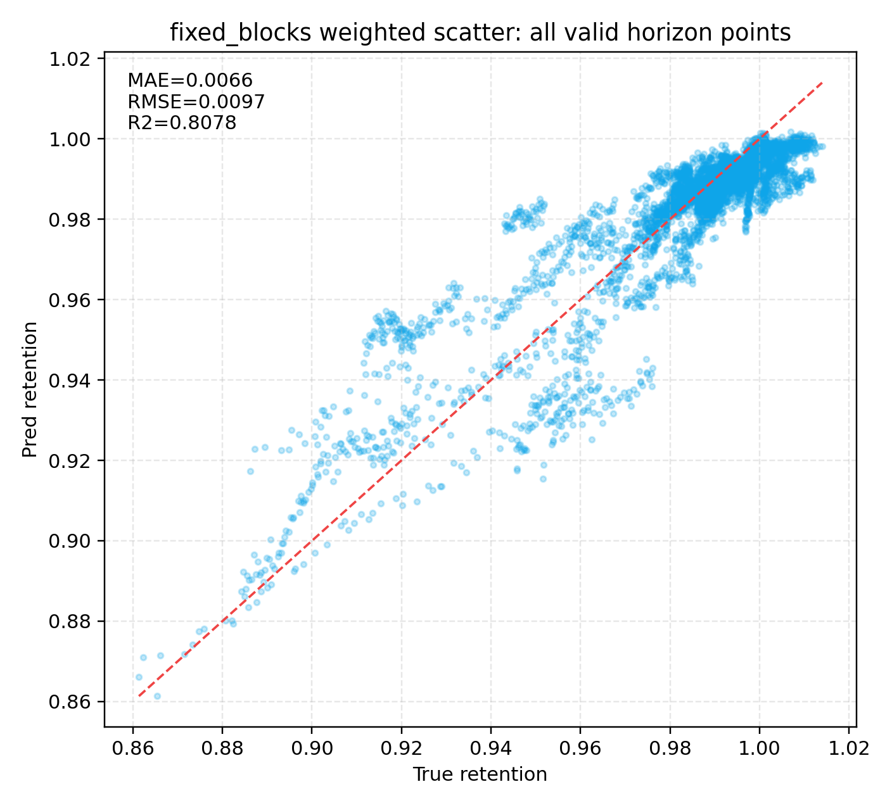
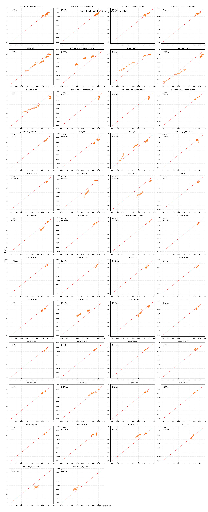

# LightGBM 滑窗 vs 固定起点 vs 分段固定起点对比报告

## 1. 运行摘要
- 生成时间：2026-05-09 11:20:33
- 滑窗口径：每个电芯生成多个 `s:s+N-1 -> s+N:s+N+M-1` 样本。
- 固定起点口径：每个电芯最多 1 个 `1:N -> N+1:N+M` 样本。
- 分段固定起点口径：每个电芯最多 3 个样本，默认 block 起点为 `1,151,301`。
- 固定起点和分段固定起点均使用 `min_child_samples=5` 适配小样本；滑窗正式结果复用已有产物。

## 2. 有效样本数量
| window_mode | N | M | train_windows | valid_windows | train_groups_available | valid_groups_available |
|---|---:|---:|---:|---:|---:|---:|
| rolling | 100 | 50 | 73826 | 32279 | 132 | 51 |
| fixed_origin | 100 | 50 | 103 | 28 | 103 | 28 |
| fixed_blocks | 100 | 50 | 334 | 119 | 132 | 51 |

## 3. 验证集预测精度
| window_mode | aggregation | horizon | n_windows | MAE | RMSE | R2 |
|---|---|---:|---:|---:|---:|---:|
| fixed_blocks | group_macro | 1 | 119 | 0.006573 | 0.007272 | -1.374899 |
| fixed_blocks | group_macro | 10 | 119 | 0.006353 | 0.006990 | -1.897088 |
| fixed_blocks | group_macro | 50 | 119 | 0.007431 | 0.008116 | -1.435989 |
| fixed_blocks | group_macro | all | 119 | 0.006698 | 0.007531 | -1.867353 |
| fixed_blocks | weighted | 1 | 119 | 0.006379 | 0.009004 | 0.747733 |
| fixed_blocks | weighted | 10 | 119 | 0.006240 | 0.009210 | 0.763448 |
| fixed_blocks | weighted | 50 | 119 | 0.007427 | 0.010607 | 0.847029 |
| fixed_blocks | weighted | all | 119 | 0.006611 | 0.009677 | 0.807755 |
| fixed_origin | group_macro | 1 | 28 | 0.004694 | 0.004694 | nan |
| fixed_origin | group_macro | 10 | 28 | 0.004736 | 0.004736 | nan |
| fixed_origin | group_macro | 50 | 28 | 0.005387 | 0.005387 | nan |
| fixed_origin | group_macro | all | 28 | 0.005155 | 0.005346 | -91.878117 |
| fixed_origin | weighted | 1 | 28 | 0.004694 | 0.006228 | 0.485332 |
| fixed_origin | weighted | 10 | 28 | 0.004736 | 0.006475 | 0.509669 |
| fixed_origin | weighted | 50 | 28 | 0.005387 | 0.007673 | 0.616001 |
| fixed_origin | weighted | all | 28 | 0.005155 | 0.007267 | 0.521131 |
| rolling | group_macro | 1 | 32279 | 0.007637 | 0.009386 | 0.631960 |
| rolling | group_macro | 10 | 32279 | 0.007664 | 0.009448 | 0.726487 |
| rolling | group_macro | 50 | 32279 | 0.009139 | 0.011541 | 0.803530 |
| rolling | group_macro | all | 32279 | 0.008177 | 0.010243 | 0.784243 |
| rolling | weighted | 1 | 32279 | 0.006613 | 0.009092 | 0.916402 |
| rolling | weighted | 10 | 32279 | 0.006749 | 0.009204 | 0.922484 |
| rolling | weighted | 50 | 32279 | 0.008261 | 0.011189 | 0.929445 |
| rolling | weighted | all | 32279 | 0.007334 | 0.009921 | 0.926646 |

## 4. 散点图

本节三张散点图分别对应三种样本构造口径，横轴均为真实 retention，纵轴均为预测 retention，红色虚线表示理想预测 `y=x`。三张图都展示验证集在 `h=1`、`h=10`、`h=50` 三个 horizon 下的预测效果，但每张图中的样本来源不同。

- `rolling_valid_scatter`：滑窗口径。每个电芯会产生大量滚动窗口，例如 `s:s+N-1 -> s+N:s+N+M-1`。因此点数最多，覆盖的退化阶段也最连续；但相邻样本高度重叠，图上表现和 weighted 指标可能偏乐观。
- `fixed_origin_valid_scatter`：单固定起点口径。每个电芯最多只有 1 个样本，即 `1:100 -> 101:150`。它最接近严格早期预测任务，点数最少，图上的离散程度更容易受少数电芯影响。
- `fixed_blocks_valid_scatter`：分段固定起点口径。每个电芯最多有 3 个样本，即 `1:100 -> 101:150`、`151:250 -> 251:300`、`301:400 -> 401:450`。它在单固定起点和滑窗之间折中，样本量增加，但不会像滑窗那样引入大量相邻重叠窗口。

读图时需要把三张图和第 3 章指标一起看：滑窗图点多且整体 R2 高，说明模型能学习滚动退化动态；固定起点图更稀疏，反映严格早期预测能力；分段固定起点图用于观察扩样后是否改善了固定起点的泛化。

## 5. Weighted 与按 Policy 分组散点图

说明：第一张图是 weighted 口径，即 fixed_blocks 验证集所有原始 horizon 点直接参与散点和指标。第二张图是按 policy 分组的小图矩阵，每个子图仍使用该 policy 下的原始预测点计算 R2，不再对 `policy+cell_code` 做均值点替代。
按 policy 分组后的 policy-macro 指标为：MAE=0.006950，RMSE=0.007825，R2=-2.112448。完整明细见 `fixed_blocks_policy_group_metrics.csv`。

## 6. 结论说明
- 滑窗样本量远大于固定起点，适合学习滚动退化动态，但 window-weighted 指标可能偏乐观。
- 固定起点更接近严格早期预测任务，但 train/valid 样本只有电芯组数量级，指标更容易受单个电芯影响。
- 分段固定起点在固定历史窗口和低重叠之间折中，样本量高于单固定起点，低于滑窗。
- 分段固定起点的 weighted R2 为正而按 policy 分组后的 R2 可能偏低或为负，主要因为分组后在每个 policy 内部单独计算 R2。部分 policy 内真实 retention 波动很小，SST 很小，轻微系统误差就会导致 SSE > SST，从而得到负 R2。
- weighted R2 把所有点合并计算，包含不同电芯之间的 retention 差异，整体 SST 更大，因此更容易得到较高 R2。
- 固定起点下每个电芯最多一个窗口，MAE/RMSE 的 weighted 与 group_macro 通常更接近。
- 固定起点的单 horizon group-macro R2 不可定义，因为每个电芯组在该 horizon 只有 1 个点；`all` horizon 的 group-macro R2 仍可参考。
- 本对比重点是样本构造口径差异，不是严格超参公平竞赛。