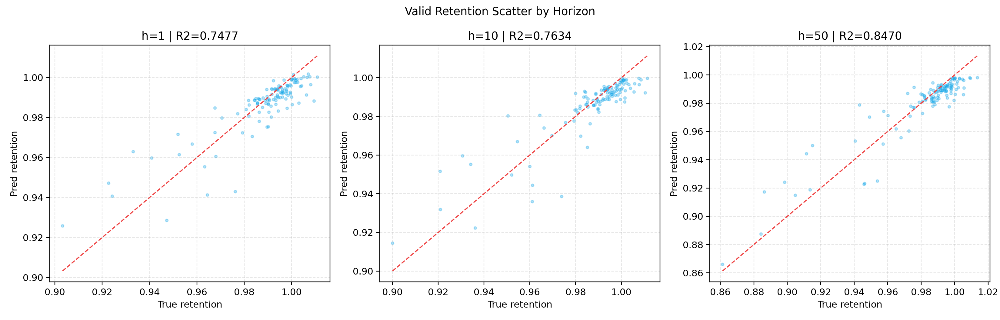

# LightGBM 多步容量保持率预测报告（分段固定起点，5类工况特征）

## 1. 运行摘要
- 运行时间：2026-05-09 10:57:37
- Python解释器：`C:\Users\pal\.virtualenvs\colab-OixbOpvz\Scripts\python.exe`
- 字体回退：`DejaVu Sans`
- 窗口模式：`fixed_blocks`
- 任务口径：`1:100 -> 101:150`
- retention口径：`q_ref=前5个有效循环中位数`，过滤 `q∈[0.3,1.3]`，`retention∈[0.3,1.1]`

## 2. 特征口径
- 充电cross-bin累计：**60** 列
- 充电cross-bin当前增量：**60** 列
- 放电当前区间容量增量：**16** 列
- 放电累计区间容量：**16** 列
- 放电汇总统计：**7** 列
- raw特征维度：**159**
- 聚合后特征维度（last/mean/std/slope）：**636**
- 放电区间口径：`range_count == 1`

## 3. 数据规模
- merged cycle级样本：**140,282**
- 训练组/验证组：**134 / 52**
- 可构造窗口组（train/valid）：**132 / 51**
- 训练窗口数：**334**
- 验证窗口数：**119**
- charge/discharge cycle行数：**140,565 / 140,292**

分段固定起点说明：每个 `policy+cell_code` 最多贡献 3 个样本，默认 block 起点为 `1,151,301`。
本次 `N=100,M=50` 时，对应 `1:100 -> 101:150`、`151:250 -> 251:300`、`301:400 -> 401:450`。

## 4. 指标结果
| set_type | aggregation | horizon | n_windows | n_points | n_groups | MAE | RMSE | R2 |
|---|---|---:|---:|---:|---:|---:|---:|---:|
| train | weighted | 1 | 334 | 334 | 132 | 0.003211 | 0.006494 | 0.945982 |
| train | group_macro | 1 | 334 | 334 | 132 | 0.003199 | 0.003736 | 0.430548 |
| train | weighted | 10 | 334 | 334 | 132 | 0.003045 | 0.004654 | 0.974569 |
| train | group_macro | 10 | 334 | 334 | 132 | 0.003069 | 0.003497 | -0.003037 |
| train | weighted | 50 | 334 | 334 | 132 | 0.004157 | 0.006481 | 0.978207 |
| train | group_macro | 50 | 334 | 334 | 132 | 0.004207 | 0.004879 | 0.550874 |
| train | weighted | all | 334 | 16700 | 132 | 0.003466 | 0.005388 | 0.976363 |
| train | group_macro | all | 334 | 16700 | 132 | 0.003494 | 0.004115 | 0.335772 |
| valid | weighted | 1 | 119 | 119 | 51 | 0.006379 | 0.009004 | 0.747733 |
| valid | group_macro | 1 | 119 | 119 | 51 | 0.006573 | 0.007272 | -1.374899 |
| valid | weighted | 10 | 119 | 119 | 51 | 0.006240 | 0.009210 | 0.763448 |
| valid | group_macro | 10 | 119 | 119 | 51 | 0.006353 | 0.006990 | -1.897088 |
| valid | weighted | 50 | 119 | 119 | 51 | 0.007427 | 0.010607 | 0.847029 |
| valid | group_macro | 50 | 119 | 119 | 51 | 0.007431 | 0.008116 | -1.435989 |
| valid | weighted | all | 119 | 5950 | 51 | 0.006611 | 0.009677 | 0.807755 |
| valid | group_macro | all | 119 | 5950 | 51 | 0.006698 | 0.007531 | -1.867353 |

## 5. 模型配置
- 模型：每个 horizon 独立训练一个 `LGBMRegressor`
- n_estimators：`50`
- learning_rate：`0.05`
- num_leaves/max_depth：`31` / `6`
- min_child_samples：`5`
- subsample/colsample_bytree：`0.8` / `0.8`
- reg_alpha/reg_lambda：`0.0` / `1.0`
- n_jobs：`4`

## 6. 结论
- 短期预测（h=1）R2：train=0.945982，valid=0.747733，gap=0.198250。
- 长期预测（h=50）R2：train=0.978207，valid=0.847029，gap=0.131179。
- 验证集 `all` 指标：weighted R2=0.807755，group-macro R2=-1.867353。
- 分段固定起点扩大了每个电芯的可用样本，同时仍避免滑窗的大量重叠样本。

## 7. 数据一致性检查
| check_item | pass_flag | value |
|---|---:|---:|
| check_split_overlap_zero | 1 | 0 |
| check_target_after_input | 1 | 1 |
| check_consecutive_horizon | 1 | 1 |
| check_feature_dim_159_raw | 1 | 159 |
| check_feature_dim_636_aggregated | 1 | 636 |
| check_no_nan_inf_features | 1 | 1 |
| check_fixed_blocks_input_length_N | 1 | 100 |
| check_fixed_blocks_target_length_M | 1 | 50 |
| check_fixed_blocks_target_after_input | 1 | 1 |
| check_fixed_blocks_allowed_input_cycles | 1 | 1 |
| check_fixed_blocks_allowed_target_starts | 1 | 1 |

## 8. 散点图
