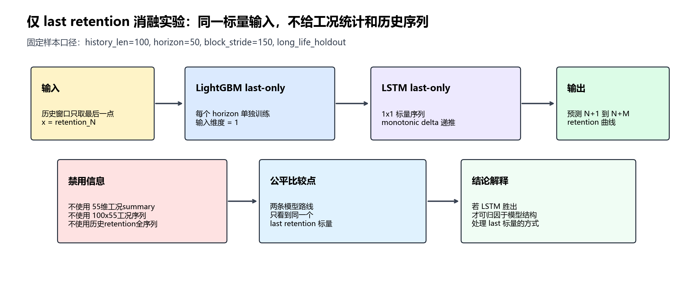

# long_life_holdout H100/M50 工况统计 -> retention LightGBM/LSTM 评估汇总

## 1. 直接执行

- split_name: `long_life_holdout`
- train_split_path: `C:/Users/pal/projects/batt_soh/data/processed/extrapolation_splits/train_policy_cell_samples_long_life_holdout.csv`
- valid_split_path: `C:/Users/pal/projects/batt_soh/data/processed/extrapolation_splits/valid_policy_cell_samples_long_life_holdout.csv`
- 样本口径：`history_len=100`，`horizon=50`，`block_stride=150`，`sample_mode=non_overlapping_blocks`。
- LightGBM-history 输出目录：`C:/Users/pal/projects/batt_soh/outputs/analysis/long_life_holdout_lgbm_history_retention_blocks_h100_m50`
- LSTM baseline_source: `loaded:C:\Users\pal\projects\batt_soh\outputs\analysis\long_life_holdout_lgbm_blocks_h100_m50`
- 路线示意图：主路线沿用用户确认的科研论文中文流程图风格；last-only 消融图由脚本生成并写入同一图表目录。

## 2. 路线总表与示意图

| H50排名 | 路线 | 方法 | 输入信息 | 是否使用历史retention | 可部署性/口径 | H10_RMSE | H10_R2 | H50_RMSE | H50_R2 | ALL_RMSE | ALL_R2 |
| --- | --- | --- | --- | --- | --- | --- | --- | --- | --- | --- | --- |
| 1 | trend baseline | linear_last10 | 历史最后10点 retention 线性外推 | 是 | 低成本强基线 | 0.001643 | 0.997529 | 0.005370 | 0.981336 | 0.003443 | 0.990611 |
| 2 | LSTM pure operational | LSTM delta strict 100x55 | 100x55工况序列 + last retention递推起点 | 否 | 纯工况序列主对照 | 0.001427 | 0.998136 | 0.006508 | 0.972583 | 0.003896 | 0.987979 |
| 3 | LSTM enhanced | LSTM delta 100x56 history-retention-enhanced | 100x55工况序列 + 历史retention通道 | 是 | 历史retention增强序列 | 0.001559 | 0.997775 | 0.006921 | 0.968999 | 0.004171 | 0.986224 |
| 4 | LightGBM enhanced | LightGBM + history retention summary | 55维工况 summary + 7维历史retention summary | 是 | 历史retention增强 tabular | 0.004209 | 0.983773 | 0.006974 | 0.968521 | 0.005311 | 0.977660 |
| 5 | last retention only ablation | LSTM delta 1x1 last retention only | 1x1 last retention标量 | 是，仅last | 仅last retention消融 LSTM | 0.001854 | 0.996851 | 0.008406 | 0.954261 | 0.005072 | 0.979624 |
| 6 | trend baseline | persistence | 历史最后一个 retention | 是 | 低成本基线 | 0.002022 | 0.996256 | 0.010470 | 0.929039 | 0.006077 | 0.970750 |
| 7 | LightGBM | LightGBM direct | 55维工况 summary | 否 | 纯工况 tabular | 0.012619 | 0.854161 | 0.014691 | 0.860301 | 0.013461 | 0.856480 |
| 8 | last retention only ablation | LightGBM last retention only | last retention标量 | 是，仅last | 仅last retention消融 tabular | 0.003460 | 0.989036 | 0.014692 | 0.860273 | 0.008257 | 0.946000 |

### 2.0 输入数据内容及含义

表 2-0 用来区分“基础工况特征”“历史retention增强”和“last-retention-only消融”三种不同输入口径，避免把模型结构收益和输入信息量收益混写。

| 路线 | 输入形态 | 输入内容 | 含义 |
| --- | --- | --- | --- |
| trend baseline / linear_last10 | 10个历史retention点 | 历史窗口末端最后10个capacity retention观测值 | 只利用容量保持率的局部平滑趋势，作为低成本强基线；不使用工况统计。 |
| trend baseline / persistence | 1个last retention标量 | 历史窗口最后一个capacity retention观测值 | 假设未来保持率等于当前状态，衡量模型是否超过最朴素起点基线。 |
| LightGBM direct | 385维tabular summary | 100个历史cycle内的55个工况基础特征，逐列压缩为last/mean/std/min/max/delta/slope七类统计量。 | 把工况时间序列压成表格摘要，不输入历史retention；用于检验工况统计本身的预测力。 |
| LightGBM + history retention summary | 392维tabular summary | 385维工况summary + 历史retention的last/mean/std/min/max/delta/slope七类summary。 | 把历史retention作为7个统计特征加入LightGBM，但不保留完整retention时间序列。 |
| LSTM pure operational | 100x55工况序列 + last retention递推起点 | 100个历史cycle的55个工况通道；last retention只用于monotonic delta递推起点，不作为输入通道。 | 保留工况时序结构，检验序列模型是否能从工况变化中获得额外泛化收益。 |
| LSTM history-retention-enhanced | 100x56序列 | 100x55工况序列 + 1个历史retention通道。 | 显式输入历史retention全序列；若胜出，结论应标注为history-retention-enhanced，不属于纯工况胜利。 |
| LightGBM last retention only | 1维tabular | 只输入历史窗口最后一个retention标量；禁用55维工况summary、历史retention全序列和7维history summary。 | 同口径消融：只看last retention能否预测未来M50保持率曲线。 |
| LSTM last retention only | 1x1标量序列 | 只输入历史窗口最后一个retention标量，并通过单调delta结构从该起点向未来递推。 | 在短历史H100、预测M50且输入严格限制为last retention时，检验LSTM结构是否比LightGBM更会利用这个起点做未来曲线外推。 |

### 2.1 trend baseline

图 2-1 说明：该路线图已按科研论文中文流程图风格刷新；该路线只使用历史 retention 的平滑趋势，代表最低成本强基线。

### 2.2 LightGBM

图 2-2 说明：该路线图已按科研论文中文流程图风格刷新；LightGBM 路线使用 tabular summary，其中增强版额外加入 7 个历史 retention summary 特征。

### 2.3 纯工况 LSTM

图 2-3 说明：该路线图已按科研论文中文流程图风格刷新；纯工况 LSTM 使用 `100x55` 工况统计序列，并用 last retention 作为递推起点，不把历史 retention 作为输入通道。

### 2.4 历史 retention 增强 LSTM

图 2-4 说明：该路线图已按科研论文中文流程图风格刷新；增强 LSTM 使用 `100x56`，历史 retention 是显式输入通道，结论必须单独标注。

### 2.5 last retention only 消融

图 2-5 说明：该图为脚本生成的科研流程图；LightGBM 与 LSTM 都只接收同一个 last retention 标量，不接收工况统计和历史 retention 序列。

## 3. 图像证据

图 3-1 说明：左图是 H50 RMSE，越低越好；右图是 H50 R2，越高越好。

图 3-2 说明：X 轴是未来 horizon step，Y 轴是 valid R2，用于观察全预测窗口的泛化趋势。

图 3-3 说明：X 轴是未来 horizon step，Y 轴是 valid RMSE，越低表示误差越小。

## 4. H10/H50/ALL 指标与散点残差图

| 路线 | 方法 | horizon | n_rows | MSE | RMSE | MAE | R2 |
| --- | --- | --- | --- | --- | --- | --- | --- |
| trend baseline | linear_last10 | H10 | 312 | 0.000003 | 0.001643 | 0.000509 | 0.997529 |
| trend baseline | linear_last10 | H50 | 312 | 0.000029 | 0.005370 | 0.002197 | 0.981336 |
| trend baseline | linear_last10 | ALL | 15600 | 0.000012 | 0.003443 | 0.001156 | 0.990611 |
| trend baseline | persistence | H10 | 312 | 0.000004 | 0.002022 | 0.001183 | 0.996256 |
| trend baseline | persistence | H50 | 312 | 0.000110 | 0.010470 | 0.006020 | 0.929039 |
| trend baseline | persistence | ALL | 15600 | 0.000037 | 0.006077 | 0.003034 | 0.970750 |
| LightGBM | LightGBM direct | H10 | 312 | 0.000159 | 0.012619 | 0.008637 | 0.854161 |
| LightGBM | LightGBM direct | H50 | 312 | 0.000216 | 0.014691 | 0.010817 | 0.860301 |
| LightGBM | LightGBM direct | ALL | 15600 | 0.000181 | 0.013461 | 0.009420 | 0.856480 |
| LightGBM enhanced | LightGBM + history retention summary | H10 | 312 | 0.000018 | 0.004209 | 0.001858 | 0.983773 |
| LightGBM enhanced | LightGBM + history retention summary | H50 | 312 | 0.000049 | 0.006974 | 0.003724 | 0.968521 |
| LightGBM enhanced | LightGBM + history retention summary | ALL | 15600 | 0.000028 | 0.005311 | 0.002569 | 0.977660 |
| last retention only ablation | LightGBM last retention only | H10 | 312 | 0.000012 | 0.003460 | 0.001828 | 0.989036 |
| last retention only ablation | LightGBM last retention only | H50 | 312 | 0.000216 | 0.014692 | 0.009737 | 0.860273 |
| last retention only ablation | LightGBM last retention only | ALL | 15600 | 0.000068 | 0.008257 | 0.004670 | 0.946000 |
| LSTM pure operational | LSTM delta strict 100x55 | H10 | 312 | 0.000002 | 0.001427 | 0.000984 | 0.998136 |
| LSTM pure operational | LSTM delta strict 100x55 | H50 | 312 | 0.000042 | 0.006508 | 0.004721 | 0.972583 |
| LSTM pure operational | LSTM delta strict 100x55 | ALL | 15600 | 0.000015 | 0.003896 | 0.002434 | 0.987979 |
| LSTM enhanced | LSTM delta 100x56 history-retention-enhanced | H10 | 312 | 0.000002 | 0.001559 | 0.001092 | 0.997775 |
| LSTM enhanced | LSTM delta 100x56 history-retention-enhanced | H50 | 312 | 0.000048 | 0.006921 | 0.005063 | 0.968999 |
| LSTM enhanced | LSTM delta 100x56 history-retention-enhanced | ALL | 15600 | 0.000017 | 0.004171 | 0.002659 | 0.986224 |
| last retention only ablation | LSTM delta 1x1 last retention only | H10 | 312 | 0.000003 | 0.001854 | 0.001616 | 0.996851 |
| last retention only ablation | LSTM delta 1x1 last retention only | H50 | 312 | 0.000071 | 0.008406 | 0.006857 | 0.954261 |
| last retention only ablation | LSTM delta 1x1 last retention only | ALL | 15600 | 0.000026 | 0.005072 | 0.003698 | 0.979624 |

## 5. 证据链检查

| 证据项 | 状态 | 关键值 |
| --- | --- | --- |
| 数据切分 | PASS | split_name=long_life_holdout |
| 样本块 | PASS | non_overlapping_blocks |
| 窗口 | PASS | history_len=100, horizon=50 |
| 步长 | PASS | block_stride=150 |
| 工况特征 | PASS | feature_count=55 |
| 历史retention增强 | PASS | LightGBM + 7维历史retention summary |
| split重合 | PASS | train/valid policy-cell overlap=0 |
| LSTM baseline契约 | PASS | LSTM加载long_life LightGBM baseline |
| LightGBM last-only | PASS | 输入仅包含 last_retention_only_feature_count=1 的消融路线 |
| LSTM last-only | PASS | 输入为 1x1 last retention 标量序列 |

## 6. 直接回答：LSTM + 历史 retention 是否优于 LightGBM + 历史 retention？

- 直接回答：按 H50 RMSE，`LSTM + 历史 retention` 更好。
- H50 上 `LSTM delta 100x56 history-retention-enhanced` RMSE=`0.006921`、R2=`0.968999`；`LightGBM + history retention summary` RMSE=`0.006974`、R2=`0.968521`。
- H50 RMSE 差值为 `0.000053`，ALL RMSE 差值为 `0.001140`；正数表示 LSTM-history 误差更低。
- 但该胜利必须标注为 `100x56 history-retention-enhanced`，不能写成“仅工况统计信息”的胜利。

## 7. last retention only 消融结论

- 直接回答：只给 last retention 标量时，按 H50 RMSE，`LSTM last-retention-only` 更好。
- 任务结论：在短历史 H100、预测 M50 的任务里，如果输入严格限制为 last retention，LSTM 的单调 delta 结构比 LightGBM 更会利用这个起点做未来曲线外推。
- H50 上 `LSTM delta 1x1 last retention only` RMSE=`0.008406`、R2=`0.954261`；`LightGBM last retention only` RMSE=`0.014692`、R2=`0.860273`。
- H50 RMSE 差值为 `0.006286`，ALL RMSE 差值为 `0.003185`；正数表示 LSTM last-only 误差更低。
- 该消融不包含 55维工况统计、不包含历史 retention 全序列，也不包含 7维 history summary，因此可用于回答“单纯 last retention”问题。

## 8. 图表与产物索引

| 产物 | 路径 | 存在 | bytes |
| --- | --- | --- | --- |
| H50 RMSE/R2柱状图 | long_life_holdout_lgbm_lstm_blocks_h100_m50_figures/comparison_v2_h50_rmse_r2_bar.png | true | 89591 |
| 跨路线R2曲线 | long_life_holdout_lgbm_lstm_blocks_h100_m50_figures/comparison_v2_r2_by_horizon.png | true | 194715 |
| 跨路线RMSE曲线 | long_life_holdout_lgbm_lstm_blocks_h100_m50_figures/comparison_v2_rmse_by_horizon.png | true | 236552 |
| H10散点图 | long_life_holdout_lgbm_lstm_blocks_h100_m50_figures/comparison_scatter_h10.png | true | 555325 |
| H10残差图 | long_life_holdout_lgbm_lstm_blocks_h100_m50_figures/comparison_residual_h10.png | true | 234343 |
| H50散点图 | long_life_holdout_lgbm_lstm_blocks_h100_m50_figures/comparison_scatter_h50.png | true | 521952 |
| H50残差图 | long_life_holdout_lgbm_lstm_blocks_h100_m50_figures/comparison_residual_h50.png | true | 243529 |
| ALL散点图 | long_life_holdout_lgbm_lstm_blocks_h100_m50_figures/comparison_scatter_all.png | true | 796648 |
| ALL残差图 | long_life_holdout_lgbm_lstm_blocks_h100_m50_figures/comparison_residual_all.png | true | 261268 |
| trend baseline路线示意图 | long_life_holdout_lgbm_lstm_blocks_h100_m50_figures/route_diagrams/route_trend_baseline_gpt_image2.png | true | 1229214 |
| LightGBM路线示意图 | long_life_holdout_lgbm_lstm_blocks_h100_m50_figures/route_diagrams/route_lightgbm_gpt_image2.png | true | 1167612 |
| 纯工况LSTM路线示意图 | long_life_holdout_lgbm_lstm_blocks_h100_m50_figures/route_diagrams/route_lstm_pure_operational_gpt_image2.png | true | 1171571 |
| 历史retention增强LSTM路线示意图 | long_life_holdout_lgbm_lstm_blocks_h100_m50_figures/route_diagrams/route_lstm_history_retention_gpt_image2.png | true | 1180520 |
| last retention only消融路线示意图 | long_life_holdout_lgbm_lstm_blocks_h100_m50_figures/route_diagrams/route_last_retention_only_ablation.png | true | 169623 |

## 9. 深度交互

- 这次新增的 LightGBM-history 才是回答“LightGBM + 历史 retention”的同口径证据，不能继续用 `linear_last10` 或 pure LightGBM 代替。
- 若 LSTM-history 胜出，合理表述是“历史 retention 增强的序列模型胜出”；若要证明纯工况统计序列更强，应继续看 `100x55` LSTM 与不含历史 retention 的 LightGBM。
- last retention only 消融是回答“单纯 last retention”问题的同口径证据，不应与 `100x55` 工况序列或 `100x56` 历史序列增强结果混写。
- `linear_last10` 仍需要保留，因为它代表短期 H50 retention 平滑趋势的最低成本解释。
