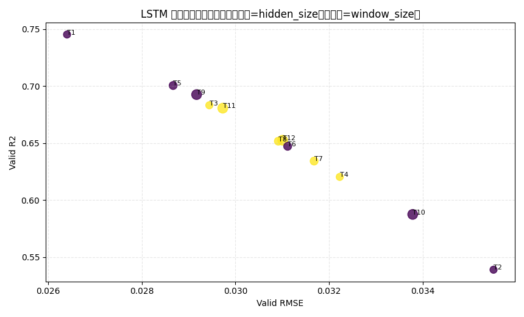

# LSTM 小网格调参报告（delta_ah 口径）

## 1. 运行摘要
- 时间：2026-04-07 18:00:40
- Python：`C:\Users\pal\.virtualenvs\colab-OixbOpvz\Scripts\python.exe`
- 设备：`cpu`
- 搜索空间：window_size=20,30,60，hidden_size=64,128，lr=1e-3,5e-4
- 训练参数：epochs=15, patience=4, batch_size=256

## 2. 全部试验结果（按 Valid R2 降序）
| trial_id | window | hidden | lr | best_epoch | valid_rmse | valid_mae | valid_r2 |
|---:|---:|---:|---:|---:|---:|---:|---:|
| 1 | 20 | 64 | 0.001 | 15 | 0.026403 | 0.019098 | 0.745234 |
| 5 | 30 | 64 | 0.001 | 11 | 0.028670 | 0.021058 | 0.700528 |
| 9 | 60 | 64 | 0.001 | 11 | 0.029171 | 0.021420 | 0.692554 |
| 3 | 20 | 128 | 0.001 | 8 | 0.029443 | 0.021589 | 0.683178 |
| 11 | 60 | 128 | 0.001 | 7 | 0.029730 | 0.021942 | 0.680648 |
| 12 | 60 | 128 | 0.0005 | 6 | 0.031010 | 0.023667 | 0.652556 |
| 8 | 30 | 128 | 0.0005 | 5 | 0.030918 | 0.022497 | 0.651713 |
| 6 | 30 | 64 | 0.0005 | 7 | 0.031117 | 0.023353 | 0.647221 |
| 7 | 30 | 128 | 0.001 | 3 | 0.031683 | 0.023550 | 0.634278 |
| 4 | 20 | 128 | 0.0005 | 4 | 0.032230 | 0.023655 | 0.620359 |
| 10 | 60 | 64 | 0.0005 | 4 | 0.033789 | 0.026537 | 0.587496 |
| 2 | 20 | 64 | 0.0005 | 4 | 0.035517 | 0.027525 | 0.538993 |

## 3. 最优配置
- trial_id：**1**
- 参数：`window_size=20, hidden_size=64, learning_rate=0.001`
- 指标：`valid_rmse=0.026403`, `valid_mae=0.019098`, `valid_r2=0.745234`

## 4. 图表

## 5. 结论
- 建议后续正式训练优先使用本报告最优超参。
- 若要进一步提升，可继续扩展窗口长度与 hidden_size 的局部搜索。