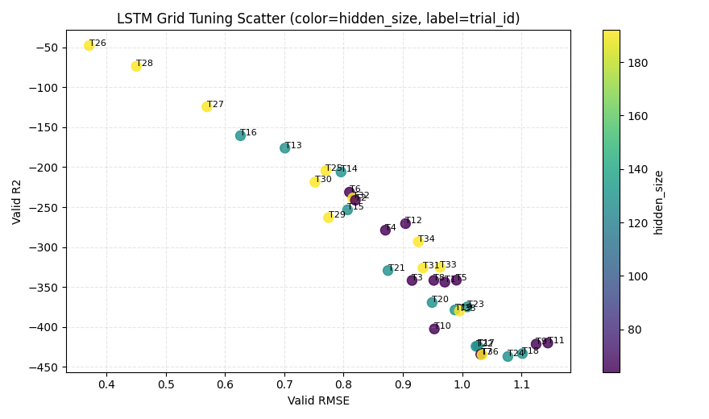

# LSTM 网格调参报告（delta_ah 口径）

## 1. 运行摘要
- 时间：2026-04-09 19:13:22
- Python：`C:\Users\pal\.virtualenvs\colab-OixbOpvz\Scripts\python.exe`
- 设备：`cpu`
- 序列模式：`prefix_full`
- 断点续跑：`True`
- 搜索空间：hidden_size=64,128,192，lr=1e-3,5e-4,2e-4，num_layers=1,2，dropout=0.1,0.2
- 全历史前缀定义：样本 `t` 使用 `1..t` 全部历史序列。
- 训练参数：epochs=2, patience=1, batch_size=256

## 2. 全部试验结果（按 Valid R2 降序）
| trial_id | seq_mode | window | hidden | lr | layers | dropout | best_epoch | valid_rmse | valid_mae | valid_r2 |
|---:|---|---:|---:|---:|---:|---:|---:|---:|---:|---:|
| 26 | prefix_full | - | 192 | 0.001 | 1 | 0.20 | 2 | 0.370706 | 0.353146 | -47.959450 |
| 28 | prefix_full | - | 192 | 0.001 | 2 | 0.20 | 2 | 0.450300 | 0.435163 | -73.839714 |
| 27 | prefix_full | - | 192 | 0.001 | 2 | 0.10 | 2 | 0.569369 | 0.557306 | -124.466339 |
| 16 | prefix_full | - | 128 | 0.001 | 2 | 0.20 | 2 | 0.626019 | 0.623660 | -160.648010 |
| 13 | prefix_full | - | 128 | 0.001 | 1 | 0.10 | 2 | 0.701102 | 0.698800 | -176.211105 |
| 25 | prefix_full | - | 192 | 0.001 | 1 | 0.10 | 1 | 0.770077 | 0.768543 | -204.326965 |
| 14 | prefix_full | - | 128 | 0.001 | 1 | 0.20 | 2 | 0.795677 | 0.793822 | -206.014435 |
| 30 | prefix_full | - | 192 | 0.0005 | 1 | 0.20 | 2 | 0.751814 | 0.750382 | -218.747299 |
| 6 | prefix_full | - | 64 | 0.0005 | 1 | 0.20 | 2 | 0.809945 | 0.808034 | -231.312592 |
| 32 | prefix_full | - | 192 | 0.0005 | 2 | 0.20 | 2 | 0.815586 | 0.814146 | -238.681259 |
| 2 | prefix_full | - | 64 | 0.001 | 1 | 0.20 | 2 | 0.819925 | 0.818619 | -241.445160 |
| 15 | prefix_full | - | 128 | 0.001 | 2 | 0.10 | 2 | 0.806728 | 0.805467 | -253.412445 |
| 29 | prefix_full | - | 192 | 0.0005 | 1 | 0.10 | 2 | 0.774647 | 0.773171 | -263.174133 |
| 12 | prefix_full | - | 64 | 0.0002 | 2 | 0.20 | 2 | 0.904569 | 0.902908 | -270.636200 |
| 4 | prefix_full | - | 64 | 0.001 | 2 | 0.20 | 2 | 0.870655 | 0.869364 | -278.915985 |
| 34 | prefix_full | - | 192 | 0.0002 | 1 | 0.20 | 2 | 0.926143 | 0.924716 | -293.359100 |
| 33 | prefix_full | - | 192 | 0.0002 | 1 | 0.10 | 2 | 0.962847 | 0.961567 | -325.453674 |
| 31 | prefix_full | - | 192 | 0.0005 | 2 | 0.10 | 2 | 0.933973 | 0.932629 | -326.123413 |
| 21 | prefix_full | - | 128 | 0.0002 | 1 | 0.10 | 2 | 0.874979 | 0.873736 | -329.375549 |
| 5 | prefix_full | - | 64 | 0.0005 | 1 | 0.10 | 2 | 0.990371 | 0.989045 | -341.454956 |
| 8 | prefix_full | - | 64 | 0.0005 | 2 | 0.20 | 2 | 0.952328 | 0.951079 | -341.683929 |
| 3 | prefix_full | - | 64 | 0.001 | 2 | 0.10 | 2 | 0.915602 | 0.914373 | -341.768646 |
| 1 | prefix_full | - | 64 | 0.001 | 1 | 0.10 | 2 | 0.970924 | 0.969756 | -343.935089 |
| 20 | prefix_full | - | 128 | 0.0005 | 2 | 0.20 | 2 | 0.949477 | 0.948258 | -369.374359 |
| 23 | prefix_full | - | 128 | 0.0002 | 2 | 0.10 | 2 | 1.008674 | 1.007378 | -374.895691 |
| 19 | prefix_full | - | 128 | 0.0005 | 2 | 0.10 | 2 | 0.988009 | 0.986873 | -378.704010 |
| 35 | prefix_full | - | 192 | 0.0002 | 2 | 0.10 | 2 | 0.995611 | 0.994373 | -380.032867 |
| 10 | prefix_full | - | 64 | 0.0002 | 1 | 0.20 | 2 | 0.953279 | 0.952205 | -402.429688 |
| 11 | prefix_full | - | 64 | 0.0002 | 2 | 0.10 | 2 | 1.144795 | 1.143408 | -420.059723 |
| 9 | prefix_full | - | 64 | 0.0002 | 1 | 0.10 | 2 | 1.124931 | 1.123515 | -421.457916 |
| 17 | prefix_full | - | 128 | 0.0005 | 1 | 0.10 | 2 | 1.026486 | 1.025448 | -423.814178 |
| 22 | prefix_full | - | 128 | 0.0002 | 1 | 0.20 | 2 | 1.023567 | 1.022471 | -424.198364 |
| 18 | prefix_full | - | 128 | 0.0005 | 1 | 0.20 | 2 | 1.101891 | 1.100850 | -433.270813 |
| 7 | prefix_full | - | 64 | 0.0005 | 2 | 0.10 | 2 | 1.031515 | 1.030336 | -434.114563 |
| 36 | prefix_full | - | 192 | 0.0002 | 2 | 0.20 | 2 | 1.033802 | 1.032690 | -434.735474 |
| 24 | prefix_full | - | 128 | 0.0002 | 2 | 0.20 | 2 | 1.077303 | 1.076141 | -436.934509 |

## 3. 最优配置
- trial_id：**26**
- 参数：`sequence_mode=prefix_full`, `window_size=-`, `hidden_size=192`, `learning_rate=0.001`, `num_layers=1`, `dropout=0.20`
- 指标：`valid_rmse=0.370706`, `valid_mae=0.353146`, `valid_r2=-47.959450`

## 4. 图表

## 5. 结论
- 建议后续正式训练优先采用本报告最优超参数。
- 如需继续提升，可在最优配置附近细化学习率与隐藏层宽度。