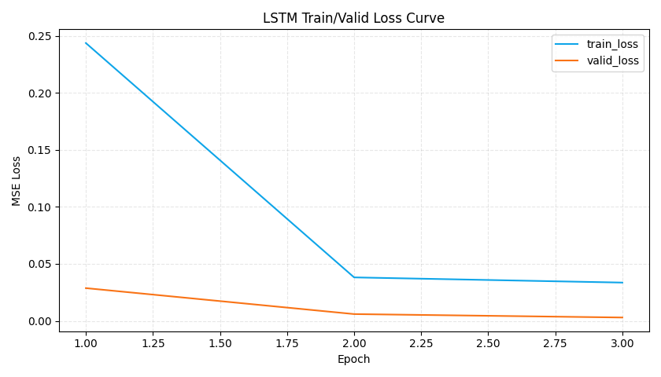
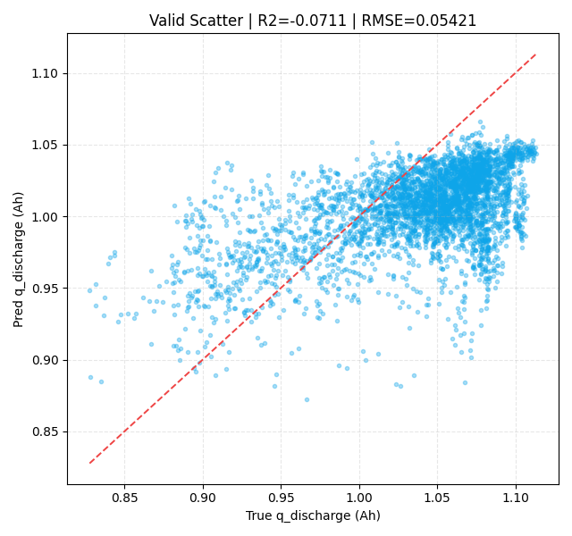

# LSTM Report: charge delta_ah -> q_discharge

## 1. Run Summary
- Time: 2026-04-07 16:16:48
- Python: `C:\Users\pal\.virtualenvs\colab-OixbOpvz\Scripts\python.exe`
- Device: `cpu`
- Window size: `30`
- Input dim per step: `24` (`12 delta_ah + 12 mask`)
- Label filter: `0.3 <= q_discharge <= 1.3`

## 2. Data Profile
- Cycle-level merged rows: **139,718**
- Train windows: **8,192**
- Valid windows: **4,096**
- Voltage ranges:
  - `[3.00,3.05)`
  - `[3.05,3.10)`
  - `[3.10,3.15)`
  - `[3.15,3.20)`
  - `[3.20,3.25)`
  - `[3.25,3.30)`
  - `[3.30,3.35)`
  - `[3.35,3.40)`
  - `[3.40,3.45)`
  - `[3.45,3.50)`
  - `[3.50,3.55)`
  - `[3.55,3.60]`

## 3. Metrics
| set_type | n_windows | MSE | RMSE | MAE | R2 |
|---|---:|---:|---:|---:|---:|
| train | 8192 | 0.00251517 | 0.050151 | 0.041457 | 0.167832 |
| valid | 4096 | 0.00293865 | 0.054209 | 0.045982 | -0.071136 |

## 4. Key Figures
- Best epoch by valid loss: **3**

## 5. Notes
- This run uses only charge interval `delta_ah` features.
- Missing intervals are handled by zero-fill + explicit mask channels.