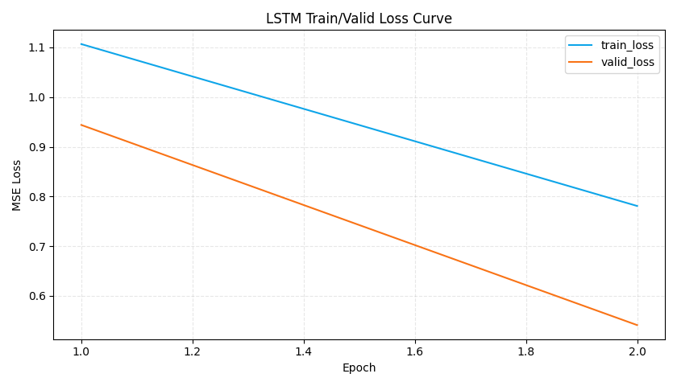
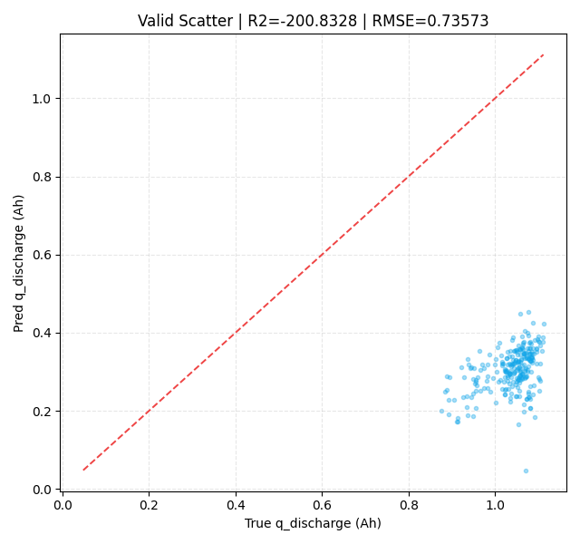

# LSTM 训练报告：charge delta_ah 拟合 q_discharge

## 1. 运行摘要
- 运行时间：2026-04-10 17:24:56
- Python 解释器：`C:\Users\pal\.virtualenvs\colab-OixbOpvz\Scripts\python.exe`
- 设备：`cpu`
- 序列模式：`prefix_full`
- 全历史前缀口径：样本第 `t` 条使用 `1..t` 全部历史序列。
- 每个时间步输入维度：`24`（`12维 delta_ah + 12维 mask`）
- 标签过滤范围：`0.3 <= q_discharge <= 1.3`

## 2. 数据概览
- 合并后 cycle 级样本数：**139,718**
- 训练样本数：**512**
- 验证样本数：**256**
- 电压区间：
  - `[3.00,3.05)`
  - `[3.05,3.10)`
  - `[3.10,3.15)`
  - `[3.15,3.20)`
  - `[3.20,3.25)`
  - `[3.25,3.30)`
  - `[3.30,3.35)`
  - `[3.35,3.40)`
  - `[3.40,3.45)`
  - `[3.45,3.50)`
  - `[3.50,3.55)`
  - `[3.55,3.60]`

## 3. 指标结果
| set_type | n_samples | MSE | RMSE | MAE | R2 |
|---|---:|---:|---:|---:|---:|
| train | 512 | 0.53083116 | 0.728582 | 0.726566 | -206.151093 |
| valid | 256 | 0.54129505 | 0.735728 | 0.733514 | -200.832825 |

## 4. 关键图表
- 按验证集损失选出的最佳轮次：**2**

## 5. 说明
- 本次训练仅使用充电电压区间 `delta_ah` 特征。
- 缺失区间采用“零填充 + 显式 mask 通道”处理。