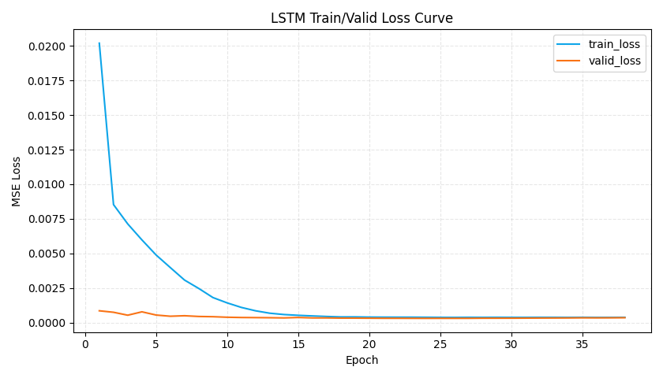
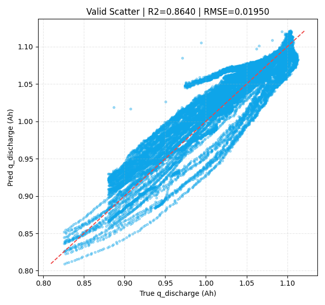

# LSTM 训练报告：dQdV 主峰特征拟合容量保持率

## 1. 运行摘要
- 运行时间：2026-04-28 01:45:55
- Python 解释器：`/usr/bin/python3.12`
- 设备：`cuda`
- 序列模式：`prefix_full`
- 特征包：`compact_peak_shape_height`
- 特征包说明：四个dQdV主峰形状特征 + 主峰高度，不含cycle_index_norm
- q 绝对过滤：`0.3 <= q_discharge <= 1.3`
- retention 过滤：`0.3 <= retention <= 1.1`，`q_ref`=前 `5` 个有效循环中位数
- checkpoint 快照间隔：每 `10` 轮

## 2. 数据概览
- 合并后 cycle 级样本数：**140,560**
- 训练样本数：**98,686**
- 验证样本数：**41,874**
- 每个时间步输入维度：`5`
- 输入特征：
  - `main_peak_area`
  - `main_peak_skewness`
  - `main_peak_voltage_v`
  - `main_peak_width_v`
  - `main_peak_height_dqdv`

## 3. 指标结果
| target | set_type | n_samples | MSE | RMSE | MAE | R2 |
|---|---|---:|---:|---:|---:|---:|
| retention | train | 98686 | 0.00026343 | 0.016230 | 0.011503 | 0.889827 |
| retention | valid | 41874 | 0.00032845 | 0.018123 | 0.012835 | 0.845893 |
| q_discharge | train | 98686 | 0.00030300 | 0.017407 | 0.012337 | 0.898092 |
| q_discharge | valid | 41874 | 0.00038007 | 0.019495 | 0.013806 | 0.864009 |

## 4. 图表
- 最佳 epoch：**18**

