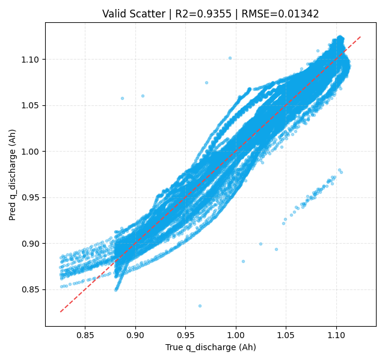

# dQ/dV 主峰特征 + LSTM 容量保持率建模报告

## 摘要

本次任务以放电 dQ/dV 曲线的主峰统计特征为输入，训练 LSTM 序列模型预测电池容量保持率（retention），并通过每个 `policy + cell_code` 前 5 个有效循环的 `q_discharge` 中位数 `q_ref` 将预测结果换算回放电容量。最终模型使用 10 个时间步输入特征，相比电压区间 deltaAh LSTM 的 24 维输入显著压缩了输入维度，同时在验证集上取得较高精度：retention 验证集 `R2=0.926793`，换算后的 `q_discharge` 验证集 `R2=0.935550`。

从结果看，dQ/dV 主峰特征能有效保留容量衰减相关信息，且相对 deltaAh 区间特征路线在主评估集上表现更优。但当前 `prefix_full` 序列模式会对每个循环重复计算完整历史，训练与离线推理的主要算力开销来自历史前缀展开，而不是模型参数量本身。因此，下一阶段优化应围绕输入特征压缩、序列历史压缩和在线推理缓存展开。

## 1. 研究目的与基本假设

本实验的目标是验证：将原始放电曲线压缩为 dQ/dV 主峰形态、峰附近温度和归一化循环序号后，是否仍能支撑 LSTM 对容量保持率进行有效建模。该路线的核心动机是减少输入维度与数据冗余，让模型从电化学退化相关的峰形变化中学习 SOH 演化趋势。

基本假设如下：

- 放电 dQ/dV 主峰位置、宽度、高度、面积、prominence 和 skewness 能表征主要退化信息。
- 主峰附近温度统计量可补充同一峰形变化下的热状态差异。
- 同一 `policy + cell_code` 的容量保持率可用前 5 个有效循环 `q_discharge` 中位数作为参考容量归一化。
- 以 `policy + cell_code` 为粒度划分训练集和验证集，可以降低同一电芯历史泄漏导致的过乐观评估。
- `prefix_full` 模式下，第 t 个循环使用 1..t 的完整历史，适合验证序列退化建模能力，但并非最低算力实现。

## 2. 输入数据与特征构成

本实验使用的主要输入文件包括：

| 类型 | 文件 | 用途 |
| --- | --- | --- |
| dQ/dV 特征 | `data/processed/discharge_dqdv_peak_features_skill_full.csv` | 提供放电 dQ/dV 主峰统计特征 |
| 容量标签 | `data/processed/life_performance.csv` | 提供 `q_discharge`，并构造 retention |
| 训练划分 | `data/processed/train_policy_cell_samples.csv` | 定义训练集 `policy + cell_code` |
| 验证划分 | `data/processed/valid_policy_cell_samples.csv` | 定义验证集 `policy + cell_code` |

样本过滤与标签构造口径：

- 仅保留 `is_valid_curve=True` 的 dQ/dV 特征记录。
- 绝对容量过滤：`0.3 <= q_discharge <= 1.3`。
- 容量保持率过滤：`0.3 <= retention <= 1.1`。
- `q_ref` 定义为每个 `policy + cell_code` 前 5 个有效循环 `q_discharge` 的中位数。
- `retention = q_discharge / q_ref`，模型直接训练目标为 retention。

最终合并后的 cycle 级样本数为 `140,560`，其中训练样本 `98,686`，验证样本 `41,874`。训练集与验证集分别对应 `135` 和 `52` 个 `policy + cell_code` 序列。

每个时间步输入 10 个特征：

| 特征组 | 特征 |
| --- | --- |
| 主峰位置与形态 | `main_peak_voltage_v`, `main_peak_width_v`, `main_peak_skewness` |
| 主峰强度与面积 | `main_peak_height_dqdv`, `main_peak_area`, `main_peak_prominence` |
| 主峰附近温度 | `main_peak_temp_max_c`, `main_peak_temp_min_c`, `main_peak_temp_avg_c` |
| 循环进程 | `cycle_index_norm` |

与 deltaAh 区间 LSTM 的 24 维输入相比，本方法将时间步输入维度压缩到 10 维，降维比例约为 `58.3%`。这说明 dQ/dV 主峰特征可以作为一种物理启发式压缩表示，将原始曲线或宽区间统计压缩为少量退化敏感指标。

## 3. 网络结构

模型结构为可变长序列 LSTM 回归器：

- 输入张量：`[batch_size, prefix_length, 10]`。
- 序列模式：`prefix_full`，第 t 个样本使用当前电芯从起始循环到第 t 个循环的完整历史。
- 主干网络：2 层 LSTM，`hidden_size=192`，层间 `dropout=0.1`。
- 回归头：`Linear(192 -> 96) + ReLU + Dropout(0.1) + Linear(96 -> 1)`。
- 输出：单标量 retention 预测值。
- 参数量估算：约 `471,745` 个参数，FP32 权重约 `1.89 MB`；本地 `best.pt` 文件大小约 `1.89 MB`，与参数量估算一致。

该结构本身较轻量，参数量不是主要瓶颈。当前主要计算成本来自 `prefix_full` 对历史序列的重复展开。

## 4. 训练设置与训练过程

训练配置如下：

| 项目 | 设置 |
| --- | --- |
| 运行环境 | Colab, Python 3.12, CUDA |
| 最大 epoch | 80 |
| 实际完成 epoch | 19 |
| 保存最佳 epoch | 6 |
| batch size | 256 |
| learning rate | 0.0005 |
| weight decay | 0.0001 |
| early stopping patience | 12 |
| min_delta | 0.0001 |
| random seed | 20260416 |

训练过程采用 MSE loss 直接拟合 retention。每轮训练后在验证集上计算 valid loss；当验证损失改善超过 `min_delta=0.0001` 时保存最佳 checkpoint。

需要注意两个“最佳”口径：

- `run_config.json` 与 `runtime_status.json` 中保存的最佳 epoch 为 `6`，对应 `best_valid_loss=0.000156026`。
- `epoch_log.csv` 中原始最低 valid loss 出现在 epoch 16，数值为 `0.000112993`；但从 epoch 6 到 epoch 16 的改善幅度没有超过 `min_delta=0.0001`，因此没有触发 checkpoint 更新。

因此，当前正式产物 `best.pt` 对应的是保存策略意义上的最佳模型，而不是 raw valid loss 最小的 epoch。后续如果用于论文或正式对外报告，建议统一并显式声明最佳模型选择规则。

训练曲线与验证散点图如下：

## 5. 实验结果

### 5.1 全样本训练与验证结果

| target | set_type | n_samples | MSE | RMSE | MAE | R2 |
| --- | --- | ---: | ---: | ---: | ---: | ---: |
| retention | train | 98,686 | 0.00018578 | 0.013630 | 0.008847 | 0.922302 |
| retention | valid | 41,874 | 0.00015603 | 0.012491 | 0.009110 | 0.926793 |
| q_discharge | train | 98,686 | 0.00021460 | 0.014649 | 0.009489 | 0.927824 |
| q_discharge | valid | 41,874 | 0.00018013 | 0.013421 | 0.009797 | 0.935550 |

验证集上 retention 与 q_discharge 的 R2 均超过 0.92，说明 dQ/dV 主峰特征在当前划分下对容量衰减具有较强解释能力。训练集和验证集误差处于同一量级，未观察到明显过拟合迹象。

### 5.2 与 deltaAh LSTM 的对比结论

在与 deltaAh 区间 LSTM 的交集验证样本上，dQ/dV 路线表现更优：

| 目标 | 聚合口径 | dQ/dV LSTM MSE | deltaAh LSTM MSE | dQ/dV LSTM R2 | deltaAh LSTM R2 |
| --- | --- | ---: | ---: | ---: | ---: |
| q_discharge | weighted | 0.000176 | 0.001051 | 0.935087 | 0.613330 |
| q_discharge | macro | 0.000222 | 0.001292 | 0.839849 | 0.204996 |
| retention | weighted | 0.000153 | 0.000905 | 0.925716 | 0.560086 |
| retention | macro | 0.000192 | 0.001120 | 0.839849 | 0.204996 |

关键差异：

- 在 q_discharge weighted 口径下，dQ/dV 相比 deltaAh 的 MSE 下降约 `83.2%`，R2 提升约 `0.322`。
- 在 retention weighted 口径下，dQ/dV 相比 deltaAh 的 MSE 下降约 `83.1%`，R2 提升约 `0.366`。
- dQ/dV 使用 10 维输入，deltaAh 使用 24 维输入；本实验结果说明较低维的物理启发特征并未削弱预测能力，反而提高了当前验证口径下的效果。

## 6. 关键结论

1. dQ/dV 主峰特征是有效的容量衰减压缩表示。  
   主峰形态、峰面积、峰强度、峰附近温度和循环进度可以用较低维度捕捉 SOH 演化信号。

2. 10 维输入已经支撑较高验证精度。  
   在 `policy + cell_code` 分组验证下，retention 验证集 `R2=0.926793`，q_discharge 验证集 `R2=0.935550`。

3. 相比 deltaAh 区间特征，dQ/dV 路线同时实现了输入降维和精度提升。  
   这支持下一阶段继续沿“物理特征压缩 + 小型序列模型”的方向优化，而不是优先扩大网络规模。

4. 当前算力瓶颈来自序列展开策略。  
   模型参数量很小，但 `prefix_full` 对历史前缀重复计算，使训练和离线全量推理成本随序列长度近似二次增长。

## 7. 算力与压缩讨论

按当前样本构造口径，训练集有 `98,686` 个 prefix 样本，但 LSTM 实际处理的训练时间步约为 `44.61M`；验证集有 `41,874` 个 prefix 样本，实际处理时间步约为 `19.65M`。这说明样本数本身低估了真实计算量。

按乘加计为 2 FLOPs 的粗略估算：

| 项目 | 估算值 |
| --- | ---: |
| 前向每时间步计算量 | 约 0.900 MFLOPs |
| 平均单个 prefix 前向 | 约 0.41 GFLOPs |
| 最长单个 prefix 前向 | 约 2.01 GFLOPs |
| 每 epoch 训练 + 验证 | 约 138 TFLOPs |
| 早停 19 epoch 总训练 | 约 2.62 PFLOPs |
| 验证集一次完整前向 | 约 17.7 TFLOPs |
| 全量 prefix 一次完整前向 | 约 57.8 TFLOPs |

因此，虽然输入维度已经从 24 维压缩到 10 维，当前训练和离线推理仍可继续优化。压缩的重点不只在特征维度，也应包括历史长度和重复计算方式。

## 8. 下一步建议

围绕“更少输入、更低算力、尽量保持预测精度”的目标，建议按以下顺序推进：

1. 做特征消融与冗余压缩。  
   以当前 10 维特征为基线，分别测试去除温度三特征、将温度压缩为均值加范围、去除 skewness、去除 area/prominence 中的冗余项，并用 valid R2、RMSE 和特征数共同排序。

2. 将 `prefix_full` 改为低成本历史表示。  
   优先比较最近固定窗口（如 64/128 cycles）、稀疏历史采样（早期锚点 + 最近窗口）和指数衰减采样，使序列计算从近似 O(T^2) 降到 O(T * W) 或更低。

3. 增加在线 hidden-state 缓存推理。  
   对部署场景，逐 cycle 推理时不应重复送入完整历史，而应缓存 LSTM hidden state；这样每新增一个循环只需处理一个时间步，单步成本约为 0.94 MFLOPs。

4. 做小模型对照。  
   在不增加输入特征的前提下，对比 `hidden_size=64/96/128`、单层 LSTM、GRU 和轻量 TCN。目标不是单纯追求最高 R2，而是寻找精度、参数量、FLOPs 和推理延迟的 Pareto 最优点。

5. 建立算力感知评估表。  
   后续每次模型对比除 MSE、RMSE、MAE、R2 外，建议同时报告输入维度、参数量、估算 FLOPs、批量推理耗时和在线单步推理耗时。

## 9. 局限性

- 当前最佳 checkpoint 采用 `min_delta=0.0001` 的保存规则，和 raw valid loss 最小 epoch 不完全一致。
- 本地结果记录了 CUDA 设备，但未记录具体 GPU 型号，因此算力讨论只能给出 FLOPs 估算和训练日志量级，不能精确到某一硬件。
- 当前验证集仍来自同一数据体系，尚未做跨数据源或跨实验批次外推验证。
- dQ/dV 特征提取本身也有计算成本，本报告主要讨论 LSTM 训练与推理成本，后续应单独评估 dQ/dV 曲线拟合、重采样和峰识别耗时。
- 当前仅使用主峰特征，没有系统比较第二峰、全曲线嵌入或多峰组合；但在降低输入维度目标下，优先建议先完成主峰特征消融和历史压缩。

## 10. 复现产物索引

| 产物 | 文件 |
| --- | --- |
| 自动训练摘要 | `lstm_dqdv_retention_report.md` |
| 训练配置 | `run_config.json` |
| 运行状态与最终指标 | `runtime_status.json` |
| epoch 日志 | `epoch_log.csv` |
| 指标表 | `train_valid_metrics.csv` |
| 最佳 checkpoint | `best.pt` |
| loss 曲线 | `loss_curve.png` |
| 验证散点图 | `valid_scatter.png` |

