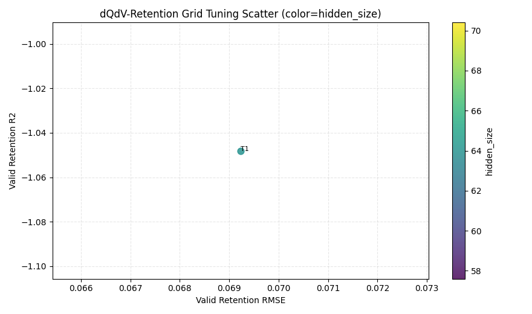

# dQdV Retention LSTM 网格调参报告（阶段1：子集寻优）

## 1. 运行摘要
- 时间：2026-04-16 13:43:21
- Python：`C:\Users\pal\.virtualenvs\colab-OixbOpvz\Scripts\python.exe`
- 设备：`cpu`
- 搜索空间：hidden=64, lr=1e-3, layers=1, dropout=0.1
- 每 trial 训练：epochs=2, patience=2
- 子集窗口上限：train=512, valid=256

## 2. 全部试验结果（按 retention R2 降序）
| trial_id | hidden | lr | layers | dropout | best_epoch | ret_rmse | ret_r2 | q_rmse | q_r2 |
|---:|---:|---:|---:|---:|---:|---:|---:|---:|---:|
| 1 | 64 | 0.001 | 1 | 0.10 | 2 | 0.069232 | -1.048043 | 0.074712 | -0.787299 |

## 3. 最优配置
- trial_id：**1**
- 参数：`hidden_size=64`, `learning_rate=0.001`, `num_layers=1`, `dropout=0.10`
- retention：`rmse=0.069232`, `r2=-1.048043`

## 4. 图表
