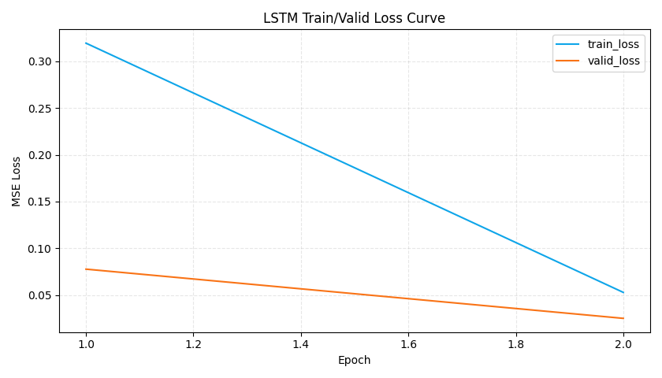
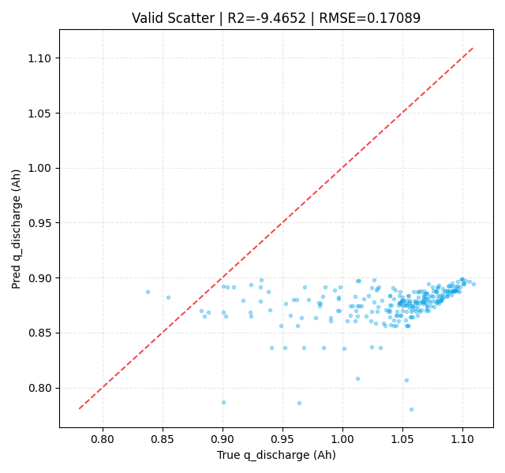

# LSTM 训练报告：dQdV 主峰特征拟合容量保持率

## 1. 运行摘要
- 运行时间：2026-04-16 14:51:33
- Python 解释器：`C:\Users\pal\.virtualenvs\colab-OixbOpvz\Scripts\python.exe`
- 设备：`cpu`
- 序列模式：`prefix_full`
- 特征包：`main_peak_temp_cycle`
- q 绝对过滤：`0.3 <= q_discharge <= 1.3`
- retention 过滤：`0.3 <= retention <= 1.1`，`q_ref`=前 `5` 个有效循环中位数
- checkpoint 快照间隔：每 `1` 轮

## 2. 数据概览
- 合并后 cycle 级样本数：**140,560**
- 训练样本数：**512**
- 验证样本数：**256**
- 每个时间步输入维度：`10`（主峰9维 + cycle_index_norm）

## 3. 指标结果
| target | set_type | n_samples | MSE | RMSE | MAE | R2 |
|---|---|---:|---:|---:|---:|---:|
| retention | train | 512 | 0.02604378 | 0.161381 | 0.153013 | -10.717591 |
| retention | valid | 256 | 0.02518557 | 0.158700 | 0.152246 | -10.931014 |
| q_discharge | train | 512 | 0.02992633 | 0.172992 | 0.163982 | -9.923838 |
| q_discharge | valid | 256 | 0.02920220 | 0.170887 | 0.163891 | -9.465166 |

## 4. 图表
- 最佳 epoch：**2**

