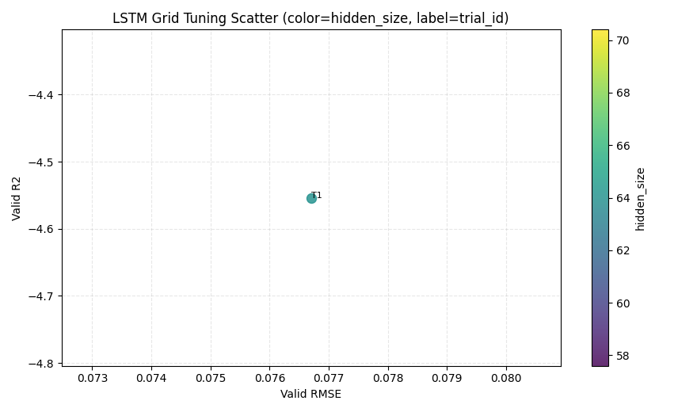

# LSTM 网格调参报告（delta_ah 口径）

## 1. 运行摘要
- 时间：2026-04-13 18:25:55
- Python：`C:\Users\pal\.virtualenvs\colab-OixbOpvz\Scripts\python.exe`
- 设备：`cpu`
- 序列模式：`prefix_full`
- 断点续跑：`False`
- trial中断恢复：`True`
- 搜索空间：hidden_size=64，lr=1e-3，num_layers=1，dropout=0.1
- 全历史前缀定义：样本 `t` 使用 `1..t` 全部历史序列。
- 训练参数：epochs=20, patience=20, batch_size=16

## 2. 全部试验结果（按 Valid R2 降序）
| trial_id | seq_mode | window | hidden | lr | layers | dropout | best_epoch | valid_rmse | valid_mae | valid_r2 |
|---:|---|---:|---:|---:|---:|---:|---:|---:|---:|---:|
| 1 | prefix_full | - | 64 | 0.001 | 1 | 0.10 | 17 | 0.076702 | 0.063553 | -4.553677 |

## 3. 最优配置
- trial_id：**1**
- 参数：`sequence_mode=prefix_full`, `window_size=-`, `hidden_size=64`, `learning_rate=0.001`, `num_layers=1`, `dropout=0.10`
- 指标：`valid_rmse=0.076702`, `valid_mae=0.063553`, `valid_r2=-4.553677`

## 4. 图表

## 5. 结论
- 建议后续正式训练优先采用本报告最优超参数。
- 如需继续提升，可在最优配置附近细化学习率与隐藏层宽度。