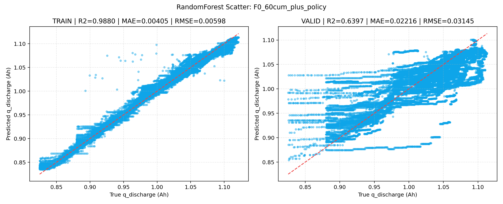
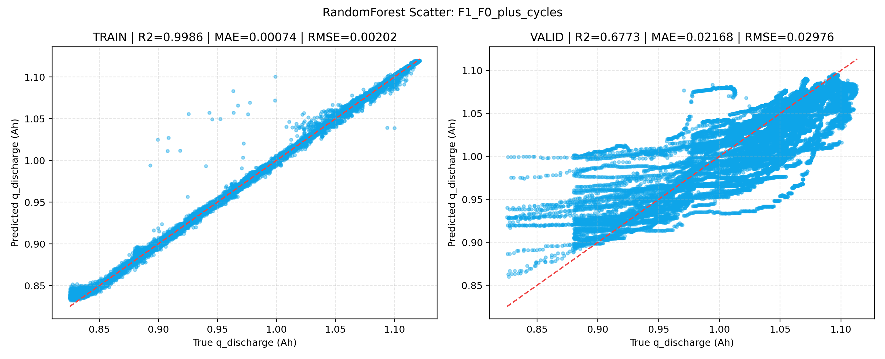
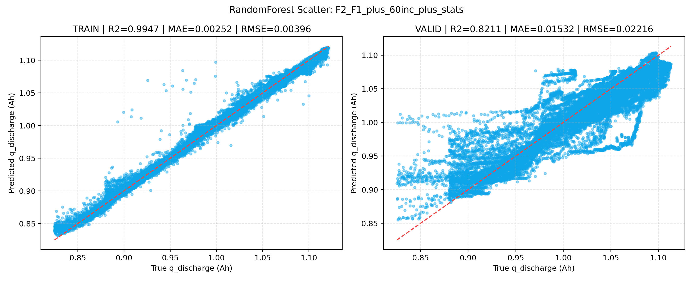
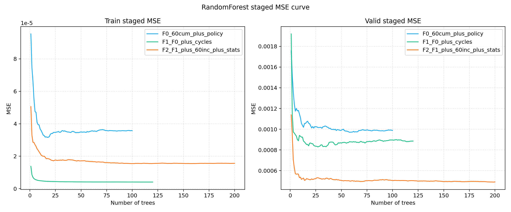

# RF优化报告：全量特征刷新 + R2冲刺

## 1. 运行摘要
- 运行时间：2026-04-01 17:55:49
- Python解释器：`C:\Users\pal\.virtualenvs\colab-OixbOpvz\Scripts\python.exe`
- 字体回退：`DejaVu Sans`
- 标签过滤阈值：`0.3 <= q_discharge <= 1.3`
- 验证集目标：`R2 >= 0.9`

## 2. 数据检查
- 被 `q_discharge < q_min` 过滤掉的标签行数：**46**
- 被 `q_discharge > q_max` 过滤掉的标签行数：**12**
- 区间过滤后标签行数：**140,565**
- 特征透视后cycle样本数：**140,565**
- 透视前cross_bin不完整样本数（<60维）：**0**
- 标签合并前缺失标签行数：**0**
- 标签处理后可训练样本数：**138,811**
- 异常电芯样本保留（train/valid/all）：**34001 / 11499 / 45500**

## 3. 模型对比
| 模型 | 特征维度 | train R2 | valid R2 | valid RMSE | valid MSE |
|---|---:|---:|---:|---:|---:|
| F2_F1_plus_60inc_plus_stats | 130 | 0.994739 | 0.821084 | 0.022161 | 0.000491 |
| F1_F0_plus_cycles | 64 | 0.998627 | 0.677284 | 0.029763 | 0.000886 |
| F0_60cum_plus_policy | 63 | 0.987992 | 0.639731 | 0.031447 | 0.000989 |

## 4. 关键图表解读
### F0散点图
- X轴说明：真实放电容量 `q_discharge`（单位：Ah）。
- Y轴说明：模型预测放电容量 `pred_q_discharge`（单位：Ah）。
- 结论：验证集拟合效果一般（valid R2=0.639731, valid RMSE=0.031447），存在明显过拟合风险（train-valid R2差=0.348262）。

### F1散点图
- X轴说明：真实放电容量 `q_discharge`（单位：Ah）。
- Y轴说明：模型预测放电容量 `pred_q_discharge`（单位：Ah）。
- 结论：验证集拟合效果一般（valid R2=0.677284, valid RMSE=0.029763），存在明显过拟合风险（train-valid R2差=0.321343）。

### F2散点图
- X轴说明：真实放电容量 `q_discharge`（单位：Ah）。
- Y轴说明：模型预测放电容量 `pred_q_discharge`（单位：Ah）。
- 结论：验证集拟合效果中等偏好（valid R2=0.821084, valid RMSE=0.022161），存在明显过拟合风险（train-valid R2差=0.173655）。

### 分阶段MSE曲线图
- X轴说明：随机森林树数量 `n_estimators`。
- Y轴说明：均方误差 `MSE`（左图为train，右图为valid）。
- 结论：按验证集MSE看，最优模型为F2_F1_plus_60inc_plus_stats（best valid MSE=0.000490，对应树数=198）。各模型最优点：F2_F1_plus_60inc_plus_stats在198棵树时best valid MSE=0.000490；F1_F0_plus_cycles在27棵树时best valid MSE=0.000830；F0_60cum_plus_policy在58棵树时best valid MSE=0.000971。

## 5. 目标结论
- 最优模型：**F2_F1_plus_60inc_plus_stats**
- 最优验证集R2：**0.821084**
- 是否达成目标（`R2 >= 0.9`）：**否**
- 距离目标差值：**0.078916**

## 6. 缩写与特征口径词典
- `F0`：特征包0，定义为 `60CUM + policy三元参数`。
- `F1`：特征包1，定义为 `F0 + cycles`。
- `F2`：特征包2，定义为 `F1 + 60INC + 统计特征`。
- `60CUM`：`cross_bin_cum_01_h ... cross_bin_cum_60_h`，表示截至当前cycle在60个cross_bin上的累计充电时长（单位：小时）。
- `60INC`：`cross_bin_inc_01_h ... cross_bin_inc_60_h`，表示当前cycle在60个cross_bin上的增量充电时长（单位：小时）。
- `cross_bin`：由 `SOC(3段) × 倍率rate(4段) × 温度temp(5段)` 交叉得到，总计60个区间索引。
- `policy三元参数`：`initial_c_rate`（起始倍率）、`switch_soc_percent`（转折SOC百分比）、`post_switch_c_rate`（转折后倍率）。
- `统计特征`：`cycle_total_charge_h`（当前cycle总充电时长，小时）、`cycle_active_bin_count`（当前cycle非零bin数）、`cycle_max_bin_h`（当前cycle最大单bin时长，小时）、`cycle_mean_nonzero_bin_h`（当前cycle非零bin平均时长，小时）、`cum_total_charge_h`（累计总充电时长，小时）、`cum_active_bin_count`（累计非零bin数）。
- `set_type`：样本所属集合标记，`train` 为训练集，`valid` 为验证集。