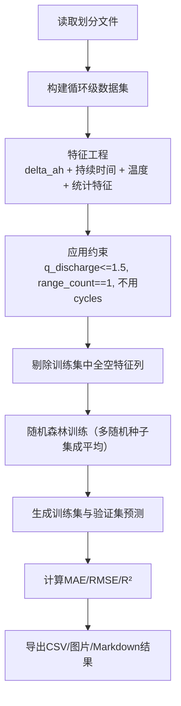
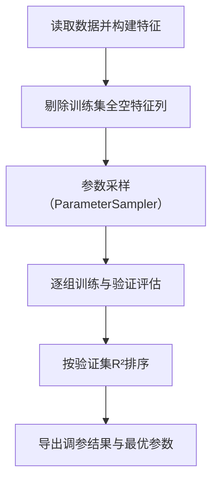

# 随机森林调优过程详细报告（特征刷新后）

## 一、任务背景与硬约束

本次任务是在“特征数据已刷新”的前提下，重新完成随机森林建模与调优流程，预测循环级放电容量 `q_discharge`。

本轮始终遵守以下硬约束：

1. 不将 `cycles` 作为训练特征。
2. 仅使用电压区间第一次出现的数据：`range_count == 1`。
3. 异常目标样本剔除：`q_discharge > 1.5`。
4. 训练/验证划分沿用既有文件，不重新切分：
   - `data/processed/train_policy_cell_samples.csv`
   - `data/processed/valid_policy_cell_samples.csv`

## 二、运行环境与输入数据

### 2.1 解释器

- 本次使用解释器：`C:\Users\pal\.virtualenvs\colab-OixbOpvz\Scripts\python.exe`

### 2.2 输入文件

1. 目标文件：`data/processed/life_performance.csv`
2. 放电特征文件：`data/processed/discharge_interval_features.csv`
3. 划分文件：
   - `data/processed/train_policy_cell_samples.csv`
   - `data/processed/valid_policy_cell_samples.csv`

### 2.3 刷新后数据规模

根据现有输出结果：

1. `life_performance` 原始行数：140,623
2. 目标异常剔除（`q_discharge > 1.5`）：11 行
3. 异常剔除后行数：140,612
4. 最终可用于建模的循环级样本：140,282
5. 训练集/验证集行数：98,451 / 41,831

## 三、程序架构说明

本次流程由两个脚本协同完成：

1. 主训练脚本：`scripts/train_rf_policy_discharge.py`
2. 快速调参脚本：`scripts/tune_rf_policy_discharge_quick.py`

### 3.1 主训练脚本结构

主函数职责拆分如下：

1. `build_cycle_level_dataset(...)`
   - 以 `policy + cell_code + cycles` 为键对齐目标与特征。
   - 将区间特征透视成宽表。
   - 增加组统计特征（非空计数、求和、均值、标准差）。
2. `build_feature_columns(...)`
   - 汇总候选特征列，默认不包含 `cycles`。
3. `drop_unusable_feature_columns(...)`
   - 自动剔除训练集中“全为空”的特征列，增强稳健性。
4. `train_model(...)`
   - 使用 `SimpleImputer(strategy='median') + RandomForestRegressor` 管线训练。
5. `main()`
   - 采用多随机种子训练后平均预测，输出指标、预测文件、特征重要性、散点图与总结报告。

### 3.2 快速调参脚本结构

关键逻辑：

1. 每组参数均计算训练集和验证集的 `R²/MAE/RMSE`。
2. 排序目标为“验证集 `R²` 最大”。
3. 产出最优参数文件，供主训练脚本回填。

## 四、特征方案与数据稳健处理

### 4.1 特征组成

1. `policy` 三元参数（3列）：
   - `initial_c_rate`
   - `switch_soc_percent`
   - `post_switch_c_rate`
2. 放电区间容量特征：`discharge_delta_ah_*`
3. 放电区间时长特征：`discharge_duration_s_*`
4. 放电区间温度特征：`discharge_avg_temper_*`
5. 分组统计特征：`*_stats_nonnull_count/sum/mean/std`

### 4.2 刷新数据带来的变化与处理

刷新后，训练集中有 9 个特征列为全缺失，已自动剔除：

1. `discharge_delta_ah_3p60_3p55`
2. `discharge_delta_ah_3p55_3p50`
3. `discharge_delta_ah_3p50_3p45`
4. `discharge_duration_s_3p60_3p55`
5. `discharge_duration_s_3p55_3p50`
6. `discharge_duration_s_3p50_3p45`
7. `discharge_avg_temper_3p60_3p55`
8. `discharge_avg_temper_3p55_3p50`
9. `discharge_avg_temper_3p50_3p45`

剔除后有效特征总数：54。

## 五、参数搜索空间（本次快速调优）

调参脚本：`scripts/tune_rf_policy_discharge_quick.py`  
试验次数：`N_TRIALS = 8`

| 参数名 | 搜索范围 |
|---|---|
| `n_estimators` | `[100, 150, 200, 250]` |
| `max_depth` | `[12, 14, 16, 18, 20, 24]` |
| `min_samples_leaf` | `[1, 2, 3, 4]` |
| `min_samples_split` | `[2, 5, 10, 20]` |
| `max_features` | `[0.2, 0.25, 0.3, 0.35, 0.4, 0.5, "sqrt"]` |
| `bootstrap` | `[True]` |
| `max_samples` | `[0.7, 0.85, 1.0]`（`1.0` 归并为 `None`） |
| `criterion` | `["squared_error"]` |
| `random_state` | 固定 `20260318` |
| `n_jobs` | 固定 `1` |

排序依据：验证集 `R²` 由高到低。

## 六、调优结果与最优参数

结果来源：`outputs/analysis/rf_policy_discharge/quick_tuning_results.csv`

前五组结果如下（按验证集 `R²`）：

| 排名 | 验证集 R² | 验证集 RMSE | 验证集 MAE | 训练集 R² | 关键参数 |
|---:|---:|---:|---:|---:|---|
| 1 | 0.862192 | 0.019571 | 0.014512 | 0.976241 | `n_estimators=100, max_depth=24, min_samples_leaf=3, min_samples_split=10, max_features=0.3, max_samples=0.85` |
| 2 | 0.860783 | 0.019671 | 0.014606 | 0.978591 | `n_estimators=150, max_depth=20, min_samples_leaf=1, min_samples_split=10, max_features=0.4, max_samples=0.85` |
| 3 | 0.860422 | 0.019697 | 0.014588 | 0.968567 | `n_estimators=200, max_depth=18, min_samples_leaf=4, min_samples_split=5, max_features=0.4, max_samples=0.7` |
| 4 | 0.857762 | 0.019884 | 0.014743 | 0.963609 | `n_estimators=100, max_depth=16, min_samples_leaf=3, min_samples_split=20, max_features=0.5, max_samples=None` |
| 5 | 0.856703 | 0.019958 | 0.014875 | 0.962481 | `n_estimators=150, max_depth=14, min_samples_leaf=2, min_samples_split=2, max_features=0.5, max_samples=None` |

最优参数文件：

- `outputs/analysis/rf_policy_discharge/quick_tuning_best_params.json`

## 七、最终训练方案与结果

最终主训练脚本采用：

1. 上述最优超参数
2. 三随机种子集成平均预测：
   - `[20260318, 20260319, 20260320]`

最终结果来源：`train_valid_metrics_comparison.csv`

| 数据集 | 样本数 | MAE | RMSE | R² |
|---|---:|---:|---:|---:|
| 训练集 | 98,451 | 0.004947 | 0.008355 | 0.976387 |
| 验证集 | 41,831 | 0.014514 | 0.019594 | 0.861875 |

## 八、产物清单

1. 调参结果：`outputs/analysis/rf_policy_discharge/quick_tuning_results.csv`
2. 最优参数：`outputs/analysis/rf_policy_discharge/quick_tuning_best_params.json`
3. 调参说明：`outputs/analysis/rf_policy_discharge/quick_tuning_report.md`
4. 训练指标：`outputs/analysis/rf_policy_discharge/train_valid_metrics_comparison.csv`
5. 预测明细：`outputs/analysis/rf_policy_discharge/train_valid_predictions.csv`
6. 特征重要性：`outputs/analysis/rf_policy_discharge/feature_importance.csv`
7. 拟合散点图：`outputs/analysis/rf_policy_discharge/fit_scatter_train_valid.png`
8. 主流程报告：`outputs/analysis/rf_policy_discharge/rf_policy_discharge_report.md`

### 拟合散点图（训练集 vs 验证集）

## 九、结论

1. 在“特征刷新后 + 不使用 `cycles`”约束下，当前方案达到较高验证性能：`R² = 0.861875`。
2. 自动剔除训练集全空特征列是本次稳定落地的关键改动之一。
3. 当前流程已形成可复现闭环：数据约束明确、搜索空间明确、最优参数可追溯、结果文件齐全。
