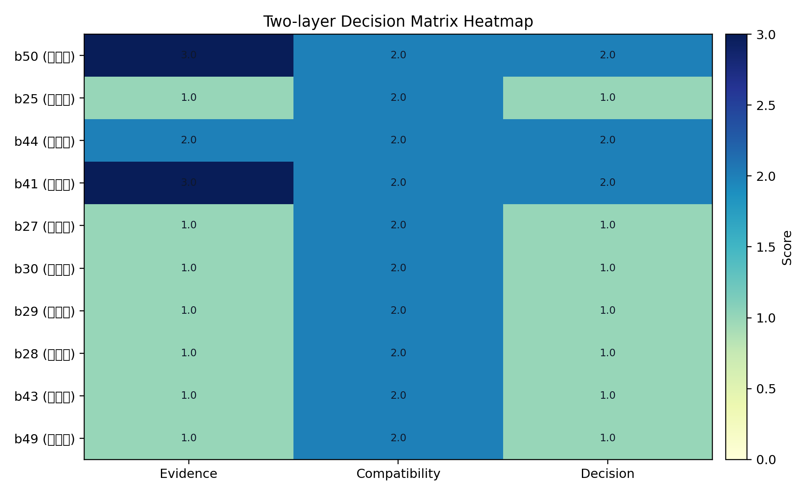
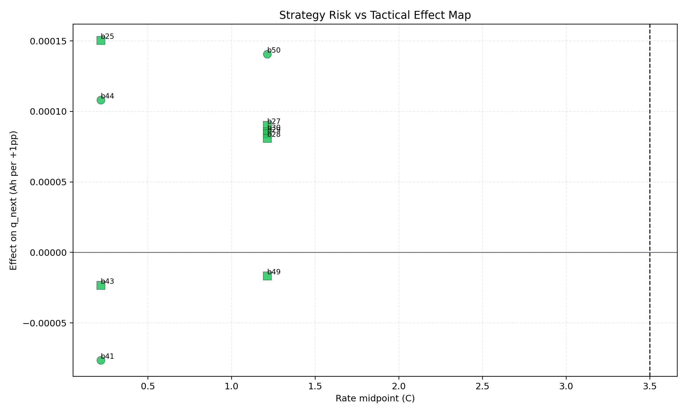

# 双层决策闭环综合报告（论文式）

## 摘要
- 报告风格：`paper_zh_layman`；附录级别：`full`。
- 运行时间：2026-04-08 12:41:40。
- Python解释器：`C:\Users\pal\.virtualenvs\colab-OixbOpvz\Scripts\python.EXE`。
- 统一标签区间：`0.3 <= q_discharge <= 1.3`。
- 关键结论1（战略层）：window_mean 全局效应 `TE=0.007918`，`NDE=0.007678`，`NIE=0.000241`，建议倍率上限 `3.50C`。（证据来源：`mediation_effect_global.csv`、`mediation_effect_by_rate_bin_fixed_a_window_mean.csv`）
- 关键结论2（战术层）：Top3 可执行干预臂为 bin50(s3_r2_t5) +5pp 预期 +0.000703Ah；bin44(s3_r1_t4) +5pp 预期 +0.000540Ah；bin41(s3_r1_t1) -5pp 预期 -0.000383Ah。（证据来源：`strategy_tactics_decision_matrix.csv`）
- 关键结论3（决策层）：可上线 `3` 项、待验证 `7` 项、禁止外推 `0` 项，可上线占比 `30.0%`，战略冲突项 `0`。（证据来源：`strategy_tactics_decision_matrix.csv`）

## 1. 业务问题与决策目标（面向非技术读者）
- 战略层问题：整体充电倍率策略是否会显著增加容量衰减风险？
- 战术层问题：在既定倍率上限下，60个区间中“把1个百分点充电时间替代到某区间”对下一循环容量有何影响？
- 决策目标：形成“先控风险（战略）再做配时（战术）”的可执行闭环，并通过受控实验验证。

## 2. 方法与理论基础
- 战略层采用中介分解：`TE = NDE + NIE`。
- 战术层采用替代效应估计：`+1pp` 表示将总充电时间中1个百分点从其余区间转移到目标区间。
- 显著性解释：`p` 是单次检验显著性，`q(FDR)` 是多重比较后显著性，更保守。
- 当95%CI跨0时，结论应解释为“当前证据不足”，而不是“确定无效”。

## 3. 数据与质量控制
- 标签过滤后样本：`138,811`；剔除 `<q_min`：`46`，剔除 `>q_max`：`10`。（证据来源：`mediation_dataset_diagnostics.csv`）
- 战略层可用样本：`n_rows=102,135`，`n_clusters=180`。（证据来源：`mediation_dataset_diagnostics.csv`）
- 战术层Top10主分析样本范围：`n_rows=138,622`，`n_groups=183`。（证据来源：`causal_substitution_effects.csv`）
- 主分析与敏感性方向一致率：`80.0%`。（证据来源：`causal_substitution_effects.csv`、`causal_sensitivity_abnormal_excluded.csv`）

## 4. 核心结果
### 4.1 战略层结果（倍率风险）
| rate_bin_label | te_r | te_r_ci_low | te_r_ci_high | nie_share | risk_level | evidence_tier | recommended_action | recommended_c_rate_upper |
| --- | --- | --- | --- | --- | --- | --- | --- | --- |
| <1.8C | 0.001540 | -0.002449 | 0.005647 | 0.013384 | 低 | C | 可维持现状 | 3.500000 |
| 1.8-2.6C | 0.005208 | 0.002558 | 0.007758 | 0.030333 | 中低 | B | 可小幅优化并保留监测 | 3.500000 |
| 2.6-3.5C | 0.008355 | 0.005893 | 0.010583 | 0.035802 | 中 | B | 保守控制并持续监测 | 3.500000 |
| >=3.5C | 0.018696 | 0.012785 | 0.024572 | 0.025179 | 高 | B | 收紧倍率上限并降低该段暴露 | 3.500000 |

### 4.2 战术层结果（60区间替代效应）
| priority_rank | cross_bin | cross_label | soc_label | rate_label | temp_label | effect_per_1pp_ah | ci_low | ci_high | q_value | tactical_action | decision_class |
| --- | --- | --- | --- | --- | --- | --- | --- | --- | --- | --- | --- |
| 1 | 50 | s3_r2_t5 | [90,100] | [0.434,1.99) | [36,60] | 0.000141 | 0.000060 | 0.000229 | 0.000000 | 增加份额 | 可上线 |
| 2 | 25 | s2_r1_t5 | [10,90) | [0,0.434) | [36,60] | 0.000151 | -0.000166 | 0.005967 | 0.394286 | 观察验证 | 待验证 |
| 3 | 44 | s3_r1_t4 | [90,100] | [0,0.434) | [34,36) | 0.000108 | 0.000021 | 0.000203 | 0.066667 | 增加份额 | 可上线 |
| 4 | 41 | s3_r1_t1 | [90,100] | [0,0.434) | [20,31) | -0.000077 | -0.000135 | -0.000023 | 0.020000 | 降低份额 | 可上线 |
| 5 | 27 | s2_r2_t2 | [10,90) | [0.434,1.99) | [31,32) | 0.000090 | -0.000083 | 0.000272 | 0.440000 | 观察验证 | 待验证 |
| 6 | 30 | s2_r2_t5 | [10,90) | [0.434,1.99) | [36,60] | 0.000086 | -0.000086 | 0.000264 | 0.440000 | 观察验证 | 待验证 |
| 7 | 29 | s2_r2_t4 | [10,90) | [0.434,1.99) | [34,36) | 0.000084 | -0.000065 | 0.000261 | 0.394286 | 观察验证 | 待验证 |
| 8 | 28 | s2_r2_t3 | [10,90) | [0.434,1.99) | [32,34) | 0.000081 | -0.000071 | 0.000221 | 0.394286 | 观察验证 | 待验证 |
| 9 | 43 | s3_r1_t3 | [90,100] | [0,0.434) | [32,34) | -0.000023 | -0.000071 | 0.000024 | 0.394286 | 观察验证 | 待验证 |
| 10 | 49 | s3_r2_t4 | [90,100] | [0.434,1.99) | [34,36) | -0.000017 | -0.000102 | 0.000061 | 0.692000 | 观察验证 | 待验证 |

- 统计显著（q<=0.10 且CI不跨0）的区间数量：`3` / `10`。（证据来源：`causal_substitution_effects.csv`）

### 4.3 关键图表解读
### 图1 战略层路径分解图

- X轴说明：因果路径分量（TE/NDE/NIE）。
- Y轴说明：对容量变化的效应值（Ah尺度）。
- 结论：全局效应中 TE=0.007918，且 TE≈NDE+NIE；其中NIE=0.000241，表明温度中介占比非零。
- 证据来源：`mediation_effect_global.csv`

### 图2 战略层贡献占比图

- X轴说明：路径分量类别（直接效应/中介效应）。
- Y轴说明：效应贡献比例（%）。
- 结论：NIE占比约 `3.04%`，说明倍率影响中有一部分通过温度路径传递。
- 证据来源：`mediation_effect_global.csv`

### 图3 Top20筛选得分条形图

- X轴说明：综合筛选得分（相关性与重要性归一化后平均）。
- Y轴说明：候选区间（bin标签）。
- 结论：Top1为 bin27(s2_r2_t2)，综合分数 `0.933018`；Top1与Top20末位分差 `0.652417`。
- 证据来源：`screening_scores.csv`

### 图4 60区间筛选热力图（SOC分面）

- X轴说明：温度分段（temp_bin）。
- Y轴说明：倍率分段（rate_bin），不同SOC分面显示。
- 结论：最高热区在 `[10,90)` × `[0.434,1.99)` × `[31,32)`，对应 bin27(s2_r2_t2)。
- 证据来源：`screening_scores.csv`

### 图5 替代效应森林图（Top10）

- X轴说明：将1pp充电时间替代到目标区间后的容量变化（Ah/1pp）。
- Y轴说明：Top10区间标识（cross_bin与标签）。
- 结论：正向区间 `7` 个、负向区间 `3` 个；显著且CI不跨0区间 `3` 个。
- 证据来源：`causal_substitution_effects.csv`

### 图6 双层决策热力图

- X轴说明：证据强度/战略兼容性/执行分类评分维度。
- Y轴说明：候选区间及其决策类别。
- 结论：最高优先级为 bin50(s3_r2_t5)，动作 `执行 +5pp 替代（在战略约束内）`。
- 证据来源：`strategy_tactics_decision_matrix.csv`

### 图7 战略风险-战术效应映射

- X轴说明：区间中点倍率（C）。
- Y轴说明：单位替代效应（Ah/1pp）。
- 结论：战略冲突项 `0` 个，说明当前Top10战术动作与战略层约束总体一致。
- 证据来源：`tactical_layer_decisions.csv`、`strategy_tactics_decision_matrix.csv`

## 5. 双层决策与执行清单
| priority_rank | cross_bin | cross_label | decision_class | final_action | expected_delta_q_next_5pp_ah | strategy_compatibility | evidence_tier | constraint_note |
| --- | --- | --- | --- | --- | --- | --- | --- | --- |
| 1 | 50 | s3_r2_t5 | 可上线 | 执行 +5pp 替代（在战略约束内） | 0.000703 | 兼容 | A | 需满足温度/电流安全边界 |
| 2 | 25 | s2_r1_t5 | 待验证 | 保持现状并继续验证 | 0.000000 | 兼容 | C | 等待更多证据后升级动作 |
| 3 | 44 | s3_r1_t4 | 可上线 | 执行 +5pp 替代（在战略约束内） | 0.000540 | 兼容 | B | 需满足温度/电流安全边界 |
| 4 | 41 | s3_r1_t1 | 可上线 | 执行 -5pp 回撤并转移至其余池 | -0.000383 | 兼容 | A | 用于抑制潜在衰减风险 |
| 5 | 27 | s2_r2_t2 | 待验证 | 保持现状并继续验证 | 0.000000 | 兼容 | C | 等待更多证据后升级动作 |
| 6 | 30 | s2_r2_t5 | 待验证 | 保持现状并继续验证 | 0.000000 | 兼容 | C | 等待更多证据后升级动作 |
| 7 | 29 | s2_r2_t4 | 待验证 | 保持现状并继续验证 | 0.000000 | 兼容 | C | 等待更多证据后升级动作 |
| 8 | 28 | s2_r2_t3 | 待验证 | 保持现状并继续验证 | 0.000000 | 兼容 | C | 等待更多证据后升级动作 |
| 9 | 43 | s3_r1_t3 | 待验证 | 保持现状并继续验证 | 0.000000 | 兼容 | C | 等待更多证据后升级动作 |
| 10 | 49 | s3_r2_t4 | 待验证 | 保持现状并继续验证 | 0.000000 | 兼容 | C | 等待更多证据后升级动作 |

### Top3 干预臂
| priority_rank | cross_bin | cross_label | tactical_action | decision_class | expected_delta_q_next_5pp_ah | soc_label | rate_label | temp_label |
| --- | --- | --- | --- | --- | --- | --- | --- | --- |
| 1 | 50 | s3_r2_t5 | 增加份额 | 可上线 | 0.000703 | [90,100] | [0.434,1.99) | [36,60] |
| 4 | 41 | s3_r1_t1 | 降低份额 | 可上线 | -0.000383 | [90,100] | [0,0.434) | [20,31) |
| 3 | 44 | s3_r1_t4 | 增加份额 | 可上线 | 0.000540 | [90,100] | [0,0.434) | [34,36) |
- 受控实验实施细则见 `closed_loop_experiment_protocol.md`。

## 6. 局限性与外推边界
- 观测因果估计依赖“给定控制变量后无未观测混杂”的强假设。
- CI跨0表示当前证据不足，需扩样或受控实验，不应解释为“确定无效应”。
- 本报告建议仅在样本支持域内执行，不建议把+5pp策略外推到未覆盖区间。
- 最终上线结论以受控实验结果为准，观测分析仅用于排序与优先级。

## 7. 结论与行动建议
1. 战略先行：先按战略层上限控制倍率暴露，再执行战术区间配时。
2. 战术聚焦：优先执行Top3中证据等级高且战略兼容的区间替代。
3. 闭环验证：采用ITT/PP双口径推进受控实验，达到Go门槛后再规模化。

## 附录A：关键公式与识别假设
```text
战略层：TE = NDE + NIE
战术层（残差化DML）：
Y~ = Y - m_y(W)
T~ = T - m_t(W)
theta = Cov(Y~, T~) / Var(T~)
effect_per_1pp = 0.01 * theta
effect_per_5pp = 0.05 * theta
```
- 不确定性：按 `policy+cell` 聚类 bootstrap 置信区间。
- 多重比较：Benjamini-Hochberg FDR，报告 `q` 值。

## 附录B：术语词典（非技术读者）
| 术语 | 解释 |
| --- | --- |
| TE | 总效应：倍率变化对容量变化的总体影响。 |
| NDE | 自然直接效应：不通过温度路径的直接影响。 |
| NIE | 自然间接效应：通过温度中介传递的影响。 |
| DML | 双重机器学习：先用模型消化混杂，再估计处理效应。 |
| CI | 置信区间：效应可能范围；跨0通常表示证据不足。 |
| p 值 | 单次检验显著性概率指标。 |
| q 值(FDR) | 多重比较修正后的显著性指标，比p更严格。 |
| pp | 百分点（percentage point），如+5pp表示份额增加5个百分点。 |
| 支持域 | 数据中真实出现过、可被可靠估计的操作范围。 |
| 外推 | 把结论用于数据未覆盖区域，风险较高。 |

## 附录C：CI跨0区间解释模板
| cross_bin | cross_label | effect_per_1pp_ah | ci_low | ci_high | q_value |
| --- | --- | --- | --- | --- | --- |
| 25 | s2_r1_t5 | 0.000151 | -0.000166 | 0.005967 | 0.394286 |
| 29 | s2_r2_t4 | 0.000084 | -0.000065 | 0.000261 | 0.394286 |
| 28 | s2_r2_t3 | 0.000081 | -0.000071 | 0.000221 | 0.394286 |
| 43 | s3_r1_t3 | -0.000023 | -0.000071 | 0.000024 | 0.394286 |
| 27 | s2_r2_t2 | 0.000090 | -0.000083 | 0.000272 | 0.440000 |
| 30 | s2_r2_t5 | 0.000086 | -0.000086 | 0.000264 | 0.440000 |
| 49 | s3_r2_t4 | -0.000017 | -0.000102 | 0.000061 | 0.692000 |
- 统一解释：该区间为“证据不足”，建议进入观察集并优先纳入受控实验。

## 附录D：证据来源映射
| 结论模块 | 来源文件 | 用途 |
| --- | --- | --- |
| 战略全局效应 | mediation_effect_global.csv | TE/NDE/NIE与总体风险结论 |
| 战略分段风险 | mediation_effect_by_rate_bin_fixed_a_window_mean.csv | 倍率分段风险与上限建议 |
| 数据质量诊断 | mediation_dataset_diagnostics.csv | 标签过滤与样本规模核验 |
| 战术主分析 | causal_substitution_effects.csv | Top10替代效应、CI、p、q |
| 战术敏感性 | causal_sensitivity_abnormal_excluded.csv | 剔除异常电芯后的方向一致性 |
| 全量筛选 | screening_scores.csv | 60区间筛选得分与热区定位 |
| 融合决策 | strategy_tactics_decision_matrix.csv | 执行分类与动作优先级 |
