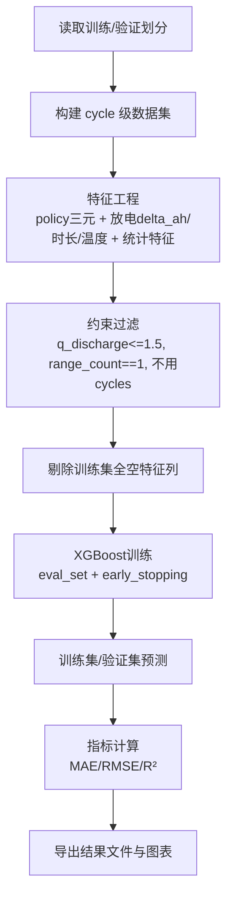
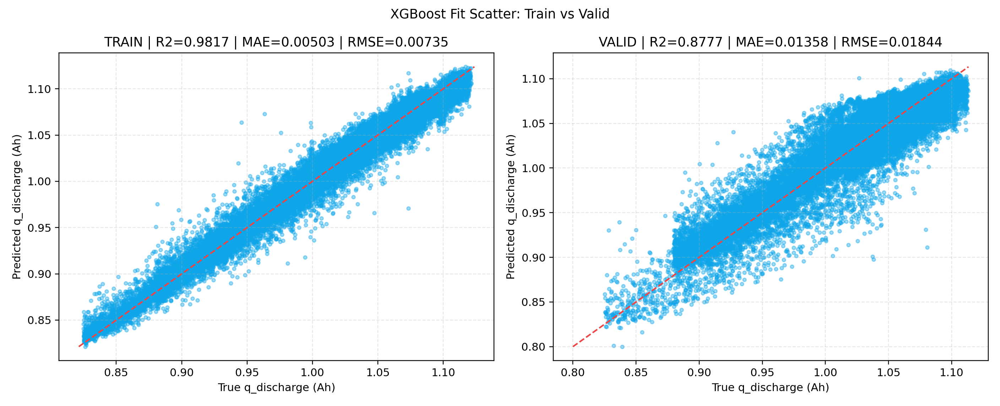

# XGBoost 方法详细报告（policy + 放电特征）

## 一、任务目标与约束

本报告汇总 `XGBoost` 在当前工程中的实现与结果，目标为使用 `policy` 三元参数与放电特征拟合循环级放电容量 `q_discharge`。

本次严格遵循以下约束：

1. 使用本地既有训练/验证划分，不重新切分数据。
2. 放电特征仅保留“第一次出现区间”：`range_count == 1`。
3. 异常目标样本剔除：`q_discharge > 1.5`。
4. 默认不引入 `cycles` 作为特征。

---

## 二、实现架构

实现脚本：

- `scripts/train_xgb_policy_discharge.py`

复用模块：

- `scripts/train_rf_policy_discharge.py` 中的数据构建与公共函数：
  - `build_cycle_level_dataset`
  - `build_feature_columns`
  - `drop_unusable_feature_columns`
  - `load_split_sample_tables`
  - `calc_metrics`

### 2.1 流程结构

---

## 三、数据与特征口径

### 3.1 数据规模（来自现有输出）

- `life_performance` 原始行数：`140,623`
- 异常目标剔除（`q_discharge > 1.5`）：`11`
- 过滤后行数：`140,612`
- 最终可用于建模的 cycle 样本：`140,282`
- 训练/验证行数：`98,451 / 41,831`

### 3.2 特征构成

1. `policy` 三元参数（3列）：
   - `initial_c_rate`
   - `switch_soc_percent`
   - `post_switch_c_rate`
2. 放电区间容量特征：`discharge_delta_ah_*`
3. 放电区间时长特征：`discharge_duration_s_*`
4. 放电区间温度特征：`discharge_avg_temper_*`
5. 统计特征：`*_stats_nonnull_count/sum/mean/std`

刷新后训练集中存在 9 列“全空特征”，已自动剔除，最终参与训练特征数为 `54`。

---

## 四、参数设置与“搜索空间”说明

本次 XGBoost 实现采用“固定超参数 + 早停”的策略。  
即：未执行外层随机采样/网格搜索；主要通过 `early_stopping_rounds` 在 boosting 轮次上自动选择最佳停止点。

### 4.1 外层超参数配置（当前版本）

- `objective = reg:squarederror`
- `n_estimators = 800`
- `learning_rate = 0.05`
- `max_depth = 8`
- `min_child_weight = 6`
- `subsample = 0.85`
- `colsample_bytree = 0.8`
- `gamma = 0.0`
- `reg_alpha = 0.0`
- `reg_lambda = 1.2`
- `tree_method = hist`
- `eval_metric = rmse`
- `early_stopping_rounds = 50`
- `random_state = 20260319`
- `n_jobs = 1`

### 4.2 内层迭代“搜索空间”

- 迭代轮次范围：`0 ~ 799`（由 `n_estimators=800` 决定）
- 评估集：`eval_set=[train, valid]`
- 早停机制：验证集 `RMSE` 连续 50 轮未改进则停止
- 本次最佳迭代：`645`（来自 `learning_curve_rmse.csv`）

---

## 五、最优结果与性能表现

结果文件：`outputs/analysis/xgb_policy_discharge/train_valid_metrics_comparison.csv`

| 数据集 | 样本数 | MAE | RMSE | R² |
|---|---:|---:|---:|---:|
| 训练集 | 98,451 | 0.005028 | 0.007350 | 0.981723 |
| 验证集 | 41,831 | 0.013580 | 0.018436 | 0.877722 |

学习曲线最优点（验证集 RMSE 最小）：

- 迭代轮次：`645`
- `valid_rmse = 0.01843580871010454`

### 5.1 与当前随机森林结果对比（同口径）

随机森林当前结果（`outputs/analysis/rf_policy_discharge/train_valid_metrics_comparison.csv`）：

- Valid `R² = 0.861875`
- Valid `RMSE = 0.019594`
- Valid `MAE = 0.014514`

XGBoost 相对随机森林改进：

- `R²` 提升约 `+0.015847`
- `RMSE` 降低约 `-0.001158`
- `MAE` 降低约 `-0.000934`

---

## 六、特征重要性摘要（Gain）

结果文件：`outputs/analysis/xgb_policy_discharge/feature_importance_gain.csv`

按 `gain` 前十特征：

1. `discharge_duration_s_3p15_3p10`
2. `discharge_delta_ah_3p15_3p10`
3. `discharge_duration_s_3p10_3p05`
4. `discharge_delta_ah_3p10_3p05`
5. `discharge_duration_s_stats_sum`
6. `initial_c_rate`
7. `discharge_duration_s_3p20_3p15`
8. `switch_soc_percent`
9. `discharge_delta_ah_3p20_3p15`
10. `post_switch_c_rate`

结论上，`3.15~3.10V` 与 `3.10~3.05V` 附近的“时长/容量”特征贡献最显著，且 `policy` 三元参数依然提供稳定信息增益。

---

## 七、产物清单

1. 指标：`outputs/analysis/xgb_policy_discharge/train_valid_metrics_comparison.csv`
2. 预测：`outputs/analysis/xgb_policy_discharge/train_valid_predictions.csv`
3. 特征重要性：`outputs/analysis/xgb_policy_discharge/feature_importance_gain.csv`
4. 学习曲线数据：`outputs/analysis/xgb_policy_discharge/learning_curve_rmse.csv`
5. 学习曲线图：`outputs/analysis/xgb_policy_discharge/learning_curve_rmse.png`
6. 拟合散点图：`outputs/analysis/xgb_policy_discharge/fit_scatter_train_valid.png`
7. 简版报告：`outputs/analysis/xgb_policy_discharge/xgb_policy_discharge_report.md`

### 拟合散点图（训练集 vs 验证集）

---

## 八、结论与后续建议

1. 在当前刷新数据和既有划分下，XGBoost 已取得较高验证表现（`R²=0.877722`）。
2. 相比当前随机森林基线，XGBoost 在验证集 `R²/RMSE/MAE` 三项指标均有改进。
3. 现阶段建议将该 XGBoost 配置作为新基线；后续若继续提升，可进一步增加外层超参数搜索（随机搜索/贝叶斯优化）并保留早停机制。
