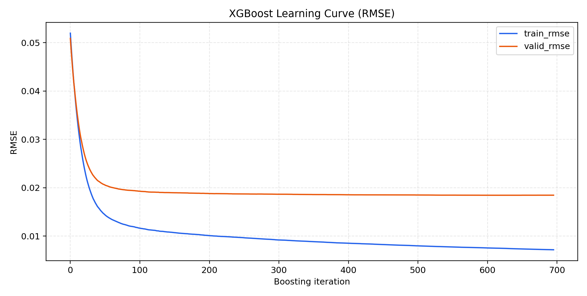

# XGBoost：policy + 放电特征拟合放电容量

## 1. 数据口径
- 运行时间：2026-03-19 15:15:43
- Python解释器：`C:\Users\pal\.virtualenvs\colab-OixbOpvz\Scripts\python.exe`
- 字体回退：`DejaVu Sans`
- 异常样本剔除：`q_discharge > 1.5`（剔除 11 行）
- 首次出现区间约束：`range_count == 1`
- 训练/验证行数：**98,451 / 41,831**
- 是否使用 `cycles` 特征：**否**
- 训练集全空特征剔除数：**9**
- 最终特征维度：**54**

## 2. 模型参数（XGBoost）
- `objective`: `reg:squarederror`
- `n_estimators`: `800`
- `learning_rate`: `0.05`
- `max_depth`: `8`
- `min_child_weight`: `6`
- `subsample`: `0.85`
- `colsample_bytree`: `0.8`
- `gamma`: `0.0`
- `reg_alpha`: `0.0`
- `reg_lambda`: `1.2`
- `random_state`: `20260319`
- `n_jobs`: `1`
- `tree_method`: `hist`
- `eval_metric`: `rmse`
- `early_stopping_rounds`: `50`

## 3. 训练结果
| set | MAE | RMSE | R2 |
|---|---:|---:|---:|
| train | 0.005028 | 0.007350 | 0.981723 |
| valid | 0.013580 | 0.018436 | 0.877722 |
- 最佳迭代轮次（早停）：**645**

## 4. 图表

